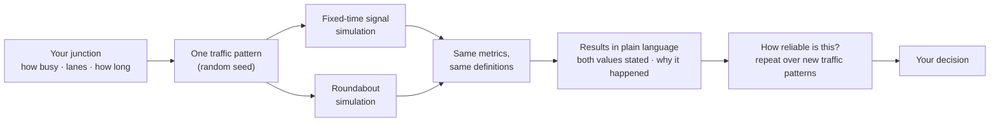
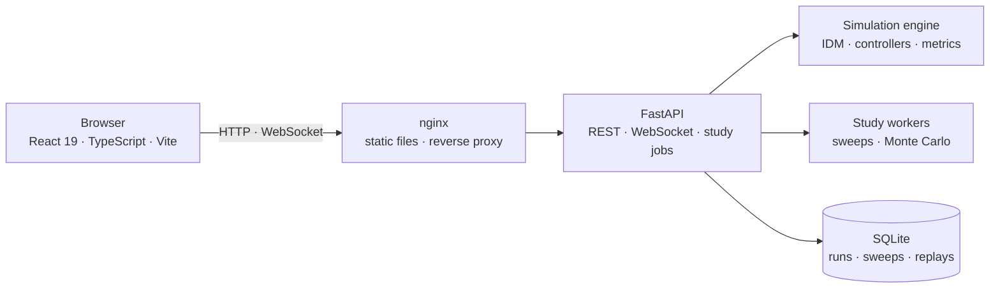
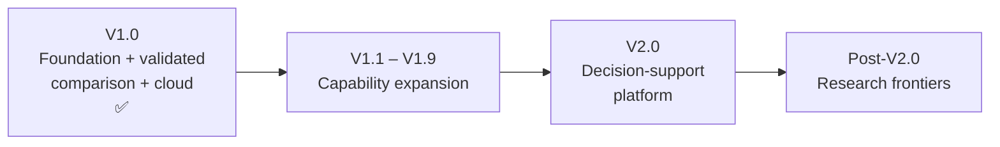

<div align="center">

# UrbanFlow

### Signal or roundabout? Try both.

**An evidence-based traffic simulation and decision-support platform for comparing intersection control strategies under controlled, reproducible conditions.**

| Version | Status | Next | Stack |
| :-: | :-: | :-: | :-: |
| **V1.5** | ✅ V1.0 deployed on AWS · V1.1–V1.3 complete · V1.4 & V1.5 implemented on `viraj-dev` (under review) | V1.6 Safety & environmental analysis | Python · FastAPI · React · TypeScript · Docker · AWS EC2 |

</div>

> [!IMPORTANT]
> **Evidence, not a verdict.** UrbanFlow does not assume that signals are better, or that roundabouts are better. It runs both on the same virtual junction with exactly the same vehicles, measures what happens, tells you how consistent the difference is, and states what the model does not capture. **The decision stays with you.**

---

## At a glance

| | |
| --- | --- |
| **What is it?** | A microscopic traffic simulator with a guided, plain-language interface and a research lab, comparing a **fixed-time traffic signal** with a **roundabout** at one four-leg junction. |
| **Who is it for?** | **Primary:** municipal planning officers and other non-specialist decision participants. **Secondary:** researchers and traffic engineers who need every metric, repeated experiments and reproducibility. |
| **What problem does it solve?** | "Signal or roundabout?" decisions are often argued from opinion. UrbanFlow turns the question into a fair, repeatable test that can be read without a manual. |
| **What does it simulate?** | Individual vehicles (Intelligent Driver Model car-following), seeded random arrivals, a fixed-time signal with paired north–south / east–west phases, and a roundabout with give-way entry, critical gap and follow-up time. |
| **How is the comparison controlled?** | Both strategies receive the **same seed** — the same arrival times, directions, turns and vehicles — and run in lockstep. Only the control strategy differs. Repeating over fresh seeds shows whether a difference is consistent or luck. |
| **How is it validated?** | Unit, integration and nightly simulation-regression tests; physical invariants (vehicle conservation, no conflicting greens, no overlaps); cross-process determinism; a calibrated, regression-pinned one-lane capacity curve; Student-t / Welch / Cohen's d statistics. |
| **How is it deployed?** | Two containers (nginx + FastAPI) under Docker Compose on Amazon EC2, with SQLite on a persistent volume. |

---

## How UrbanFlow works



1. **Describe the junction** in everyday terms: how busy it is, how many lanes, how long to watch.
2. **Watch both run** side by side — two maps, the same cars.
3. **Read the results**: time lost per driver, traffic served, queues, fairness between directions — and *why* the two differ.
4. **Check reliability**: UrbanFlow repeats *your* scenario over 5 or 10 new traffic patterns and reports whether the difference is consistent.
5. **Go deeper** if you want: every metric, the method, saved runs with full provenance, traffic-level sweeps and statistical studies in the Research Lab.

---

## What V1.0 supports

| Area | Capabilities |
| --- | --- |
| **Planner experience** | Landing page · three-step guided comparison · plain-language results with HCM-style grades and fairness bands · "Why did this happen?" · one-click reliability check · "Try another scenario" |
| **Simulation** | Discrete-time engine (Δt = 0.1 s) · IDM car-following · Poisson/uniform seeded arrivals · curve speed limits · safe vehicle insertion · 1–4 lanes per approach (1 = calibrated) |
| **Control strategies** | Fixed-time signal (paired phases, configurable greens incl. per-corridor, yellow, all-red, offset) · roundabout (critical gap, follow-up time, entry/circulating speed caps) |
| **Measurement** | Delay family (mean, median, p95, …) · throughput · queues · stops · Jain's fairness · planning-time index · idle-green loss · exploratory TTC/PET · integrity counters — all computed by the backend |
| **Research Lab** | Traffic-level sweep with delay crossover bracket · Monte Carlo statistical validation (Student-t CI, Welch's t-test, Cohen's d) · single-strategy views · background jobs with live progress |
| **Reproducibility** | Every saved run records configuration, seed, timing, code version and Python version · server-side re-run with discrepancy and limitation reporting · JSON/CSV export · compare up to six saved runs |
| **Platform** | FastAPI REST + WebSocket streaming (≈ 10 Hz) · per-visitor live sessions · SQLite (WAL) persistence · optional Cognito sign-in · Docker Compose · CI with nightly regression |

Since V1.1–V1.5 the simulator also models cars, SUVs, buses, trucks and motorcycles, gradual lane changing (mixed-traffic results are exploratory until calibrated), a signal that responds to traffic (adaptive, vehicle-actuated) alongside the fixed timetable, multi-lane roundabout circulation with exit convergence zones (V1.4), and real-world 3- or 4-arm junctions with configurable bearings, per-arm lane widths and U-turns (V1.5). What it does **not** model yet — crash-risk prediction, emissions, field calibration — is listed with its planned version in [Validation & evidence](docs/research/validation.md#5-known-limitations).

---

## Quick start

### Docker (recommended)

Requires Docker with Compose v2.

```bash
docker compose up --build -d
```

| URL | What |
| --- | --- |
| http://localhost | Landing page (also on port 3000) |
| http://localhost/app/comparative | Guided comparison |
| http://localhost/app/research | Research Lab |
| http://localhost/health | Health check (proxied to the backend) |
| http://localhost/api/version | Running backend's commit and Python version |

Record the code version with saved runs by passing the commit at build time:

```bash
GIT_COMMIT=$(git rev-parse HEAD) docker compose up -d --build
```

Stop with `docker compose down`. Saved data lives in the named volume `traffic-simulation_traffic_data` and survives restarts; `docker compose down -v` deletes it.

### Windows: `start.ps1`

Needs only Docker Desktop and Git. It starts Docker if needed, checks ports and configuration, rebuilds only what changed, waits for health and smoke-tests the stack.

```powershell
.\start.ps1                    # build what changed, start, verify
.\start.ps1 -Status            # read-only status
.\start.ps1 -Logs [backend]    # follow logs
.\start.ps1 -Restart           # recreate containers (data kept)
.\start.ps1 -Rebuild           # rebuild without cache
.\start.ps1 -SmokeTest         # re-check the running stack
.\start.ps1 -Clean             # remove containers and images (data kept)
.\start.ps1 -Clean -DeleteData # ...and the database volume (asks first)
.\start.ps1 -Dev               # development stack with hot reload
```

`-Dev` runs `docker-compose.dev.yml`: the Vite dev server on http://localhost:5173 and Uvicorn `--reload` on http://localhost:8000 (OpenAPI docs at `/docs`), source bind-mounted, signed in as "Local developer". If port 80 or 3000 is taken, set `URBANFLOW_HTTP_PORT` / `URBANFLOW_ALT_HTTP_PORT`.

### Native development

Requires Python 3.11+ and Node.js (CI uses Node 20).

```bash
# backend
cd backend
python -m venv .venv
.venv\Scripts\activate          # Windows
# source .venv/bin/activate     # macOS / Linux
pip install -r requirements.txt
uvicorn src.main:app --reload --host 0.0.0.0 --port 8000
```

```bash
# frontend (second terminal)
cd frontend
npm install
npm run dev                     # http://localhost:5173 and /app/comparative
```

Set `DEV_AUTH_BYPASS=1` for the backend if you want to save runs while developing without Cognito.

### Run the validated study from the command line

```bash
python scripts/run_full_study.py --help
python scripts/run_full_study.py      # volume sweep + Monte Carlo → study_report.csv
```

---

## Architecture



The browser never simulates and never computes a metric; the backend is the single source of every number. Full picture: [System overview](docs/architecture/00-system-overview.md).

```
├── backend/     Simulation engine, metrics, studies, API, persistence (Python 3.11, FastAPI)
├── frontend/    Landing page and dashboard (React 19, TypeScript, Vite, Canvas, Recharts)
├── shared/      JSON Schema contracts (scenario configuration, snapshots, vehicle state)
├── scripts/     Study runner, schema validation, Cognito and GitHub utilities
├── docs/        Documentation (start at docs/README.md)
├── docker-compose.yml / docker-compose.dev.yml / start.ps1
└── landingpage/ Legacy prototype workspace — not built or deployed
```

---

## Validation

| Layer | What it shows |
| --- | --- |
| **Engine correctness** | IDM, clock, lanes, spawner, controllers and every metric definition are unit-tested |
| **Physical invariants** | Vehicle conservation, non-negative speeds, no conflicting greens, no lock-ups at tested demands, no collisions in the calibrated one-lane comparison |
| **Determinism** | Same seed → same result, in-process, across processes, and after save → restore → re-run |
| **Comparative evidence** | A calibrated one-lane capacity curve pinned by regression tests; multi-seed statistics with stated method and limits |

Measured results are in the [comparative report](docs/reports/comparative_report.md) — each scoped to the conditions it was measured under. UrbanFlow is validated internally; it is **not yet calibrated against observed field traffic** (planned for V1.8/V1.9). Details: [Validation & evidence](docs/research/validation.md) · [Testing](docs/testing/README.md).

---

## Deployment

V1.0 runs on **Amazon EC2** as a Docker Compose stack: an nginx container serving the built frontend and proxying `/api/`, `/ws/` and `/health` to a FastAPI container, which persists to SQLite on a named volume. See [Deployment & operations](docs/deployment/README.md) (architecture, environment, verification, troubleshooting, known issues) and the [EC2 runbook](docs/deployment/AWS_FREE_TIER_DEPLOYMENT.md).

---

## Documentation

| Start here | |
| --- | --- |
| [Documentation hub](docs/README.md) | Map of every document, by audience |
| [Product story](docs/product/README.md) | Personas, principles, the planner journey |
| [System overview](docs/architecture/00-system-overview.md) | Architecture, data flow, lifecycle, concurrency |
| [Simulation methodology](docs/simulation/methodology.md) | What is modelled, how, and under which assumptions |
| [Configuration reference](docs/simulation/configuration.md) | Planner, advanced and research configuration |
| [Metrics reference](docs/research/metrics-reference.md) | Every metric: definition, unit, calculation, limits |
| [Reproducibility](docs/research/reproducibility.md) | Seeds, provenance, re-running runs and studies |
| [Validation & evidence](docs/research/validation.md) | Validated · assumed · known limitations · future work |
| [API & WebSocket reference](docs/api/README.md) | Every route and stream |
| [Testing](docs/testing/README.md) · [Deployment](docs/deployment/README.md) · [Operations guide](docs/operations.md) | Quality gates and running the system |

---

## Roadmap



| Week (2026) | Version | Theme | Status |
| --- | --- | --- | --- |
| W11 · Oct 2–5 | **V1.0** | Finalisation & Demo | ✅ Complete |
| W12 · Oct 5–6 | **V1.1** | Different Vehicle Types | ✅ Complete |
| W12 · Oct 5–6 | **V1.2** | Advanced Lane Modelling | ✅ Complete |
| W12 · Oct 6 | **V1.3** | Adaptive Signal Control | ✅ Complete |
| W12 · Oct 7 | **V1.4** | Advanced Roundabout Modelling + Scenario Config | 🟢 Implemented (under review) |
| W12 · Oct 7 | **V1.5** | Real-World Junction Modelling | 🟢 Implemented (under review) |
| W17 · Nov 13–19 | **V1.6** | Safety & Environmental Analysis | 🔜 Upcoming |
| W18 · Nov 20–27 | V1.7 | Scenario / What-If Planning | Planned |
| W19 · Nov 28–Dec 7 | V1.8 / V1.9 | Calibration & Network-Level Foundations | Planned |
| W20 · Dec 8–17 | **V2.0** | UrbanFlow Decision-Support Platform | Planned |

Authoritative detail: [ROADMAP](docs/ROADMAP.md).

### After V2.0

Ten research frontiers, none of which duplicate the roadmap: emergency vehicle priority · AI-based signal control · connected-vehicle communication · platooning · autonomous intersection management · uncertainty & robust simulation · weather & road conditions · incidents & disruption · large-scale networks · digital-twin integration. See [Future Scope](docs/future-scope/future_scope.md).

---

## Naming

**UrbanFlow** is the product. **Traffic-Simulation** is the repository and Docker Compose project name (hence volume names such as `traffic-simulation_traffic_data`). Some code identifiers and file names predate the product name.

## Team

| Contributor | Scope |
| --- | --- |
| Viraj Jadhao | Backend — simulation engine, physics, metrics, studies, API |
| Khushi Kashyap | Frontend — dashboard, canvas, charts, playback |

## Contributing

See [Engineering standards](docs/architecture/09-engineering-standards.md) and [Testing](docs/testing/README.md). Every pull request runs schema validation, backend lint/types/tests (coverage ≥ 85 %), frontend lint/types/format/tests, and Docker image builds.

## License

No `LICENSE` file is currently included in the repository.
