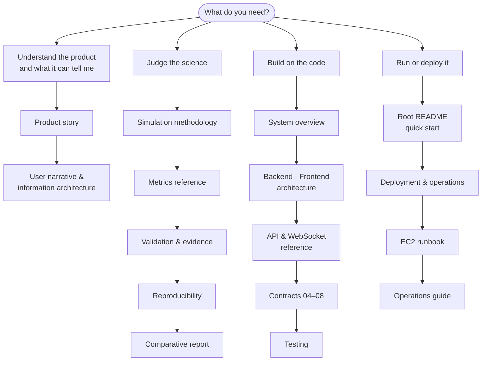

# UrbanFlow Documentation

> The map of everything written about UrbanFlow. **V1.0 — complete.** Documentation frozen and verified against the source on 2026-10-05.

---

## Find your path

| You are… | Read in this order |
| --- | --- |
| **A planner or reviewer** new to UrbanFlow | [Product story](product/README.md) → [Methodology §1–2](simulation/methodology.md) → [Validation §5 (limits)](research/validation.md#5-known-limitations) |
| **A researcher** assessing the results | [Methodology](simulation/methodology.md) → [Metrics](research/metrics-reference.md) → [Validation](research/validation.md) → [Reproducibility](research/reproducibility.md) → [Comparative report](reports/comparative_report.md) |
| **A developer** starting V1.3 | [System overview](architecture/00-system-overview.md) → [Backend](architecture/02-backend-architecture.md) / [Frontend](architecture/03-frontend-architecture.md) → [Configuration](simulation/configuration.md) → [API](api/README.md) → [Testing](testing/README.md) → [Roadmap](ROADMAP.md) |
| **An operator** | [Root README](../README.md#quick-start) → [Deployment & operations](deployment/README.md) → [Operations guide](operations.md) |

---

## Document status legend

| Status | Meaning |
| --- | --- |
| **Current** | Describes the V1.0 implementation; verified against the source |
| **Reference** | Detailed contract or audit; current, but narrower or deeper than the Current docs |
| **Record** | A dated record of work (reports, audits, logs). Accurate for its date; later changes are noted at the top |
| **Historical** | Planning material from earlier phases. Kept for context; not a description of the system |
| **Archived** | Retired; replaced by the document it points to |

---

## Index

### Overview and product

| Document | Status | Purpose |
| --- | --- | --- |
| [../README.md](../README.md) | Current | Project entry point |
| [product/README.md](product/README.md) | Current | Product story: problem, personas, principles, journey |
| [product/urbanflow-user-narrative.md](product/urbanflow-user-narrative.md) | Reference | Narrative, information architecture and plain-language strategy as implemented |
| [product/urbanflow-evaluation-metrics.md](product/urbanflow-evaluation-metrics.md) | Reference | Full metric audit: formulas, charts, validity findings |

### Simulation and research

| Document | Status | Purpose |
| --- | --- | --- |
| [simulation/methodology.md](simulation/methodology.md) | Current | What is modelled and how; assumptions register; controlled comparison |
| [simulation/configuration.md](simulation/configuration.md) | Current | Planner, advanced and research configuration; environment variables |
| [research/metrics-reference.md](research/metrics-reference.md) | Current | Every metric with definition, unit, calculation, interpretation, limits, use |
| [research/reproducibility.md](research/reproducibility.md) | Current | Determinism, provenance, re-running runs and studies |
| [research/validation.md](research/validation.md) | Current | Validated · measured · assumed · known limitations · future work |
| [reports/comparative_report.md](reports/comparative_report.md) | Record | Measured signal-vs-roundabout comparison (revision 2026-09-25b) |
| [reports/v1-known-limitations.md](reports/v1-known-limitations.md) | Record | Per-item limitation audit with measurements |
| [bug-fix-report.md](bug-fix-report.md) | Record | Bug-fix and calibration pass with regression evidence |
| [reports/study_report.csv](reports/study_report.csv) | Record | Study output (CSV) |

### Architecture and contracts

| Document | Status | Purpose |
| --- | --- | --- |
| [architecture/00-system-overview.md](architecture/00-system-overview.md) | Current | Architecture, tick sequence, data flow, lifecycle, concurrency, security |
| [architecture/01-repository-architecture.md](architecture/01-repository-architecture.md) | Current | Repository layout and ownership |
| [architecture/02-backend-architecture.md](architecture/02-backend-architecture.md) | Current | Backend packages and dependencies |
| [architecture/03-frontend-architecture.md](architecture/03-frontend-architecture.md) | Current | Frontend structure, routing, data flow |
| [architecture/04-shared-contract-layer.md](architecture/04-shared-contract-layer.md) | Reference | Contract ownership and versioning |
| [architecture/05-snapshot-contract.md](architecture/05-snapshot-contract.md) | Reference | Snapshot schema |
| [architecture/06-scenario-configuration-contract.md](architecture/06-scenario-configuration-contract.md) | Reference | Scenario configuration schema, field by field |
| [architecture/07-metric-contract.md](architecture/07-metric-contract.md) | Reference | Metric formulas and edge cases |
| [architecture/08-communication-contract.md](architecture/08-communication-contract.md) | Reference | REST/WebSocket design notes (endpoint list: [API reference](api/README.md)) |
| [architecture/09-engineering-standards.md](architecture/09-engineering-standards.md) | Reference | Naming, Git workflow, code quality |
| [architecture/10-repository-bootstrap.md](architecture/10-repository-bootstrap.md) | Historical | Original bootstrap specification |
| [decisions/](decisions/README.md) | Reference | Architecture Decision Records and V1.0 implementation decisions |

### Interfaces, quality and operations

| Document | Status | Purpose |
| --- | --- | --- |
| [api/README.md](api/README.md) | Current | Every REST route and WebSocket stream |
| [testing/README.md](testing/README.md) | Current | Test architecture and quality gates |
| [deployment/README.md](deployment/README.md) | Current | Deployment architecture, environment, verification, troubleshooting |
| [deployment/AWS_FREE_TIER_DEPLOYMENT.md](deployment/AWS_FREE_TIER_DEPLOYMENT.md) | Current | Step-by-step EC2 runbook |
| [operations.md](operations.md) | Current | Detailed runtime behaviour: workflows, study jobs, persistence, access control |
| [aws-deployment-plan.md](aws-deployment-plan.md) | Historical | Early S3/CloudFront/RDS proposal — not what was deployed |

### Planning

| Document | Status | Purpose |
| --- | --- | --- |
| [ROADMAP.md](ROADMAP.md) | **Authoritative** | V0.1 → V1.0 history and the V1.1 → V2.0 roadmap |
| [future-scope/future_scope.md](future-scope/future_scope.md) | **Authoritative** | Post-V2.0 research frontiers |
| [future-scope/ui_ux_and_nextgen_innovations.md](future-scope/ui_ux_and_nextgen_innovations.md) | Archived | Early UI brainstorm, mapped to roadmap/future scope |
| [project-management/](project-management/README.md) | Historical | Original milestone plan, labels, Kanban |
| [issues/](issues/README.md) | Historical | Original atomic issue breakdown |
| [code-review/](code-review/01_initialization.md) | Historical | Code-review walkthroughs (2026-09) |
| [stitch_live_metrics_specification.md](stitch_live_metrics_specification.md) | Historical | Original live-metrics design brief |
| [resources/](resources/README.md) | Record | Proposal decks, reference papers, images |

---

## Principles these documents follow

- **Zero invention.** Every technical statement is traceable to code, a test or a dated measurement. Planned work is labelled as planned.
- **One home per topic.** One roadmap, one future scope, one metrics reference, one API reference. Other documents link rather than restate.
- **Evidence, not a verdict.** Results are always scoped to their conditions; limitations are stated next to findings.
