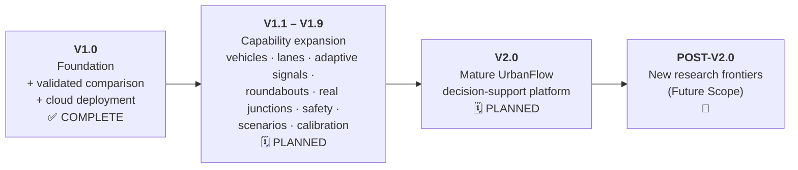
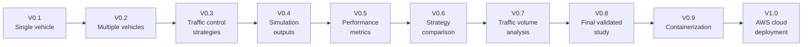
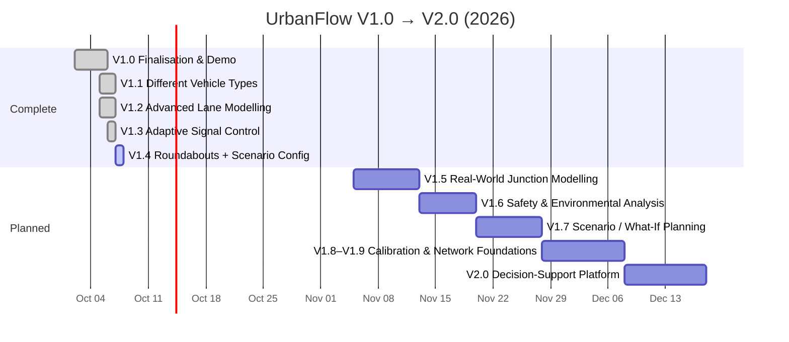

# UrbanFlow Roadmap

> **This is the single authoritative roadmap.** It supersedes every earlier roadmap, deferred-features log and V1.1/V2/V3 plan in this repository (preserved in git history).
> **Current version:** V1.3 — V1.1 (vehicle types), V1.2 (lane modelling) and V1.3 (adaptive signal control) **COMPLETE** · **V1.4** (advanced roundabouts + full scenario configuration) **implemented on `viraj-dev`, under review** · **Last updated:** 2026-10-07
> **Beyond V2.0:** [Future Scope](future-scope/future_scope.md) — post-V2.0 research frontiers only.

| Status | Meaning |
| --- | --- |
| ✅ **COMPLETE** | Shipped, documented, tested |
| 🟢 **CURRENT** | The version in use today (V1.3) |
| 🔜 **PLANNED / UPCOMING** | Next in line; work starts imminently (V1.4) |
| 🗓️ **PLANNED** | Scheduled in the V1.x → V2.0 roadmap |
| 🔭 **FUTURE SCOPE** | After V2.0 — not part of this roadmap |

---

## 1. The boundary

**The V2.0 line is a hard boundary.** Everything listed in §4 belongs to the V1.1–V2.0 product roadmap. [Future Scope](future-scope/future_scope.md) contains only capabilities that are genuinely new beyond V2.0, and never duplicates a roadmap item.

---

## 2. How UrbanFlow got here — V0.1 → V1.0 ✅

| Version | Milestone | Realised in the codebase as | Status |
| --- | --- | --- | --- |
| V0.1 | Single Vehicle | IDM car-following (`vehicles/idm.py`); single-vehicle demo routes (`/api/simulation/single-vehicle`) and canvas | ✅ |
| V0.2 | Multiple Vehicles | Seeded spawner, vehicle pool, leaders and routing (`vehicles/spawner.py`, `pool.py`, `router.py`) | ✅ |
| V0.3 | Traffic Control Strategies | `FixedTimeSignalController`, `RoundaboutController`, conflict management | ✅ |
| V0.4 | Simulation Outputs | Snapshots, WebSocket streams, canvas visualisation, snapshot history buffer | ✅ |
| V0.5 | Performance Metrics | `MetricCollector` with warm-up exclusion and the metric definitions | ✅ |
| V0.6 | Strategy Comparison | `DualSimulationOrchestrator` (same seed, lockstep), comparative dashboard | ✅ |
| V0.7 | Traffic Volume Analysis | Volume sweeps, sweep sessions, delay crossover | ✅ |
| V0.8 | Final Validated Study | Monte Carlo validation, invariant checks, calibration pass, `scripts/run_full_study.py`, [comparative report](reports/comparative_report.md) | ✅ |
| V0.9 | Containerization | Backend/frontend images, Compose stacks, nginx proxy, `start.ps1` | ✅ |
| V1.0 | AWS Cloud Deployment | EC2 + Docker Compose deployment; guided planner experience; saved runs and reproducibility; finalisation (below) | ✅ |

---

## 3. V1.0 — Finalisation & Demo ✅ COMPLETE

**W11 · Oct 2 – Oct 5, 2026**

| Finalisation work | Status |
| --- | --- |
| Final application QA and recording | ✅ |
| Documentation freeze (this documentation overhaul) | ✅ |
| Presentation readiness · presentation visuals | ✅ |
| Final technical QA · research validation | ✅ |
| Demo workflow | ✅ |
| Final UI polish · UX QA | ✅ |

### V1.0 capability baseline

What every later version builds on — all implemented and documented:

| Area | V1.0 capability | Reference |
| --- | --- | --- |
| Simulation | Discrete-time engine (Δt 0.1 s), IDM, seeded Poisson/uniform arrivals, curve speed rule, safe insertion | [Methodology](simulation/methodology.md) |
| Control | Fixed-time signal (paired NS/EW plan, optional per-corridor greens, offset); single-geometry roundabout with gap acceptance | [Methodology §7](simulation/methodology.md#7-traffic-control-strategies) |
| Comparison | Same-seed lockstep comparison; repeated-seed reliability check; demand ladder | [Methodology §10](simulation/methodology.md#10-controlled-comparison) |
| Metrics | Delay family, throughput, queues, stops, fairness, reliability, exploratory TTC/PET, integrity counters | [Metrics reference](research/metrics-reference.md) |
| Evidence | Invariant checks, Monte Carlo (Student-t, Welch, Cohen's d), calibrated one-lane capacity curve | [Validation & evidence](research/validation.md) |
| Reproducibility | Provenance record per run; reproduce endpoint; JSON/CSV export | [Reproducibility](research/reproducibility.md) |
| Product | Landing → Compare (3 steps) → Results → reliability → Saved → Research Lab | [Product story](product/README.md) |
| Platform | FastAPI REST + 3 WebSocket streams; background study jobs; SQLite persistence; Cognito sign-in path | [API reference](api/README.md) · [System overview](architecture/00-system-overview.md) |
| Delivery | Docker Compose on AWS EC2 behind nginx; CI (lint, types, tests, images, nightly regression) | [Deployment](deployment/README.md) · [Testing](testing/README.md) |

Known V1.0 limitations, and which milestone addresses each, are listed in [Validation & evidence §5](research/validation.md#5-known-limitations).

---

## 4. V1.1 → V2.0

| Week | Dates | Version | Theme | Status |
| --- | --- | --- | --- | --- |
| W11 | Oct 2 – Oct 5 | V1.0 | Finalisation & Demo | ✅ COMPLETE |
| W12 | Oct 5 – Oct 6 | V1.1 | Different Vehicle Types | ✅ COMPLETE (with V1.2) |
| W12 | Oct 5 – Oct 6 | V1.2 | Advanced Lane Modelling | ✅ COMPLETE (with V1.1) |
| W12 | Oct 6 | V1.3 | Adaptive Signal Control | ✅ COMPLETE (ahead of the W14 slot) |
| W12 | Oct 7 | V1.4 | Advanced Roundabout Modelling + Full Scenario Configuration | 🟢 IMPLEMENTED, under review (ahead of the W15 slot) |
| W16 | Nov 5 – Nov 12 | V1.5 | Real-World Junction Modelling | 🗓️ PLANNED |
| W17 | Nov 13 – Nov 19 | V1.6 | Safety & Environmental Analysis | 🗓️ PLANNED |
| W18 | Nov 20 – Nov 27 | V1.7 | Scenario / What-If Planning | 🗓️ PLANNED |
| W19 | Nov 28 – Dec 7 | V1.8 / V1.9 | Calibration & Network-Level Foundations | 🗓️ PLANNED |
| W20 | Dec 8 – Dec 17 | V2.0 | UrbanFlow Decision-Support Platform | 🗓️ PLANNED |

Each milestone below lists its **goal**, its **scope** (authoritative), and the **V1.0 starting point** — a factual note on what exists today, so the work starts from the code rather than from assumptions.

---

### V1.1 — Different Vehicle Types

**✅ COMPLETE · delivered with V1.2 on 2026-10-06**

**Goal:** introduce heterogeneous traffic.

| Scope | |
| --- | --- |
| Vehicle classes | Cars · SUVs · Buses · Trucks · Bikes |
| Behaviour | Differentiated vehicle behaviour · vehicle models · IDM parameters |
| Engine | Spawning · simulation logic · validation |
| Presentation | Vehicle representation · configuration UI · legends / visual differentiation |

**Delivered:** five vehicle classes — car, SUV, bus, truck, motorcycle — each with its own dimensions, IDM parameters (a, b, T, s₀), desired-speed range, cornering limit and lane-change behaviour (`backend/src/vehicles/vehicle_types.py`); `vehicleGeneration.vehicleMix` and `vehicleTypes` in the schema; type-aware seeded spawning; long-vehicle handling (axle-chord body pose, length-aware conflict zones, design-vehicle signal geometry, roundabout gap allowance and entry commitment); a per-class metric breakdown; a "What traffic uses the junction?" question, an advanced mix editor, class-specific map sprites, legends and a per-class results table. Without a mix, single-lane runs reproduce V1.0 bit for bit. Mixed results are exploratory (not calibrated). See [methodology §5.4](simulation/methodology.md#54-vehicle-classes-v11).

**V1.0 starting point (for reference):** one passenger-car population; length `U(4.0, 5.0)` m, width `U(1.8, 2.2)` m and desired speed are randomised per vehicle, but IDM parameters (`a`, `b`, `T`, `s₀`, `δ`) are shared by all vehicles (`vehicleGeneration.*`).

---

### V1.2 — Advanced Lane Modelling

**✅ COMPLETE · delivered with V1.1 on 2026-10-06**

**Goal:** move beyond single-lane assumptions.

| Scope | |
| --- | --- |
| Lane model | Multi-lane traffic · lane model · lane assignment · routing |
| Lane changing | Lane-changing foundations · lane changes |
| Quality | Physics and regression tests |
| Presentation | Lane configuration UI · visualisation · user controls |

**Delivered:** explicit lane identity and one lane-use policy (`RoadNetwork.permitted_turns`, narrowed by the signal plan where its heads demand it); per-approach lane counts via `roads.approaches[].lanes` (opposite approaches must match); MOBIL lane changing carried out as gradual, distance-based manoeuvres with shadow occupancy of both lanes, safety checks against each vehicle's own IDM, mandatory changes and missed-turn fallback (`backend/src/vehicles/lane_change.py`); `roads.laneChange` settings; lane arrows, lane-change indicators, a lane-changing switch and side-street lanes in the signal research view. V1.0's undocumented single-tick lane jump is gone. See [methodology §4 and §6.1](simulation/methodology.md#61-lane-changing-v12).

**V1.0 starting point (for reference):** 1–4 lanes per approach exist, but the calibrated comparison is one lane; a vehicle's lane is fixed at spawn by turn intent (left / straight / right policy); there is no lane changing; the versioned schema accepts only one lane count for all approaches.

---

### V1.3 — Adaptive Signal Control

**✅ COMPLETE · delivered on 2026-10-06 (planned for W14)**

**Goal:** compare fixed-time signals with responsive/adaptive control.

| Scope | |
| --- | --- |
| Control | Adaptive controller · control logic |
| Evidence | Experiments · validation |
| Presentation | Controller selection UI · visual comparison · result presentation |

**Delivered:** a vehicle-actuated adaptive signal (`backend/src/controllers/adaptive_signal.py`) on the fixed-time signal's own phase plan, heads, yellow and all-red — minimum green, passage-based extension and gap-out, maximum green once another phase calls, rest in green, cyclic order with phases skipped when nobody waits — selected by `controller.signalControl: "adaptive"` with `controller.adaptive` settings (fixed-time stays the default and is unchanged); stop-line detection shared with a new green-time measure for both signals (`metrics.signalTiming`); a reproducible three-way study, fixed-time vs adaptive vs roundabout (`/api/v1/study/control-comparison`, Research Lab); a "How should the signal respond to traffic?" question, adaptive advanced settings, a live map panel explaining each decision, and results that name the controller. Results: adaptive lowers delay against the fixed timetable below saturation and gains nothing measurable at and above capacity; on one lane the roundabout keeps the lowest delay from busy demand upwards ([validation §4.1](research/validation.md#41-fixed-time-vs-adaptive-vs-roundabout-v13-2026-10-06)). See [methodology §7.3](simulation/methodology.md#73-adaptive-signal--controllersadaptive_signalpy-v13).

**V1.0 starting point (for reference):** fixed-time control only. Controllers share the `BaseController` interface and are built by `controllers/factory.py`, so a new controller plugs in without changing the engine loop.

---

### V1.4 — Advanced Roundabout Modelling

**🟢 IMPLEMENTED · 2026-10-07 (ahead of the W15 slot) · under review — extended to full user configuration**

**Goal:** advance roundabout modelling beyond the current implementation, and let users build the junction they want to investigate.

| Scope | |
| --- | --- |
| Geometry & behaviour | Proper multi-lane circulation · lane assignment · spiral behaviour · independent rings · exit behaviour · weaving |
| Evidence | Collision validation |
| Presentation | Roundabout configuration · visualisation improvements |

**Delivered (implemented on `viraj-dev`, awaiting review):**

*Roundabout.* The ring has its own lane count (`geometry.circulatingLanes`, 1–2; three-lane rings are rejected as not yet validated) and an explicit two-lane designation — left turns inner, right turns outer, straight on the entry lane's own — with right-aligned entry and exit mapping, merging entries for approaches one lane wider than the ring, keep-clear entry and **exit convergence zones** taken in strict arrival order (`roads/lane_config.py`, `controllers/roundabout.py`). Roundabout approaches may now all differ. One-lane rings are unchanged to the last bit. Three rejected designs and the measurements behind each decision are in [methodology §7.4.1](simulation/methodology.md#741-multi-lane-rings-v14); safety results in [validation §4.2](research/validation.md#42-v14-roundabout-validation-matrix). This resolves **K1** for supported configurations.

*Full scenario configuration.* A strategy-neutral, versioned **scenario document** (`core/scenario.py`) — per-approach lanes, length, lane arrows, roundabout lane markings, demand, turning and vehicle mix; scenario mix; signal, adaptive and roundabout design; duration, warm-up, seed, arrival pattern — compiled once per strategy so comparisons differ only in control; strict validation that explains every rejection (`core/lane_validation.py`); `POST /api/v1/scenarios/validate` and `/compile`, scenario input to `/api/v1/simulations`, the live comparison and the control-comparison study; a per-approach results breakdown (`metrics.approachBreakdown`). Frontend: a **scenario builder** (guided "Build your own junction" and the Research Lab) with lane cards and movement toggles, "How busy is each road?", a live plan, completeness and validation panel, an explicit-percentage vehicle mix editor, presets as editable shortcuts, import/export; maps draw each arm and the ring from the snapshot; results name the scenario and split by approach.

**Starting point (V1.0–V1.3):** concentric rings, one per approach lane, without lane designation; multi-lane runs were exploratory (low-speed inner-ring-exit contacts under saturation); `controller.circulatingLanes` was accepted but inert (it still is — superseded by `geometry.circulatingLanes`).

---

### V1.5 — Real-World Junction Modelling

**W16 · Nov 5 – Nov 12 · 🗓️ PLANNED**

**Goal:** allow simulations to represent configurable real-world junction layouts.

| Scope | |
| --- | --- |
| Model | Junction geometry / configuration model · traffic inputs |
| Engine | Backend support |
| Presentation | Junction builder · configuration workflow · visual editor |

**V1.0 starting point:** one abstract four-leg junction with symmetric approaches (`roads.approachLength`, `laneWidth`); `roads.approaches[]` is accepted by the schema but not read.

---

### V1.6 — Safety & Environmental Analysis

**W17 · Nov 13 – Nov 19 · 🗓️ PLANNED**

**Goal:** expand evaluation beyond delay and throughput.

| Scope | |
| --- | --- |
| Measures | Safety proxies · fuel/emissions modelling where scientifically supportable |
| Evidence | Validation |
| Presentation | New metrics dashboard · explanations · visualisations |

**V1.0 starting point:** exploratory TTC (all geometries) and PET (signal only) in the specialist layer; an overlap audit used as a model-integrity check; no fuel or emissions model.

---

### V1.7 — Scenario / What-If Planning

**W18 · Nov 20 – Nov 27 · 🗓️ PLANNED**

**Goal:** allow planners to compare intervention scenarios under different traffic conditions.

| Scope | |
| --- | --- |
| Engine | Scenario engine · batch experiments · reproducibility |
| Presentation | Scenario creation workflow · comparison UI · reporting |

**V1.0 starting point:** one scenario per comparison; "Try another scenario" and a session table; background study jobs, run provenance, and saved-run comparison of up to six runs.

---

### V1.8 / V1.9 — Calibration & Network-Level Foundations

**W19 · Nov 28 – Dec 7 · 🗓️ PLANNED**

**Goal:** connect simulations more closely to observed traffic and establish foundations for connected/networked simulation.

| Scope | |
| --- | --- |
| Calibration | Calibration framework · real-world traffic inputs |
| Networks | Network simulation foundations · network/scenario visualisation |
| Reporting | Expanded reporting |

**V1.0 starting point:** demand levels are calibrated against UrbanFlow's own measured capacity, not field data; the engine simulates one junction.

---

### V2.0 — UrbanFlow Decision-Support Platform

**W20 · Dec 8 – Dec 17 · 🗓️ PLANNED**

**Goal:** integrate the major capabilities into a mature evidence-based planning workflow.

| Scope | |
| --- | --- |
| Platform | Full-system integration · performance · reproducibility |
| Evidence | Research validation |
| Experience | End-to-end planner workflow · UX refinement · final presentation layer |

---

## 5. Capability matrix

| Capability | V1.0 | V1.1 | V1.2 | V1.3 | V1.4 | V1.5 | V1.6 | V1.7 | V1.8/9 | V2.0 |
| --- | :-: | :-: | :-: | :-: | :-: | :-: | :-: | :-: | :-: | :-: |
| Same-seed signal vs roundabout comparison | ✅ | ● | ● | ● | ● | ● | ● | ● | ● | ◆ |
| Plain-language results & reliability check | ✅ | ● | ● | ● | ● | ● | ● | ● | ● | ◆ |
| Reproducible saved runs | ✅ | ● | ● | ● | ● | ● | ● | ● | ● | ◆ |
| Heterogeneous vehicles | — | ✅ | ● | ● | ● | ● | ● | ● | ● | ◆ |
| Multi-lane traffic & lane changes | partial | | ✅ | ● | ● | ● | ● | ● | ● | ◆ |
| Adaptive signal control | — | | | ✅ | ● | ● | ● | ● | ● | ◆ |
| Multi-lane roundabout circulation | exploratory | | | | ▲ | ● | ● | ● | ● | ◆ |
| Real-world junction layouts | — | | | | | ▲ | ● | ● | ● | ◆ |
| Safety proxies & emissions | exploratory | | | | | | ▲ | ● | ● | ◆ |
| Scenario / what-if batches | — | | | | | | | ▲ | ● | ◆ |
| Calibration to observed traffic | — | | | | | | | | ▲ | ◆ |
| Network-level foundations | — | | | | | | | | ▲ | ◆ |

✅ shipped · ▲ introduced · ● carried forward · ◆ integrated into the V2.0 platform

---

## 6. Roadmap vs Future Scope

| Theme | Inside the roadmap (≤ V2.0) | Future Scope (post-V2.0) — only what is genuinely new |
| --- | --- | --- |
| Vehicles | Cars, SUVs, buses, trucks, bikes (V1.1) | Emergency vehicles with priority and yielding (FS-1) |
| Signals | Adaptive / responsive control (V1.3) | Learning-based (RL) signal control (FS-2) |
| Lanes & cooperation | Lanes, lane changes (V1.2) | V2V/V2I communication (FS-3); platooning (FS-4) |
| Intersection control | Signals, roundabouts (V1.0–V1.4) | Reservation-based autonomous intersections (FS-5) |
| Evidence | Scenario batches & reproducibility (V1.7); calibration (V1.8/9) | Uncertainty quantification & robustness (FS-6) |
| Conditions | — | Weather & road condition (FS-7); incidents & disruption (FS-8) |
| Scale | Network-level **foundations** (V1.8/9) | Large-scale network simulation (FS-9) |
| Data | Real-world traffic **inputs** & calibration (V1.8/9) | Continuously updated digital twin (FS-10) |

---

## 7. Maintaining this roadmap

1. This file is the only roadmap. Do not add competing roadmap or "deferred" lists elsewhere.
2. Do not add V1.x milestones or move scope between versions without an explicit decision recorded here.
3. When a version ships, change its status, update §5, and move its "V1.0 starting point" note into a short "delivered" note.
4. Anything that does not fit V1.1–V2.0 belongs in [Future Scope](future-scope/future_scope.md) — and only if it does not duplicate a roadmap item.
5. Implementation decisions that constrain future work are recorded in [docs/decisions](decisions/README.md#implementation-decisions-v10).
