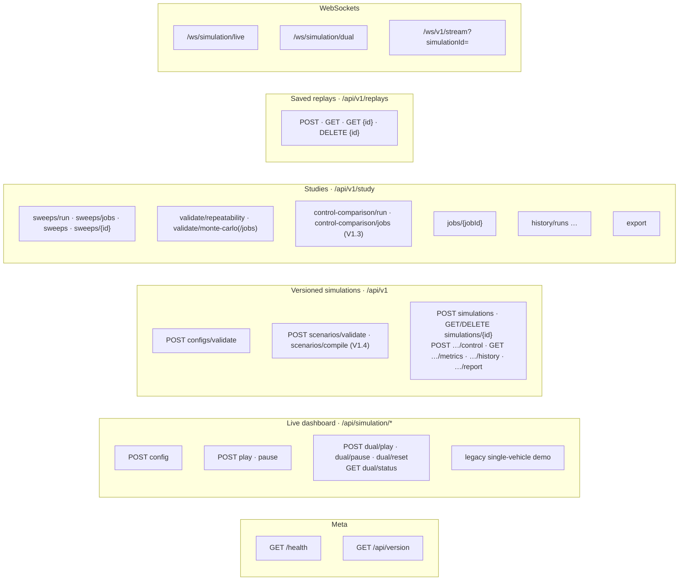
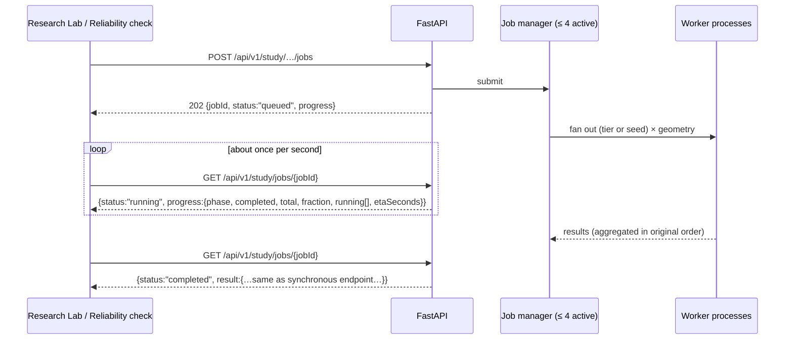
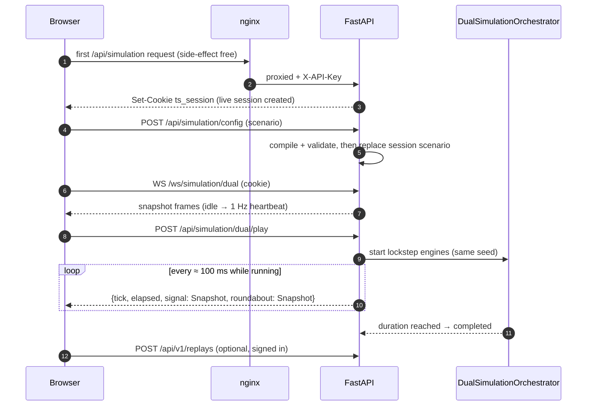

# API & WebSocket Reference

> **Status:** Current · V1.0 · every route on this page is registered in `backend/src/main.py` (verified 2026-10-05). Nothing here is planned or hypothetical.
> **Interactive schema:** FastAPI serves OpenAPI docs at `/docs` on the backend (e.g. `http://localhost:8000/docs` in development).
> **Narrative guide:** [Operations guide](../operations.md) explains behaviour in more depth (study jobs, provenance, access control).

---

## 1. Conventions

| Item | Rule |
| --- | --- |
| Base URL | Development: `http://localhost:8000` · Production (Compose): same paths on the nginx host, e.g. `http://<host>/api/...`, `ws://<host>/ws/...` |
| Format | JSON request and response bodies, camelCase keys (snake_case appears only in raw DB rows such as `summary_metrics`) |
| 🔑 API key | Routes marked 🔑 require `X-API-Key: <API_KEY>` (or `Authorization: Bearer <API_KEY>`) **when `API_KEY` is set**. nginx adds `X-API-Key` for browser traffic and passes the user's `Authorization` header through. |
| 👤 Sign-in | Routes marked 👤 require a verified Cognito ID token (or the development token with `DEV_AUTH_BYPASS=1`) |
| Live session | `/api/simulation/*` calls are scoped to a per-client session (cookie `ts_session`, or the Cognito `sub` when a bearer token is sent) |
| Pagination | `limit` 1–500, `offset` ≥ 0 |
| Run IDs | Must match `[A-Za-z0-9_-]{1,128}` on routes that validate them (400 otherwise) |

### Error shape

Errors raised by the application use one envelope:

```json
{ "error": { "code": "NOT_FOUND", "message": "Simulation not found", "details": null, "timestamp": "2026-10-05T09:00:00Z" } }
```

| Status | `code` | Typical cause |
| --- | --- | --- |
| 400 | `VALIDATION_ERROR` | Schema or cross-field rule violated; malformed run ID; bad `format` |
| 401 | `UNAUTHORIZED` | Missing/invalid API key or token |
| 403 | — | Replay owned by another user |
| 404 | `NOT_FOUND` | Unknown simulation, run, sweep, job or replay |
| 409 | `INVALID_STATE_TRANSITION` | `start` on a simulation that is not `initialized` |
| 422 | *(FastAPI default shape)* | Request body fails Pydantic validation (e.g. `numSeeds` > 30) |
| 429 | `SIMULATION_LIMIT_REACHED` | > 50 versioned simulations, or > 4 active study jobs |

Two exceptions to the envelope: **422** keeps FastAPI's default `{"detail": [...]}` array, and an invalid user bearer token on `/api/simulation/*` is rejected by middleware as `401 {"detail": "Invalid token"}` (a bearer value equal to the API key is not a user token and falls back to the cookie session).

---

## 2. Route map



---

## 3. Health and metadata

| Method | Route | Purpose | Response |
| --- | --- | --- | --- |
| GET | `/health` | Liveness (Docker health checks, nginx) | `{"status": "healthy"}` |
| GET | `/api/version` | Build provenance of the running backend | `{"gitCommit", "pythonVersion"}` |

---

## 4. Live dashboard routes — `/api/simulation/*`

Used by the guided comparison and the single-strategy views. State lives in the caller's **live session**.

| Method | Route | Purpose | Input | Output / notes |
| --- | --- | --- | --- | --- |
| POST 🔑 | `/api/simulation/config` | Set the session's scenario | Dashboard body (see [configuration](../simulation/configuration.md#layer-2--advanced-settings)); **V1.4:** may carry `scenario` (a [scenario document](#51-scenario-documents-v14)), which then defines the whole junction — the comparison runs its signal (fixed-time, or adaptive when `signalControl: "adaptive"` or the junction type says so) beside its roundabout, with the document's own seed | `{status, message, randomSeed}`. 400 on invalid `intersectionType` or any bound, or a scenario invalid for either side of the comparison. A rejected config leaves the running scenario untouched. Unchanged config is a no-op. |
| POST 🔑 | `/api/simulation/play` | Start / resume the single-strategy engine | — | `{status, message, randomSeed}`. A completed run restarts (fresh seed unless pinned). |
| POST 🔑 | `/api/simulation/pause` | Pause it | — | `{status, message}` |
| POST 🔑 | `/api/simulation/dual/play` | Start / resume the lockstep comparison | — | `{status, message, randomSeed}` |
| POST 🔑 | `/api/simulation/dual/pause` | Pause the comparison | — | `{status, message}` |
| POST 🔑 | `/api/simulation/dual/reset` | Discard and rebuild the comparison | — | `{status, message, randomSeed}` |
| GET | `/api/simulation/dual/status` | Comparison clock | — | `{status, elapsed, tick}` |
| GET | `/api/simulation/active-vehicles` | Active vehicles of the session's single engine | — | `vehicles[]` from the current snapshot |
| GET | `/api/simulation/status` · `/single-vehicle` | Legacy single-vehicle demo (V0.1) | — | Demo state; `/single-vehicle` advances 0.1 s per call while running |
| POST 🔑 | `/api/simulation/start` · `/stop` · `/reset` | Legacy demo controls (`/stop` also stops the session's live engine) | — | `{status, message}` |

---

## 5. Versioned simulation API — `/api/v1`

For programmatic runs. Simulations live in memory (≤ 50; completed ones evicted first) and are **persisted to run history automatically** when they complete, stop or fail.

| Method | Route | Purpose | Input | Output | Errors |
| --- | --- | --- | --- | --- | --- |
| POST | `/api/v1/configs/validate` | Validate without creating | Scenario JSON | `{valid, errors[]}` (always 200) | — |
| POST 🔑 | `/api/v1/simulations` | Create (status `initialized`) | Scenario JSON (`config.schema.json`), or **V1.4** `{"scenario": <scenario document>, "strategy": "fixed_time" \| "adaptive" \| "roundabout"}` (compiled first; `config` in the response is the compiled configuration) | **201** `{simulationId, configId, status, createdAt, config}` | 400, 429 |
| POST 🔑 | `/api/simulation/new` | Same, but parsed through the Pydantic model first (defaults filled) | Scenario JSON | as above | 400, 422 |
| GET | `/api/v1/simulations/{id}` | Status | — | `{simulationId, status, elapsed, tick}` | 404 |
| POST 🔑 | `/api/v1/simulations/{id}/control` | Lifecycle | `{"action": "start" \| "pause" \| "resume" \| "stop"}` | `{status, simulationId, previousStatus, currentStatus, timestamp}` | 400, 404, 409 |
| GET | `/api/v1/simulations/{id}/metrics` | Current metrics | — | Metrics dictionary ([reference](../research/metrics-reference.md)) | 404 |
| GET | `/api/v1/simulations/{id}/history` | Buffered snapshots | — | Up to 1,000 snapshots | 404 |
| GET | `/api/v1/simulations/{id}/history/{tick}` | One buffered snapshot | — | Snapshot | 404 |
| GET | `/api/v1/simulations/{id}/report?format=json\|csv` | Final report | `format` (default `csv`) | JSON `{simulationId, finalMetrics, ticksCount}` or CSV download | 404 |
| DELETE 🔑 | `/api/v1/simulations/{id}` | Remove from memory | — | `{status: "deleted", simulationId}` | 400 if running/paused, 404 |

There is **no** list route (`GET /api/v1/simulations`); use `/api/v1/study/history/runs` for persisted runs.

### 5.1 Scenario documents (V1.4)

A scenario document (`format: "urbanflow-scenario"`, `version: 1`) describes a junction and its traffic independently of how it is controlled: approaches with their own lanes, length, signal lane arrows (`laneUse`), roundabout lane markings (`roundaboutLaneUse`, optional), vehicles per hour, turning shares and optional vehicle mix; the scenario vehicle mix; signal timing and adaptive settings; roundabout design (circulating lanes, radii, gap acceptance, speeds); duration, warm-up, seed, arrival pattern. The backend compiles it into the configuration above **once per strategy**, so every strategy gets identical geometry, lanes, traffic, vehicles, duration and seed. Unknown fields are rejected; nothing is normalised. Full field list: [scenario contract §8](../architecture/06-scenario-configuration-contract.md#8-scenario-documents-v14).

| Method | Route | Purpose | Input | Output | Errors |
| --- | --- | --- | --- | --- | --- |
| POST | `/api/v1/scenarios/validate` | Can this scenario be simulated under these strategies? | `{scenario, strategies?: ["fixed_time","adaptive","roundabout"] (1–3; default: the junction type)}` | `{valid, errors[], warnings[], strategies, design{strategy: {laneUse, circulatingLanes?, ringAssignment?}}, fingerprint, scenario}` — always 200. An error that holds for only one strategy is prefixed with its name ("Roundabout: …"). | 422 (body shape) |
| POST | `/api/v1/scenarios/compile` | The exact engine configuration one strategy runs | `{scenario, strategy}` | `{strategy, config}` | 400 (invalid scenario), 422 |

`fingerprint` is a hash of everything simulated (not the name or description); compiled configurations carry it in `scenario.fingerprint`, so runs of the same scenario can be matched.

---

## 6. Studies — `/api/v1/study`

### 6.1 Background jobs (used by the app)



| Method | Route | Purpose | Input | Output | Errors |
| --- | --- | --- | --- | --- | --- |
| POST 🔑 | `/api/v1/study/sweeps/jobs` | Volume sweep in the background | Sweep body (below) | **202** job | 422, 429 |
| POST 🔑 | `/api/v1/study/validate/monte-carlo/jobs` | Monte Carlo in the background | Monte Carlo body | **202** job | 400, 422, 429 |
| POST 🔑 | `/api/v1/study/control-comparison/jobs` | V1.3 fixed-time vs adaptive vs roundabout in the background | Control-comparison body (below) | **202** job | 422, 429 |
| GET | `/api/v1/study/jobs/{jobId}` | Poll | — | `{jobId, kind, status: queued\|running\|completed\|failed, progress, result, error}` | 404 |

Jobs live in server memory: a restart drops unfinished jobs; finished jobs are kept for one hour.

### 6.2 Synchronous study routes (scripts, existing clients)

| Method | Route | Body | Output |
| --- | --- | --- | --- |
| POST 🔑 | `/api/v1/study/sweeps/run` | `{arrivalRates?: number[] (≤ 20, each 0–10), duration?: 60 (1–3600), randomSeed?: 42, name?, customConfig?}` | Sweep result: `sessionId, name, duration, randomSeed, seedsPerTier, tieTolerance, calibration, curves{rates, volumesVehPerHour, signal{…}, roundabout{…}, crossoverArrivalRate, crossoverHourlyVolume, crossoverBracketArrivalRates}, runs[]` — persisted |
| POST 🔑 | `/api/v1/study/validate/monte-carlo` | `{numSeeds?: 5 (1–30), confidenceLevel?: 0.95 (0.90/0.95/0.99), duration?: 30, customConfig? \| scenario?}` | `numSeeds, seeds, duration, confidenceLevel, alpha, method, calibration, vehicleLimitReachedSeeds, signal{delay,throughput,queue}, roundabout{…}, comparison{…}, seedRuns` |
| POST 🔑 | `/api/v1/study/control-comparison/run` | `{lanes?: 1 (1–3), levels?: ["light","moderate","busy","near","capacity","over"] (no repeats), numSeeds?: 5 (2–10), baseSeed?: 1, duration?: 300 (60–900), adaptive?: controller.adaptive, vehicleMix?, confidenceLevel?: 0.95}` | `controls, lanesPerApproach, levels, seeds, duration, warmupTime, confidenceLevel, adaptiveSettings, vehicleMix, calibration, tieTolerance, collisionCount{per control}, method, results[]{level, arrivalRate, demandVph, degreeOfSaturation, vehicleLimitReached, controls{fixed_time,adaptive,roundabout: per-measure mean/CI}, delayComparisons{pair: meanDifference, ciLow, ciHigh, reading lower\|higher\|tie\|inconclusive}}, perSeed[]` — same seeds, arrivals and geometry for all three controls; not persisted |
| POST 🔑 | `/api/v1/study/validate/repeatability` | `{duration?: 20, randomSeed?: 12345}` | Per-geometry invariant results (`geometries`), what was `checked`, `valid`, `isDeterministic` |
| GET 🔑 | `/api/v1/study/export?format=json\|csv` | — | Runs a fresh default sweep **and** a Monte Carlo study, returns the combined report (CSV: `traffic_simulation_study_v1.csv`). Expensive. |

**V1.4 — a custom scenario in the control comparison.** `control-comparison/run` and `/jobs` also accept `{scenario: <scenario document>, strategies?: (2–3 of fixed_time, adaptive, roundabout; default all), numSeeds?, baseSeed? (default: the scenario's seed), demandScales?: number[] (≤ 6, each 0.1–3; default [1]), confidenceLevel?}`. `lanes`, `levels`, `duration`, `adaptive` and `vehicleMix` describe the built-in junction and are rejected alongside a scenario (422), as is a scenario invalid for any requested strategy or longer than 900 s. Result (`study: "scenario-comparison"`): `scenario, fingerprint, controls, demandScales, seeds, duration, warmupTime, confidenceLevel, calibration, tieTolerance, collisionCount, compiledConfigs{strategy: engine config}, method, results[]{demandScale, demandVph, vehicleLimitReached, controls{…}, delayComparisons{a_vs_b}}, perSeed[]{demandScale, seed, <strategy>{averageDelay, throughput, averageQueueLength, collisionCount, vehicleTypeBreakdown, approachBreakdown, signalTiming}}`.

In the Monte Carlo body, `scenario` and `customConfig` are mutually exclusive (422). `scenario` takes the dashboard body and repeats exactly that scenario; a scenario the live dashboard would reject is rejected here too (400).

### 6.3 Sweep sessions

| Method | Route | Output |
| --- | --- | --- |
| GET | `/api/v1/study/sweeps?limit=20&offset=0` | Summaries `[{id, name, created_at}]` |
| GET | `/api/v1/study/sweeps/{sweepId}` | Full stored sweep (configuration + results) · 404 |

### 6.4 Run history

| Method | Route | Purpose | Input | Output | Errors |
| --- | --- | --- | --- | --- | --- |
| GET | `/api/v1/study/history/runs` | List runs | `limit` (50), `offset`, `intersection_type`, `seed`, `batch_id` | Run rows | 422 |
| GET | `/api/v1/study/history/runs/{runId}` | Run + per-tick metrics | — | `{run, metricsTimeline}` | 404 |
| GET | `/api/v1/study/history/runs/{runId}/reproducibility` | Full reproducibility record | — | See [reproducibility §3](../research/reproducibility.md#3-the-reproducibility-record) (+ `savedReplay`) | 400, 404 |
| PATCH 🔑 | `/api/v1/study/history/runs/{runId}` | Labels only | `{name?: 1–120 chars, notes?: ≤ 4000, tags?: ≤ 20 × ≤ 32 chars}` — `null`/`[]` clears notes/tags | Updated record | 400, 404, 422 |
| GET | `/api/v1/study/history/runs/{runId}/export?format=json\|csv` | Download | `format` (default `json`) | JSON `{exportFormat, exportVersion, exportedAt, exportedBy, run, metricsTimeline}` or CSV `section,key,value` | 400, 404 |
| POST | `/api/v1/study/history/runs/compare` | Two-run delta | `{runIdA, runIdB}` | `{runA, runB, comparison{delayDelta, delayDeltaPercent, throughputDelta, queueDelta, stopsDelta, winner, winnerBasis}, identicalSeed, seed}` | 404 |
| POST 🔑 | `/api/v1/study/history/runs/{runId}/reproduce` | Headless re-run and check | — | See [reproducibility §4.2](../research/reproducibility.md#42-through-the-api) | 400, 404 |

---

## 7. Saved replays — `/api/v1/replays`

A saved replay and its run record share one ID; deleting one deletes both.

| Method | Route | Purpose | Input | Output | Errors |
| --- | --- | --- | --- | --- | --- |
| POST 🔑 👤 | `/api/v1/replays` | Save the current run | `{name, config, metrics, mode?: "single" \| "dual"}` | `{status, replay_id, runId, reproducibility}` | 401/403, 422 |
| GET 👤 | `/api/v1/replays?limit=50&offset=0` | The caller's saved replays | — | Replays with compact `reproducibility` | 401/403 |
| GET 👤 | `/api/v1/replays/{replayId}` | One replay | — | Replay | 403, 404 |
| DELETE 🔑 👤 | `/api/v1/replays/{replayId}` | Delete replay **and** run record | — | `{status: "ok"}` | 403, 404 |

When the request carries the caller's live-session cookie and that session's engine ran with the claimed seed, the server stores the **engine's** exact configuration and metrics at the recorded elapsed time instead of the client's copy.

---

## 8. WebSockets

| Endpoint | Scope | Rate | Ends when | Client messages |
| --- | --- | --- | --- | --- |
| `/ws/simulation/dual` | Caller's live session (cookie) | ≈ 10 Hz while time advances; 1 Hz heartbeat when paused/idle | Client disconnects | Ignored — control via REST |
| `/ws/simulation/live` | Caller's live session (cookie) | as above | Client disconnects | Ignored |
| `/ws/v1/stream?simulationId=<id>` | One versioned simulation | `simulation.snapshotFrequency` (default 10 Hz, 1–60) | Snapshot status `completed` or `error` | Ignored — control via `POST …/control` |

Close codes: `1008` unknown `simulationId` (versioned stream) · `1011` server error.

### 8.1 Lifecycle of a guided comparison



The frontend deliberately makes one side-effect-free request first and waits for the session cookie before opening the socket or sending configuration, so the stream and the REST calls always address the same session (`frontend/src/services/liveSession.ts`).

### 8.2 Message shapes

**Single snapshot** (`/ws/simulation/live`, `/ws/v1/stream`) — built by `snapshot/builder.py`, contract in [05 — Snapshot contract](../architecture/05-snapshot-contract.md):

```json
{
  "schemaVersion": "1.0.0",
  "simulationId": "…", "configId": "…",
  "timestamp": 74.3, "tick": 743, "frameNumber": 743,
  "wallClockTime": "2026-10-05T09:00:00+00:00",
  "samplingFrequency": 10.0, "deltaTime": 0.1, "warmupTime": 30.0,
  "simulationStatus": "running",
  "vehicles": [{ "id": "veh_12", "x": -3.5, "y": 41.2, "speed": 7.9, "acceleration": 0.4,
                 "heading": 180.0, "length": 4.4, "width": 1.9, "state": "approaching",
                 "laneId": "n_in_0", "direction": "north", "turnIntent": "straight",
                 "waitTime": 0.0, "stopCount": 0, "spawnTime": 66.1, "exitTime": null, "…": "…" }],
  "intersection": { "type": "fixed_time_signal", "centerX": 0, "centerY": 0, "boundingRadius": 11,
                    "approaches": [{ "direction": "north", "queueLength": 2, "laneCount": 1, "…": "…" }] },
  "controller": { "…": "controller-specific state (phase, time remaining / circulating count)" },
  "metrics": { "averageDelay": 18.4, "throughput": 52, "…": "full metrics dictionary" },
  "vehicleCounts": { "active": 14, "approaching": 0, "waiting": 0, "crossing": 0, "inRoundabout": 0, "exited": 61 },
  "units": { "distance": "meters", "speed": "meters_per_second", "acceleration": "meters_per_second_squared", "time": "seconds", "angle": "degrees" }
}
```

Values above are illustrative; field names are exact.

**Dual frame** (`/ws/simulation/dual`):

```json
{ "tick": 743, "elapsed": 74.3, "signal": { "…": "Snapshot" }, "roundabout": { "…": "Snapshot" } }
```

---

## 9. Example: a scripted run

```bash
curl -X POST http://localhost:8000/api/v1/configs/validate \
  -H "Content-Type: application/json" \
  -d '{"simulation":{"duration":120,"randomSeed":7},"geometry":{"intersectionType":"roundabout"},"roads":{"lanesPerApproach":1}}'
# {"valid": true, "errors": []}

curl -X POST http://localhost:8000/api/v1/simulations \
  -H "Content-Type: application/json" \
  -d '{"simulation":{"duration":120,"randomSeed":7},"geometry":{"intersectionType":"roundabout"},"roads":{"lanesPerApproach":1}}'
# 201 {"simulationId": "…", "status": "initialized", …}

curl -X POST http://localhost:8000/api/v1/simulations/<id>/control \
  -H "Content-Type: application/json" -d '{"action":"start"}'

# stream:  ws://localhost:8000/ws/v1/stream?simulationId=<id>
curl "http://localhost:8000/api/v1/simulations/<id>/report?format=json"
```
