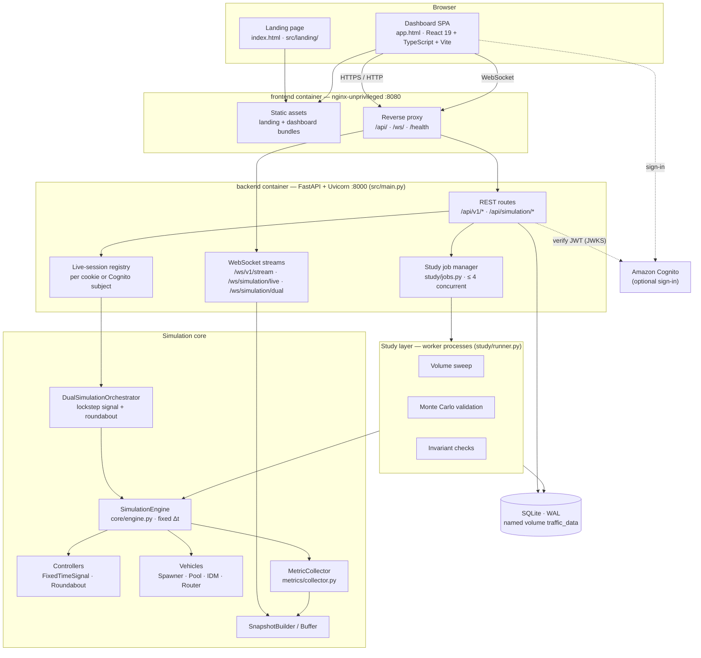
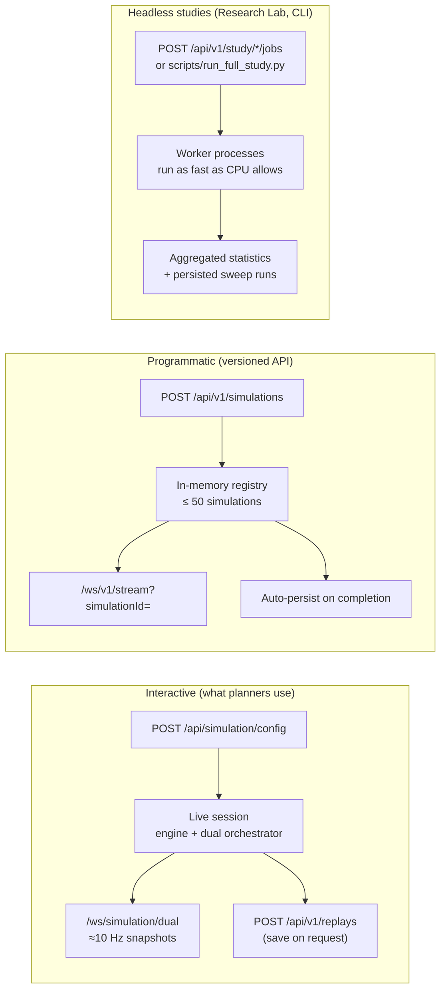
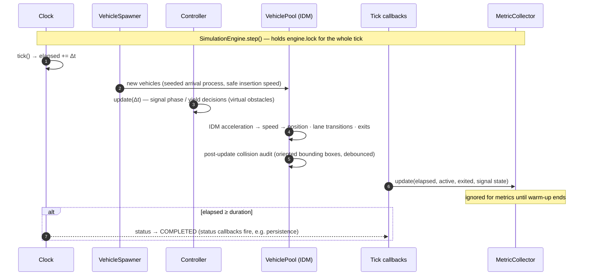
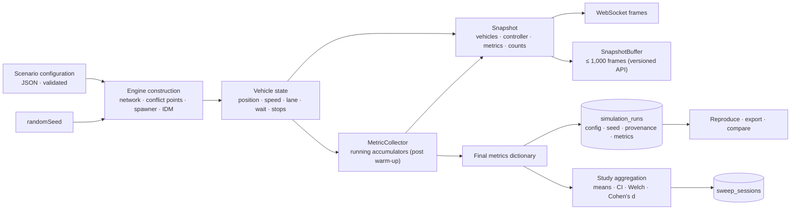
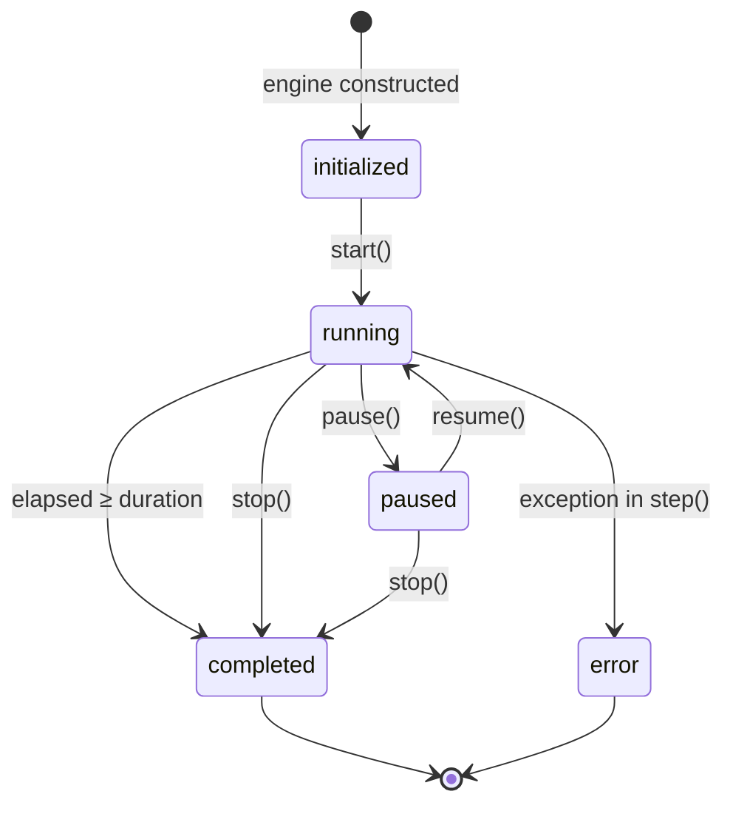
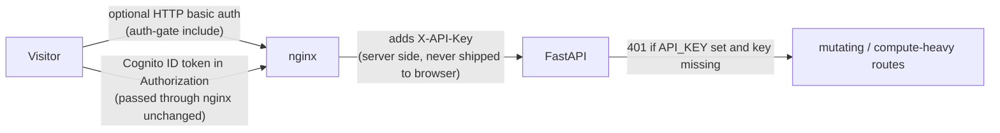

# 00 — System Overview

> **Status:** Current · describes the V1.0 implementation · verified against the source tree on 2026-10-05
> **Read this first.** Documents 01–10 in this folder go deeper into individual layers and contracts; this page is the map.

UrbanFlow is a two-tier web application: a **React/TypeScript single-page app** that presents and explains results, and a **Python/FastAPI backend** that owns the simulation, every metric, every statistic and all persistence. The browser never simulates and never computes a metric — it renders what the backend measured.

---

## 1. Architecture at a glance

| Layer | Technology | Responsibility | Source |
| --- | --- | --- | --- |
| Landing + dashboard | React 19, TypeScript, Vite, HTML5 Canvas, Recharts, Tailwind CSS | Narrative, guided comparison, plain-language results, Research Lab views, saved-run pages | `frontend/src/` |
| Edge | nginx (unprivileged image) | Serves static bundles, SPA route fallback, proxies `/api/`, `/ws/`, `/health`; attaches the server-side API key; optional basic-auth gate | `frontend/templates/default.conf.template` |
| API | FastAPI, Uvicorn, Pydantic, `jsonschema` | Validation, simulation lifecycle, live sessions, streaming, studies, history, replays, exports | `backend/src/main.py` |
| Simulation core | Pure Python | Discrete-time engine, IDM car-following, controllers, conflict management, metrics | `backend/src/core`, `vehicles`, `controllers`, `intersection`, `roads`, `metrics` |
| Study layer | `concurrent.futures` worker processes | Sweeps, Monte Carlo validation, invariant checks, reports | `backend/src/study/` |
| Persistence | SQLite (WAL, 5 s busy timeout, foreign keys) | Runs, per-tick metrics, sweeps, saved replays, configurations | `backend/src/database/` |
| Contracts | JSON Schema | Scenario configuration validation; snapshot and vehicle shapes | `shared/schemas/` |

---

## 2. Three ways the engine is driven

The same `SimulationEngine` is used everywhere. What differs is **who advances it** and **what happens to the result**.

| Mode | Advanced by | Pace | Persisted |
| --- | --- | --- | --- |
| Interactive live / dual | Engine background thread | Real time (sleeps to `timeStep` per tick) | Only when the user saves (`/api/v1/replays`) |
| Versioned `/api/v1/simulations` | Engine background thread after `control: start` | Real time | Automatically, on completion / stop / error |
| Studies | Worker process loop calling `step()` | As fast as possible | Sweep runs and sweep sessions; Monte Carlo results are returned, not stored as runs |

---

## 3. Inside one tick

Every tick is executed under the engine's re-entrant lock, so REST handlers and snapshot builders only ever observe a completed tick.

The controller updates **before** vehicle physics, so a red signal or a refused gap affects the very same tick ("zero-latency" control response — `core/engine.py`).

---

## 4. Data and state flow

| Artefact | Produced by | Lifetime | Consumer |
| --- | --- | --- | --- |
| Configuration | Client or study runner | Copied into each engine; stored with every persisted run | Engine, persistence, reproduction |
| Vehicle state | `VehiclePool` | In memory for the run (exited vehicles are kept for metrics) | Collector, snapshot builder |
| Snapshot | `SnapshotBuilder.build()` | Sent and discarded (live), or buffered (versioned API) | Canvas, live panels |
| Metrics dictionary | `MetricCollector.get_metrics()` | Recomputed on demand from accumulators | Snapshots, reports, persistence |
| Run record | `SimulationRunDAO.save()` | SQLite until deleted | Saved runs, reproduction, exports |
| Study result | `study/validation.py`, `study/volume_sweep.py` | Returned via job result; sweeps also stored | Research Lab |

---

## 5. Lifecycle of a simulation

`start()` on anything other than `initialized` raises, which the versioned API reports as **409**. Interactive sessions re-create a completed engine (with a fresh seed unless the user pinned one) when Play is pressed again.

---

## 6. Concurrency and isolation

| Concern | Mechanism | Bound |
| --- | --- | --- |
| Torn reads of vehicle lists | `engine.lock` (re-entrant) held for the whole tick and by every reader | — |
| One visitor resetting another's run | Live sessions keyed by the `ts_session` cookie (or the Cognito `sub` when a bearer token is sent) | ≤ 100 sessions; idle sessions reclaimed after 30 min; running/paused sessions never evicted |
| Versioned simulations | `simulations_db` registry under a lock; completed runs evicted oldest-first | ≤ 50 entries (429 beyond) |
| Heavy studies | Background job manager + worker process pool | ≤ 4 active jobs (429 beyond); finished jobs kept 1 h; `STUDY_WORKERS` processes |
| SQLite contention | WAL journal, 5 s busy timeout | — |

---

## 7. Security boundary

- **`API_KEY`** protects mutating and compute-heavy routes. nginx injects it as `X-API-Key` from `BACKEND_API_KEY`, so the browser never holds it, and leaves `Authorization` free for the user's token. In production the backend publishes no port.
- **Cognito** identifies *who* saved a run. `POST/GET/DELETE /api/v1/replays` require a verified token; ownership is enforced on read and delete. Local development uses an explicit bypass token accepted only when `DEV_AUTH_BYPASS=1`.
- **Access gate** — an optional nginx basic-auth include restricts who can use a public demo at all.

Details: [Deployment & operations](../deployment/README.md) · [Operations guide](../operations.md#access-control).

---

## 8. Where to go next

| Question | Document |
| --- | --- |
| How is the backend organised? | [02 — Backend architecture](02-backend-architecture.md) |
| How is the frontend organised? | [03 — Frontend architecture](03-frontend-architecture.md) |
| What does the simulation actually model? | [Simulation methodology](../simulation/methodology.md) |
| What does every metric mean? | [Metrics reference](../research/metrics-reference.md) |
| Which endpoints exist? | [API & WebSocket reference](../api/README.md) |
| How is it deployed? | [Deployment & operations](../deployment/README.md) |
