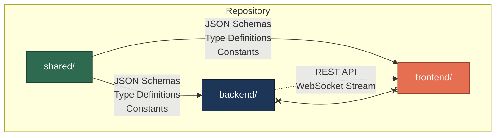

# Deliverable 1 — Repository Architecture

> **Document Version:** 0.1.0
> **Last Updated:** 2026-07-23
> **Status:** Phase 0 — Architecture Specification
> **Owner:** Architecture Team

---

## 1. Overview

This document defines the top-level repository structure for the **Traffic Intersection Control Comparison Framework**. The repository is organized as a **monorepo** with strict separation between Backend, Frontend, and Shared layers.

Two developers work independently:

| Developer | Scope | Primary Directory |
|-----------|-------|-------------------|
| Developer A | Simulation Engine, Metrics, API | `backend/` |
| Developer B | Dashboard, Visualization, Charts | `frontend/` |
| Both (coordinated) | Contracts, Schemas, Types | `shared/` |

Neither developer should ever need to inspect the other's implementation directory.

---

## 2. Repository Tree

```
traffic-intersection-control-comparison/
│
├── backend/                    # Simulation engine and API server
│   ├── src/                    # All backend source code
│   │   ├── api/                # HTTP and WebSocket endpoints
│   │   ├── config/             # Configuration loading and validation
│   │   ├── controllers/        # Intersection control strategies
│   │   ├── core/               # Simulation loop and orchestration
│   │   ├── events/             # Event bus and event definitions
│   │   ├── intersection/       # Intersection geometry and state
│   │   ├── metrics/            # Metric computation engine
│   │   ├── roads/              # Road network and lane modeling
│   │   ├── simulation/         # Simulation lifecycle management
│   │   ├── snapshot/           # Snapshot serialization and emission
│   │   ├── utils/              # Shared backend utilities
│   │   └── vehicles/           # Vehicle models and physics (IDM)
│   ├── tests/                  # All backend tests
│   │   ├── unit/               # Unit tests per module
│   │   ├── integration/        # Cross-module integration tests
│   │   └── fixtures/           # Test data and mock objects
│   ├── requirements.txt        # Python dependencies
│   ├── pyproject.toml          # Project metadata and tool config
│   └── README.md               # Backend-specific documentation
│
├── frontend/                   # Visualization dashboard
│   ├── src/                    # All frontend source code
│   │   ├── assets/             # Static files (images, icons, fonts)
│   │   ├── charts/             # Chart components and configurations
│   │   ├── components/         # Reusable UI components
│   │   ├── contexts/           # React context providers
│   │   ├── hooks/              # Custom React hooks
│   │   ├── layouts/            # Page layout templates
│   │   ├── metrics/            # Metric display and formatting
│   │   ├── pages/              # Top-level page components
│   │   ├── services/           # API and WebSocket clients
│   │   ├── simulation/         # Simulation canvas and playback
│   │   ├── styles/             # Global styles and design tokens
│   │   └── types/              # TypeScript type definitions
│   ├── public/                 # Static public assets
│   ├── index.html              # HTML entry point
│   ├── package.json            # Node.js dependencies
│   ├── tsconfig.json           # TypeScript configuration
│   ├── vite.config.ts          # Vite build configuration
│   └── README.md               # Frontend-specific documentation
│
├── shared/                     # Shared contracts (THE source of truth)
│   ├── schemas/                # JSON Schema definitions
│   │   ├── snapshot.schema.json
│   │   ├── config.schema.json
│   │   └── metrics.schema.json
│   ├── snapshot/               # Snapshot contract documentation
│   ├── metrics/                # Metric definitions and formulas
│   ├── config/                 # Configuration contract documentation
│   ├── types/                  # Canonical type definitions
│   ├── constants/              # Shared constant values
│   ├── enums/                  # Enumeration definitions
│   └── README.md               # Shared layer documentation
│
├── docs/                       # Project documentation
│   ├── architecture/           # Architecture specification (this folder)
│   │   ├── 01-repository-architecture.md
│   │   ├── 02-backend-architecture.md
│   │   ├── 03-frontend-architecture.md
│   │   ├── 04-shared-contract-layer.md
│   │   ├── 05-snapshot-contract.md
│   │   ├── 06-scenario-configuration-contract.md
│   │   ├── 07-metric-contract.md
│   │   ├── 08-communication-contract.md
│   │   ├── 09-engineering-standards.md
│   │   └── 10-repository-bootstrap.md
│   ├── Internship Project proposal - 2026.pptx
│   ├── Internship Project proposal ver1.pptx
│   ├── Project_Documentation.docx
│   ├── Technical Documentation.docx
│   ├── Simulation_Parameters_Reference.md.pdf
│   └── simulation_pipeline_overview.png
│
├── scripts/                    # Development and CI/CD scripts
│   ├── setup.sh                # One-command project setup
│   ├── validate-schemas.sh     # JSON Schema validation
│   └── README.md               # Scripts documentation
│
├── examples/                   # Example configurations and outputs
│   ├── configs/                # Sample scenario configurations
│   ├── snapshots/              # Sample snapshot payloads
│   └── README.md               # Examples documentation
│
├── .github/                    # GitHub-specific configuration
│   ├── ISSUE_TEMPLATE/         # Issue templates
│   ├── PULL_REQUEST_TEMPLATE.md
│   └── workflows/              # CI/CD workflows (future)
│
├── .gitignore                  # Git ignore rules
├── LICENSE                     # Project license
└── README.md                   # Project root documentation
```

---

## 3. Directory Purposes

### Top-Level Directories

| Directory | Purpose | Owner |
|-----------|---------|-------|
| `backend/` | All server-side code: simulation engine, physics, metrics computation, API endpoints | Developer A |
| `frontend/` | All client-side code: React dashboard, canvas visualization, chart rendering, playback | Developer B |
| `shared/` | Contracts, schemas, and type definitions that both sides depend on | Both (coordinated changes only) |
| `docs/` | Architecture documents, project proposals, technical references | Both |
| `scripts/` | Development automation, CI/CD helpers, validation utilities | Both |
| `examples/` | Sample configurations, snapshot payloads, expected outputs | Both |
| `.github/` | GitHub issue templates, PR templates, CI workflows | Both |

### Ownership Rules

1. **Developer A** has full authority over everything inside `backend/`. Developer B should never need to read or modify anything in this directory.
2. **Developer B** has full authority over everything inside `frontend/`. Developer A should never need to read or modify anything in this directory.
3. **`shared/`** is jointly owned. Any change to `shared/` requires a Pull Request reviewed by BOTH developers, because changes here affect both sides.
4. **`docs/architecture/`** is a reference that both developers read but modify only through coordinated PRs.

---

## 4. Anti-Patterns

> **What should NEVER happen in this repository:**

| Anti-Pattern | Why It's Wrong |
|-------------|---------------|
| Backend code importing from `frontend/` | Violates separation; backend must never depend on UI code |
| Frontend code importing from `backend/` | Violates separation; frontend must never depend on engine code |
| Business logic in `shared/` | Shared is for contracts only — no algorithms, no computation, no state |
| Simulation code in `frontend/` | Frontend renders snapshots; it never runs simulations |
| UI components in `backend/` | Backend is headless; it never renders HTML or React |
| Hardcoded values that should be in `shared/constants/` | Both sides must use the same constant values |
| Schema definitions outside `shared/schemas/` | One source of truth; never duplicate schemas |
| Test files mixed with source files | Tests belong in dedicated `tests/` directories |
| Configuration files committed with secrets | Use `.env` files (gitignored) for sensitive configuration |

---

## 5. Dependency Flow



**Key:** Backend and Frontend NEVER import from each other directly. They communicate exclusively through the API layer (HTTP/WebSocket), and both reference the same shared contracts.

---

## 6. Technology Stack

| Layer | Technology | Rationale |
|-------|-----------|-----------|
| Backend Runtime | Python 3.11+ | Strong scientific computing ecosystem; IDM physics modeling |
| Backend API | FastAPI | Async support, WebSocket native, auto-generated OpenAPI docs |
| Frontend Runtime | Node.js 18+ | Standard for React tooling |
| Frontend Framework | React 18+ with TypeScript | Component-based UI, strong typing, rich ecosystem |
| Frontend Build | Vite | Fast HMR, native ESM, minimal config |
| Shared Format | JSON Schema (Draft 2020-12) | Language-agnostic, machine-validatable, self-documenting |
| Rendering | HTML5 Canvas | Direct pixel control for vehicle animation and interpolation |
| Communication | REST + WebSocket | REST for CRUD operations; WebSocket for real-time snapshot streaming |

---

## 7. Cross-References

| Topic | Document |
|-------|----------|
| Backend folder details | [02-backend-architecture.md](./02-backend-architecture.md) |
| Frontend folder details | [03-frontend-architecture.md](./03-frontend-architecture.md) |
| Shared layer design | [04-shared-contract-layer.md](./04-shared-contract-layer.md) |
| Engineering standards | [09-engineering-standards.md](./09-engineering-standards.md) |
| Repository bootstrap | [10-repository-bootstrap.md](./10-repository-bootstrap.md) |
