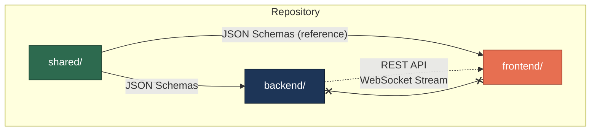

# Deliverable 1 — Repository Architecture

> **Status:** Current · V1.0 · repository tree re-verified 2026-10-05
> **Owner:** Both developers
> **See also:** [00 — System overview](00-system-overview.md) · [Documentation hub](../README.md)

---

## 1. Overview

This document describes the checked-in repository structure. It supersedes the original phase-zero proposal where they differ. For setup, payload examples, routes, database behavior, and study commands, see [../operations.md](../operations.md).

Two developers work independently:

| Developer | Scope | Primary Directory |
|-----------|-------|-------------------|
| Viraj Jadhao (Developer A) | Simulation Engine, Metrics, API | `backend/` |
| Khushi Kashyap (Developer B) | Dashboard, Visualization, Charts | `frontend/` |
| Both (coordinated) | Contracts, Schemas, Types | `shared/` |

Neither developer should ever need to inspect the other's implementation directory.

---

## 2. Repository Tree

```
Traffic-Simulation/                 (product name: UrbanFlow)
├── backend/                        Simulation engine, metrics, studies, API, persistence
│   ├── src/                        core/ roads/ vehicles/ controllers/ intersection/ metrics/
│   │                               snapshot/ study/ database/ · main.py · auth.py
│   ├── tests/                      pytest suite mirroring src/ (+ api/, integration/)
│   ├── Dockerfile · docker-entrypoint.py · pyproject.toml · requirements.txt · README.md
├── frontend/                       Landing page + dashboard (React 19, TypeScript, Vite)
│   ├── src/                        landing/ components/ (guided/, analytics/, ui/) hooks/ services/
│   │                               metrics/ types/ auth/ runs/ styles/ theme/ utils/ test/
│   ├── templates/                  nginx site template (production)
│   ├── index.html · app.html · vite.config.ts · package.json · Dockerfile · README.md
├── shared/
│   ├── schemas/                    config.schema.json · snapshot.schema.json · vehicle_state.json
│   └── README.md
├── scripts/                        run_full_study.py · validate_schemas.py (+ .sh) · setup_cognito.py ·
│                                   GitHub automation (setup_github.py, assign_issues.py, …) · README.md
├── docs/                           Documentation — start at docs/README.md
│   ├── architecture/ simulation/ research/ api/ product/ deployment/ testing/
│   ├── decisions/ reports/ future-scope/ resources/
│   ├── ROADMAP.md · operations.md · bug-fix-report.md
│   └── project-management/ issues/ code-review/   (historical)
├── landingpage/                    Legacy prototype workspace (pnpm) — not built, deployed or referenced
├── .github/                        CI workflows (ci.yml, docker.yml), issue/PR templates, CODEOWNERS, Dependabot
├── .husky/pre-commit               Runs the frontend linter
├── docker-compose.yml              Production stack (nginx + FastAPI + volume)
├── docker-compose.dev.yml          Development stack (Vite + uvicorn --reload)
├── start.ps1                       Windows helper for both stacks
├── AWS_DEPLOYMENT_GUIDE.md         Pointer to docs/deployment/
└── README.md
```

---

## 3. Directory Purposes

### Top-Level Directories

| Directory | Purpose | Owner |
|-----------|---------|-------|
| `backend/` | All server-side code: simulation engine, physics, metrics computation, API endpoints | Developer A |
| `frontend/` | All client-side code: React dashboard, canvas visualization, chart rendering, playback | Developer B |
| `shared/` | Contracts, schemas, and type definitions that both sides depend on | Both (coordinated changes only) |
| `docs/` | All project documentation (hub: `docs/README.md`) | Both |
| `scripts/` | Study runner, schema validation, Cognito provisioning, GitHub automation | Both |
| `landingpage/` | Legacy prototype workspace; not part of the build or deployment | — |
| `.github/` | GitHub issue templates, PR templates, CI workflows | Both |

### Ownership Rules

1. **Developer A** has full authority over everything inside `backend/`. Developer B should never need to read or modify anything in this directory.
2. **Developer B** has full authority over everything inside `frontend/`. Developer A should never need to read or modify anything in this directory.
3. **`shared/`** is jointly owned. Any change to `shared/` requires a Pull Request reviewed by BOTH developers, because changes here affect both sides.
4. **`docs/architecture/`** is a reference that both developers read but modify only through coordinated PRs.

---

## 4. Anti-Patterns

> **What should NEVER happen in this repository:**

| Anti-Pattern | Why It's Wrong |
|-------------|---------------|
| Backend code importing from `frontend/` | Violates separation; backend must never depend on UI code |
| Frontend code importing from `backend/` | Violates separation; frontend must never depend on engine code |
| Business logic in `shared/` | Shared is for contracts only — no algorithms, no computation, no state |
| Simulation code in `frontend/` | Frontend renders snapshots; it never runs simulations |
| UI components in `backend/` | Backend is headless; it never renders HTML or React |
| Constants duplicated without a sync test | Values mirrored across the boundary (e.g. reference capacity in `study/calibration.py` and `types/demand.ts`) must be kept equal by a test |
| Schema definitions outside `shared/schemas/` | One source of truth; never duplicate schemas |
| Test files mixed with source files | Tests belong in dedicated `tests/` directories |
| Configuration files committed with secrets | Use `.env` files (gitignored) for sensitive configuration |

---

## 5. Dependency Flow


```mermaid
graph TD
    subgraph Repository
        BE[backend/]
        FE[frontend/]
        SH[shared/]
    end

    SH -->|"JSON Schemas"| BE
    SH -->|"JSON Schemas (reference)"| FE
    BE -.->|"REST API<br/>WebSocket Stream"| FE

    BE x--x FE

    style SH fill:#2d6a4f,stroke:#1b4332,color:#fff
    style BE fill:#1d3557,stroke:#0d1b2a,color:#fff
    style FE fill:#e76f51,stroke:#9c4130,color:#fff
```

**Key:** Backend and Frontend NEVER import from each other directly. They communicate exclusively through the API layer (HTTP/WebSocket), and both reference the same shared contracts.

---

## 6. Technology Stack

| Layer | Technology | Rationale |
|-------|-----------|-----------|
| Backend Runtime | Python 3.11+ | Strong scientific computing ecosystem; IDM physics modeling |
| Backend API | FastAPI | Async support, WebSocket native, auto-generated OpenAPI docs |
| Frontend Tooling | Node.js (CI uses 20; the image build uses 26) | Standard for React tooling |
| Frontend Framework | React 19 with TypeScript | Component-based UI and strong typing |
| Frontend Build | Vite | Fast HMR, native ESM, minimal config |
| Shared Format | JSON Schema (Draft 2020-12) | Language-agnostic, machine-validatable, self-documenting |
| Rendering | HTML5 Canvas · Recharts | Canvas for vehicle animation and interpolation; Recharts for charts |
| Persistence | SQLite (WAL) | Zero-ops storage on a Docker volume |
| Delivery | Docker Compose · nginx · AWS EC2 | See docs/deployment/README.md |
| Communication | REST + WebSocket | REST for CRUD operations; WebSocket for real-time snapshot streaming |

---

## 7. Cross-References

| Topic | Document |
|-------|----------|
| Backend folder details | [02-backend-architecture.md](./02-backend-architecture.md) |
| Frontend folder details | [03-frontend-architecture.md](./03-frontend-architecture.md) |
| Shared layer design | [04-shared-contract-layer.md](./04-shared-contract-layer.md) |
| Engineering standards | [09-engineering-standards.md](./09-engineering-standards.md) |
| Repository bootstrap | [10-repository-bootstrap.md](./10-repository-bootstrap.md) |
