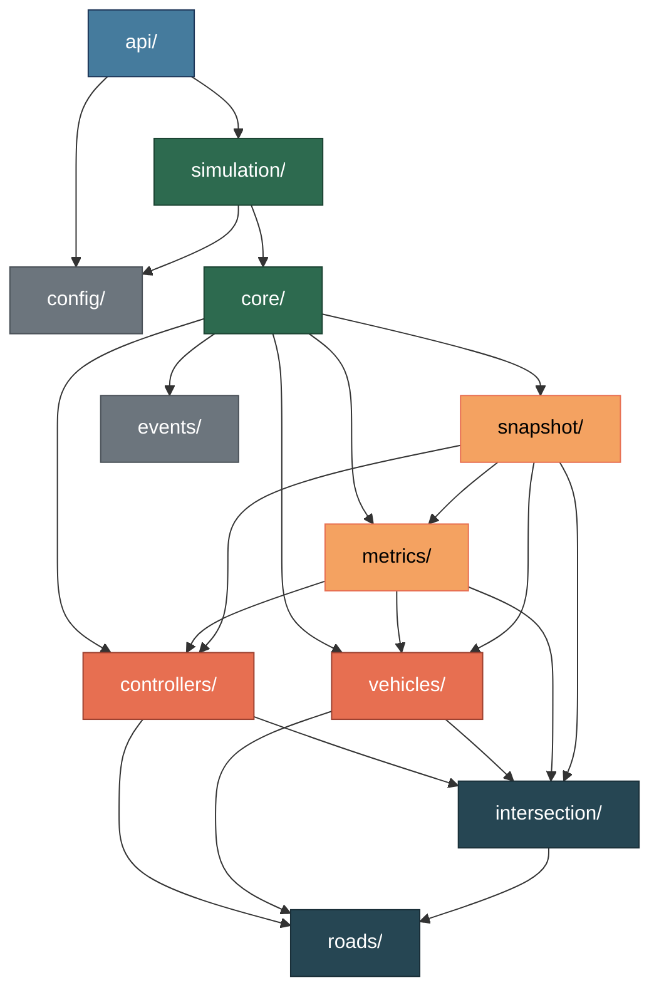

# Deliverable 2 — Backend Architecture

> **Document Version:** 0.1.0
> **Last Updated:** 2026-07-23
> **Status:** Phase 0 — Architecture Specification
> **Owner:** Developer A

---

## 1. Overview

The backend is a **Python application** responsible for:

1. Running discrete-time traffic simulations
2. Modeling vehicle physics using the Intelligent Driver Model (IDM)
3. Implementing intersection control strategies (Fixed-Time Signal, Roundabout)
4. Computing performance metrics in real-time
5. Emitting simulation snapshots over WebSocket
6. Exposing REST endpoints for scenario management

The backend is **completely headless** — it has no UI, no HTML, no rendering logic. It produces structured JSON data that the frontend consumes.

---

## 2. Folder Structure

```
backend/
├── src/
│   ├── __init__.py
│   ├── main.py                     # Application entry point
│   │
│   ├── api/                        # HTTP and WebSocket layer
│   │   ├── __init__.py
│   │   ├── routes/                 # Route definitions
│   │   │   ├── __init__.py
│   │   │   ├── simulation.py       # Simulation lifecycle endpoints
│   │   │   ├── scenarios.py        # Scenario CRUD endpoints
│   │   │   ├── metrics.py          # Metric query endpoints
│   │   │   └── health.py           # Health check endpoint
│   │   ├── websocket/              # WebSocket handlers
│   │   │   ├── __init__.py
│   │   │   └── stream.py           # Snapshot streaming handler
│   │   ├── middleware/             # Request/response middleware
│   │   │   ├── __init__.py
│   │   │   └── error_handler.py    # Global error handling
│   │   └── schemas/                # API request/response models (Pydantic)
│   │       ├── __init__.py
│   │       ├── requests.py
│   │       └── responses.py
│   │
│   ├── config/                     # Configuration management
│   │   ├── __init__.py
│   │   ├── loader.py               # Config file loading and parsing
│   │   ├── validator.py            # Config validation against JSON Schema
│   │   ├── defaults.py             # Default configuration values
│   │   └── settings.py             # Application settings (env-based)
│   │
│   ├── controllers/                # Intersection control strategies
│   │   ├── __init__.py
│   │   ├── base.py                 # Abstract base controller interface
│   │   ├── fixed_time_signal.py    # Fixed-time traffic signal controller
│   │   ├── roundabout.py           # Modern roundabout controller
│   │   └── registry.py             # Controller type registry
│   │
│   ├── core/                       # Simulation orchestration
│   │   ├── __init__.py
│   │   ├── engine.py               # Main simulation loop
│   │   ├── clock.py                # Simulation clock and time management
│   │   ├── scheduler.py            # Event scheduling
│   │   └── state.py                # Global simulation state container
│   │
│   ├── events/                     # Event system
│   │   ├── __init__.py
│   │   ├── bus.py                  # Event bus (pub/sub)
│   │   ├── types.py                # Event type definitions
│   │   └── handlers.py             # Event handler registration
│   │
│   ├── intersection/               # Intersection modeling
│   │   ├── __init__.py
│   │   ├── geometry.py             # Intersection geometric layout
│   │   ├── conflict_zones.py       # Conflict point detection
│   │   ├── phases.py               # Signal phase definitions
│   │   └── state.py                # Intersection state tracking
│   │
│   ├── metrics/                    # Metric computation
│   │   ├── __init__.py
│   │   ├── collector.py            # Real-time metric data collection
│   │   ├── calculator.py           # Metric computation engine
│   │   ├── aggregator.py           # Final metric aggregation
│   │   ├── definitions/            # Individual metric implementations
│   │   │   ├── __init__.py
│   │   │   ├── wait_time.py
│   │   │   ├── throughput.py
│   │   │   ├── queue_length.py
│   │   │   ├── stop_count.py
│   │   │   ├── speed_variance.py
│   │   │   ├── travel_time.py
│   │   │   ├── idle_loss.py
│   │   │   ├── saturation.py
│   │   │   ├── fairness.py
│   │   │   └── footprint.py
│   │   └── registry.py            # Metric type registry
│   │
│   ├── roads/                      # Road network
│   │   ├── __init__.py
│   │   ├── network.py             # Road network graph
│   │   ├── lane.py                # Lane model
│   │   ├── approach.py            # Approach arm definition
│   │   └── topology.py            # Network topology utilities
│   │
│   ├── simulation/                 # Simulation lifecycle
│   │   ├── __init__.py
│   │   ├── runner.py              # Simulation run management
│   │   ├── scenario.py            # Scenario loading and setup
│   │   ├── context.py             # Per-run simulation context
│   │   └── results.py             # Final results packaging
│   │
│   ├── snapshot/                   # Snapshot system
│   │   ├── __init__.py
│   │   ├── builder.py             # Snapshot assembly from simulation state
│   │   ├── serializer.py          # JSON serialization
│   │   ├── emitter.py             # Snapshot emission to WebSocket
│   │   └── buffer.py              # Snapshot history buffer
│   │
│   ├── utils/                      # Shared utilities
│   │   ├── __init__.py
│   │   ├── math_helpers.py        # Mathematical utility functions
│   │   ├── validators.py          # Generic validation helpers
│   │   ├── logging.py             # Logging configuration
│   │   └── id_generator.py        # Unique ID generation
│   │
│   └── vehicles/                   # Vehicle modeling
│       ├── __init__.py
│       ├── vehicle.py             # Vehicle entity model
│       ├── idm.py                 # Intelligent Driver Model physics
│       ├── spawner.py             # Vehicle generation / spawning
│       ├── router.py              # Vehicle route assignment
│       └── pool.py                # Active vehicle pool management
│
├── tests/
│   ├── __init__.py
│   ├── conftest.py                # Shared pytest fixtures
│   ├── unit/                      # Unit tests (mirror src/ structure)
│   │   ├── __init__.py
│   │   ├── test_idm.py
│   │   ├── test_metrics.py
│   │   ├── test_snapshot_builder.py
│   │   ├── test_config_validator.py
│   │   └── ...
│   ├── integration/               # Integration tests
│   │   ├── __init__.py
│   │   ├── test_simulation_run.py
│   │   ├── test_api_endpoints.py
│   │   └── ...
│   └── fixtures/                  # Test data
│       ├── sample_config.json
│       ├── sample_snapshot.json
│       └── ...
│
├── pyproject.toml                 # Project metadata, dependencies, tool config
├── requirements.txt               # Pinned dependencies (production)
├── requirements-dev.txt           # Development dependencies
└── README.md                      # Backend documentation
```

---

## 3. Module Responsibilities

### `api/` — HTTP and WebSocket Layer

| Aspect | Detail |
|--------|--------|
| **Responsibility** | Expose REST endpoints and WebSocket handlers. Translate HTTP requests into service calls. Serialize responses. Handle errors. |
| **What belongs** | Route definitions, request/response Pydantic models, middleware, WebSocket connection management. |
| **What NEVER belongs** | Simulation logic, metric computation, vehicle physics, direct database access. The API layer is a thin adapter — it delegates all work to service modules. |

### `config/` — Configuration Management

| Aspect | Detail |
|--------|--------|
| **Responsibility** | Load scenario configuration files (JSON), validate them against the shared JSON Schema, apply defaults, expose typed configuration objects. |
| **What belongs** | Config loaders, validators, default value definitions, application settings (environment variables). |
| **What NEVER belongs** | Business logic, simulation algorithms, hard-coded scenario parameters. |

### `controllers/` — Intersection Control Strategies

| Aspect | Detail |
|--------|--------|
| **Responsibility** | Implement the decision-making logic for each intersection control type. Each controller receives the current simulation state and returns control decisions (e.g., which phase is active, which vehicles may proceed). |
| **What belongs** | Abstract base controller, fixed-time signal controller, roundabout controller, controller registry for dynamic instantiation. |
| **What NEVER belongs** | Vehicle physics, metric calculations, API concerns, rendering logic. Controllers make decisions — they do not move vehicles or compute scores. |

### `core/` — Simulation Orchestration

| Aspect | Detail |
|--------|--------|
| **Responsibility** | The simulation main loop. Advances the clock, ticks all subsystems in order (vehicles, controllers, metrics, snapshots), manages simulation state transitions (initialized → running → paused → completed). |
| **What belongs** | Engine loop, simulation clock, tick scheduler, global state container. |
| **What NEVER belongs** | Specific controller implementations, specific metric formulas, API endpoints, configuration parsing. The core orchestrates — it does not implement domain logic. |

### `events/` — Event System

| Aspect | Detail |
|--------|--------|
| **Responsibility** | Publish-subscribe event bus for decoupled communication between modules. Enables modules to react to simulation events without tight coupling. |
| **What belongs** | Event bus implementation, event type enumerations, handler registration utilities. |
| **What NEVER belongs** | Business logic in event handlers (handlers should delegate to the appropriate module), WebSocket connection details (that's `api/`), metric computation. |

### `intersection/` — Intersection Modeling

| Aspect | Detail |
|--------|--------|
| **Responsibility** | Model the physical intersection: geometric layout, approach arms, conflict zones, signal phases. Provides the spatial foundation that controllers operate on. |
| **What belongs** | Intersection geometry, conflict zone detection, phase definitions, intersection state (current phase, time in phase). |
| **What NEVER belongs** | Controller decision logic (that's `controllers/`), vehicle movement (that's `vehicles/`), metric computation (that's `metrics/`). |

### `metrics/` — Metric Computation

| Aspect | Detail |
|--------|--------|
| **Responsibility** | Collect raw data from the simulation, compute per-tick metrics, aggregate final results. Each metric is an independent, self-contained computation unit. |
| **What belongs** | Metric collector, calculator engine, individual metric definition files (one per metric), metric registry, final aggregation logic. |
| **What NEVER belongs** | Simulation control logic, vehicle physics, API serialization, rendering. Metrics are pure computations over simulation data. |

### `roads/` — Road Network

| Aspect | Detail |
|--------|--------|
| **Responsibility** | Model the road network: lanes, approach arms, network topology. Provides the spatial structure that vehicles travel on. |
| **What belongs** | Road network graph, lane models, approach definitions, topology utilities. |
| **What NEVER belongs** | Vehicle objects (that's `vehicles/`), intersection control (that's `controllers/`), rendering. |

### `simulation/` — Simulation Lifecycle

| Aspect | Detail |
|--------|--------|
| **Responsibility** | High-level simulation management: loading scenarios, creating simulation contexts, running simulations, packaging final results. |
| **What belongs** | Simulation runner, scenario loading, per-run context objects, results packaging. |
| **What NEVER belongs** | The tick-level simulation loop (that's `core/engine.py`), specific controller or metric implementations. This module manages lifecycles, not inner loops. |

### `snapshot/` — Snapshot System

| Aspect | Detail |
|--------|--------|
| **Responsibility** | Assemble the current simulation state into a snapshot object conforming to the shared snapshot schema, serialize it to JSON, emit it to connected WebSocket clients. |
| **What belongs** | Snapshot builder, JSON serializer, WebSocket emitter, snapshot history buffer for playback support. |
| **What NEVER belongs** | Simulation logic, metric formulas, controller decisions. The snapshot system reads state — it never modifies it. |

### `utils/` — Shared Utilities

| Aspect | Detail |
|--------|--------|
| **Responsibility** | Generic utility functions used across multiple backend modules. |
| **What belongs** | Math helpers, generic validators, logging configuration, ID generators. |
| **What NEVER belongs** | Domain-specific logic (metrics, physics, controllers). If a utility is specific to one module, it belongs in that module, not here. |

### `vehicles/` — Vehicle Modeling

| Aspect | Detail |
|--------|--------|
| **Responsibility** | Model individual vehicles: entity state, physics (IDM car-following model), spawning, routing, and lifecycle management. |
| **What belongs** | Vehicle entity class, IDM physics implementation, vehicle spawner, route assignment, active vehicle pool. |
| **What NEVER belongs** | Intersection control decisions (that's `controllers/`), metric computation (that's `metrics/`), API endpoints. Vehicles know how to move — they do not know how to control intersections. |

---

## 4. Dependency Flow



**Rules:**
- Arrows point in the direction of dependency (A → B means A depends on B)
- No circular dependencies are permitted
- `api/` is the outermost layer — nothing depends on it
- `roads/` and `events/` are leaf dependencies — they depend on nothing else
- `config/` is consumed by `api/` and `simulation/` only

---

## 5. Key Design Decisions

### 5.1 Controller Extensibility

Controllers implement a common abstract interface (`base.py`). Adding a new controller type requires:
1. Creating a new file in `controllers/`
2. Implementing the abstract interface
3. Registering it in `registry.py`

No modifications to `core/`, `api/`, or `snapshot/` should be required.

### 5.2 Metric Extensibility

Each metric is a self-contained module in `metrics/definitions/`. The metric registry discovers metrics automatically. Adding a new metric requires:
1. Creating a new file in `metrics/definitions/`
2. Implementing the standard metric interface
3. Registering it in `registry.py`

### 5.3 Snapshot as Read-Only

The snapshot system is strictly read-only. It reads state from all other modules but never writes back. This ensures snapshot generation has zero side effects on simulation accuracy.

### 5.4 Event Bus for Decoupling

The event bus (`events/`) allows modules to communicate without direct imports. For example, when a vehicle completes its journey, it publishes a `VEHICLE_EXITED` event. The metrics module subscribes to this event to update throughput counters. Neither module imports the other.

---

## 6. Testing Strategy

| Test Type | Location | Purpose | Tools |
|-----------|----------|---------|-------|
| Unit | `tests/unit/` | Test individual functions and classes in isolation | pytest, unittest.mock |
| Integration | `tests/integration/` | Test module interactions (e.g., full simulation tick) | pytest, httpx (for API) |
| Fixtures | `tests/fixtures/` | Shared test data: sample configs, expected snapshots | JSON files |

### Testing Rules

1. Every module in `src/` should have a corresponding test file in `tests/unit/`
2. Tests must not depend on external services or network connections
3. Fixture data should conform to the shared JSON Schemas
4. Integration tests should verify end-to-end flows (config → simulation → snapshot → metrics)
5. Target: minimum 80% code coverage for core simulation logic

---

## 7. Cross-References

| Topic | Document |
|-------|----------|
| Repository structure | [01-repository-architecture.md](./01-repository-architecture.md) |
| Shared contracts | [04-shared-contract-layer.md](./04-shared-contract-layer.md) |
| Snapshot schema | [05-snapshot-contract.md](./05-snapshot-contract.md) |
| Configuration schema | [06-scenario-configuration-contract.md](./06-scenario-configuration-contract.md) |
| Metric definitions | [07-metric-contract.md](./07-metric-contract.md) |
| Communication endpoints | [08-communication-contract.md](./08-communication-contract.md) |
| Engineering standards | [09-engineering-standards.md](./09-engineering-standards.md) |
