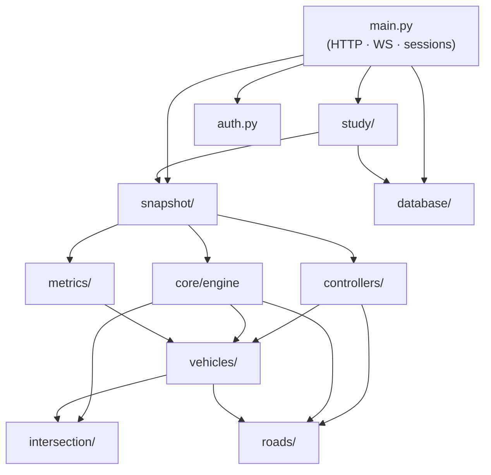
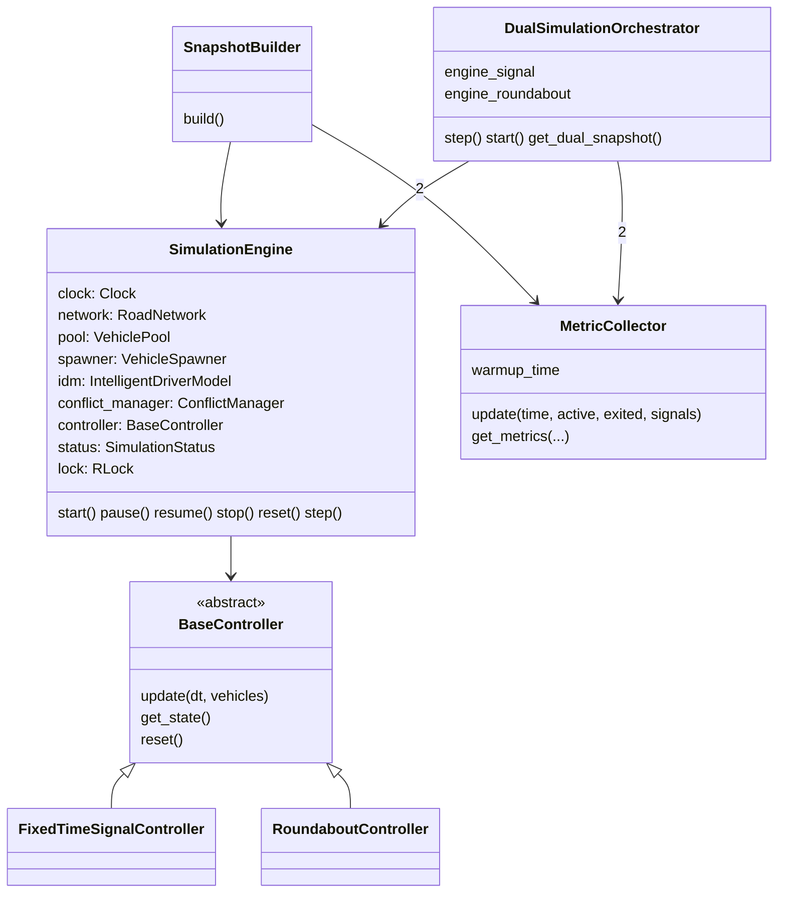

# 02 — Backend Architecture

> **Status:** Current · V1.0 · rewritten 2026-10-05 from the checked-in `backend/src/` tree (the original Phase-0 version described planned `api/`, `config/`, `events/`, `simulation/` and `utils/` packages that were never created)
> **Owner:** Viraj Jadhao (simulation, metrics, API)
> **See also:** [00 — System overview](00-system-overview.md) · [Simulation methodology](../simulation/methodology.md) · [API reference](../api/README.md)

The backend is a headless Python 3.11 application. It owns **all** simulation state, every metric and statistic, and all persistence; it emits JSON and never renders anything.

---

## 1. Package map

```
backend/
├── src/
│   ├── main.py                  FastAPI app: routes, WebSockets, live sessions, error envelope, CORS, API key
│   ├── auth.py                  Cognito JWT verification (JWKS) and the local-development bypass
│   ├── core/
│   │   ├── engine.py            SimulationEngine — tick loop, lifecycle, locking, callbacks
│   │   ├── clock.py             Discrete-time clock (Δt, tick count, ticks_for_duration)
│   │   ├── config_models.py     Pydantic scenario model (bounds, defaults, DEFAULT_PHASE_SEQUENCE)
│   │   ├── config_validation.py Cross-field rules the JSON Schema cannot express
│   │   ├── enums.py             SimulationStatus, Direction, TurnIntent, VehicleState
│   │   ├── limits.py            Vehicle cap and demand-sized limit
│   │   └── provenance.py        Git commit / Python version; per-run provenance record
│   ├── roads/
│   │   ├── network.py           RoadNetwork — four approaches, connection lanes, roundabout rings, routes
│   │   ├── lane.py              Polyline lanes with cached segment geometry
│   │   └── approach.py          Approach — the lanes of one direction
│   ├── vehicles/
│   │   ├── vehicle.py           Vehicle state and semi-implicit Euler update
│   │   ├── idm.py               Intelligent Driver Model
│   │   ├── spawner.py           Seeded arrivals, lane policy, safe insertion
│   │   ├── pool.py              Active/exited vehicles, physics loop, conflict layers, collision audit
│   │   ├── router.py            Leader finding along routes, emergency proximity
│   │   └── speed_profile.py     Desired speed from the speed limit; curve speed limits
│   ├── controllers/
│   │   ├── base.py              BaseController ABC: update(), get_state(), reset()
│   │   ├── fixed_time_signal.py Phase plans, per-corridor greens, offset, stop-line obstacles
│   │   ├── roundabout.py        Gap acceptance, follow-up time, entry/circulating caps, spillback
│   │   ├── virtual_obstacle.py  Zero-speed barrier used as a leader at stop/give-way lines
│   │   └── factory.py           create_controller(), build_tick_callback(), derive_signals_state()
│   ├── intersection/
│   │   ├── conflict_manager.py  Crossing points + reservations (signal geometry)
│   │   └── predictive_conflicts.py Path-sampling conflict resolver (all geometries)
│   ├── metrics/
│   │   ├── collector.py         MetricCollector — warm-up handling, accumulators, get_metrics()
│   │   ├── efficiency.py        masterEfficiencyScore (same-geometry composite)
│   │   └── definitions/         One module per metric family (delay/wait, throughput, queues,
│   │                            stops, speed variance, travel-time reliability, fairness,
│   │                            idle loss, derived, TTC/PET safety)
│   ├── snapshot/
│   │   ├── builder.py           SnapshotBuilder — the streamed JSON frame
│   │   ├── buffer.py            Bounded snapshot history (versioned API)
│   │   └── dual_orchestrator.py Lockstep signal + roundabout engines with one seed
│   ├── study/
│   │   ├── volume_sweep.py      Paired sweep over arrival rates; tie rule; crossover bracket; persistence
│   │   ├── validation.py        Monte Carlo statistics; invariant and determinism checks
│   │   ├── runner.py            Worker-process pool (STUDY_WORKERS) and progress reporting
│   │   ├── jobs.py              Background job registry (≤ 4 active, 1 h retention)
│   │   ├── calibration.py       Reference capacity, demand levels, calibration status, study warm-up
│   │   ├── tolerances.py        Shared "about the same" delay rule
│   │   └── report_generator.py  Combined study report (JSON/CSV)
│   └── database/
│       ├── db.py                SQLite schema, WAL/busy-timeout pragmas, in-place migrations
│       ├── dao.py               Runs, per-tick metrics, sweep sessions, reproducibility description
│       └── replay_dao.py        Saved replays (with owner)
├── tests/                       pytest suite (see docs/testing/README.md)
├── Dockerfile                   base → dev (reload) / production (non-root) targets
├── docker-entrypoint.py         Fixes volume ownership, drops to appuser
├── pyproject.toml               ruff, mypy (strict), pytest + coverage gate
└── requirements.txt
```

---

## 2. Dependency direction


```mermaid
flowchart TB
    MAIN["main.py<br/>(HTTP · WS · sessions)"] --> STUDY["study/"]
    MAIN --> SNAP["snapshot/"]
    MAIN --> DB["database/"]
    MAIN --> AUTH["auth.py"]
    STUDY --> SNAP
    STUDY --> DB
    SNAP --> CORE["core/engine"]
    SNAP --> MET["metrics/"]
    SNAP --> CTRL["controllers/"]
    CTRL --> ROADS["roads/"]
    CTRL --> VEH["vehicles/"]
    CORE --> VEH
    CORE --> ROADS
    CORE --> INT["intersection/"]
    VEH --> INT
    VEH --> ROADS
    MET --> VEH
```

Rules the code follows:

- **The engine has no strategy-specific branches.** `SimulationEngine.step()` calls `controller.update()` through the `BaseController` interface; `controllers/factory.py` chooses the class from `geometry.intersectionType`.
- **Controllers act only through virtual obstacles** (and roundabout speed caps), so vehicle physics is shared by both strategies.
- **Metrics read state; they never change it.** Safety measures (TTC/PET) are observation-only by construction.
- **Only `main.py` speaks HTTP.** Studies and the CLI (`scripts/run_full_study.py`) drive the same engine without the web layer.

---

## 3. Runtime objects


```mermaid
classDiagram
    class SimulationEngine {
        clock: Clock
        network: RoadNetwork
        pool: VehiclePool
        spawner: VehicleSpawner
        idm: IntelligentDriverModel
        conflict_manager: ConflictManager
        controller: BaseController
        status: SimulationStatus
        lock: RLock
        start() pause() resume() stop() reset() step()
    }
    class BaseController {
        <<abstract>>
        update(dt, vehicles)
        get_state()
        reset()
    }
    class FixedTimeSignalController
    class RoundaboutController
    class MetricCollector {
        warmup_time
        update(time, active, exited, signals)
        get_metrics(...)
    }
    class SnapshotBuilder {
        build()
    }
    class DualSimulationOrchestrator {
        engine_signal
        engine_roundabout
        step() start() get_dual_snapshot()
    }
    BaseController <|-- FixedTimeSignalController
    BaseController <|-- RoundaboutController
    SimulationEngine --> BaseController
    SnapshotBuilder --> SimulationEngine
    SnapshotBuilder --> MetricCollector
    DualSimulationOrchestrator --> SimulationEngine : 2
    DualSimulationOrchestrator --> MetricCollector : 2
```

`build_tick_callback()` wires a collector (and, for the versioned API, a snapshot buffer) to an engine, so the same per-tick metric update runs in live sessions, versioned simulations and studies.

---

## 4. Key design decisions

| Decision | Why | Where |
| --- | --- | --- |
| Controller before physics in each tick | Signal changes and refused gaps take effect immediately | `core/engine.py` |
| Re-entrant engine lock held for the whole tick | Readers never see a torn tick; callbacks may re-enter | `SimulationEngine.lock` |
| Private RNG per engine; seed written back to config | Determinism and complete provenance | `vehicles/spawner.py` |
| Lockstep dual orchestrator with one seed | Fair comparison: same arrivals for both strategies | `snapshot/dual_orchestrator.py` |
| Backend is the only metric authority | Live, saved, exported and study numbers agree | ADR-005, `metrics/collector.py` |
| Studies in worker processes | Heavy studies do not block the API or live streams; results equal sequential runs | `study/runner.py` |
| Live sessions keyed per client | One visitor cannot reset another's simulation | `main.py` `_LiveSession` |
| SQLite with in-place column migrations | Zero-ops persistence; older databases upgrade on start | `database/db.py` |

The full decision record: [decisions](../decisions/README.md).

---

## 5. Extending the backend (V1.1+)

| To add… | Touch | Keep invariant |
| --- | --- | --- |
| A vehicle type (V1.1) | `vehicles/spawner.py` (assignment), `vehicles/vehicle.py` (properties), IDM parameter source, snapshot vehicle fields, `config_models.py` + `config.schema.json` | Same-seed comparison still gives both strategies identical vehicles |
| Lane changing (V1.2) | `vehicles/pool.py`, `vehicles/router.py`, `roads/network.py` | Deterministic, order-independent updates; collision audit stays clean |
| A controller (V1.3) | New `BaseController` subclass; `controllers/factory.py`; schema enum; `derive_signals_state()` if it exposes signals | Engine loop unchanged; metrics unchanged |
| A metric | `metrics/definitions/`, `MetricCollector.get_metrics()`, `frontend/src/metrics/catalog.ts` (a test enforces this), metrics reference | Warm-up convention; backend-only computation |

---

## 6. Testing

See [Testing](../testing/README.md). Every package above has a matching directory under `backend/tests/`; full-strength simulation sweeps are marked `slow` and run nightly.
