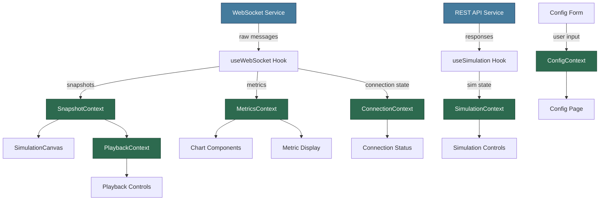

# Deliverable 3 — Frontend Architecture

> **Document Version:** 0.1.0
> **Last Updated:** 2026-07-23
> **Status:** Phase 0 — Architecture Specification
> **Owner:** Developer B

---

## 1. Overview

The frontend is a **React + TypeScript** single-page application that provides:

1. A real-time **simulation visualization** using HTML5 Canvas
2. Interactive **metric dashboards** with comparative charts
3. **Scenario configuration** through forms
4. **Playback controls** for simulation review
5. **Side-by-side comparison** of Fixed-Time Signal vs. Roundabout results

The frontend **never runs simulations**. It receives structured snapshot data from the backend over WebSocket and renders it. All metric values arrive pre-computed — the frontend only formats and displays them.

---

## 2. Folder Structure

```
frontend/
├── src/
│   ├── main.tsx                    # Application entry point
│   ├── App.tsx                     # Root component and router setup
│   │
│   ├── assets/                     # Static resources
│   │   ├── images/                 # Image files (logos, backgrounds)
│   │   ├── icons/                  # SVG icons
│   │   └── fonts/                  # Custom font files (if any)
│   │
│   ├── charts/                     # Chart components
│   │   ├── index.ts                # Public exports
│   │   ├── MetricBarChart.tsx       # Bar chart for metric comparison
│   │   ├── TimeSeriesChart.tsx      # Time-series line chart
│   │   ├── QueueLengthChart.tsx     # Queue length visualization
│   │   ├── ComparisonRadar.tsx      # Radar chart for multi-metric comparison
│   │   ├── ThroughputGauge.tsx      # Real-time throughput gauge
│   │   └── chart-config.ts         # Shared chart configuration/themes
│   │
│   ├── components/                 # Reusable UI components
│   │   ├── index.ts                # Public exports
│   │   ├── common/                 # Generic, domain-agnostic components
│   │   │   ├── Button.tsx
│   │   │   ├── Card.tsx
│   │   │   ├── Modal.tsx
│   │   │   ├── Tooltip.tsx
│   │   │   ├── Badge.tsx
│   │   │   ├── Spinner.tsx
│   │   │   └── ErrorBoundary.tsx
│   │   ├── forms/                  # Form-related components
│   │   │   ├── FormField.tsx
│   │   │   ├── Select.tsx
│   │   │   ├── Slider.tsx
│   │   │   └── NumberInput.tsx
│   │   └── feedback/               # User feedback components
│   │       ├── Toast.tsx
│   │       ├── Alert.tsx
│   │       └── ProgressBar.tsx
│   │
│   ├── contexts/                   # React Context providers
│   │   ├── index.ts                # Public exports
│   │   ├── SimulationContext.tsx    # Current simulation state
│   │   ├── SnapshotContext.tsx      # Latest snapshot data
│   │   ├── MetricsContext.tsx       # Accumulated metrics data
│   │   ├── ConfigContext.tsx        # Active scenario configuration
│   │   ├── ConnectionContext.tsx    # WebSocket connection state
│   │   └── PlaybackContext.tsx      # Playback controls state
│   │
│   ├── hooks/                      # Custom React hooks
│   │   ├── index.ts                # Public exports
│   │   ├── useWebSocket.ts         # WebSocket connection management
│   │   ├── useSimulation.ts        # Simulation lifecycle controls
│   │   ├── useSnapshot.ts          # Snapshot consumption and buffering
│   │   ├── useMetrics.ts           # Metric data access
│   │   ├── usePlayback.ts          # Playback position and speed control
│   │   ├── useCanvas.ts            # Canvas rendering lifecycle
│   │   ├── useConfig.ts            # Configuration form state
│   │   └── useResponsive.ts        # Responsive layout utilities
│   │
│   ├── layouts/                    # Page layout templates
│   │   ├── index.ts                # Public exports
│   │   ├── MainLayout.tsx          # Primary app layout (header, sidebar, content)
│   │   ├── DashboardLayout.tsx     # Dashboard-specific layout (metrics + canvas)
│   │   ├── ComparisonLayout.tsx    # Side-by-side comparison layout
│   │   └── FullScreenLayout.tsx    # Full-screen simulation view
│   │
│   ├── metrics/                    # Metric display components
│   │   ├── index.ts                # Public exports
│   │   ├── MetricCard.tsx          # Single metric display card
│   │   ├── MetricGrid.tsx          # Grid of metric cards
│   │   ├── MetricComparison.tsx    # Side-by-side metric comparison
│   │   ├── MetricFormatter.ts      # Metric value formatting (units, precision)
│   │   └── MetricDefinitions.ts    # Frontend metric display configuration
│   │
│   ├── pages/                      # Top-level page components
│   │   ├── index.ts                # Public exports
│   │   ├── HomePage.tsx            # Landing / overview page
│   │   ├── ConfigPage.tsx          # Scenario configuration page
│   │   ├── SimulationPage.tsx      # Live simulation view
│   │   ├── ComparisonPage.tsx      # Results comparison page
│   │   ├── ResultsPage.tsx         # Historical results browser
│   │   └── NotFoundPage.tsx        # 404 page
│   │
│   ├── services/                   # External communication
│   │   ├── index.ts                # Public exports
│   │   ├── api.ts                  # REST API client (axios/fetch wrapper)
│   │   ├── websocket.ts            # WebSocket client and reconnection
│   │   ├── snapshot-parser.ts      # Snapshot JSON deserialization
│   │   └── config-service.ts       # Configuration submission service
│   │
│   ├── simulation/                 # Simulation visualization
│   │   ├── index.ts                # Public exports
│   │   ├── SimulationCanvas.tsx    # Main canvas component
│   │   ├── renderer/              # Canvas rendering subsystem
│   │   │   ├── index.ts
│   │   │   ├── SceneRenderer.ts    # Top-level scene orchestrator
│   │   │   ├── VehicleRenderer.ts  # Vehicle drawing and animation
│   │   │   ├── RoadRenderer.ts     # Road and lane drawing
│   │   │   ├── IntersectionRenderer.ts  # Intersection visualization
│   │   │   ├── SignalRenderer.ts   # Traffic signal state rendering
│   │   │   ├── RoundaboutRenderer.ts    # Roundabout geometry rendering
│   │   │   └── Interpolator.ts     # Frame interpolation between snapshots
│   │   ├── PlaybackControls.tsx    # Play, pause, speed, seek controls
│   │   ├── PlaybackTimeline.tsx    # Timeline scrubber
│   │   └── SimulationOverlay.tsx   # HUD overlay (stats, frame count)
│   │
│   ├── styles/                     # Global styles and design system
│   │   ├── index.css               # Global stylesheet entry
│   │   ├── variables.css           # CSS custom properties (design tokens)
│   │   ├── reset.css               # CSS reset / normalization
│   │   ├── typography.css          # Typography system
│   │   ├── animations.css          # Shared animation keyframes
│   │   └── themes/                 # Theme definitions
│   │       ├── dark.css            # Dark theme overrides
│   │       └── light.css           # Light theme overrides
│   │
│   └── types/                      # TypeScript type definitions
│       ├── index.ts                # Public exports
│       ├── snapshot.ts             # Snapshot types (from shared schema)
│       ├── config.ts               # Configuration types (from shared schema)
│       ├── metrics.ts              # Metric types (from shared schema)
│       ├── simulation.ts           # Simulation state types
│       ├── websocket.ts            # WebSocket message types
│       └── api.ts                  # API request/response types
│
├── public/                         # Static public assets
│   ├── favicon.ico
│   └── manifest.json
│
├── index.html                      # HTML entry point
├── package.json                    # Dependencies and scripts
├── tsconfig.json                   # TypeScript configuration
├── vite.config.ts                  # Vite build configuration
├── eslint.config.js                # ESLint configuration
└── README.md                       # Frontend documentation
```

---

## 3. Module Responsibilities

### `assets/` — Static Resources

| Aspect | Detail |
|--------|--------|
| **Responsibility** | Store static files that are imported into components: images, SVG icons, custom fonts. |
| **What belongs** | Image files, SVG icons, font files, static JSON data for testing. |
| **What NEVER belongs** | Component code, styles, business logic, API responses, dynamically generated content. |

### `charts/` — Chart Components

| Aspect | Detail |
|--------|--------|
| **Responsibility** | Encapsulate all charting logic. Each chart is a self-contained component that receives metric data as props and renders a visualization. |
| **What belongs** | Chart components (bar, line, radar, gauge), chart configuration, theme integration for chart libraries. |
| **What NEVER belongs** | Metric computation, data fetching, WebSocket logic. Charts receive data — they never fetch or compute it. |

### `components/` — Reusable UI Components

| Aspect | Detail |
|--------|--------|
| **Responsibility** | Generic, reusable UI building blocks. These are domain-agnostic — they know nothing about traffic, simulations, or metrics. |
| **What belongs** | Buttons, cards, modals, tooltips, form inputs, spinners, error boundaries. Organized into subdirectories: `common/`, `forms/`, `feedback/`. |
| **What NEVER belongs** | Page-level components, business logic, API calls, simulation-specific rendering, chart components. |

### `contexts/` — React Context Providers

| Aspect | Detail |
|--------|--------|
| **Responsibility** | Provide global application state through React Context. Each context manages one domain of state (simulation, snapshots, metrics, config, connection, playback). |
| **What belongs** | Context definitions, provider components, state initialization logic. |
| **What NEVER belongs** | UI rendering, complex business logic, API implementation details. Contexts hold state — they delegate side effects to hooks and services. |

### `hooks/` — Custom React Hooks

| Aspect | Detail |
|--------|--------|
| **Responsibility** | Encapsulate reusable stateful logic and side effects. Hooks bridge services (data layer) and contexts (state layer) with components (view layer). |
| **What belongs** | WebSocket connection hooks, simulation control hooks, data access hooks, canvas lifecycle hooks, responsive layout hooks. |
| **What NEVER belongs** | UI rendering (JSX), direct DOM manipulation outside canvas, business logic that should be in services. |

### `layouts/` — Page Layout Templates

| Aspect | Detail |
|--------|--------|
| **Responsibility** | Define the structural arrangement of pages: headers, sidebars, content areas, footers. Layouts compose slots where pages inject content. |
| **What belongs** | Layout components that define page structure, navigation containers. |
| **What NEVER belongs** | Business logic, data fetching, domain-specific components. Layouts are structural — they are domain-agnostic. |

### `metrics/` — Metric Display Components

| Aspect | Detail |
|--------|--------|
| **Responsibility** | Render metric values with proper formatting, units, and visual indicators. Provide comparison views between Fixed-Time and Roundabout results. |
| **What belongs** | Metric card components, metric grids, comparison views, value formatters, display configuration (precision, units, colors). |
| **What NEVER belongs** | Metric computation (backend does this), raw data processing, chart rendering (that's `charts/`). |

### `pages/` — Top-Level Page Components

| Aspect | Detail |
|--------|--------|
| **Responsibility** | Compose layouts, components, and contexts into complete pages. Each page represents a distinct view in the application. |
| **What belongs** | Page-level components (one per route), page-specific composition logic. |
| **What NEVER belongs** | Reusable components (those go in `components/`), business logic, direct API calls (use hooks/services instead). |

### `services/` — External Communication

| Aspect | Detail |
|--------|--------|
| **Responsibility** | All communication with the backend. Encapsulate REST API calls, WebSocket connection management, response parsing. |
| **What belongs** | API client, WebSocket client, response deserialization, request construction, error normalization. |
| **What NEVER belongs** | UI rendering, state management, React-specific code. Services are pure TypeScript — no React imports. |

### `simulation/` — Simulation Visualization

| Aspect | Detail |
|--------|--------|
| **Responsibility** | Render the traffic simulation on an HTML5 Canvas. Handle frame interpolation between snapshots, vehicle animation, road drawing, intersection visualization. |
| **What belongs** | Canvas component, renderers (vehicles, roads, intersection, signals, roundabout), frame interpolator, playback controls, HUD overlay. |
| **What NEVER belongs** | Simulation logic, vehicle physics, controller decisions. The frontend **renders** — it never **simulates**. |

### `styles/` — Global Styles and Design System

| Aspect | Detail |
|--------|--------|
| **Responsibility** | Define the visual design system: CSS custom properties (design tokens), typography, animations, theme definitions. |
| **What belongs** | Global CSS files, design tokens (colors, spacing, typography), CSS reset, animation keyframes, theme files. |
| **What NEVER belongs** | Component-specific styles (use CSS modules or co-located styles), JavaScript, business logic. |

### `types/` — TypeScript Type Definitions

| Aspect | Detail |
|--------|--------|
| **Responsibility** | Central location for all TypeScript interfaces and type aliases. Types are derived from the shared JSON Schemas to ensure backend-frontend alignment. |
| **What belongs** | Snapshot types, configuration types, metric types, simulation state types, WebSocket message types, API types. |
| **What NEVER belongs** | Implementation code, React components, utility functions. This folder contains ONLY type definitions. |

---

## 4. State Management Architecture

The frontend uses **React Context + Custom Hooks** for state management (no external state library required for this scale).



### Context Hierarchy (Provider Nesting Order)

```
<ConnectionProvider>          ← WebSocket connection state
  <ConfigProvider>            ← Scenario configuration
    <SimulationProvider>      ← Simulation lifecycle state
      <SnapshotProvider>      ← Current + buffered snapshots
        <MetricsProvider>     ← Accumulated metrics
          <PlaybackProvider>  ← Playback position and speed
            <App />
          </PlaybackProvider>
        </MetricsProvider>
      </SnapshotProvider>
    </SimulationProvider>
  </ConfigProvider>
</ConnectionProvider>
```

---

## 5. Data Flow

```
Backend WebSocket ──► websocket.ts ──► useWebSocket() ──► SnapshotContext
                                                      ──► MetricsContext
                                                      ──► ConnectionContext
                                                               │
                          ┌────────────────────────────────────┘
                          │
                          ▼
            ┌─────────────────────────────────┐
            │  Component Tree                  │
            │                                  │
            │  SimulationCanvas ← snapshots    │
            │  MetricGrid       ← metrics      │
            │  Charts           ← metrics      │
            │  PlaybackControls ← snapshots    │
            │  ConnectionStatus ← connection   │
            └─────────────────────────────────┘
```

**Key Principle:** Data flows in one direction — from WebSocket → Service → Hook → Context → Component. Components never write to WebSocket or call the API directly. They dispatch actions through hooks.

---

## 6. Routing Structure

| Route | Page Component | Purpose |
|-------|---------------|---------|
| `/` | `HomePage` | Landing page with project overview and quick start |
| `/config` | `ConfigPage` | Scenario configuration form |
| `/simulation` | `SimulationPage` | Live simulation with canvas and real-time metrics |
| `/comparison` | `ComparisonPage` | Side-by-side comparison of two controller results |
| `/results` | `ResultsPage` | Historical results browser |
| `*` | `NotFoundPage` | 404 fallback |

---

## 7. Key Design Decisions

### 7.1 Canvas Rendering Architecture

The simulation visualization uses a **layered renderer pattern**:

1. **SceneRenderer** — Orchestrates all sub-renderers, manages the render loop
2. **RoadRenderer** — Draws roads and lanes (static layer, rarely redrawn)
3. **IntersectionRenderer** — Draws the intersection geometry
4. **SignalRenderer** / **RoundaboutRenderer** — Draws controller-specific visuals
5. **VehicleRenderer** — Draws and animates vehicles (dynamic layer, redrawn every frame)
6. **Interpolator** — Smooths vehicle positions between snapshot ticks

This separation allows each renderer to be developed and tested independently.

### 7.2 Snapshot Buffering for Playback

The `SnapshotContext` maintains a circular buffer of received snapshots. This enables:
- **Playback**: Seek to any buffered frame
- **Interpolation**: Smooth animation between discrete snapshot ticks
- **Pause/Resume**: Freeze rendering at any point

### 7.3 No External State Library

For this application's scale, React Context + Hooks provides sufficient state management. This avoids introducing Redux/MobX/Zustand complexity. If state management becomes unwieldy in future phases, migration to Zustand is recommended due to its minimal API surface.

### 7.4 Service Layer Isolation

The `services/` layer contains zero React code. Services are pure TypeScript classes/functions that can be unit-tested without React Testing Library. This ensures the communication layer is testable independently from the UI.

---

## 8. Cross-References

| Topic | Document |
|-------|----------|
| Repository structure | [01-repository-architecture.md](./01-repository-architecture.md) |
| Shared contracts | [04-shared-contract-layer.md](./04-shared-contract-layer.md) |
| Snapshot schema (for `types/snapshot.ts`) | [05-snapshot-contract.md](./05-snapshot-contract.md) |
| Configuration schema (for `types/config.ts`) | [06-scenario-configuration-contract.md](./06-scenario-configuration-contract.md) |
| Metric definitions (for `types/metrics.ts`) | [07-metric-contract.md](./07-metric-contract.md) |
| Communication endpoints (for `services/`) | [08-communication-contract.md](./08-communication-contract.md) |
| Engineering standards | [09-engineering-standards.md](./09-engineering-standards.md) |
