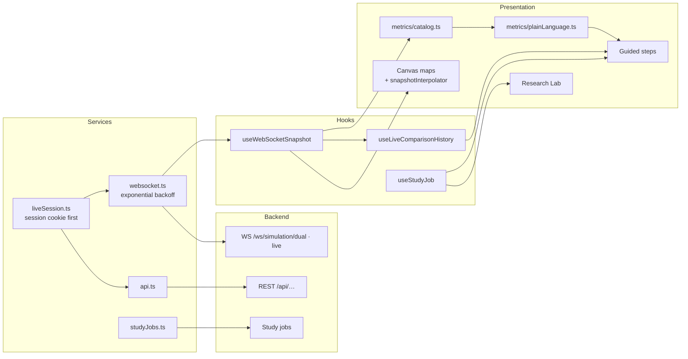
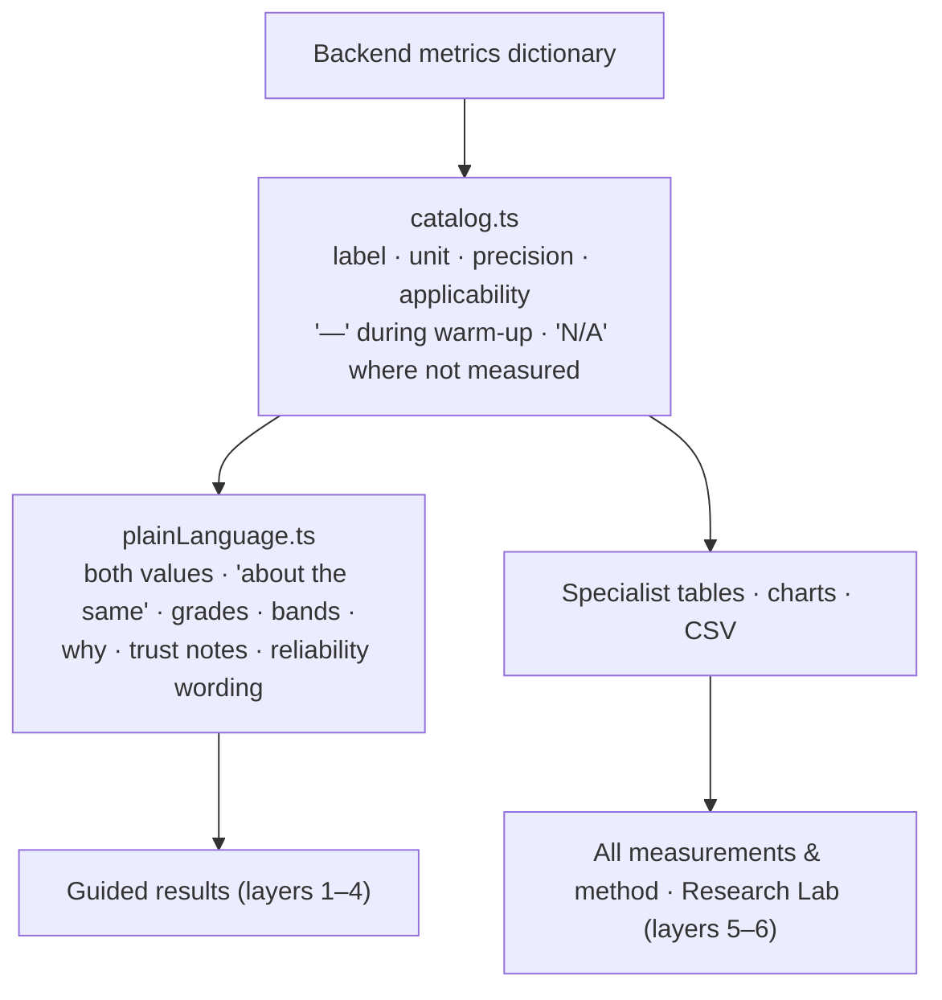

# 03 — Frontend Architecture

> **Status:** Current · V1.0 · rewritten 2026-10-05 from the checked-in `frontend/src/` tree (the original Phase-0 version described planned `charts/`, `contexts/`, `layouts/`, `pages/` and `simulation/` folders that were never created)
> **Owner:** Khushi Kashyap (dashboard, canvas, charts, playback)
> **See also:** [00 — System overview](00-system-overview.md) · [Product story](../product/README.md) · [User narrative & IA](../product/urbanflow-user-narrative.md)

The frontend is a **React 19 + TypeScript** application built with **Vite**, shipped as two documents: a landing page (`index.html`) and a dashboard single-page app (`app.html`). It **never runs simulations and never computes metrics** — it renders backend snapshots and presents backend metric values.

---

## 1. Folder structure

```
frontend/
├── index.html · app.html           Two entry documents (landing, dashboard)
├── src/
│   ├── landing/                    Landing page (App.tsx, Reveal animation, error boundary)
│   ├── main.tsx · App.tsx          Dashboard entry and shell: sections, guided stage machine, views
│   ├── routing.ts                  URL ↔ view mapping (mirrored by nginx and the Vite fallback)
│   ├── config.ts                   API/WS base URLs (VITE_API_URL / VITE_WS_URL or same origin)
│   ├── auth/cognito.ts             Cognito sign-in; development bypass (dev server only)
│   ├── components/
│   │   ├── guided/                 The planner journey: ScenarioSetup, LiveGuide, ResultsReport,
│   │   │                           ReliabilityCheck, StepNav, comparisonRun.ts
│   │   ├── IntersectionMap.tsx     Canvas: signalised junction · RoundaboutMap.tsx: roundabout
│   │   ├── IntersectionCanvas.tsx  Canvas: original single-vehicle view
│   │   ├── mapGeometry.ts · mapEnvironment.ts · snapshotInterpolator.ts   Drawing helpers, smooth motion
│   │   ├── ComparativeDashboard.tsx · MetricsSidebar.tsx · MetricSections.tsx · TierMetrics.tsx
│   │   ├── analytics/              Live specialist charts (performance, flow, capacity, safety, distribution)
│   │   ├── WeightedScoringPanel.tsx  User-weighted scoring (specialist layer)
│   │   ├── ConfigurationSidebar.tsx  Advanced settings and presets
│   │   ├── PlaybackControls.tsx    Play / pause / start over; plain and technical modes
│   │   ├── HistoryDashboard.tsx · RunPage.tsx · ComparePage.tsx · RunTags.tsx   Saved section
│   │   ├── ResearchHub.tsx · VolumeAnalysisDashboard.tsx · ValidationDashboard.tsx · IntegrityCheck.tsx
│   │   ├── ControlComparisonStudy.tsx (V1.3 three-way study, on /app/research) · AdaptiveSignalStatus.tsx (adaptive map overlay)
│   │   ├── Login.tsx               Sign-in dialog
│   │   └── ui/                     Shared UI: loaders, page transitions, status states, logo
│   ├── hooks/                      useWebSocketSnapshot · useSimulationPolling · useLiveComparisonHistory ·
│   │                               useStudyJob · useContainerSize
│   ├── services/                   api.ts (REST) · websocket.ts (stream client) · liveSession.ts · studyJobs.ts
│   ├── metrics/
│   │   ├── catalog.ts              One description per metric: label, unit, precision, group, applicability
│   │   └── plainLanguage.ts        Plain-language readings, similarity rule, grades, bands, "why", trust notes
│   ├── types/                      config.ts (scenario, presets, dashboard body) · demand.ts · simulation.ts · scoring.ts
│   ├── runs/savedRun.ts            Saved-run helpers
│   ├── styles/ · theme/ · utils/   Design tokens, chart theme, time formatting
│   └── test/                       Vitest + Testing Library suites
├── templates/default.conf.template nginx site (SPA fallback, proxy, API-key injection, auth gate)
├── vite.config.ts                  Dev proxy, history fallback, Vitest config
└── Dockerfile                      deps → dev / builder → nginx-unprivileged runtime
```

---

## 2. Routing

| Route | View | Section |
| --- | --- | --- |
| `/` | Landing (separate document) | — |
| `/app/comparative` | Guided comparison (default) | Compare |
| `/app/history` · `/app/runs/<id>` · `/app/compare?runs=a,b,…` | Saved runs, run page, comparison of ≤ 6 runs | Saved |
| `/app/research` · `/app/volume` · `/app/validation` · `/app/signal` · `/app/roundabout` | Research Lab hub and tools | Research Lab |
| `/app`, `/app.html` | Redirect to `/app/comparative` | — |
| anything else | Not-found page (nginx answers 404 with it) | — |

`routing.ts` is the single list; `templates/default.conf.template` and `vite.config.ts` mirror it, and `routing.test.tsx` keeps nginx in step.

---

## 3. Data flow


```mermaid
flowchart LR
    subgraph Backend
        REST["REST /api/…"]
        WS["WS /ws/simulation/dual · live"]
        JOBS["Study jobs"]
    end
    subgraph Services
        LS["liveSession.ts<br/>session cookie first"]
        API["api.ts"]
        WSC["websocket.ts<br/>exponential backoff"]
        SJ["studyJobs.ts"]
    end
    subgraph Hooks
        UWS["useWebSocketSnapshot"]
        ULH["useLiveComparisonHistory"]
        USJ["useStudyJob"]
    end
    subgraph Presentation
        CAT["metrics/catalog.ts"]
        PL["metrics/plainLanguage.ts"]
        MAP["Canvas maps<br/>+ snapshotInterpolator"]
        GUIDE["Guided steps"]
        LAB["Research Lab"]
    end
    LS --> API --> REST
    LS --> WSC --> WS
    SJ --> JOBS
    WSC --> UWS --> MAP
    UWS --> ULH --> GUIDE
    UWS --> CAT --> PL --> GUIDE
    USJ --> LAB
    USJ --> GUIDE
```

- **Session first.** `liveSession.ts` makes one side-effect-free request so the backend sets the session cookie before any REST call or WebSocket opens; otherwise early calls could land in different sessions.
- **Config, then play.** The guided flow sends the scenario (`POST /api/simulation/config`) and only then plays the dual comparison.
- **Smooth motion.** Snapshots arrive at ≈ 10 Hz; `snapshotInterpolator.ts` keeps a short buffer (~0.8 s) and interpolates vehicle poses per animation frame.
- **Reconnection.** `websocket.ts` retries with backoff (1 s → 30 s).
- **Studies.** `useStudyJob` starts a background job and polls its progress about once a second.

---

## 4. Presentation layers


```mermaid
flowchart TB
    B["Backend metrics dictionary"] --> C["catalog.ts<br/>label · unit · precision · applicability<br/>'—' during warm-up · 'N/A' where not measured"]
    C --> P["plainLanguage.ts<br/>both values · 'about the same' · grades · bands ·<br/>why · trust notes · reliability wording"]
    C --> T["Specialist tables · charts · CSV"]
    P --> G["Guided results (layers 1–4)"]
    T --> S["All measurements & method · Research Lab (layers 5–6)"]
```

- The **catalog** never computes a metric; it decides presentation only. `metricCatalog.test.ts` fails if the backend emits a metric the catalog does not describe.
- **plainLanguage** reads values only through the catalog, ranks nothing, and never shows a cross-geometry composite score.

---

## 5. Key design decisions

| Decision | Rationale |
| --- | --- |
| No client-side metrics | Live, saved and exported numbers must agree with the backend (ADR-005) |
| Canvas for maps, Recharts for charts | Many vehicles redrawn every animation frame; declarative charts elsewhere |
| No global state library | State lives in `App.tsx` and focused hooks; services are plain TypeScript |
| One URL per view | Refresh, bookmarks and back/forward work; nginx and Vite mirror the route list |
| Dev auth bypass compiled out of production | `import.meta.env.DEV` is `false` in `vite build` (`devAuthBypass.test.ts`) |

---

## 6. Build and quality

`npm run dev` · `npm run build` (`tsc && vite build`) · `npm run test` · `npm run type-check` · `npm run lint` · `npm run format`. See [Testing](../testing/README.md).
