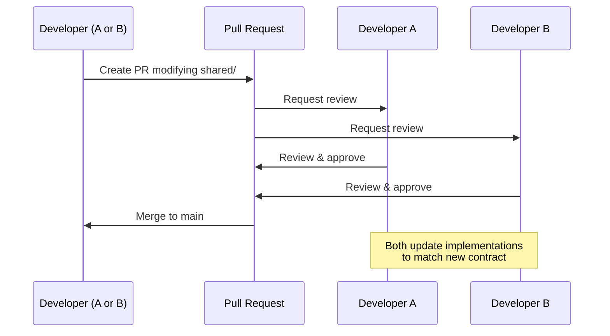

# Deliverable 4 — Shared Contract Layer

> **Document Version:** 0.1.0
> **Last Updated:** 2026-07-23
> **Status:** Phase 0 — Architecture Specification
> **Owner:** Both Developers (jointly)

---

## 1. Why `shared/` Exists

The `shared/` directory is the **single source of truth** for all data contracts between the Backend and Frontend. It exists to solve one fundamental problem:

> **Two developers building two independent applications must agree on the exact shape of every piece of data that crosses the boundary between them.**

Without `shared/`:
- Developer A might emit snapshots with `vehicle_speed` in m/s while Developer B expects km/h
- Developer A might name a field `avg_wait_time` while Developer B looks for `averageWaitTime`
- Adding a new controller type might break the frontend's snapshot parser
- Metric formulas might be interpreted differently on each side

With `shared/`:
- Every field name, type, unit, and format is defined once and consumed by both sides
- Changes are versioned and require mutual agreement
- Both sides can validate their data against the same schemas
- New features can be designed contract-first before implementation begins

---

## 2. Folder Structure

```
shared/
├── README.md                       # Shared layer documentation and rules
│
├── schemas/                        # JSON Schema definitions (canonical)
│   ├── snapshot.schema.json        # Snapshot payload schema
│   ├── config.schema.json          # Scenario configuration schema
│   ├── metrics.schema.json         # Metric output schema
│   ├── messages.schema.json        # WebSocket message schemas
│   └── errors.schema.json          # Error response schema
│
├── snapshot/                       # Snapshot contract documentation
│   ├── README.md                   # Snapshot field reference
│   └── examples/                   # Example snapshot payloads
│       ├── fixed_time_snapshot.json
│       └── roundabout_snapshot.json
│
├── metrics/                        # Metric contract documentation
│   ├── README.md                   # Metric definitions reference
│   └── examples/                   # Example metric outputs
│       ├── fixed_time_metrics.json
│       └── roundabout_metrics.json
│
├── config/                         # Configuration contract documentation
│   ├── README.md                   # Configuration field reference
│   └── examples/                   # Example configurations
│       ├── fixed_time_default.json
│       ├── roundabout_default.json
│       ├── high_traffic.json
│       └── low_traffic.json
│
├── types/                          # Canonical type definitions
│   ├── README.md                   # Type documentation
│   ├── snapshot.types.md           # Snapshot type table
│   ├── config.types.md             # Configuration type table
│   └── metrics.types.md            # Metric type table
│
├── constants/                      # Shared constant values
│   ├── README.md                   # Constants documentation
│   ├── physics.md                  # Physics constants (IDM defaults, speed limits)
│   ├── units.md                    # Unit system definitions
│   └── limits.md                   # System limits (max vehicles, max ticks)
│
└── enums/                          # Enumeration definitions
    ├── README.md                   # Enums documentation
    ├── controller-type.md          # ControllerType enum
    ├── simulation-status.md        # SimulationStatus enum
    ├── vehicle-state.md            # VehicleState enum
    ├── signal-phase.md             # SignalPhase enum
    ├── direction.md                # Direction enum
    └── metric-category.md          # MetricCategory enum
```

---

## 3. What Belongs in `shared/`

| Category | Examples | Format |
|----------|----------|--------|
| **JSON Schemas** | Snapshot schema, config schema, metric schema | `.schema.json` (JSON Schema Draft 2020-12) |
| **Type Tables** | Field-by-field type definitions with descriptions | Markdown tables |
| **Enumeration Definitions** | Controller types, simulation states, vehicle states | Markdown with value tables |
| **Constants** | Physics defaults, unit conversions, system limits | Markdown with value tables |
| **Example Payloads** | Sample snapshots, configs, metric outputs | `.json` files |
| **Contract Documentation** | Field descriptions, edge cases, validation rules | Markdown |

## 4. What NEVER Belongs in `shared/`

| Excluded | Why |
|----------|-----|
| Python source code | Backend implementation detail |
| TypeScript source code | Frontend implementation detail |
| Business logic | Contracts define shape, not behavior |
| Algorithms or formulas (as code) | Mathematical definitions in Markdown are OK; executable code is not |
| Test files | Tests belong in `backend/tests/` or frontend test directories |
| Build artifacts | Generated files are never committed |
| Environment-specific values | No `.env` files, no server URLs, no API keys |

---

## 5. Ownership Rules

### Rule 1: Joint Ownership

Every file in `shared/` is jointly owned by Developer A and Developer B. Neither developer may unilaterally modify a shared contract.

### Rule 2: Contract-First Design

When a new feature requires data exchange between backend and frontend:
1. **Design the contract first** — Add or modify the relevant schema/type in `shared/`
2. **Both developers review** — PR must be approved by both
3. **Then implement** — Each developer implements against the agreed contract

### Rule 3: No Breaking Changes Without Migration

A "breaking change" is any modification that would cause existing backend or frontend code to fail:
- Removing a required field
- Changing a field's type
- Renaming a field
- Changing a field's units

Breaking changes require:
1. A deprecation notice in the current version
2. A new schema version
3. Both developers agreeing on the migration plan

### Rule 4: Additive Changes Are Safe

Adding new optional fields is always safe and does not require a version bump. Both sides must ignore unknown fields gracefully.

---

## 6. Change Management Process



### Change Checklist

For any PR modifying `shared/`:
- [ ] Schema changes are backward-compatible (or version is bumped)
- [ ] Type documentation is updated to match schema
- [ ] Example payloads are updated or added
- [ ] Both developers have been notified
- [ ] Both developers have approved the PR

---

## 7. Versioning Strategy

### Schema Versioning

Each schema file includes a `version` field using **Semantic Versioning (SemVer)**:

```
MAJOR.MINOR.PATCH
```

| Change Type | Version Bump | Example |
|-------------|-------------|---------|
| Breaking: field removed, type changed, field renamed | MAJOR | `1.0.0` → `2.0.0` |
| New optional field added, new enum value added | MINOR | `1.0.0` → `1.1.0` |
| Documentation fix, example correction | PATCH | `1.0.0` → `1.0.1` |

### Version in Snapshots

Every snapshot payload includes a `schemaVersion` field so the frontend can detect incompatible versions:

```json
{
  "schemaVersion": "1.0.0",
  "...": "..."
}
```

The frontend should:
1. Parse `schemaVersion` from every snapshot
2. Compare against the expected version
3. Display a warning if the major version differs
4. Continue gracefully if only the minor or patch version differs

---

## 8. Consumption Patterns

### Backend (Python) Consumption

The backend uses `shared/schemas/*.schema.json` files to:
1. **Validate incoming configuration** — `config/validator.py` loads `config.schema.json` and validates user-submitted configs
2. **Validate outgoing snapshots** (in development/test mode) — Ensures emitted snapshots conform to `snapshot.schema.json`
3. **Reference constants and enums** — Python enum classes mirror the definitions in `shared/enums/`

Python validation library: `jsonschema` or `pydantic` (models generated from JSON Schema)

### Frontend (TypeScript) Consumption

The frontend uses `shared/` to:
1. **Define TypeScript interfaces** — `types/snapshot.ts` mirrors the types defined in `shared/types/snapshot.types.md`
2. **Validate incoming data** (in development mode) — Optionally validate WebSocket payloads against schemas
3. **Format metric values** — Uses unit definitions from `shared/constants/units.md`
4. **Render controller-specific UI** — Uses `shared/enums/controller-type.md` to determine which renderers to activate

TypeScript types are manually maintained to match the shared schemas. In the future, code generation from JSON Schema is recommended.

---

## 9. File Format Conventions

| File Type | Naming Convention | Purpose |
|-----------|------------------|---------|
| `*.schema.json` | Lowercase, dot-separated | Machine-readable JSON Schema |
| `*.types.md` | Lowercase, dot-separated | Human-readable type tables |
| `*.json` (in examples/) | Lowercase, snake_case | Example payloads |
| `*.md` (in enums/, constants/) | Lowercase, kebab-case | Documentation files |
| `README.md` | Uppercase | Directory purpose documentation |

---

## 10. Cross-References

| Topic | Document |
|-------|----------|
| Snapshot schema details | [05-snapshot-contract.md](./05-snapshot-contract.md) |
| Configuration schema details | [06-scenario-configuration-contract.md](./06-scenario-configuration-contract.md) |
| Metric definitions | [07-metric-contract.md](./07-metric-contract.md) |
| Communication messages | [08-communication-contract.md](./08-communication-contract.md) |
| Engineering standards | [09-engineering-standards.md](./09-engineering-standards.md) |
