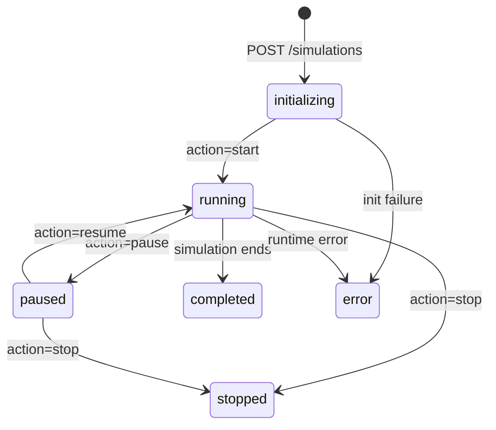
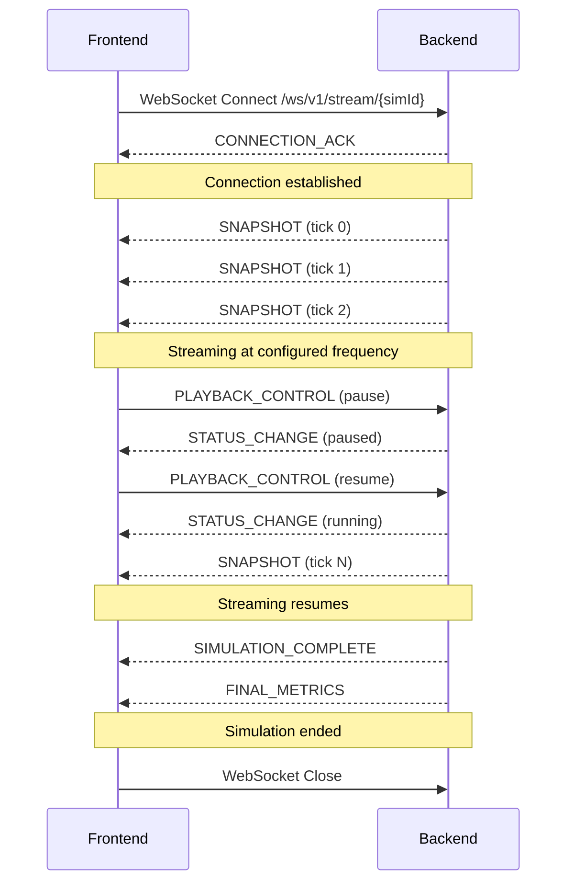

# Deliverable 8 — Communication Contract

> **Document Version:** 0.1.0
> **Last Updated:** 2026-07-23
> **Status:** Phase 0 — Architecture Specification
> **Owner:** Both Developers (jointly)

---

## 1. Overview

The frontend and backend communicate through two channels:

| Channel | Protocol | Purpose |
|---------|----------|---------|
| **REST API** | HTTP/1.1 (JSON) | CRUD operations: submit configs, start/stop simulations, fetch results |
| **WebSocket** | WS (JSON) | Real-time streaming: snapshot delivery, live metric updates, status changes |

### Why Both?

- **REST** is ideal for request-response patterns: "create a simulation," "fetch final metrics," "validate a config." It's stateless, cacheable, and well-understood.
- **WebSocket** is essential for high-frequency streaming: 10+ snapshots per second cannot efficiently use REST polling. WebSocket provides persistent, low-latency, bidirectional communication.

### Base URL Convention

```
REST:      http://localhost:8000/api/v1/...
WebSocket: ws://localhost:8000/ws/v1/...
```

---

## 2. API Versioning Strategy

All endpoints are prefixed with a version identifier:

```
/api/v1/simulations
/ws/v1/stream
```

**Rules:**
- Breaking changes (removed fields, changed types) → increment major version (`/api/v2/`)
- New endpoints or optional fields → same version, documented in changelog
- Old versions remain active for one major release cycle (then deprecated)
- Version is in the URL path (not headers) for simplicity and debuggability

---

## 3. REST API Endpoints

### 3.1 Health Check

| Attribute | Value |
|-----------|-------|
| **Method** | `GET` |
| **Path** | `/api/v1/health` |
| **Description** | Server health check |
| **Request Body** | None |

**Response (200 OK):**
```json
{
  "status": "healthy",
  "version": "0.1.0",
  "uptime": 3600,
  "timestamp": "2026-07-23T14:30:00.000Z"
}
```

---

### 3.2 Validate Configuration

| Attribute | Value |
|-----------|-------|
| **Method** | `POST` |
| **Path** | `/api/v1/configs/validate` |
| **Description** | Validate a scenario configuration without creating a simulation |
| **Request Body** | Full or partial scenario configuration JSON |

**Request:**
```json
{
  "geometry": { "intersectionType": "fixed_time_signal" },
  "simulation": { "duration": -10 }
}
```

**Response (200 OK — Valid):**
```json
{
  "valid": true,
  "resolvedConfig": { "...full config with defaults applied..." }
}
```

**Response (200 OK — Invalid):**
```json
{
  "valid": false,
  "errors": [
    {
      "path": "simulation.duration",
      "message": "Value must be greater than 0",
      "value": -10,
      "constraint": { "minimum": 0, "exclusiveMinimum": true }
    }
  ]
}
```

---

### 3.3 Create Simulation

| Attribute | Value |
|-----------|-------|
| **Method** | `POST` |
| **Path** | `/api/v1/simulations` |
| **Description** | Create and initialize a new simulation from a configuration |
| **Request Body** | Scenario configuration JSON |

**Request:**
```json
{
  "geometry": { "intersectionType": "fixed_time_signal" },
  "simulation": { "duration": 300 }
}
```

**Response (201 Created):**
```json
{
  "simulationId": "sim_a1b2c3d4",
  "configId": "cfg_e5f6g7h8",
  "status": "initializing",
  "createdAt": "2026-07-23T14:30:00.000Z",
  "config": { "...resolved config..." }
}
```

---

### 3.4 Get Simulation Status

| Attribute | Value |
|-----------|-------|
| **Method** | `GET` |
| **Path** | `/api/v1/simulations/{simulationId}` |
| **Description** | Get current status of a simulation |

**Response (200 OK):**
```json
{
  "simulationId": "sim_a1b2c3d4",
  "status": "running",
  "progress": 0.45,
  "currentTick": 1350,
  "totalTicks": 3000,
  "elapsedTime": 135.0,
  "totalTime": 300.0
}
```

---

### 3.5 Control Simulation

| Attribute | Value |
|-----------|-------|
| **Method** | `POST` |
| **Path** | `/api/v1/simulations/{simulationId}/control` |
| **Description** | Start, pause, resume, or stop a simulation |
| **Request Body** | Control action |

**Request:**
```json
{
  "action": "start"
}
```

**Valid Actions:** `start`, `pause`, `resume`, `stop`

**Response (200 OK):**
```json
{
  "simulationId": "sim_a1b2c3d4",
  "previousStatus": "initializing",
  "currentStatus": "running",
  "timestamp": "2026-07-23T14:30:01.000Z"
}
```

**State Transitions:**



---

### 3.6 Get Final Metrics

| Attribute | Value |
|-----------|-------|
| **Method** | `GET` |
| **Path** | `/api/v1/simulations/{simulationId}/metrics` |
| **Description** | Get final computed metrics (available after simulation completes) |

**Response (200 OK):**
```json
{
  "simulationId": "sim_a1b2c3d4",
  "controllerType": "fixed_time_signal",
  "status": "completed",
  "metrics": {
    "average_wait_time": { "value": 23.4, "unit": "seconds" },
    "throughput": { "value": 185, "unit": "vehicles" },
    "...": "...see metric contract for full schema"
  }
}
```

**Response (409 Conflict — Not Complete):**
```json
{
  "error": {
    "code": "SIMULATION_NOT_COMPLETE",
    "message": "Simulation is still running. Final metrics are not yet available.",
    "simulationId": "sim_a1b2c3d4",
    "currentStatus": "running"
  }
}
```

---

### 3.7 List Simulations

| Attribute | Value |
|-----------|-------|
| **Method** | `GET` |
| **Path** | `/api/v1/simulations` |
| **Description** | List all simulations (with optional status filter) |
| **Query Params** | `?status=completed&limit=10&offset=0` |

**Response (200 OK):**
```json
{
  "simulations": [
    {
      "simulationId": "sim_a1b2c3d4",
      "controllerType": "fixed_time_signal",
      "status": "completed",
      "createdAt": "2026-07-23T14:30:00.000Z",
      "completedAt": "2026-07-23T14:35:00.000Z"
    }
  ],
  "total": 1,
  "limit": 10,
  "offset": 0
}
```

---

## 4. WebSocket Protocol

### 4.1 Connection

**URL:** `ws://localhost:8000/ws/v1/stream/{simulationId}`

**Connection Flow:**


### 4.2 Message Format

All WebSocket messages use a standard envelope:

```json
{
  "type": "<EVENT_TYPE>",
  "timestamp": "2026-07-23T14:30:00.123Z",
  "payload": { "..." }
}
```

### 4.3 Server → Client Events

| Event Type | Description | Payload |
|------------|-------------|---------|
| `CONNECTION_ACK` | Connection established | `{ "simulationId": "...", "status": "...", "schemaVersion": "1.0.0" }` |
| `SNAPSHOT` | Simulation state snapshot | Full Snapshot object (see Deliverable 5) |
| `STATUS_CHANGE` | Simulation status changed | `{ "previousStatus": "...", "currentStatus": "...", "reason": "..." }` |
| `SIMULATION_COMPLETE` | Simulation finished | `{ "simulationId": "...", "totalTicks": 3000, "totalVehicles": 185 }` |
| `FINAL_METRICS` | Final metric results | Full Metric output object (see Deliverable 7) |
| `ERROR` | Server-side error | `{ "code": "...", "message": "...", "recoverable": true/false }` |
| `HEARTBEAT` | Keep-alive ping | `{ "serverTime": "..." }` |

### 4.4 Client → Server Events

| Event Type | Description | Payload |
|------------|-------------|---------|
| `PLAYBACK_CONTROL` | Control simulation playback | `{ "action": "pause" \| "resume" \| "stop" }` |
| `SPEED_CHANGE` | Change playback speed | `{ "speed": 2.0 }` |
| `SEEK` | Jump to specific tick (buffered snapshots only) | `{ "tick": 500 }` |
| `HEARTBEAT_ACK` | Respond to heartbeat | `{}` |

---

## 5. Streaming Strategy

### 5.1 Snapshot Frequency

| Parameter | Value | Configurable |
|-----------|-------|-------------|
| Default snapshot frequency | 10 Hz | Yes (via `simulation.snapshotFrequency`) |
| Maximum snapshot frequency | 60 Hz | Hard limit |
| Minimum snapshot frequency | 1 Hz | Hard limit |

### 5.2 Snapshot Decimation

If the simulation runs faster than the snapshot frequency:
- The engine ticks at `1 / timeStep` Hz (e.g., 10 Hz for dt=0.1s)
- Snapshots are emitted at `snapshotFrequency` Hz
- If tick rate > snapshot rate: only every Nth tick produces a snapshot
- Example: tick rate = 100 Hz, snapshot rate = 10 Hz → emit every 10th tick

### 5.3 Backpressure

If the frontend cannot consume snapshots fast enough:
1. The WebSocket buffer fills up
2. When the buffer reaches a threshold (100 messages), the backend drops the oldest undelivered snapshots
3. A `SNAPSHOT_DROPPED` warning is sent with the count of dropped frames
4. The frontend should handle gaps gracefully (interpolation or skipping)

### 5.4 Reconnection

If the WebSocket connection drops:
1. The frontend should attempt reconnection with exponential backoff: 1s, 2s, 4s, 8s, max 30s
2. On reconnection, the backend sends the latest snapshot immediately
3. Missed snapshots are not replayed (the frontend resumes from current state)
4. The simulation continues running during disconnection

---

## 6. Error Taxonomy

### 6.1 HTTP Error Responses

All error responses follow a consistent format:

```json
{
  "error": {
    "code": "ERROR_CODE",
    "message": "Human-readable error description",
    "details": { "...additional context..." },
    "timestamp": "2026-07-23T14:30:00.000Z"
  }
}
```

### 6.2 Error Codes

| Code | HTTP Status | Description |
|------|------------|-------------|
| `VALIDATION_ERROR` | 400 | Configuration validation failed |
| `SIMULATION_NOT_FOUND` | 404 | Requested simulation does not exist |
| `SIMULATION_NOT_COMPLETE` | 409 | Attempting to get final metrics while simulation is running |
| `INVALID_STATE_TRANSITION` | 409 | Invalid control action for current simulation state |
| `SIMULATION_LIMIT_REACHED` | 429 | Maximum concurrent simulations reached |
| `INTERNAL_ERROR` | 500 | Unexpected server error |
| `SIMULATION_ENGINE_ERROR` | 500 | Error within the simulation engine |

### 6.3 WebSocket Error Codes

| Code | Description | Recoverable |
|------|-------------|-------------|
| `WS_SIMULATION_NOT_FOUND` | Simulation ID in connection URL is invalid | No |
| `WS_SIMULATION_NOT_RUNNING` | Simulation is not in a streamable state | No |
| `WS_SNAPSHOT_DROPPED` | Frames were dropped due to backpressure | Yes |
| `WS_ENGINE_ERROR` | Simulation engine encountered an error | No |
| `WS_INVALID_MESSAGE` | Client sent an unrecognized message type | Yes |

---

## 7. CORS Configuration

For local development:

```
Access-Control-Allow-Origin: http://localhost:5173
Access-Control-Allow-Methods: GET, POST, OPTIONS
Access-Control-Allow-Headers: Content-Type
Access-Control-Max-Age: 86400
```

The frontend development server (Vite) runs on port 5173 by default. The backend (FastAPI) runs on port 8000.

---

## 8. Future Extensibility

| Feature | How It's Supported |
|---------|--------------------|
| **Batch simulation runs** | Add `POST /api/v1/batches` endpoint; results via polling or WebSocket |
| **Comparison endpoint** | Add `GET /api/v1/comparisons?simA=...&simB=...` to return side-by-side metrics |
| **Export results** | Add `GET /api/v1/simulations/{id}/export?format=csv\|json` |
| **Multiple concurrent viewers** | WebSocket already supports multiple connections per simulation |
| **Authentication** | Add JWT middleware; no endpoint changes needed |
| **Rate limiting** | Add middleware; no endpoint changes needed |
| **New controller types** | No API changes needed — controller type is part of config |

---

## 9. Endpoint Summary

| Method | Path | Description |
|--------|------|-------------|
| `GET` | `/api/v1/health` | Health check |
| `POST` | `/api/v1/configs/validate` | Validate config |
| `POST` | `/api/v1/simulations` | Create simulation |
| `GET` | `/api/v1/simulations` | List simulations |
| `GET` | `/api/v1/simulations/{id}` | Get simulation status |
| `POST` | `/api/v1/simulations/{id}/control` | Control simulation |
| `GET` | `/api/v1/simulations/{id}/metrics` | Get final metrics |
| `WS` | `/ws/v1/stream/{id}` | Real-time snapshot stream |

---

## 10. Cross-References

| Topic | Document |
|-------|----------|
| Snapshot payload schema | [05-snapshot-contract.md](./05-snapshot-contract.md) |
| Configuration schema | [06-scenario-configuration-contract.md](./06-scenario-configuration-contract.md) |
| Metric output schema | [07-metric-contract.md](./07-metric-contract.md) |
| Engineering standards | [09-engineering-standards.md](./09-engineering-standards.md) |
