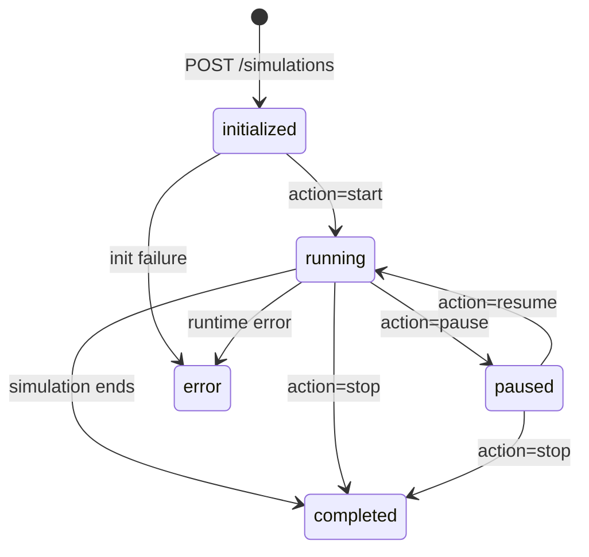

# Deliverable 8 — Communication Contract

> **Document Version:** 0.1.0
> **Last Updated:** 2026-07-23
> **Status:** Current implementation reference (audited 2026-09-07)
> **Owner:** Both Developers (jointly)

---

## 1. Overview

The frontend and backend communicate through two channels:

| Channel | Protocol | Purpose |
|---------|----------|---------|
| **REST API** | HTTP/1.1 (JSON) | CRUD operations: submit configs, start/stop simulations, fetch results |
| **WebSocket** | WS (JSON) | Real-time streaming: snapshot delivery, live metric updates, status changes |

### Why Both?

- **REST** is ideal for request-response patterns: "create a simulation," "fetch final metrics," "validate a config." It's stateless, cacheable, and well-understood.
- **WebSocket** is essential for high-frequency streaming: 10+ snapshots per second cannot efficiently use REST polling. WebSocket provides persistent, low-latency, bidirectional communication.

### Base URL Convention

```
REST:      http://localhost:8000/api/v1/...
WebSocket: ws://localhost:8000/ws/v1/stream?simulationId=...

The dashboard also uses the compatibility routes under `/api/simulation/*` and `/ws/simulation/*`. See [../operations.md](../operations.md) for the complete current route list.
```

---

## 2. API Versioning Strategy

All endpoints are prefixed with a version identifier:

```
/api/v1/simulations
/ws/v1/stream
```

**Rules:**
- Breaking changes (removed fields, changed types) → increment major version (`/api/v2/`)
- New endpoints or optional fields → same version, documented in changelog
- Old versions remain active for one major release cycle (then deprecated)
- Version is in the URL path (not headers) for simplicity and debuggability

---

## 3. REST API Endpoints

### 3.1 Health Check

| Attribute | Value |
|-----------|-------|
| **Method** | `GET` |
| **Path** | `/health` |
| **Description** | Server health check |
| **Request Body** | None |

**Response (200 OK):**
```json
{
  "status": "healthy",
  "version": "0.1.0",
  "uptime": 3600,
  "timestamp": "2026-07-23T14:30:00.000Z"
}
```

---

### 3.2 Validate Configuration

| Attribute | Value |
|-----------|-------|
| **Method** | `POST` |
| **Path** | `/api/v1/configs/validate` |
| **Description** | Validate a scenario configuration without creating a simulation |
| **Request Body** | Full or partial scenario configuration JSON |

**Request:**
```json
{
  "geometry": { "intersectionType": "fixed_time_signal" },
  "simulation": { "duration": -10 }
}
```

> **Audited 2026-09-11 against `backend/src/main.py`:** the handler runs
> `jsonschema.validate()` and returns only `valid`/`errors`. There is no
> `resolvedConfig` (defaults-applied config) in the response, and `errors`
> is a flat list of plain jsonschema message strings, not structured
> `{path, message, value, constraint}` objects. A structured error
> envelope and `resolvedConfig` were previously documented here as if
> implemented; they are unbuilt — see §8 Future Extensibility if revisited.

**Response (200 OK — Valid):**
```json
{
  "valid": true,
  "errors": []
}
```

**Response (200 OK — Invalid):**
```json
{
  "valid": false,
  "errors": [
    "-10 is less than the minimum of 0"
  ]
}
```

---

### 3.3 Create Simulation

| Attribute | Value |
|-----------|-------|
| **Method** | `POST` |
| **Path** | `/api/v1/simulations` |
| **Description** | Create and initialize a new simulation from a configuration |
| **Request Body** | Scenario configuration JSON |

**Request:**
```json
{
  "geometry": { "intersectionType": "fixed_time_signal" },
  "simulation": { "duration": 300 }
}
```

> **Audited 2026-09-11 against `backend/src/main.py`:** the response
> returns `simulationId`, `configId`, and `status`, plus `createdAt` (the
> simulation's existing creation timestamp, in the API's UTC-`Z`
> convention — see §6.1) and `config`. `config` is the exact configuration
> dict this simulation was constructed from — including a `randomSeed`
> filled in by the vehicle spawner when the request omitted one — not a
> defaults-filled/schema-resolved configuration; there is no such
> resolution step in this endpoint.

**Response (201 Created — current):**
```json
{
  "simulationId": "sim_a1b2c3d4",
  "configId": "cfg_e5f6g7h8",
  "status": "initialized",
  "createdAt": "2026-07-23T14:30:00.000Z",
  "config": { "...the exact configuration used to construct the simulation...": "..." }
}
```

---

### 3.4 Get Simulation Status

| Attribute | Value |
|-----------|-------|
| **Method** | `GET` |
| **Path** | `/api/v1/simulations/{simulationId}` |
| **Description** | Get current status of a simulation |

> **Audited 2026-09-11 against `backend/src/main.py`:** the response
> currently returns only `simulationId`, `status`, `elapsed`, and `tick`.
> `progress`, `currentTick`, `totalTicks`, `elapsedTime`, and `totalTime`
> are not computed or returned today — they remain a desired future
> enhancement, not current behavior.

**Response (200 OK — current):**
```json
{
  "simulationId": "sim_a1b2c3d4",
  "status": "running",
  "elapsed": 135.0,
  "tick": 1350
}
```

**Planned/future (not implemented):** `progress` (0.0–1.0 completion fraction), `currentTick`/`totalTicks` (aliases/derivations of `tick`), `elapsedTime`/`totalTime` (aliases/derivations of `elapsed`).

---

### 3.5 Control Simulation

| Attribute | Value |
|-----------|-------|
| **Method** | `POST` |
| **Path** | `/api/v1/simulations/{simulationId}/control` |
| **Description** | Start, pause, resume, or stop a simulation |
| **Request Body** | Control action |

**Request:**
```json
{
  "action": "start"
}
```

**Valid Actions:** `start`, `pause`, `resume`, `stop`

> **Audited 2026-09-11 against `backend/src/main.py`:** the response
> returns `status` (the simulation's status after the action, unchanged
> from before), plus `simulationId`, `previousStatus` (the status
> immediately before the successful transition), `currentStatus` (the
> resulting engine status — the same value as `status`), and `timestamp`
> (the response timestamp, in the API's existing UTC-`Z` convention — see
> §6.1). On a failed transition (`409 INVALID_STATE_TRANSITION`), none of
> this is returned — the existing error envelope (§6.1) is used instead,
> never a success-shaped payload.

**Response (200 OK — current):**
```json
{
  "status": "running",
  "simulationId": "sim_a1b2c3d4",
  "previousStatus": "initialized",
  "currentStatus": "running",
  "timestamp": "2026-07-23T14:30:01.000Z"
}
```

**State Transitions:**



---

### 3.6 Get Metrics

| Attribute | Value |
|-----------|-------|
| **Method** | `GET` |
| **Path** | `/api/v1/simulations/{simulationId}/metrics` |
| **Description** | Get the current metrics snapshot for a simulation |

> **Audited 2026-09-11 against `backend/src/main.py`:** this endpoint
> intentionally returns metrics for a simulation in **any** status,
> including `running` and `paused`, not only `completed` — it is used for
> live polling as well as final results. There is no completion check and
> no `409 SIMULATION_NOT_COMPLETE` response; that response was previously
> documented here but was never implemented and does not describe current
> behavior. The response is also not wrapped in a
> `{simulationId, controllerType, status, metrics: {...}}` envelope — it
> is exactly the flat dictionary produced by `MetricCollector.get_metrics()`
> (same shape used for WebSocket running metrics and the JSON report), with
> camelCase keys and unwrapped numeric/primitive values. See
> [07-metric-contract.md §9](./07-metric-contract.md#9-metric-output-schema)
> for the full key list.

**Response (200 OK — current, abbreviated):**
```json
{
  "averageWaitTime": 23.4,
  "throughput": 185,
  "throughputRate": 12.3,
  "currentQueueLengths": { "north": 2, "south": 1, "east": 0, "west": 3 },
  "maxQueueLength": 7,
  "averageQueueLength": 2.1,
  "totalStops": 92,
  "averageStopsPerVehicle": 0.6,
  "speedVarianceIndex": 0.18,
  "travelTimeReliability": 1.12,
  "idleOpportunityLoss": 0.05,
  "directionalFairnessIndex": 0.94,
  "activeVehicleCount": 14,
  "totalVehiclesSpawned": 200,
  "averageTravelSpeed": 9.5,
  "queueStabilityIndex": 0.8,
  "congestionRecoveryTime": 12.0,
  "spaceFootprintConsumed": 196.0,
  "intersectionUtilization": 65.0,
  "criticalSaturationVolume": 0.42
}
```

---

### 3.7 List Simulations

> **Audited 2026-09-11 against `backend/src/main.py`:** `GET
> /api/v1/simulations` (list, no path parameter) is not implemented —
> there is no route registered for it. Everything below this note
> describes a **planned/future** endpoint, not current behavior. Listing
> simulations today requires going through
> `GET /api/v1/study/history/runs` (persisted, completed runs only — see
> [operations.md](../operations.md#study-and-analysis)) rather than the
> in-memory `simulations_db` registry this section originally described.

| Attribute | Value |
|-----------|-------|
| **Method** | `GET` |
| **Path** | `/api/v1/simulations` |
| **Description** | List all simulations (with optional status filter) |
| **Query Params** | `?status=completed&limit=10&offset=0` |

**Response (200 OK — planned, not implemented):**
```json
{
  "simulations": [
    {
      "simulationId": "sim_a1b2c3d4",
      "controllerType": "fixed_time_signal",
      "status": "completed",
      "createdAt": "2026-07-23T14:30:00.000Z",
      "completedAt": "2026-07-23T14:35:00.000Z"
    }
  ],
  "total": 1,
  "limit": 10,
  "offset": 0
}
```

---

### 3.8 Get Simulation History

| Attribute | Value |
|-----------|-------|
| **Method** | `GET` |
| **Path** | `/api/v1/simulations/{simulationId}/history` |
| **Description** | Get every buffered snapshot recorded so far for a simulation (up to the buffer's 1,000-frame capacity) |

**Response (200 OK):** a JSON array of raw Snapshot objects (the same shape sent over `/ws/v1/stream` — see [05-snapshot-contract.md](./05-snapshot-contract.md)), oldest first:
```json
[
  { "simulationStatus": "running", "tick": 0, "...": "..." },
  { "simulationStatus": "running", "tick": 1, "...": "..." }
]
```

---

### 3.9 Get Simulation History Frame

| Attribute | Value |
|-----------|-------|
| **Method** | `GET` |
| **Path** | `/api/v1/simulations/{simulationId}/history/{tick}` |
| **Description** | Get a single buffered snapshot by tick number |

**Response (200 OK):** the raw Snapshot object for that tick.

**Response (404 Not Found):** if `tick` is not present in the buffer (e.g. it was evicted, or never recorded), using the standard error envelope (§6.1) with code `NOT_FOUND`.

---

### 3.10 Get Simulation Report

| Attribute | Value |
|-----------|-------|
| **Method** | `GET` |
| **Path** | `/api/v1/simulations/{simulationId}/report` |
| **Query Params** | `?format=json` or `?format=csv` (default: `csv`) |
| **Description** | Get the current metrics snapshot as a downloadable report |

**Response (200 OK, `format=json`):**
```json
{
  "simulationId": "sim_a1b2c3d4",
  "finalMetrics": { "...same flat shape as §3.6...": "..." },
  "ticksCount": 3000
}
```

**Response (200 OK, `format=csv`, default):** a `text/csv` file download (`Content-Disposition: attachment`) with a `Metric Name,Value` header row, one row per metric; nested/dict-valued metrics (e.g. `currentQueueLengths`) are JSON-encoded into the value cell.

> Note: despite the field name `finalMetrics` and the name "report," this
> endpoint does not require the simulation to be `completed` — like §3.6,
> it reads whatever the collector currently holds, so calling it on a
> running simulation returns an in-progress snapshot, not an error.

---

### 3.11 Delete Simulation

| Attribute | Value |
|-----------|-------|
| **Method** | `DELETE` |
| **Path** | `/api/v1/simulations/{simulationId}` |
| **Description** | Remove a simulation from the in-memory registry |

**Response (200 OK):**
```json
{
  "status": "deleted",
  "simulationId": "sim_a1b2c3d4"
}
```

**Response (400 Bad Request):** if the simulation is currently `running` or `paused` — it must be stopped first.

---

## 4. WebSocket Protocol

> **Audited 2026-09 against `backend/src/main.py`:** the protocol actually
> implemented is deliberately simpler than an earlier draft of this
> section described. There is no message envelope, no `CONNECTION_ACK` /
> `STATUS_CHANGE` / `SIMULATION_COMPLETE` / `FINAL_METRICS` / `HEARTBEAT`
> event stream, and the socket does not accept any client→server control
> messages — control happens exclusively over the REST control endpoint
> (§3.5). Nothing in the codebase (backend or frontend) implements that
> richer envelope/event-taxonomy version; [../operations.md](../operations.md)
> has tracked the real behavior throughout, and this section now matches it
> rather than describing an unbuilt design. If that richer protocol is
> wanted, it should be scoped as a new feature (see §8 Future
> Extensibility) rather than assumed to already exist.

### 4.1 Connection

**URL:** `ws://localhost:8000/ws/v1/stream?simulationId={simulationId}`

**Connection Flow:**
```mermaid
sequenceDiagram
    participant FE as Frontend
    participant BE as Backend

    FE->>BE: WebSocket Connect /ws/v1/stream?simulationId={simId}
    Note over FE,BE: Server accepts and starts streaming immediately —<br/>no acknowledgement message is sent

    BE-->>FE: Snapshot (tick 0)
    BE-->>FE: Snapshot (tick 1)
    BE-->>FE: Snapshot (tick 2)
    Note over FE,BE: One JSON snapshot per message, at simulation.snapshotFrequency<br/>(default 10Hz); use the REST control endpoint to pause/resume/stop

    BE-->>FE: Snapshot (simulationStatus: "completed")
    Note over FE,BE: Server closes the connection after the final snapshot

    FE->>BE: WebSocket Close
```

If `simulationId` does not name a known simulation, the server accepts the
connection and immediately closes it with WebSocket close code `1008`. An
unhandled server-side error while streaming closes the connection with
code `1011`.

### 4.2 Message Format

Each server→client message is the raw JSON Snapshot object itself (see
[05-snapshot-contract.md](./05-snapshot-contract.md)) — there is no
`{type, timestamp, payload}` wrapper. The two fields every consumer needs
are:

```json
{
  "simulationStatus": "running",
  "tick": 42,
  "...": "...see the snapshot contract for the full shape..."
}
```

The server stops streaming and closes the connection once
`simulationStatus` is `"completed"` or `"error"` — that final snapshot is
the last message sent.

### 4.3 Server → Client Events

There is no separate event-type taxonomy: every message is a `Snapshot`.
Callers distinguish "still running" from "finished" by reading
`simulationStatus` on each snapshot, not by a message `type` field.

### 4.4 Client → Server Events

None. The server does not read or act on any message sent by the client
on this socket; use `POST /api/v1/simulations/{id}/control` (§3.5) for
pause/resume/stop instead.

---

## 5. Streaming Strategy

> §5.1 (snapshot frequency) is implemented and enforced as described. §5.2
> (tick-counting decimation), §5.3 (backpressure / `SNAPSHOT_DROPPED`) and
> §5.4 (send-latest-on-reconnect) describe intended strategies that are not
> implemented: the WS loop simply polls the current simulation state once
> per `1/snapshotFrequency` seconds and sends whatever it finds, with no
> tick-counting, drop-warning, or reconnect-specific behavior. A dropped
> connection is treated like any other new connection — see §4.1.

### 5.1 Snapshot Frequency

| Parameter | Value | Configurable |
|-----------|-------|-------------|
| Default snapshot frequency | 10 Hz | Yes (via `simulation.snapshotFrequency`) |
| Maximum snapshot frequency | 60 Hz | Hard limit |
| Minimum snapshot frequency | 1 Hz | Hard limit |

### 5.2 Snapshot Decimation

If the simulation runs faster than the snapshot frequency:
- The engine ticks at `1 / timeStep` Hz (e.g., 10 Hz for dt=0.1s)
- Snapshots are emitted at `snapshotFrequency` Hz
- If tick rate > snapshot rate: only every Nth tick produces a snapshot
- Example: tick rate = 100 Hz, snapshot rate = 10 Hz → emit every 10th tick

### 5.3 Backpressure

If the frontend cannot consume snapshots fast enough:
1. The WebSocket buffer fills up
2. When the buffer reaches a threshold (100 messages), the backend drops the oldest undelivered snapshots
3. A `SNAPSHOT_DROPPED` warning is sent with the count of dropped frames
4. The frontend should handle gaps gracefully (interpolation or skipping)

### 5.4 Reconnection

If the WebSocket connection drops:
1. The frontend should attempt reconnection with exponential backoff: 1s, 2s, 4s, 8s, max 30s
2. On reconnection, the backend sends the latest snapshot immediately
3. Missed snapshots are not replayed (the frontend resumes from current state)
4. The simulation continues running during disconnection

---

## 6. Error Taxonomy

### 6.1 HTTP Error Responses

> **Audited 2026-09-11 against `backend/src/main.py`:** the envelope below
> is used for every error raised as a FastAPI `HTTPException` (a global
> `@app.exception_handler(HTTPException)` rewrites it into this shape —
> this covers all `4xx`/`5xx` responses that endpoint code raises
> explicitly, e.g. simulation-not-found, invalid config, invalid state
> transition). It is **not** used for `422` responses produced by FastAPI's
> automatic request-body validation (a `RequestValidationError`, e.g. an
> `/api/simulation/new` body that fails its Pydantic model, or a malformed
> `{"action": ...}` control body) — no handler is registered for
> `RequestValidationError`, so those responses still use FastAPI's default
> `{"detail": [...]}` shape. This is current, tested behavior (see
> `backend/tests/integration/test_config_validation.py`), not a bug to work
> around when reading responses; unifying the two shapes is an open item
> (§8).

Error responses raised via `HTTPException` follow this format:

```json
{
  "error": {
    "code": "ERROR_CODE",
    "message": "Human-readable error description",
    "details": { "...additional context..." },
    "timestamp": "2026-07-23T14:30:00.000Z"
  }
}
```

`422` responses from automatic Pydantic request-body validation instead look like FastAPI's default:

```json
{
  "detail": [
    { "type": "...", "loc": ["body", "..."], "msg": "...", "input": "..." }
  ]
}
```

### 6.2 Error Codes

`details` above is currently always `null` — no endpoint populates it with additional context yet.

| Code | HTTP Status | Description |
|------|------------|-------------|
| `VALIDATION_ERROR` | 400 | Configuration/request validation failed (raised via `HTTPException`, e.g. schema validation) |
| `UNAUTHORIZED` | 401 | Missing or invalid `API_KEY` bearer token |
| `NOT_FOUND` | 404 | Requested resource does not exist — **generic for every resource type** (simulations, history frames, sweeps, runs, replays all use this same code; there is no resource-specific variant like `SIMULATION_NOT_FOUND` today) |
| `INVALID_STATE_TRANSITION` | 409 | Invalid control action for current simulation state |
| `SIMULATION_LIMIT_REACHED` | 429 | Maximum concurrent simulations reached |
| `INTERNAL_ERROR` | 500 | Unexpected server error (also the fallback for any status code not in this table) |

**Planned/future (not implemented) — deferred API-design items:**
- `SIMULATION_NOT_FOUND` and other resource-specific 404 codes, in place of the current generic `NOT_FOUND`.
- `SIMULATION_NOT_COMPLETE` (409) — see §3.6: the metrics/report endpoints currently serve live and completed simulations alike, with no completion gate, so this code has no corresponding behavior to attach to unless that changes.
- `SIMULATION_ENGINE_ERROR` (500) — there is currently no code path that distinguishes an engine-internal error from any other unexpected server error; both fall through to `INTERNAL_ERROR`.
- A structured `{"error": {...}}` envelope for `422 RequestValidationError` responses, unifying them with §6.1's `HTTPException` envelope.

### 6.3 WebSocket Error Codes

> Not implemented as structured messages. `/ws/v1/stream` signals errors
> only via the WebSocket close code and a plain-text close reason — it
> never sends a `{code, message, recoverable}` JSON payload before
> closing, and there is no distinct "not running" / "invalid message"
> state (the socket streams whatever snapshot currently exists regardless
> of simulation status, until that status is `"completed"` or `"error"`).
> The two close codes actually used are:

| WS Close Code | Meaning |
|---------------|---------|
| `1008` | `simulationId` in the connection URL does not exist |
| `1011` | Unhandled server-side error while streaming |

---

## 7. CORS Configuration

For local development:

```
Access-Control-Allow-Origin: http://localhost:5173
Access-Control-Allow-Methods: GET, POST, OPTIONS
Access-Control-Allow-Headers: Content-Type
Access-Control-Max-Age: 86400
```

The frontend development server (Vite) runs on port 5173 by default. The backend (FastAPI) runs on port 8000.

---

## 8. Future Extensibility

| Feature | How It's Supported |
|---------|--------------------|
| **Batch simulation runs** | Add `POST /api/v1/batches` endpoint; results via polling or WebSocket |
| **Comparison endpoint** | Add `GET /api/v1/comparisons?simA=...&simB=...` to return side-by-side metrics (note: `POST /api/v1/study/history/runs/compare` already provides this for persisted runs — see [operations.md](../operations.md#study-and-analysis)) |
| **Export results** | Add `GET /api/v1/simulations/{id}/export?format=csv\|json` (note: `GET /api/v1/simulations/{id}/report?format=csv\|json`, §3.10, already provides this) |
| **Multiple concurrent viewers** | WebSocket already supports multiple connections per simulation |
| **Authentication** | Add JWT middleware; no endpoint changes needed |
| **Rate limiting** | Add middleware; no endpoint changes needed |
| **New controller types** | No API changes needed — controller type is part of config |

### 8.1 Deferred API-Design Items

These are known gaps between this document's original design intent and
the current implementation, called out inline above. They are listed here
together as a single reference for anyone deciding what to build next; none
of them are scheduled or decided, only identified:

| Item | Where discussed | Current state |
|------|------------------|----------------|
| `progress` / `currentTick` / `totalTicks` / `elapsedTime` / `totalTime` on status response | §3.4 | Not implemented |
| `GET /api/v1/simulations` (list) | §3.7 | Not implemented |
| Structured `422` error envelope matching §6.1 | §6.1 | Not implemented; current shape is FastAPI's default and is relied on by an existing test |
| Resource-specific 404 codes (e.g. `SIMULATION_NOT_FOUND`) | §6.2 | Not implemented; current generic `NOT_FOUND` is relied on by an existing test |
| `409 SIMULATION_NOT_COMPLETE` gate on metrics/report | §3.6, §3.10 | Not implemented; current live-polling behavior appears intentional but is unconfirmed as a deliberate design decision |
| Structured `/configs/validate` errors + `resolvedConfig` | §3.2 | Not implemented |

---

## 9. Endpoint Summary

| Method | Path | Description |
|--------|------|-------------|
| `GET` | `/health` | Health check |
| `POST` | `/api/v1/configs/validate` | Validate config |
| `POST` | `/api/v1/simulations` | Create simulation |
| `GET` | `/api/v1/simulations` | List simulations — **planned, not implemented** (§3.7) |
| `GET` | `/api/v1/simulations/{id}` | Get simulation status |
| `DELETE` | `/api/v1/simulations/{id}` | Delete simulation |
| `POST` | `/api/v1/simulations/{id}/control` | Control simulation |
| `GET` | `/api/v1/simulations/{id}/metrics` | Get current metrics (running or completed) |
| `GET` | `/api/v1/simulations/{id}/history` | Get all buffered snapshots |
| `GET` | `/api/v1/simulations/{id}/history/{tick}` | Get one buffered snapshot |
| `GET` | `/api/v1/simulations/{id}/report` | Get metrics as a JSON or CSV report |
| `WS` | `/ws/v1/stream?simulationId={id}` | Real-time snapshot stream |

This table covers only the versioned `/api/v1/*` core simulation-lifecycle
routes documented in §3. It does not include the legacy `/api/simulation/*`
compatibility routes used by the interactive dashboard, or the
`/api/v1/study/*` and `/api/v1/replays/*` routes — see
[operations.md](../operations.md) for the complete current route list.

---

## 10. Cross-References

| Topic | Document |
|-------|----------|
| Snapshot payload schema | [05-snapshot-contract.md](./05-snapshot-contract.md) |
| Configuration schema | [06-scenario-configuration-contract.md](./06-scenario-configuration-contract.md) |
| Metric output schema | [07-metric-contract.md](./07-metric-contract.md) |
| Engineering standards | [09-engineering-standards.md](./09-engineering-standards.md) |
