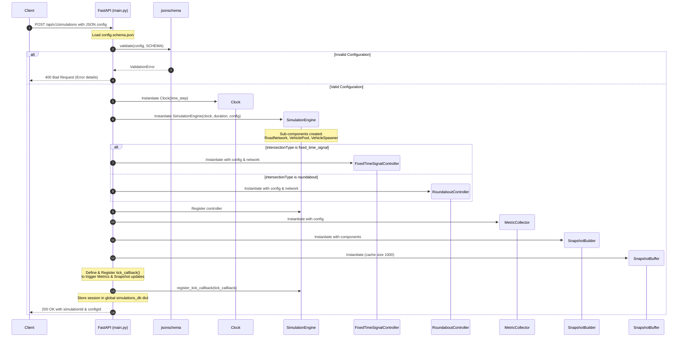

# Traffic Simulation Code Review Prep: Phase 1
## Simulation Request Lifecycle & Session Initialization

This guide explains how the backend starts, validates a simulation configuration, and spawns an isolated simulation session.

---

## 1. High-Level Architecture & Flow

When a client wants to run a traffic simulation, it submits a JSON configuration payload. The backend validates this configuration against a shared schema and constructs the simulation's object graph (the Engine, Clock, Road Network, Spawner, Pool, Intersection Controller, Snapshot Builder/Buffer, and Metric Collector).

Below is the execution sequence for configuring and initializing a new simulation session:



---

## 2. Key Components & Code Files

### A. [`backend/src/main.py`](file:///c:/VIRAJ/Internship/Traffic_Simulation_Project_1/backend/src/main.py)
* **Role**: The web application entry point (FastAPI). It coordinates HTTP request handling, validation, session storage, lifecycle management, and WebSocket streaming.
* **Key Global Variables**:
  * `simulations_db`: A dictionary (`Dict[str, Dict[str, Any]]`) that maps `simulation_id` to its respective instances:
    ```python
    simulations_db[sim_id] = {
        "engine": SimulationEngine,
        "collector": MetricCollector,
        "controller": FixedTimeSignalController | RoundaboutController,
        "config_id": config_id,
        "buffer": SnapshotBuffer
    }
    ```
    *Why?* Since FastAPI is stateless per request, storing this in a global registry allows subsequent calls (like starting, pausing, or polling metrics) to fetch the exact running engine instance using `sim_id`.

### B. [`shared/schemas/config.schema.json`](file:///c:/VIRAJ/Internship/Traffic_Simulation_Project_1/shared/schemas/config.schema.json)
* **Role**: The JSON Schema describing the structure, data types, and requirements of the simulation parameters (e.g., simulation duration, spawner rates, vehicle physics constants, geometry types, and signal phase durations).
* **Key Validation Aspects**:
  * Ensures coordinates, velocities, and rates are within logical bounds (non-negative).
  * Validates that critical objects like `geometry` and `simulation` contain all required properties.

---

## 3. Data Structures & Variables Flowing

During initialization, data flows as follows:

1. **Input Payload (`dict`)**: A standard python dictionary parsed from the request body.
2. **Schema Output**: True/False (raises a validation error if invalid).
3. **Configuration Sub-objects**:
   * `config["simulation"]["timeStep"]` (float) -> passed to [`Clock`](file:///c:/VIRAJ/Internship/Traffic_Simulation_Project_1/backend/src/core/clock.py)
   * `config["simulation"]["duration"]` (float/int) -> passed to [`SimulationEngine`](file:///c:/VIRAJ/Internship/Traffic_Simulation_Project_1/backend/src/core/engine.py)
   * `config["geometry"]["intersectionType"]` (string) -> decides whether to instantiate a fixed-time signal controller or a roundabout controller.
   * `config` and `engine.network` -> passed to the Controller constructor.

---

## 4. Senior Reviewer Questions & Defense

### Q1: "Why did you use `jsonschema` validation instead of Pydantic models for the entry-point validation?"
* **Defense**: 
  1. **Single Source of Truth**: The JSON schema is stored in the `shared/` directory. This allows the Frontend (written in TypeScript/JavaScript) to validate user input instantly in the browser using the same validation rules that the Backend enforces.
  2. **Interoperability**: If we migrated the frontend to a different framework or language, the JSON schema remains a language-agnostic standard.
  3. **Complementary Usage**: We *do* use Pydantic models (like `ScenarioConfiguration` and `ControlRequest`) to enforce runtime type safety and auto-generate OpenAPI/Swagger documentation, but the deep validation of configuration shapes uses the JSON Schema.

### Q2: "Isn't a global dictionary (`simulations_db`) problematic for horizontal scaling?"
* **Defense**:
  * Yes, in a multi-server production environment, a global in-memory dictionary would prevent horizontal scaling (since a request to pause a simulation might hit a server that doesn't hold the engine instance).
  * **However**, for this prototype/internship project, it is highly optimal because:
    1. It avoids the overhead of setting up external state coordination (like Redis or Celery workers).
    2. Keeping the engine loop in-memory is critical for real-time `0.1s` tick speed execution, avoiding database/I/O latency during the hot tick loop.
  * **Scaling path**: If we needed to scale, we would use sticky sessions, or offload simulation execution to a separate worker pool (e.g., Celery/Redis) and persist snapshots to a fast-access cache like Redis.

### Q3: "What is the purpose of the registered `tick_callback`?"
* **Defense**:
  * It decouples the engine's physics loop from the metric aggregation and state snapshotting logic.
  * The `SimulationEngine` only needs to know how to advance time and update physics; it doesn't need to know *how* snapshots are built or *how* metrics are aggregated. 
  * By passing a callback, we adhere to the **Single Responsibility Principle**. The callback collects signals state from the controller, calls `collector.update()`, and appends the built frame to the `SnapshotBuffer` at every physics step.
