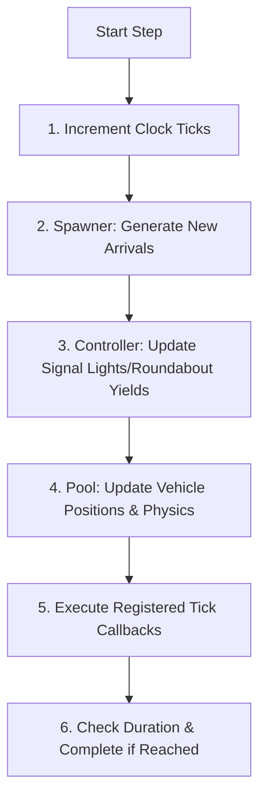

# Traffic Simulation Code Review Prep: Phase 2
## The Core Engine & Simulation Loop

This guide details how the [`SimulationEngine`](file:///c:/VIRAJ/Internship/Traffic_Simulation_Project_1/backend/src/core/engine.py) orchestrates discrete-time execution, controls thread concurrency, and guarantees sequence consistency.

---

## 1. The Time Management System ([`Clock`](file:///c:/VIRAJ/Internship/Traffic_Simulation_Project_1/backend/src/core/clock.py))

Discrete-time simulations must maintain strict control over virtual time progression.
* **State variables**:
  * `time_step`: duration of each frame in virtual seconds (typically `0.1s`).
  * `_ticks`: absolute count of steps executed.
  * `_elapsed_time`: total virtual time elapsed since start.
* **Anti-Drift Math**: 
  Instead of summing `self._elapsed_time += self.time_step` at each tick (which accumulates floating-point representation errors over time), the clock uses:
  ```python
  self._elapsed_time = self._ticks * self.time_step
  ```
  *Senior Tip:* Mentioning floating-point drift prevention shows a high level of numerical computing awareness.

---

## 2. Multi-Threaded Architecture & Concurrency

The simulation runs on a background thread so it does not block the FastAPI async event loop.

```
                  ┌──────────────────────────────────────────────┐
                  │            FastAPI Main Thread               │
                  │  (Handles Client HTTP/WS requests, Status)   │
                  └──────────────────────┬───────────────────────┘
                                         │
                        Start / Pause    │ (Thread Safe Signals)
                                         ▼
                  ┌──────────────────────────────────────────────┐
                  │          Background Worker Thread            │
                  │     Runs Simulation Loop (_run_loop)         │
                  └──────────────────────┬───────────────────────┘
                                         │
                             Ticks every Clock timeStep
                                         ▼
                           ┌───────────────────────────┐
                           │      Simulation Step      │
                           │  (Physics & State updates)│
                           └───────────────────────────┘
```

### Thread Safety Mechanics
* **Locking**: A `threading.Lock` (`self._lock`) protects state updates and status transitions (e.g. `start`, `pause`, `stop`, `step`).
* **Control Flag**: A `threading.Event` (`self._stop_event`) allows the web server thread to cleanly request the worker loop thread to terminate.
* **Joining**: When resuming or resetting, the calling thread joins the active thread (`self._thread.join()`) to ensure no race conditions where two background loops are running simultaneously.
* **Sim Rate Control**:
  To simulate real-time behavior (e.g. a `0.1s` step should take `0.1s` of real wall-clock time), the runner computes:
  ```python
  elapsed = time.time() - start_time
  sleep_time = max(0.0, self.clock.time_step - elapsed)
  time.sleep(sleep_time)
  ```
  If the physics updates take less than `0.1s`, the thread sleeps for the remainder. If they take longer, it runs as fast as possible (`sleep_time = 0`).

---

## 3. Detailed Anatomy of a Simulation Step (`step()`)

The sequence of operations within `step()` is critical. It is executed in this order:



1. **`clock.tick()`**: Virtual time moves forward.
2. **Spawner Step**: The [`VehicleSpawner`](file:///c:/VIRAJ/Internship/Traffic_Simulation_Project_1/backend/src/vehicles/spawner.py) evaluates probability rates for each approach and creates new vehicles, adding them directly to the [`VehiclePool`](file:///c:/VIRAJ/Internship/Traffic_Simulation_Project_1/backend/src/vehicles/pool.py).
3. **Controller Step**: The active traffic light or roundabout controller evaluates current vehicle distributions and updates signal lights or yielding priorities.
4. **Pool Step**: The `VehiclePool` calculates physics forces for all vehicles using the Intelligent Driver Model (IDM) and conflict point resolving algorithms.
5. **Callbacks**: Any external callbacks registered to the engine (like `SnapshotBuilder` and `MetricCollector` updating snapshot arrays) execute now.
6. **Stop Conditions**: The engine compares elapsed time to the configured duration to decide if it should transition to `COMPLETED`.

---

## 4. Senior Reviewer Questions & Defense

### Q1: "Why does the controller run BEFORE the vehicle physics update in the step execution sequence?"
* **Defense**: 
  * **Zero-Latency Response**: If the vehicles updated first, they would calculate their acceleration and braking based on the *previous* frame's signal states. 
  * If the light turns red in the current frame, we want vehicles to immediately react to it. Running the controller updates first ensures that the vehicle physics logic reads the *newest, correct* signal states for that frame.

### Q2: "Python has a Global Interpreter Lock (GIL). Why did you use `threading` instead of `multiprocessing` or `asyncio`?"
* **Defense**:
  * **Why not `asyncio`**: CPU-bound code (such as checking conflict points and running IDM physics equations for 50+ vehicles) in an `async` function would block the single-threaded event loop of FastAPI, causing HTTP request timeouts and freezing WebSocket streams.
  * **Why not `multiprocessing`**: The simulation states (roads, vehicle positions, conflict arrays) are highly interconnected object graphs. Sharing them across process boundaries requires expensive serialization/deserialization or complex shared memory arrays.
  * **Why `threading` works best here**: The physics simulation calculations are lightweight enough that they don't saturate a modern CPU core. Running it on a standard Python thread offloads it from the main FastAPI async thread, ensuring FastAPI remains highly responsive to incoming UI polling or controls, while keeping state sharing direct and low-overhead.

### Q3: "What happens if a step throws an unhandled exception inside the background loop thread?"
* **Defense**:
  * The background loop is wrapped in a `try...except` block inside `_run_loop`.
  * If an exception occurs, the engine logs the traceback using `logger.exception`, safely transitions the engine state to `SimulationStatus.ERROR`, notifies any registered status callbacks, and exits the loop.
  * This prevents the backend server from crashing and allows client queries to immediately see that the simulation has failed via status routes.
