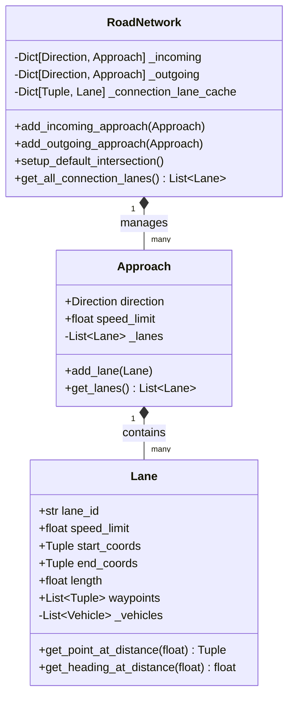

# Traffic Simulation Code Review Prep: Phase 3
## Road Network & Geometry Representation

This guide explains the spatial representation, coordinate mathematics, lane connectivity, and geometry configuration of the road network.

---

## 1. Structural Class Architecture

The road network topology is represented by three core classes located under [`backend/src/roads/`](file:///c:/VIRAJ/Internship/Traffic_Simulation_Project_1/backend/src/roads/):

---

## 2. Spatial Mapping & Coordinate System

### Coordinate Axes
* **Origin `(0, 0)`**: The geometric center of the intersection.
* **Orientation (Standard Math Cartesian)**:
  * Positive Y ($+Y$) points **North**.
  * Positive X ($+X$) points **East**.
  * Negative Y ($-Y$) points **South**.
  * Negative X ($-X$) points **West**.
* **Heading Degrees**:
  * $0^\circ$: North ($+Y$)
  * $90^\circ$: East ($+X$)
  * $180^\circ$: South ($-Y$)
  * $270^\circ$: West ($-X$)
  * Formula to translate standard math angles: `heading = (degrees(atan2(dx, dy)) + 360.0) % 360.0`

### Intersection Geometry Configurations

#### A. Standard Intersection Layout
* `approach_length` (e.g. `200m`) defines where roads end relative to the origin.
* Lanes have a defined width (default `3.5m`).
* **Lanes Spacing Calculation**:
  For an approach with $N$ lanes, the $i$-th lane's center is offset from the center axis by $(i + 0.5) \times \text{lane\_width}$.
  * *Incoming North Lane* (moves Southward): $x_i = -(i + 0.5) \times W_{\text{lane}}$.
  * *Outgoing North Lane* (moves Northward): $x_i = (i + 0.5) \times W_{\text{lane}}$.

#### B. Roundabout Geometry Layout
* Defined by `inner_radius` (radius of central island) and `outer_radius` (radius of roundabout circle).
* Incoming roads terminate at the `outer_radius` boundary instead of the intersection box.
* Circular lanes are modeled using multi-segment waypoints forming a circle/arc around `(0, 0)`.

---

## 3. Waypoint Interpolation Math in [`Lane`](file:///c:/VIRAJ/Internship/Traffic_Simulation_Project_1/backend/src/roads/lane.py)

For curved connection lanes (turns) or circular paths, straight lines are insufficient. A lane is defined by a list of 2D points: $[P_0, P_1, P_2, \dots, P_n]$.

### A. Point at Distance $d$ (`get_point_at_distance`)
To locate a vehicle that is $d$ meters along a lane:
1. Iterate through segments $[P_i, P_{i+1}]$ until the cumulative segment lengths cover $d$.
2. Compute the interpolation ratio $t$ for that specific segment:
   $$t = \frac{d - D_{\text{cum}}[i]}{D_{\text{cum}}[i+1] - D_{\text{cum}}[i]}$$
3. Linearly interpolate between the segment endpoints:
   $$x = x_i + t \cdot (x_{i+1} - x_i)$$
   $$y = y_i + t \cdot (y_{i+1} - y_i)$$

### B. Heading at Distance $d$ (`get_heading_at_distance`)
Instead of return static lane direction, it computes the local segment tangent angle:
$$\theta = \arctan2(x_{i+1} - x_i, y_{i+1} - y_i)$$
This makes vehicle headings rotate smoothly as they round curves on intersection turning arcs.

---

## 4. Senior Reviewer Questions & Defense

### Q1: "Why do turning connection lanes need to be cached and shared as singletons?"
* **Defense**:
  * **Leader Detection Dependency**: Our car-following logic (IDM) relies on knowing if another vehicle is ahead on the same lane.
  * If two vehicles are turning left from North to East, they must query the *exact same* `Lane` instance to see each other in `lane.get_vehicles()`. 
  * If each vehicle instantiated its own turn trajectory path, they would be invisible to each other, resulting in rear-end collisions inside the intersection.

### Q2: "How does the coordinates setup prevent vehicles from overlapping sideways during turns?"
* **Defense**:
  * Standard turn paths are generated based on the source lane index. 
  * A vehicle turning left from Lane 0 (outermost lane) maps to Lane 0 of the destination approach, while a vehicle in Lane 1 maps to Lane 1.
  * The Bezier control points are offset accordingly, ensuring concentric turning arcs that naturally maintain separation.
