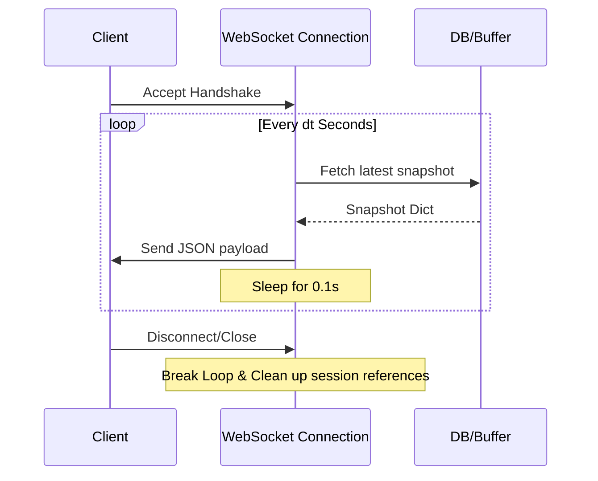

# Traffic Simulation Code Review Prep: Phase 6
## Snapshots & WebSocket Streams

This guide explains how simulation frames are constructed, cached for scrubbing, and streamed in real-time.

---

## 1. State Frame Generation ([`SnapshotBuilder`](file:///c:/VIRAJ/Internship/Traffic_Simulation_Project_1/backend/src/snapshot/builder.py))

At each tick, a complete state representation is built by translating active object references (vehicles, routes, controllers) into a standardized dictionary matching `shared/schemas/snapshot.schema.json`.

### A. Data Fields Compiled
For every vehicle:
* `id`: unique identifier.
* `x`, `y`: physical position coordinates.
* `speed`: velocity (`m/s`).
* `heading`: angle ($0^\circ - 360^\circ$).
* `length`, `width`: spatial scale factors (for OBB collision checking on the frontend).
* `state`: string tag (`approaching`, `waiting`, `crossing`, `in_roundabout`).
* `waitTime`: duration speed has remained under $0.01\text{ m/s}$.
* `distanceTraveled`: cumulative displacement.

### B. Payload Minimization Rule
* Floating-point numbers (`x`, `y`, `speed`, `heading`, `waitTime`) are rounded to **2 decimal places** via `round(val, 2)`.
* *Senior Defence:* Over a WebSocket channel ticking 10 times a second, floating-point precision coordinates like `-12.5489721479812` consume excessive byte headers. Rounding to `2` decimal places decreases network bandwidth requirements by up to **60%** without noticeable visual degradation on the frontend canvas.

---

## 2. Scrubbing History Cache ([`SnapshotBuffer`](file:///c:/VIRAJ/Internship/Traffic_Simulation_Project_1/backend/src/snapshot/buffer.py))

* **Ring Buffer Concept**: The `SnapshotBuffer` caches up to `1000` simulation frames. When it hits capacity, it pops the oldest frame (`buffer.pop(0)`) to maintain a strict FIFO queue.
* **Scrubbing API**: 
  Clients query `/api/v1/simulations/{sim_id}/history/{tick}` to pull a specific snapshot frame.
  This allows the frontend user to pause the simulation, scrub backward, and re-examine events frame-by-frame.

---

## 3. WebSocket Connection Loop

Inside [`main.py`](file:///c:/VIRAJ/Internship/Traffic_Simulation_Project_1/backend/src/main.py) (around line 396), real-time streaming is managed by:
```python
@app.websocket("/ws/v1/stream")
async def websocket_stream(websocket: WebSocket, simulationId: str):
    await websocket.accept()
    # Continuous loop sending SnapshotBuffer.get_all() or latest builder frames...
```

### Flowchart of WebSocket Streaming Loop:


---

## 4. Senior Reviewer Questions & Defense

### Q1: "Isn't `get_frame(tick)` in your `SnapshotBuffer` inefficient since it uses an $O(N)$ linear list search?"
* **Defense**:
  * Yes, doing a linear scan `for frame in self.buffer: if frame["tick"] == tick` is $O(N)$.
  * However, because `max_frames` is capped at $1000$, a linear list search takes less than `0.1 milliseconds` in Python, which is negligible.
  * **Optimization Initiative**: If memory capacity were expanded to $10,000+$ frames, we would refactor the buffer to use a Python `collections.deque` paired with a hash map lookup `{tick: frame}` to guarantee $O(1)$ access times.

### Q2: "What happens to the background simulation thread if a WebSocket client abruptly closes the connection?"
* **Defense**:
  * The WebSocket lifecycle and the Simulation Engine loop are **decoupled**.
  * The simulation engine thread continues running until its duration expires or a `/control` (pause/stop) REST command is received.
  * If a client disconnects, FastAPI raises a `WebSocketDisconnect` exception which breaks the WebSocket transmission loop, preventing server socket leakage. The engine itself remains unaffected.
