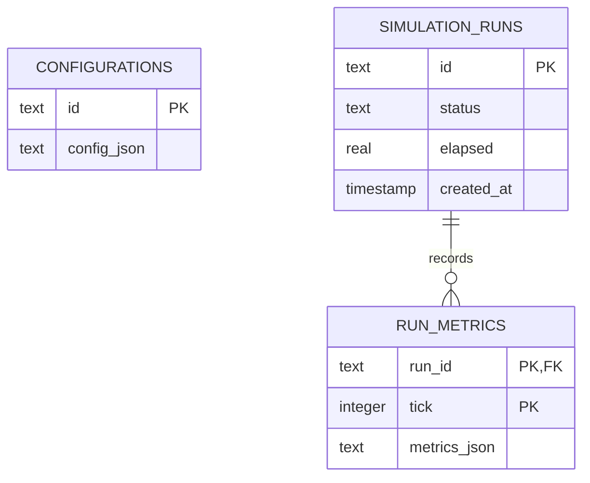

# Traffic Simulation Code Review Prep: Phase 7
## Metrics Collector & Persistent Database

This guide explains how physical simulation states are aggregated into key performance indicators (KPIs) and persisted inside SQLite.

---

## 1. Metrics Aggregation Pipeline ([`MetricCollector`](file:///c:/VIRAJ/Internship/Traffic_Simulation_Project_1/backend/src/metrics/collector.py))

Operational statistics are computed over discrete steps to gauge intersection efficiency.

### A. The Warmup Phase Filter
* The collector ignores data compiled during the `warmupTime` window (default `30s`).
* *Senior Defence:* A simulation starting with an empty network experiences a "transient phase" with zero queues and free-flow speeds. Including this transient phase in aggregate KPIs would bias results downwards (e.g. under-reporting average delay). Discarding warmup frames guarantees steady-state analysis.

### B. Core Traffic Metrics & Formulas

#### 1. Average Delay
$$\text{Delay} = T_{\text{actual}} - T_{\text{free\_flow}}$$
Where $T_{\text{free\_flow}} = \text{Route Length} / v_{\text{desired}}$. This represents the time lost due to queuing, signals, or leading vehicles.

#### 2. Fuel & Carbon Emissions
$$\text{Emission} = \sum_{v \in \text{vehicles}} \left( 0.05 \cdot v + 0.2 \cdot \max(0, a)^2 \right) \cdot dt$$
Emissions are modeled proportional to speed and the square of positive acceleration, capturing the high-energy cost of starting from stop lines.

#### 3. Directional Fairness (Jain's Fairness Index)
$$\mathcal{J}(x_1, x_2, \dots, x_n) = \frac{\left( \sum_{i=1}^n x_i \right)^2}{n \cdot \sum_{i=1}^n x_i^2}$$
Where $x_i$ represents the average wait time for approach direction $i$. A fairness score of $1.0$ indicates equal wait times for all directions; lower values highlight unequal green-time distribution.

#### 4. Queue Length Hysteresis
* A vehicle is flagged as "waiting" if its speed drops below `waitSpeedThreshold` (e.g. $0.5 \text{ m/s}$).
* It is removed from the queue list only when speed rises above `stopSpeedThreshold` (e.g. $0.1 \text{ m/s}$) to prevent queue flickering at low crawls.

---

## 2. Persistent Database Schema ([`db.py`](file:///c:/VIRAJ/Internship/Traffic_Simulation_Project_1/backend/src/database/db.py))

Metrics are persisted inside SQLite (`simulation.db`). The relational design consists of three tables:

### Table Schemas
1. **`configurations`**: Stores the scenario parameters configuration string.
2. **`simulation_runs`**: Records run metadata (status, duration, timestamp).
3. **`run_metrics`**: Maps a composite key `(run_id, tick)` to a JSON block `metrics_json`.
   * *Why composite?* Ensures one metric log frame per tick for a specific run.
   * *On Delete Cascade*: Dropping a row in `simulation_runs` automatically deletes thousands of related rows in `run_metrics` without orphaned data leaks.

---

## 3. Senior Reviewer Questions & Defense

### Q1: "Why do you store metrics inside SQLite as a single JSON blob instead of structured database columns?"
* **Defense**:
  * **Schema Flexibility**: In a development environment, traffic metric algorithms (like queue stability indexes or fairness metrics) evolve rapidly. If we mapped each metric to a traditional table column, every code addition would require writing database migration scripts (`ALTER TABLE`).
  * **Serialization Simplicity**: We convert the entire memory dictionary in a single `json.dumps()` call, resulting in write transactions that finish within microseconds, avoiding lock contentions during simulations.

### Q2: "SQLite has poor write concurrency. Why not PostgreSQL or MongoDB?"
* **Defense**:
  * **Zero Setup Overhead**: SQLite requires no installation, configuration, or background database servers, which is highly preferred for local developers and Docker container isolation.
  * **Adequate Performance**: Our simulation loop writes metrics from a single thread (sequential writes). Since there are no parallel concurrent writers, SQLite handles our sequential writes efficiently.
