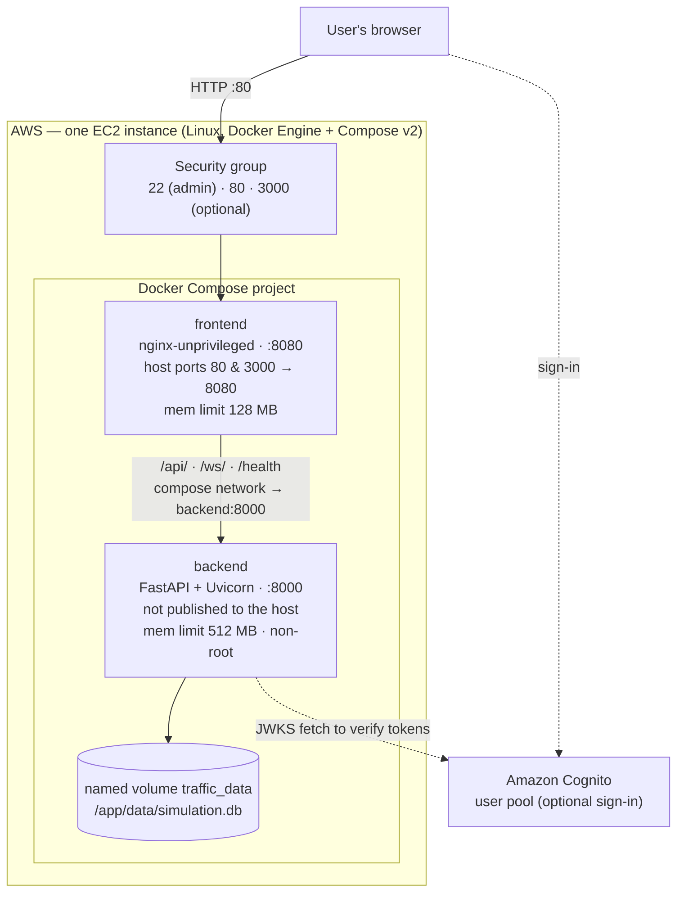
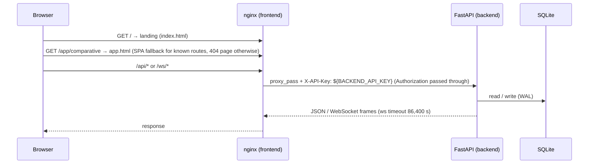

# Deployment & Operations

> **Status:** Current · V1.0 (AWS cloud deployment milestone) · verified against `docker-compose.yml`, `docker-compose.dev.yml`, `backend/Dockerfile`, `frontend/Dockerfile`, `frontend/templates/default.conf.template`, `start.ps1` and `backend/src/main.py`
> **Step-by-step runbook:** [AWS EC2 deployment runbook](AWS_FREE_TIER_DEPLOYMENT.md) · **Day-to-day behaviour:** [Operations guide](../operations.md)

---

## 1. Deployment architecture

UrbanFlow V1.0 runs as **two containers orchestrated by Docker Compose on a single Amazon EC2 instance**. There is no managed database, load balancer, CDN or container service in the checked-in configuration.



| Component | Image / runtime | Exposed | Health check |
| --- | --- | --- | --- |
| `frontend` | `nginxinc/nginx-unprivileged:1.31.5-alpine` serving the Vite production build | Host `${URBANFLOW_HTTP_PORT:-80}` and `${URBANFLOW_ALT_HTTP_PORT:-3000}` → 8080 | `wget http://127.0.0.1:8080/health` (proxied to the backend) every 15 s |
| `backend` | `python:3.11.16-slim-bookworm`, Uvicorn, runs as `appuser` | `expose: 8000` only (compose network) | `urllib.request.urlopen('http://localhost:8000/health')` every 15 s |
| Data | Named volume `traffic_data` (Compose project name prefixes it, e.g. `traffic-simulation_traffic_data`) | — | — |

The frontend waits for the backend to be **healthy** before starting (`depends_on: condition: service_healthy`). Both services restart `unless-stopped`.

---

## 2. Request path



---

## 3. Prerequisites

| Requirement | Notes |
| --- | --- |
| AWS account and one EC2 instance | The runbook uses Ubuntu on a `t2.micro`/`t3.micro`; size up if you run heavy studies |
| Docker Engine + Docker Compose v2 | `docker compose version` must work |
| Git | To clone the repository onto the instance |
| Security group | Inbound 80 (and 3000 if used); SSH 22 restricted to your IP |
| Swap (recommended on 1 GB instances) | Image builds on 1 GB of RAM need swap — see the runbook |
| Optional: Cognito user pool | `scripts/setup_cognito.py` provisions one (needs `boto3` and AWS credentials) |

---

## 4. Environment configuration

Compose reads variables from the shell or a `.env` file **in the repository root** (never commit it).

```ini
# .env (example — values are placeholders)
API_KEY=<long random hex, e.g. from: openssl rand -hex 32>
CORS_ORIGINS=http://<your-host>
STUDY_WORKERS=2
# GIT_COMMIT is best passed on the command line, see below
```

| Variable | Effect in production |
| --- | --- |
| `API_KEY` | Backend requires the key (`X-API-Key`) on mutating/compute routes; nginx injects it for proxied traffic and leaves the user's `Authorization` token untouched |
| `CORS_ORIGINS` | Only matters for cross-origin callers; browser traffic through nginx is same-origin |
| `STUDY_WORKERS` | Study worker processes. Unset = one per CPU (max 8). Each worker ≈ 40 MB; the backend container is capped at 512 MB |
| `GIT_COMMIT` | Commit recorded with saved runs (the image has no `.git`) |
| `URBANFLOW_HTTP_PORT` / `URBANFLOW_ALT_HTTP_PORT` | Host ports if 80/3000 are taken |
| Cognito (`COGNITO_USER_POOL_ID`, `COGNITO_CLIENT_ID`, `AWS_REGION` for the backend; `VITE_COGNITO_USER_POOL_ID`, `VITE_COGNITO_CLIENT_ID` for the frontend **at build time**) | Enables sign-in. The backend also reads `backend/.env` if present. `frontend/.dockerignore` excludes `.env` and `.env.local`, so supplying the Vite variables to the image build is a deployment decision. |

---

## 5. Deploy

```bash
git clone <repository-url>
cd Traffic-Simulation
# create .env as above
GIT_COMMIT=$(git rev-parse HEAD) docker compose up -d --build
docker compose ps
```

On Windows hosts, `.\start.ps1` does the same with change-aware rebuilds, port checks, health waits and a smoke test (see the [root README](../../README.md#windows-startps1)).

### Update

```bash
git pull
GIT_COMMIT=$(git rev-parse HEAD) docker compose up -d --build
```

Only images whose inputs changed are rebuilt; data in `traffic_data` is untouched.

---

## 6. Verify the deployment

| Check | Command | Expected |
| --- | --- | --- |
| Containers healthy | `docker compose ps` | both `running (healthy)` |
| Backend health via nginx | `curl -s http://<host>/health` | `{"status":"healthy"}` |
| Running code version | `curl -s http://<host>/api/version` | `{"gitCommit": "<sha>", "pythonVersion": "3.11.16"}` (`"unknown"` if `GIT_COMMIT` was not passed) |
| Landing page | open `http://<host>/` | "Signal or roundabout? Try both." |
| Dashboard routing | open `http://<host>/app/comparative` | Step 1 "Your junction" |
| Live stream | run a Quick look comparison | both maps animate; results page appears at 2:00 |
| Study workers | Research Lab → Statistical validation (5 seeds) | progress updates, then results |
| Persistence | `docker compose exec backend ls -l /app/data` | `simulation.db` (+ WAL files) |

`start.ps1 -SmokeTest` automates the equivalent checks against a local stack.

---

## 7. Operations

### Logs and resource use

```bash
docker compose logs -f backend
docker compose logs -f frontend
docker stats --no-stream
```

### Backup and restore

```bash
# backup (SQLite online copy via the backend container's Python)
docker compose exec backend python -c "import sqlite3; s=sqlite3.connect('/app/data/simulation.db'); d=sqlite3.connect('/app/data/backup.db'); s.backup(d); d.close()"
docker cp "$(docker compose ps -q backend)":/app/data/backup.db ./simulation-$(date +%Y%m%d).db
```

To restore, stop the stack, copy the file back into the volume as `simulation.db`, and start again. **`docker compose down -v` deletes the volume and every saved run.**

### Capacity planning

| Load | Behaviour |
| --- | --- |
| Live comparisons | Each running comparison is two engine threads in the backend process at real-time pace |
| Studies | ≤ 4 concurrent jobs; each fans out to `STUDY_WORKERS` processes; extra requests get 429 |
| Sessions | ≤ 100 live sessions; idle ones reclaimed after 30 min |
| Versioned simulations | ≤ 50 in memory |
| Memory caps | backend 512 MB, frontend 128 MB (Compose `deploy.resources.limits`) |

### Access control options

| Goal | Mechanism |
| --- | --- |
| Restrict who can reach the instance | Security-group source ranges (recommended for demos) |
| Password-protect the whole app | Mount an `auth_basic` config into `/etc/nginx/auth-gate/` ([operations guide](../operations.md#the-access-gate--who-may-use-the-demo)) |
| Protect the backend from anything that bypasses nginx | `API_KEY` |
| HTTPS | **Not configured** in the checked-in nginx template (it listens on 8080 only). Terminate TLS in front of the instance (e.g. a proxy or CDN) or add a TLS server block. |

---

## 8. Known operational issues

| Issue | Detail | Impact |
| --- | --- | --- |
| **Frontend image must be rebuilt after the 2026-10-05 key-header fix** | nginx now sends the key as `X-API-Key` instead of overwriting `Authorization`. An old frontend image with a new backend still works (the backend accepts the key as a bearer token and treats it as "no user"), but signed-in saving needs the new template. | `docker compose up -d --build` |
| **No HTTPS in-container** | See §7. | Browsers show the site as not secure unless TLS is terminated upstream. |
| **Versioned simulations and study jobs are in memory** | A restart drops them (persisted runs remain). | Expected; documented. |

---

## 9. Troubleshooting

| Symptom | Likely cause | Action |
| --- | --- | --- |
| `frontend` never becomes healthy | Backend unhealthy, so nginx `/health` fails | `docker compose logs backend`; the backend refuses to start if `shared/schemas/config.schema.json` is missing |
| Port 80 already in use | Another web server on the host | Set `URBANFLOW_HTTP_PORT` |
| Dashboard actions return 401 | `API_KEY` on the backend differs from `BACKEND_API_KEY` in nginx, or an expired/invalid sign-in token | Both come from the same `API_KEY` in Compose — recreate with `docker compose up -d`; sign in again |
| Saved runs show `gitCommitHash: "unknown"` | Built without `GIT_COMMIT` | Rebuild with `GIT_COMMIT=$(git rev-parse HEAD)` |
| Study returns 429 | 4 jobs already running | Wait for one to finish |
| Build killed on a 1 GB instance | Out of memory | Add swap (runbook step 2) or build images elsewhere |
| Old results "missing" after redeploy | Different Compose project name → different volume | `docker volume ls`; check the project directory name |

---

## 10. Development stack (for reference)

`docker-compose.dev.yml` (or `.\start.ps1 -Dev`) runs the **Vite dev server** on `:5173` and **Uvicorn `--reload`** on `:8000` with source bind-mounted, `DEV_AUTH_BYPASS=1` (signed in as "Local developer"), and its own volume `traffic_data_dev`. It is not a production configuration. Production and development share one Compose project name, so starting one replaces the other.
