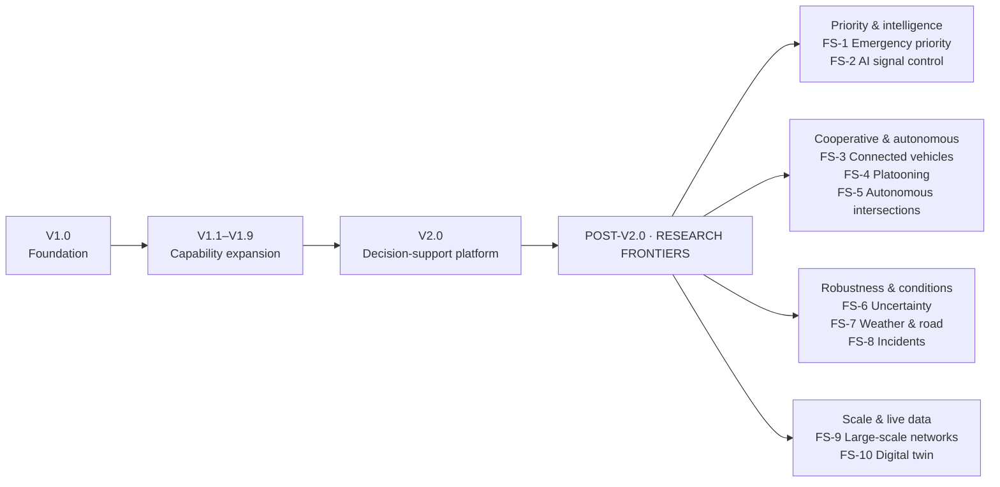

# Future Scope — Post-V2.0 Research Frontiers

> **This is the single authoritative Future Scope.** It replaces every earlier future-scope list in this repository.
> **Status:** 🔭 FUTURE SCOPE — none of these capabilities exist, and none are part of the V1.1–V2.0 roadmap.
> **Boundary rule:** a capability scheduled anywhere in [the roadmap](../ROADMAP.md) is **not** listed here. Where a frontier builds on a roadmap capability, only the genuinely new extension beyond V2.0 is described.

## Summary

| # | Frontier | Indicative effort | Builds on (roadmap, ≤ V2.0) | Genuinely new beyond V2.0 |
| ---: | --- | :-: | --- | --- |
| FS-1 | Emergency Vehicle Priority | 1–2 months | Vehicle types (V1.1), adaptive control (V1.3) | Priority vehicles, signal pre-emption, yielding/clearance, response metrics |
| FS-2 | AI-Based Traffic Signal Control | 2–3 months | Adaptive control (V1.3), batch experiments (V1.7) | Learning-based controllers trained in simulation |
| FS-3 | Connected Vehicle Communication | 2–3 months | Network foundations (V1.8/V1.9) | V2V/V2I messaging with latency, loss and imperfect information |
| FS-4 | Vehicle Platooning & Cooperative Driving | 2–3 months | Vehicle types (V1.1), lanes (V1.2) | Coordinated groups with cooperative longitudinal control |
| FS-5 | Autonomous Intersection Management | 3–4 months | Conflict management (V1.0), signals & roundabouts (V1.0–V1.4) | Reservation/negotiation-based, signal-free passage |
| FS-6 | Uncertainty & Robust Traffic Simulation | 2–3 months | Batch experiments (V1.7), calibration (V1.8/V1.9) | Probabilistic models of behaviour, demand and conditions; sensitivity and robustness reporting |
| FS-7 | Weather & Road-Condition Effects | 1–2 months | IDM and curve-speed model (V1.0) | Weather scenarios, friction and visibility effects |
| FS-8 | Incident & Disruption Simulation | 2–3 months | Lane model and routing (V1.2) | Crashes, blockages, closures, rerouting and recovery |
| FS-9 | Large-Scale Traffic Network Simulation | 3–6 months | Network-level foundations (V1.8/V1.9) | City-scale networks, corridors, congestion propagation |
| FS-10 | Digital Twin Integration | 4–6+ months | Real-world inputs and calibration (V1.8/V1.9) | Continuously updated, live representation of real junctions/networks |

Effort figures are indicative planning estimates, not commitments.

---

## FS-1 · Emergency Vehicle Priority

**Indicative effort:** 1–2 months

| | |
| --- | --- |
| **Core** | Ambulances · fire trucks · emergency vehicle priority · signal priority phases · surrounding vehicle yielding / clearance |
| **Value** | Emergency response analysis · traffic-control evaluation under emergency conditions · public-safety planning |
| **Deliverables** | Emergency vehicle models · priority logic · signal pre-emption · yield/clearance behaviour · emergency response metrics |
| **Boundary** | V1.1 introduces ordinary vehicle classes. Priority status, pre-emption and the behaviour of other road users towards an emergency vehicle are new here. |

## FS-2 · AI-Based Traffic Signal Control

**Indicative effort:** 2–3 months

| | |
| --- | --- |
| **Core** | Learning-based signal control · simulated training · DQN/PPO or other reinforcement-learning approaches · comparison against existing controllers |
| **Value** | AI traffic-optimisation research · identifying conditions where learning-based control helps · an intelligent traffic-control research platform |
| **Deliverables** | RL environment · training pipeline · trained controllers · policy evaluation · fixed-time vs adaptive vs AI comparison |
| **Boundary** | V1.3 delivers rule-based adaptive control. Learned policies and the training infrastructure are new here. |

## FS-3 · Connected Vehicle Communication

**Indicative effort:** 2–3 months

| | |
| --- | --- |
| **Core** | V2V · V2I · traffic/infrastructure information sharing · communication latency · imperfect information · cooperative decisions |
| **Value** | Connected-vehicle research · traffic-flow and safety analysis · intelligent transport research |
| **Deliverables** | V2V/V2I communication model · message system · communication delay/loss modelling · cooperative behaviour metrics |
| **Boundary** | Nothing in V1.0–V2.0 models communication between vehicles or with infrastructure. |

## FS-4 · Vehicle Platooning & Cooperative Driving

**Indicative effort:** 2–3 months

| | |
| --- | --- |
| **Core** | Vehicle groups · leader/follower behaviour · platoon formation · merging · splitting · coordinated acceleration/braking |
| **Value** | Road-capacity research · autonomous/cooperative vehicle research · fuel and traffic-flow analysis |
| **Deliverables** | Platoon controller · formation/merging logic · cooperative longitudinal control · stability analysis · throughput analysis |
| **Boundary** | Up to V2.0 every vehicle follows its own IDM; vehicles never coordinate. |

## FS-5 · Autonomous Intersection Management

**Indicative effort:** 3–4 months

| | |
| --- | --- |
| **Core** | Reservation/coordination-based intersection control · connected autonomous vehicles · negotiated intersection passage · crossing times and trajectories · conflict handling |
| **Value** | Signal-free intersection research · reduced stopping/delay investigation · future autonomous infrastructure research |
| **Deliverables** | Intersection reservation system · conflict-resolution algorithm · trajectory coordination · safety validation · performance comparison |
| **Boundary** | V1.0's `ConflictManager` reserves conflict zones *inside* signal and roundabout control. Replacing signals and give-way rules with negotiated passage is new here. |

## FS-6 · Uncertainty & Robust Traffic Simulation

**Indicative effort:** 2–3 months

| | |
| --- | --- |
| **Core** | Driver-behaviour uncertainty · demand uncertainty · reaction-time uncertainty · traffic-condition uncertainty · probabilistic scenarios · sensitivity analysis |
| **Value** | More robust planning conclusions · quantified confidence · reduced dependence on single scenarios |
| **Deliverables** | Uncertainty models · probabilistic scenario generation · sensitivity analysis · confidence/robustness reporting |
| **Boundary** | V1.0 repeats seeds and V1.7 runs scenario batches; V1.8/V1.9 calibrates. Modelling the *parameters themselves* as uncertain, and reporting robustness across that uncertainty, is new here. |

## FS-7 · Weather & Road-Condition Effects

**Indicative effort:** 1–2 months

| | |
| --- | --- |
| **Core** | Rain · fog · snow where applicable · reduced visibility · vehicle behaviour changes · road friction |
| **Value** | Adverse-condition analysis · robust infrastructure evaluation · improved real-world applicability |
| **Deliverables** | Weather scenarios · road-friction model · visibility effects · weather-aware analysis |
| **Boundary** | All roadmap versions assume dry, clear conditions. |

## FS-8 · Incident & Disruption Simulation

**Indicative effort:** 2–3 months

| | |
| --- | --- |
| **Core** | Crashes · blocked lanes · stalled vehicles · road closures · capacity reduction · rerouting · recovery |
| **Value** | Junction resilience · traffic-management analysis · emergency/contingency planning |
| **Deliverables** | Incident generator · lane/blockage modelling · rerouting behaviour · recovery-time metrics |
| **Boundary** | V1.2 adds lane changes and routing under normal operation. Injected disruptions, dynamic rerouting around them and recovery measurement are new here. |

## FS-9 · Large-Scale Traffic Network Simulation

**Indicative effort:** 3–6 months

| | |
| --- | --- |
| **Core** | Larger road networks · connected corridors · network interactions · congestion propagation |
| **Value** | City-scale planning experiments · network-level effects · larger infrastructure decisions |
| **Deliverables** | Scalable network engine · network routing · congestion propagation · large-scale performance analysis |
| **Boundary** | V1.8/V1.9 lays network-level *foundations*. Scaling to city-size networks with propagation analysis is new here. |

## FS-10 · Digital Twin Integration

**Indicative effort:** 4–6+ months

| | |
| --- | --- |
| **Core** | Continuously updated real-world traffic data · digital representation of real junctions/networks · predicted vs observed traffic · live scenario testing |
| **Value** | Operational planning · continuous monitoring · data-driven infrastructure decisions |
| **Deliverables** | Real-world data connectors · digital-twin model · continuous calibration · live scenario analysis · prediction-vs-observation dashboard |
| **Boundary** | V1.5 models real layouts and V1.8/V1.9 calibrates from real traffic inputs. A *continuously* synchronised, live model is new here. |

---

## Duplication check

Every V1.1–V2.0 scope item was compared with this list. None of the following appear here, because they are roadmap work: vehicle classes (V1.1) · multi-lane traffic and lane changes (V1.2) · adaptive signal control (V1.3) · multi-lane/spiral roundabouts (V1.4) · real-world junction layouts and a junction builder (V1.5) · safety proxies and fuel/emissions (V1.6) · scenario engine and batch experiments (V1.7) · calibration framework, real-world traffic inputs and network foundations (V1.8/V1.9) · integrated planner workflow (V2.0).
