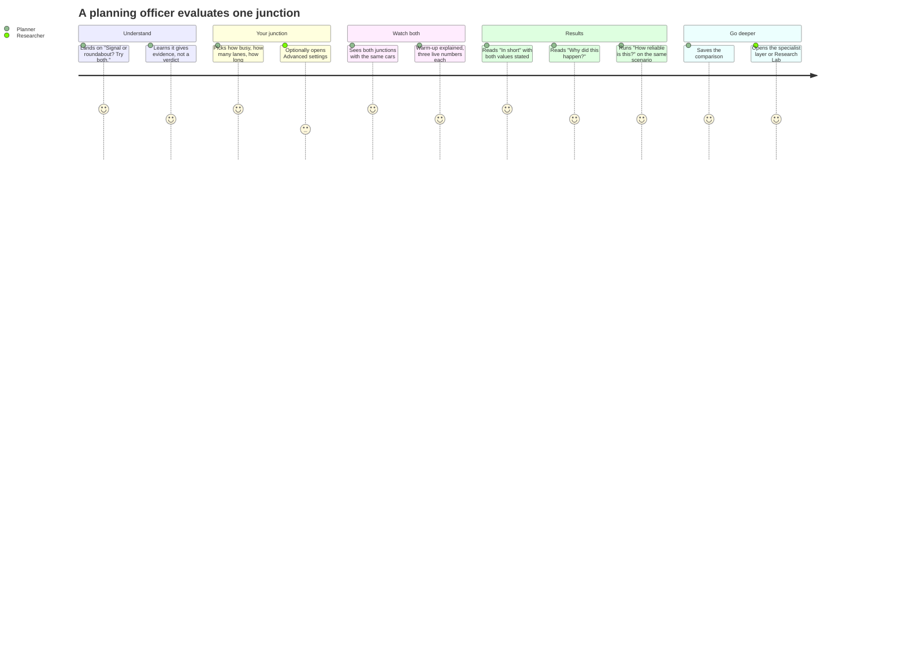
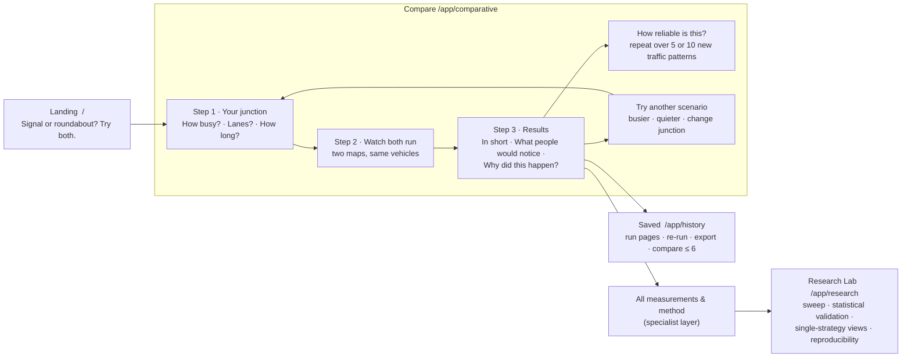
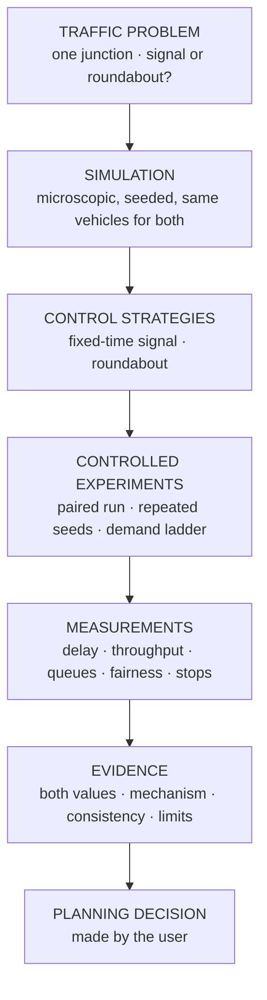

# UrbanFlow — Product Story

> **Status:** Current · V1.0 · describes the shipped experience (`frontend/src/landing/`, `frontend/src/components/guided/`, `frontend/src/components/ResearchHub.tsx`)
> **Detail documents:** [User narrative & information architecture](urbanflow-user-narrative.md) · [Evaluation metrics audit](urbanflow-evaluation-metrics.md)

---

## The problem

A junction is up for redesign. Someone has to decide — or explain a decision to a committee or to residents — whether it should be **signalised** or a **roundabout**. Opinions are loud; evidence specific to *this* junction, at *these* traffic levels, is scarce. Professional traffic-engineering tools exist, but they assume a traffic engineer at the keyboard.

## The answer

> **Signal or roundabout? Try both.**

UrbanFlow runs a fixed-time traffic signal and a roundabout **side by side on the same virtual junction, with exactly the same cars**, and explains in plain language how much time drivers lose, how much traffic gets through, how queues build, whether every direction is treated alike — **why** — and **how sure you can be**.

---

## Two principles

<table>
<tr>
<td width="50%" valign="top">

### EVIDENCE, NOT A VERDICT

UrbanFlow never declares a winner. It states both values, explains the mechanism, measures how consistent the difference is, and lists what the model does not capture. The decision stays with the person who owns it.

- No "wins", "best" or composite score in the main experience
- Every plain sentence quotes both numbers
- "About the same" when a difference is within tolerance
- Non-significant ≠ equal

</td>
<td width="50%" valign="top">

### SIMPLE BY DEFAULT, DEEP BY CHOICE

Three everyday questions start a comparison. Every metric, statistic, sweep, export and reproducibility record is still there — one deliberate step away, in the specialist layer and the Research Lab.

- Default path uses no traffic-engineering vocabulary
- "How is this measured?" on every card
- "All measurements & method" for specialists
- Research Lab keeps its full technical language

</td>
</tr>
</table>

---

## Who it is for

| | Primary persona | Secondary persona |
| --- | --- | --- |
| **Who** | Municipal planning officer / decision participant (not a traffic engineer). Councillors' staff, community representatives and students share the need. | Researcher, traffic engineer, technical reviewer |
| **Knows** | Roughly how busy the junction is, how many lanes, what waiting at lights or a roundabout feels like | IDM, gap acceptance, control delay, confidence intervals |
| **Needs** | A fair test, plain answers with the numbers visible, the reason behind them, an honest reliability check, stated limits | Every metric, repeated experiments, sweeps, exports, reproducibility |
| **Lives in** | Compare → Results | Specialist layer, Saved runs, Research Lab |

---

## The journey

### Information architecture

| Section | Route | Purpose |
| --- | --- | --- |
| Landing | `/` | What UrbanFlow is, who it is for, how it works, what you learn, the method |
| **Compare** (default) | `/app/comparative` | The three-step guided comparison |
| **Saved** | `/app/history` · `/app/runs/<id>` · `/app/compare?runs=…` | Saved comparisons and runs; provenance, re-run, exports, labels; compare up to six runs |
| **Research Lab** | `/app/research` | Hub plus `/app/volume` (traffic-level sweep), `/app/validation` (statistical validation), `/app/signal` and `/app/roundabout` (each strategy on its own) |

### The six layers of a result

| Layer | Where | Audience |
| --- | --- | --- |
| 1 · Answer | "In short", card lead sentences | Everyone |
| 2 · Evidence | Both values, bars, grades, bands | Everyone |
| 3 · Meaning | "How is this measured?" | Curious users |
| 4 · Reason & trust | "Why did this happen?", "How reliable is this?" | Everyone |
| 5 · Full data | "All measurements & method": every metric, charts, weighting, CSV | Specialists |
| 6 · Studies | Research Lab | Researchers |

---

## From traffic problem to planning decision

---

## Vocabulary: plain ↔ technical

| What the planner sees | What the researcher sees |
| --- | --- |
| How busy? (Light … Over capacity) | Arrival rate as a share of reference capacity (veh/s, veh/h) |
| Traffic pattern #N | Random seed |
| "The first 30 s are a warm-up while traffic builds up" | `warmupTime` = 30 s |
| Time lost per driver | Control delay (`averageDelay`) |
| Got through | Post-warm-up throughput (count) |
| Very even … Very uneven | Jain's fairness index bands |
| Consistent difference — unlikely to be luck | Welch's t-test, p < α |
| Small / medium / large gap | Cohen's d at 0.2 / 0.5 / 0.8 |
| Check reliability | Monte Carlo validation on the user's own scenario |

Full mapping: [Metrics reference §6](../research/metrics-reference.md#6-plain-language-map-guided-results).

---

## What the product deliberately does not do (V1.0)

- Pick a winner, or rank layouts with a composite score.
- Claim crash risk — surrogate safety measures stay in the specialist layer.
- Model a specific real junction, other vehicle types, adaptive signals or multi-lane roundabout circulation — see the [roadmap](../ROADMAP.md).
