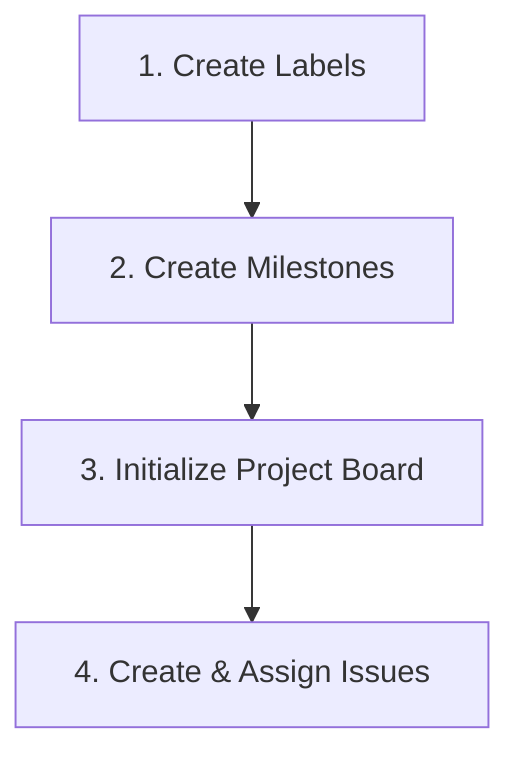

# GitHub Management Package: Project Deconstruction Reference

This document serves as the master database for importing and configuring the **Traffic Intersection Control Comparison Framework** project in GitHub. It contains a complete table of all 61 issues, their milestones, labels, assignees, and dependencies, followed by the recommended environment setup sequence.

---

## 1. Complete GitHub Issues Reference Table

The table below lists all issues in their recommended creation order to ensure dependencies are resolved correctly when logging tasks.

| Order | Issue ID | Title | Milestone | Labels | Assignee | Dependencies |
|-------|----------|-------|-----------|--------|----------|--------------|
| 1 | `ISSUE-001` | Root Repository Structure & CODEOWNERS | M1: Phase 0 | `component: shared`, `type: chore`, `priority: critical` | Both | None |
| 2 | `ISSUE-004` | Repository Architecture Document Updates | M1: Phase 0 | `docs: architecture`, `type: documentation`, `priority: high` | Both | ISSUE-001 |
| 3 | `ISSUE-007` | Backend Ruff, MyPy, and Pytest Configurations | M1: Phase 0 | `tech: python`, `type: chore`, `priority: high` | Backend | ISSUE-001 |
| 4 | `ISSUE-008` | Frontend ESLint, Prettier, and TypeScript | M1: Phase 0 | `tech: typescript`, `type: chore`, `priority: high` | Frontend | ISSUE-001 |
| 5 | `ISSUE-011` | Approach and Lane Geometry Data Entities | M2: Backend Core | `component: backend`, `type: feature`, `priority: high` | Backend | ISSUE-007 |
| 6 | `ISSUE-015` | Vehicle Entity Data Model | M2: Backend Core | `component: backend`, `type: feature`, `priority: high` | Backend | ISSUE-007 |
| 7 | `ISSUE-009` | Simulation Clock and Time Management | M3: Engine | `component: simulation`, `type: feature`, `priority: high` | Backend | ISSUE-007 |
| 8 | `ISSUE-010` | Simulation Engine Lifecycle and Tick Loop | M3: Engine | `component: simulation`, `type: feature`, `priority: critical` | Backend | ISSUE-009 |
| 9 | `ISSUE-012` | Road Network Graph Topology and Route Builder | M3: Engine | `component: simulation`, `type: feature`, `priority: high` | Backend | ISSUE-011 |
| 10 | `ISSUE-013` | Intelligent Driver Model (IDM) Physics Engine | M4: Logic/Phys | `component: simulation`, `type: feature`, `priority: critical` | Backend | ISSUE-007 |
| 11 | `ISSUE-018` | Intersection Geometry and Connectors | M4: Logic/Phys | `component: controller`, `type: feature`, `priority: high` | Backend | ISSUE-011 |
| 12 | `ISSUE-020` | Abstract BaseController Interface | M4: Logic/Phys | `component: controller`, `type: feature`, `priority: high` | Backend | ISSUE-010, ISSUE-017 |
| 13 | `ISSUE-021` | Fixed-Time Traffic Signal State Machine | M5: Strategies | `component: controller`, `type: feature`, `priority: critical` | Backend | ISSUE-009, ISSUE-020 |
| 14 | `ISSUE-014` | Lane Joining and Conflict Queue Traversal | M3: Engine | `component: simulation`, `type: feature`, `priority: high` | Backend | ISSUE-012, ISSUE-013 |
| 15 | `ISSUE-016` | Poisson Process Vehicle Spawner | M3: Engine | `component: simulation`, `type: feature`, `priority: high` | Backend | ISSUE-012, ISSUE-015 |
| 16 | `ISSUE-017` | Active Vehicle Pool Manager | M3: Engine | `component: simulation`, `type: feature`, `priority: critical` | Backend | ISSUE-014, ISSUE-015, ISSUE-016 |
| 17 | `ISSUE-019` | Conflict Zones and Collision Prevention | M4: Logic/Phys | `component: controller`, `type: feature`, `priority: critical` | Backend | ISSUE-012, ISSUE-013, ISSUE-018 |
| 18 | `ISSUE-022` | Fixed-Time Signal Head Stop-Line Constraints | M5: Strategies | `component: controller`, `type: feature`, `priority: critical` | Backend | ISSUE-014, ISSUE-021 |
| 19 | `ISSUE-023` | Modern Roundabout Yield Line and Entering | M5: Strategies | `component: controller`, `type: feature`, `priority: critical` | Backend | ISSUE-014, ISSUE-019, ISSUE-020 |
| 20 | `ISSUE-024` | Roundabout Circulating Speed and Splines | M5: Strategies | `component: controller`, `type: feature`, `priority: high` | Backend | ISSUE-015, ISSUE-023 |
| 21 | `ISSUE-025` | Centralized Controller Registry | M5: Strategies | `component: controller`, `type: refactor`, `priority: medium` | Backend | ISSUE-021, ISSUE-023 |
| 22 | `ISSUE-026` | Metrics Collector Framework and Warmup Filter | M6: Metrics | `component: metrics`, `type: feature`, `priority: high` | Backend | ISSUE-009, ISSUE-017 |
| 23 | `ISSUE-027` | Average Wait Time Calculator | M6: Metrics | `component: metrics`, `type: feature`, `priority: high` | Backend | ISSUE-015, ISSUE-026 |
| 24 | `ISSUE-028` | Throughput and Rolling Throughput Rate Tracker | M6: Metrics | `component: metrics`, `type: feature`, `priority: high` | Backend | ISSUE-017, ISSUE-026 |
| 25 | `ISSUE-029` | Approach Queue Length Statistics Calculator | M6: Metrics | `component: metrics`, `type: feature`, `priority: high` | Backend | ISSUE-011, ISSUE-026 |
| 26 | `ISSUE-030` | Stop Count Metric with Speed Hysteresis | M6: Metrics | `component: metrics`, `type: feature`, `priority: medium` | Backend | ISSUE-015, ISSUE-026 |
| 27 | `ISSUE-031` | Speed Variance and Travel Time Reliability | M6: Metrics | `component: metrics`, `type: feature`, `priority: medium` | Backend | ISSUE-017, ISSUE-026 |
| 28 | `ISSUE-032` | Idle Opportunity Loss and Fairness Index | M6: Metrics | `component: metrics`, `type: feature`, `priority: medium` | Backend | ISSUE-022, ISSUE-026, ISSUE-029 |
| 29 | `ISSUE-033` | Snapshot Builder and Serializer | M4: Logic/Phys | `component: shared`, `type: feature`, `priority: critical` | Backend | ISSUE-010, ISSUE-017, ISSUE-025, ISSUE-026 |
| 30 | `ISSUE-034` | Snapshot History Buffer | M4: Logic/Phys | `component: shared`, `type: feature`, `priority: high` | Backend | ISSUE-033 |
| 31 | `ISSUE-035` | FastAPI App Initialization and Middleware | M7: API Layer | `component: api`, `type: feature`, `priority: critical` | Backend | ISSUE-007 |
| 32 | `ISSUE-036` | Configuration Validation & Creation Endpoints | M7: API Layer | `component: api`, `type: feature`, `priority: critical` | Backend | ISSUE-006, ISSUE-010, ISSUE-035 |
| 33 | `ISSUE-037` | Simulation Lifecycle Control & Final Metrics | M7: API Layer | `component: api`, `type: feature`, `priority: critical` | Backend | ISSUE-026, ISSUE-036 |
| 34 | `ISSUE-038` | WebSocket Real-Time Snapshot Stream Route | M7: API Layer | `component: api`, `type: feature`, `priority: critical` | Backend | ISSUE-033, ISSUE-037 |
| 35 | `ISSUE-039` | Vite React TypeScript Project Initialization | M8: FE Found | `tech: react`, `type: chore`, `priority: high` | Frontend | ISSUE-008 |
| 36 | `ISSUE-040` | UI Design System Tokens and Layout Setup | M8: FE Found | `tech: tailwind`, `type: style`, `priority: high` | Frontend | ISSUE-039 |
| 37 | `ISSUE-041` | Frontend API Client Service | M8: FE Found | `tech: typescript`, `type: feature`, `priority: high` | Frontend | ISSUE-036, ISSUE-037, ISSUE-040 |
| 38 | `ISSUE-042` | Frontend WebSocket Client and Reconnects | M8: FE Found | `tech: typescript`, `type: feature`, `priority: critical` | Frontend | ISSUE-038, ISSUE-041 |
| 39 | `ISSUE-043` | HTML5 Canvas Viewport and Scale Handler | M9: Visuals | `component: visualization`, `type: feature`, `priority: high` | Frontend | ISSUE-040 |
| 40 | `ISSUE-044` | Road Network Geometry and Lane Overlay | M9: Visuals | `component: visualization`, `type: feature`, `priority: high` | Frontend | ISSUE-043 |
| 41 | `ISSUE-045` | Canvas Vehicle Renderer and Heading Rotation | M9: Visuals | `component: visualization`, `type: feature`, `priority: high` | Frontend | ISSUE-043 |
| 42 | `ISSUE-051` | Real-Time Charts Component Integration | M10: Dashboard | `component: visualization`, `type: feature`, `priority: high` | Frontend | ISSUE-040, ISSUE-042 |
| 43 | `ISSUE-052` | Metrics cards & Side-by-Side Comparison Layout | M10: Dashboard | `component: visualization`, `type: feature`, `priority: high` | Frontend | ISSUE-040, ISSUE-051 |
| 44 | `ISSUE-002` | Monorepo Schema Validator Script Setup | M1: Phase 0 | `component: shared`, `type: test`, `priority: high` | Shared | ISSUE-001 |
| 45 | `ISSUE-003` | Pre-commit Linting and Formatting Check | M1: Phase 0 | `component: shared`, `type: chore`, `priority: medium` | Both | ISSUE-001, ISSUE-002 |
| 46 | `ISSUE-005` | Communication Contract & API Spec Sync | M1: Phase 0 | `docs: api-spec`, `type: documentation`, `priority: critical` | Shared | ISSUE-001 |
| 47 | `ISSUE-006` | Metric Formulas Reference Sheet Sync | M1: Phase 0 | `docs: architecture`, `type: documentation`, `priority: high` | Both | ISSUE-001 |
| 48 | `ISSUE-046` | Client-Side Frame Interpolation Engine | M11: Integration | `component: visualization`, `type: feature`, `priority: high` | Frontend | ISSUE-042, ISSUE-045 |
| 49 | `ISSUE-047` | Playback Lifecycle Control Panel | M11: Integration | `component: visualization`, `type: feature`, `priority: high` | Frontend | ISSUE-041, ISSUE-046 |
| 50 | `ISSUE-048` | Playback Scrubbing and Timeline Slider | M11: Integration | `component: visualization`, `type: feature`, `priority: medium` | Frontend | ISSUE-034, ISSUE-047 |
| 51 | `ISSUE-049` | Scenario Configuration Form Builder | M11: Integration | `component: visualization`, `type: feature`, `priority: high` | Frontend | ISSUE-041 |
| 52 | `ISSUE-050` | Schema Validation Error Visualizer | M11: Integration | `component: visualization`, `type: feature`, `priority: medium` | Frontend | ISSUE-049 |
| 53 | `ISSUE-053` | IDM Physics Engine Pytest Suite | M12: Testing | `tech: python`, `type: test`, `priority: high` | Backend | ISSUE-013 |
| 54 | `ISSUE-054` | Backend End-to-End Simulation Run Pytest Suite | M12: Testing | `tech: python`, `type: test`, `priority: high` | Backend | ISSUE-010, ISSUE-017, ISSUE-026 |
| 55 | `ISSUE-055` | Vitest Frontend Component and Hook Tests | M12: Testing | `tech: react`, `type: test`, `priority: medium` | Frontend | ISSUE-039, ISSUE-047 |
| 56 | `ISSUE-056` | End-to-End API Integration Tests | M12: Testing | `tech: python`, `type: test`, `priority: high` | Backend | ISSUE-038, ISSUE-054 |
| 57 | `ISSUE-057` | Pydantic Model Serialization Optimization | M13: Perf/Deploy | `tech: python`, `type: perf`, `priority: medium` | Backend | ISSUE-033, ISSUE-054 |
| 58 | `ISSUE-058` | HTML5 Canvas Rendering Optimization | M13: Perf/Deploy | `tech: react`, `type: perf`, `priority: medium` | Frontend | ISSUE-045, ISSUE-046 |
| 59 | `ISSUE-059` | Multi-Stage Dockerfile Configurations | M13: Perf/Deploy | `tech: docker`, `type: chore`, `priority: medium` | Both | ISSUE-035, ISSUE-039 |
| 60 | `ISSUE-060` | Dashboard Reconnection Indicators and UI Polish | M14: Demo | `tech: tailwind`, `type: style`, `priority: medium` | Frontend | ISSUE-040, ISSUE-042 |
| 61 | `ISSUE-061` | Comparison Reports and Project Documentation | M14: Demo | `docs: user-guide`, `type: documentation`, `priority: critical` | Both | ISSUE-004, ISSUE-060 |

---

## 2. Recommended Setup Sequence

To boot up the GitHub workflow correctly, perform the following setup steps sequentially.



### Step 1: Create GitHub Labels
Define the labels in your repository settings first. You can use the **GitHub CLI** to script this step rapidly:

```bash
# Example script to create a few key labels
gh label create "component: backend" --color "1D3557" --description "Backend-specific Python components"
gh label create "component: frontend" --color "E76F51" --description "Frontend React components"
gh label create "component: shared" --color "2D6A4F" --description "Shared JSON contracts and schemas"
gh label create "type: bug" --color "D73A4A" --description "Something isn't working"
gh label create "type: feature" --color "0E8A16" --description "New functional additions"
gh label create "priority: critical" --color "B60205" --description "Blocks pipeline or runs"
```
*(Reference [labels.md](./labels.md) for the full list of names, descriptions, and Hex colors)*.

### Step 2: Create Milestones
Set up the milestones inside your GitHub Issues interface. This allows immediate mapping during issue creation.

1.  **M1: Phase 0 — Setup & Docs** (Target: End of Week 1)
2.  **M2: Backend Core** (Target: Middle of Week 2)
3.  **M3: Engine** (Target: End of Week 2)
4.  **M4: Logic/Phys** (Target: Middle of Week 3)
5.  **M5: Strategies** (Target: End of Week 3)
6.  **M6: Metrics** (Target: Middle of Week 4)
7.  **M7: API Layer** (Target: End of Week 4)
8.  **M8: FE Found** (Target: Middle of Week 5)
9.  **M9: Visuals** (Target: End of Week 5)
10. **M10: Dashboard** (Target: Middle of Week 6)
11. **M11: Integration** (Target: End of Week 6)
12. **M12: Testing** (Target: Middle of Week 7)
13. **M13: Perf/Deploy** (Target: End of Week 7)
14. **M14: Demo** (Target: End of Week 8)

### Step 3: Setup the GitHub Project Board
Create a new GitHub Project (Beta) linked to your repository.

1.  **Add Columns**: Customize the status field to: `1. Backlog`, `2. Ready`, `3. In Progress`, `4. In Review`, `5. In Testing`, `6. Done`.
2.  **Set WIP Limits**: Document active limits on `In Progress` (2 items) and `In Review` (2 PRs).
3.  **Configure Saved Views**: Save individual tabs with the appropriate filters (e.g. `is:open label:"component: backend"` for the Backend tab, grouped vertically by Milestone).

### Step 4: Create and Assign Issues
Create the issues sequentially following the **Order** column in the reference table above. 
*   **Avoid Dependency Blocks**: Do not set an issue to `Ready` or `In Progress` unless all dependencies in the **Dependencies** column are in the `Done` column.
*   **Assign Instantly**: Assign suggested roles (Backend, Frontend, Shared, Both) immediately to keep workspaces clear.
