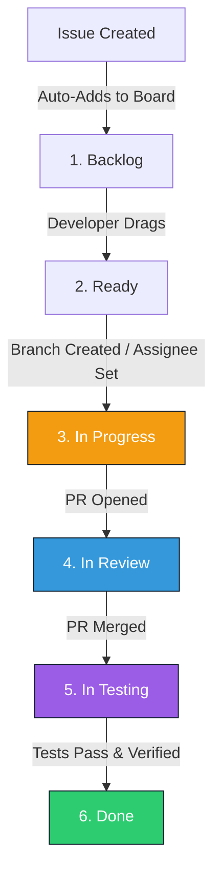

# GitHub Projects Kanban Board Workflow

This document details the **GitHub Projects Kanban Workflow** designed for the two-developer team (Developer A: Backend, Developer B: Frontend) building the **Traffic Intersection Control Comparison Framework**.

---

## 1. Board Columns
The project board consists of six sequential columns tracking work items from creation to release.

| Column | Purpose | Work-In-Progress (WIP) Limit |
|--------|---------|------------------------------|
| **1. Backlog** | Central registry of all open, prioritized requirements, spikes, and chores. | None |
| **2. Ready (Todo)** | Prioritized backlog items committed to the current sprint. | 8 Issues |
| **3. In Progress** | Active development. Code is actively being written on feature branches. | 2 Issues (1 per Developer) |
| **4. In Review** | Code complete. Pull Request is open, and code is undergoing peer review. | 2 PRs |
| **5. In Testing** | Merged to `develop`. Undergoing manual testing or running system tests. | 2 Issues |
| **6. Done** | Fully verified, documented, and integrated into `main`. | None |

---

## 2. Definitions of Gate Criteria

To maintain code quality and prevent incomplete work from drifting downstream, issues must pass strict exit/entry criteria at each column transition.

### 2.1 Definition of Ready (DoR)
An issue is transitioned from **Backlog** to **Ready** when:
*   [ ] Clear, singular **Description** and **Objective** are documented.
*   [ ] Detailed, testable **Acceptance Criteria** are written.
*   [ ] Technical dependencies are identified and resolved.
*   [ ] Estimation has been assigned (`XS`, `S`, `M`, `L`, `XL`).
*   [ ] Suggested Assignee and Milestones are set.
*   [ ] Labels (`type:`, `component:`, `priority:`) are attached.

### 2.2 Definition of In Progress
An issue enters **In Progress** when:
*   [ ] Developer assigns the issue to themselves.
*   [ ] A dedicated feature branch is created from `develop` following branch naming standards (e.g., `feature/BE-idm-physics`).
*   [ ] The issue status in GitHub Projects updates to "In Progress".
*   [ ] Work-In-Progress (WIP) limits are respected (no developer should have more than 1 active issue in progress).

### 2.3 Definition of Review (DoR-view)
An issue is ready for **In Review** when:
*   [ ] Code implementation is complete on the feature branch.
*   [ ] A Draft Pull Request is converted to "Ready for Review" against `develop`.
*   [ ] All automated pre-commit hooks and static analysis tools (Ruff, ESLint, Prettier, MyPy, TSC) pass locally.
*   *Shared Contract Exception*: If the PR touches the `shared/` directory, reviews must be requested from **both** developers. Otherwise, the owner of the respective folder conducts a self-review or requests advice.

### 2.4 Definition of Testing
An issue enters **In Testing** when:
*   [ ] The Pull Request is approved and merged into `develop`.
*   [ ] Automated unit and integration tests execute successfully.
*   [ ] The application builds and runs in a sandbox, staging, or container environment.

### 2.5 Definition of Done (DoD)
An issue is marked as **Done** when:
*   [ ] All acceptance criteria defined in the issue description are successfully verified.
*   [ ] User-facing documentation is updated to match the code changes.
*   [ ] No new regression bugs are identified.
*   [ ] The code is integrated into the stable release branch.

---

## 3. Automation and Issue Movement Rules
We utilize GitHub Actions and built-in Projects Workflows to automate status adjustments and limit administrative overhead.



### Automation Triggers:
1.  **Item Created**:
    *   *Trigger*: New issue is opened in the repository.
    *   *Action*: Automatically add to the **Backlog** column.
2.  **Item Assigned / Branch Created**:
    *   *Trigger*: An issue is assigned to a user or a branch containing the issue ID is pushed.
    *   *Action*: Move the issue card automatically to **In Progress**.
3.  **Pull Request Opened**:
    *   *Trigger*: A pull request referencing the issue (e.g., `Closes #12`) is opened.
    *   *Action*: Move the issue card to **In Review** and set status.
4.  **Pull Request Merged**:
    *   *Trigger*: The associated PR is merged into `develop`.
    *   *Action*: Move the issue card to **In Testing**.
5.  **Tests Pass / Manual Check Completed**:
    *   *Trigger*: Developer closes the issue manually or CI report triggers success.
    *   *Action*: Move the issue card to **Done**.

---

## 4. Board Visual Configurations

GitHub Projects supports multiple saved views, grouping filters, and swimlanes. These settings allow the two-developer team to filter noise and focus on their respective daily targets.

### 4.1 Swimlanes (Grouping)
*   **Epic Milestone Grouping**: The primary board view is grouped vertically by Milestones (e.g., `v0.2.0 — Backend Core`, `v0.3.0 — Frontend Core`). This keeps current sprint goals visible and pushes future work to bottom tiers.
*   **Priority Grouping**: During critical integration periods, swimlanes are switched to group by Priority (`priority: critical`, `priority: high`, etc.) to highlight blocking issues.

### 4.2 Saved Views and Filters
We configure 8 dedicated saved tabs on our GitHub Projects board:

```
┌────────────────────────────────────────────────────────────────────────────────────────┐
│ [Board]  [Priority View]  [Backend]  [Frontend]  [Docs]  [Blocked]  [Testing]  [Milestones] │
├────────────────────────────────────────────────────────────────────────────────────────┤
│                                                                                        │
│  Active View: Backend                                                                  │
│  Filter: state:open label:"component: backend", "component: simulation"                │
│  Group by: Milestone                                                                   │
│                                                                                        │
└────────────────────────────────────────────────────────────────────────────────────────┘
```

#### 1. Priority View
*   **Purpose**: Highlight urgent issues and active blockers.
*   **Filter Query**: `state:open sort:priority-desc`
*   **Grouping**: Swimlanes grouped by `priority`.
*   **Visual Layout**: Kanban board.

#### 2. Backend View
*   **Purpose**: Developer A's active dashboard, focusing only on Python, physics, and APIs.
*   **Filter Query**: `state:open label:"component: backend", "component: simulation", "component: api", "component: controller"`
*   **Grouping**: Grouped vertically by Milestone.
*   **Visual Layout**: Kanban board.

#### 3. Frontend View
*   **Purpose**: Developer B's active dashboard, focusing on React, Canvas, and CSS.
*   **Filter Query**: `state:open label:"component: frontend", "component: visualization"`
*   **Grouping**: Grouped vertically by Milestone.
*   **Visual Layout**: Kanban board.

#### 4. Documentation View
*   **Purpose**: Track architecture guides, API spec synchronizations, and reports.
*   **Filter Query**: `label:"scope: docs", "type: documentation"`
*   **Grouping**: Grouped by Status.
*   **Visual Layout**: List view.

#### 5. Blocked View
*   **Purpose**: Highlight bottlenecks and stalled tasks.
*   **Filter Query**: `state:open label:"status: blocked"`
*   **Grouping**: Grouped by Assignee.
*   **Visual Layout**: Kanban board.

#### 6. Testing View
*   **Purpose**: Quality assurance pipeline tracking.
*   **Filter Query**: `state:open status:"In Testing" or label:"type: test"`
*   **Grouping**: Grouped by Milestone.
*   **Visual Layout**: Kanban board.

#### 7. Roadmap Timeline View
*   **Purpose**: High-level milestone planning.
*   **Filter Query**: `*`
*   **Grouping**: Grouped by Milestone.
*   **Visual Layout**: Timeline (Gantt chart) mapping milestone start and target dates.

#### 8. Technical Debt View
*   **Purpose**: Keep track of refactoring tasks and cleanup work.
*   **Filter Query**: `state:open label:"type: technical-debt", "type: refactor"`
*   **Grouping**: Grouped by Priority.
*   **Visual Layout**: List view.

---

## 5. Category Mapping
This table maps every issue category (from our 22 categories) to the appropriate workflow layout and view.

| Category | Default Board View | Default Priority | Primary Assignee |
|----------|--------------------|------------------|------------------|
| **Repository Setup** | Priority View | Critical | Both |
| **Documentation** | Documentation View | High | Both |
| **Backend Foundation** | Backend View | High | Backend |
| **Simulation Engine** | Backend View | High | Backend |
| **Vehicle System** | Backend View | High | Backend |
| **Road Network** | Backend View | Medium | Backend |
| **Intersection Logic** | Backend View | High | Backend |
| **Traffic Controllers** | Backend View | Critical | Backend |
| **Metric Engine** | Backend View | Medium | Backend |
| **Snapshot Engine** | Backend View | High | Backend |
| **API Layer** | Backend View / Frontend View | Critical | Both |
| **Frontend Foundation** | Frontend View | High | Frontend |
| **Visualization** | Frontend View | High | Frontend |
| **Charts** | Frontend View | Medium | Frontend |
| **Dashboard** | Frontend View | High | Frontend |
| **Scenario Configuration** | Frontend View / Backend View | Medium | Both |
| **Playback Controls** | Frontend View | High | Frontend |
| **Testing** | Testing View | High | Both |
| **Integration** | Priority View | Critical | Both |
| **Performance** | Testing View | Medium | Both |
| **Deployment** | Priority View | Medium | Both |
| **Documentation Improvements** | Documentation View | Low | Both |

---

## 6. Workflow Design Rationale

### 6.1 Strict WIP Limit of 1 per Developer (In Progress)
*   *Reasoning*: In a small two-developer team, context switching is the greatest performance killer. If a developer has three issues "In Progress" simultaneously, tasks remain half-finished, pipelines stall, and merge conflicts compound. Restricting active work to a single issue per developer forces focus and ensures issues are brought to completion before new ones are started.

### 6.2 Separating "In Review" from "In Testing"
*   *Reasoning*: Code review (PR approval) checks the structural and stylistic quality of the code before it is merged into the integration branch (`develop`). Testing checks the runtime behavioral safety of the application after integration. Separating these columns prevents broken code from polluting the integration branch and makes it clear whether an issue is waiting for a peer review or running verification test scripts.

### 6.3 CODEOWNERS & Shared Directory Gate
*   *Reasoning*: Changes to `shared/` contracts immediately affect both layers. If Developer A modifies a schema unilaterally, Developer B's frontend compiler will crash on their next pull. Enforcing double-approval automation on the shared directory protects the team from unexpected breaking changes.

### 6.4 The List View for Tech Debt and Docs
*   *Reasoning*: Kanban boards are optimal for tracking active development flow but are poor for reviewing long backlogs of documentation tasks or minor refactoring ideas. Using a structured list view sorted by priority for tech debt and documentation tasks prevents the main Kanban board from becoming cluttered, while ensuring these tasks are not forgotten during sprint planning.
