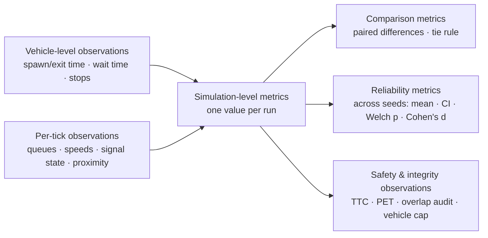

# Metrics Reference

> **Status:** Current · V1.0 · every metric listed here is emitted by `MetricCollector.get_metrics()` (`backend/src/metrics/collector.py`) or by the study layer (`backend/src/study/`). Nothing on this page is computed in the browser.
> **Deeper audit:** [UrbanFlow evaluation metrics — audit and authoritative reference](../product/urbanflow-evaluation-metrics.md) (formulas, chart inventory, validity findings) · [07 — Metric contract](../architecture/07-metric-contract.md)

---

## How to read this page

**Conventions that apply to almost every metric**

| Convention | Rule |
| --- | --- |
| Warm-up | Only vehicles that **exit after** `warmupTime` (or spawn after it) and ticks **after** it are counted. Vehicles active at the boundary have their pre-warm-up wait and stops subtracted. |
| "Queued" | A vehicle on an **incoming** lane with speed `< waitSpeedThreshold` (0.5 m/s). |
| "Stop" | Speed drops below `stopSpeedThreshold` (0.1 m/s); another stop needs a recovery above 0.2 m/s first (hysteresis). |
| No data yet | Most metrics report their best-case value (0 delay, fairness 1.0) until a vehicle exits; the UI shows "—" instead. `masterEfficiencyScore` returns `null`. |
| Authority | The backend is the only place metrics are computed; live panels, saved runs, studies and exports all read the same dictionary (ADR-005). |

Units: s = seconds · veh = vehicles (count) · m/s · m² · — = dimensionless.

---

## 1. Vehicle-level quantities

Tracked per vehicle (`backend/src/vehicles/vehicle.py`) and aggregated into the run-level metrics below. They also appear in every snapshot's `vehicles[]`.

| Field | Definition | Unit |
| --- | --- | --- |
| `waitTime` | Accumulated time with speed below the wait threshold | s |
| `stopCount` | Number of hysteresis stops | count |
| `spawnTime` / `exitTime` | Simulation time of entry / exit | s |
| Control delay (internal) | `(exit − max(spawn, warmup)) − free-flow time`, where free-flow time = route length ÷ desired speed (scaled for vehicles that spawned during warm-up); floored at 0 | s |

---

## 2. Simulation-level metrics

### 2.1 Delay and waiting

| Metric | Definition & calculation | Unit | Interpretation | Limitations | Used in |
| --- | --- | --- | --- | --- | --- |
| `averageDelay` | Mean control delay over post-warm-up exited vehicles | s | Time lost per driver compared with driving the same route at desired speed. **Primary efficiency measure.** | Includes geometric slowing (curves, roundabout entry speed), not only waiting | Guided "time lost", HCM grade; sweeps; Monte Carlo; reproduction check |
| `medianDelay`, `minDelay`, `maxDelay` | Order statistics of the same delays | s | Typical / best / worst driver | Max is noisy | Specialist table |
| `p95Delay` | 95th percentile (linear interpolation) | s | "1 in 20 drivers lost more than …" | Unstable with < 20 vehicles (UI warns) | Guided card; specialist |
| `delayStdDev` | Sample standard deviation of delays | s | Spread of driver experience | — | Specialist |
| `averageWaitTime` | Mean post-warm-up **queued** time per exited vehicle | s | Time actually spent stopped or crawling | Differs from delay by design; shown only in the specialist layer to avoid two "wait" numbers | Specialist; `masterEfficiencyScore` input |

### 2.2 Throughput and demand

| Metric | Definition & calculation | Unit | Interpretation | Limitations | Used in |
| --- | --- | --- | --- | --- | --- |
| `throughput` | Count of post-warm-up exited vehicles | veh (count) | "Got through in the measured time" | A count, not a rate — depends on run length | Guided card; sweeps; Monte Carlo |
| `throughputRate` | Exits in the last 60 s (post-warm-up) ÷ window × 60 | veh/min | Current discharge rate | Rolling window; early values unstable | Live charts; composite input |
| `activeVehicleCount` | Vehicles still on the network now | veh | Backlog when the clock stopped — growth signals over-saturation | Instantaneous | Guided "falling behind" reading |
| `totalVehiclesSpawned` | All vehicles generated since t = 0 | veh | Offered demand admitted | **Not** warm-up filtered | Specialist; integrity |
| `vehicleLimit`, `vehicleLimitReached` | Generation cap and whether it was hit | veh / bool | If true, demand after that moment was truncated | — | Trust notes; Monte Carlo `vehicleLimitReachedSeeds`; sweep "inconclusive" |
| `criticalSaturationVolume` | If observed rate < configured rate: observed rate; else `λ × throughput / post-warm-up spawned` | veh/s | Rough estimate of the volume at which the junction saturates | Simplified; weak estimator | Specialist |

### 2.3 Queues and congestion

| Metric | Definition & calculation | Unit | Interpretation | Limitations | Used in |
| --- | --- | --- | --- | --- | --- |
| `averageQueueLength` | Mean over the four approaches of each approach's time-averaged queue | veh | "Typical queue on one approach" | Counts queued vehicles, not metres | Guided card; Monte Carlo |
| `maxQueueLength` | Largest single-approach queue seen | veh | Worst back-up | Extreme value, noisy | Guided card |
| `currentQueueLengths` | Queue per approach this tick | veh | Live map/labels | Instantaneous | Snapshots |
| `activeAverageQueueLength` | Mean total queue over ticks where any queue existed | veh | Queue size *when* there is one | — | Specialist |
| `queueStdDev` | Sample SD of total queue across ticks | veh | Queue volatility | — | Specialist |
| `queueStabilityIndex` | `queueStdDev ÷ mean total queue` | — | Coefficient of variation of the queue | Undefined → 0 when mean is 0 | Specialist |
| `congestionRecoveryTime` | Post-warm-up time with **more than 5** vehicles queued in total | s | "Time congested" | Threshold is fixed | Guided card |

### 2.4 Driver experience and flow quality

| Metric | Definition & calculation | Unit | Interpretation | Limitations | Used in |
| --- | --- | --- | --- | --- | --- |
| `averageStopsPerVehicle` | Mean post-warm-up stops per exited vehicle | stops | Stop-and-go burden | — | Guided card + "why" lines |
| `totalStops` | Sum of the same | stops | — | Scales with throughput | Specialist |
| `speedVarianceIndex` | Time-average of per-tick coefficient of variation of active-vehicle speeds (ticks with ≥ 2 vehicles) | — | Smoothness of flow | Mixes approaching and queued vehicles | Specialist |
| `averageTravelSpeed` | Mean speed of vehicles active **now** | m/s | Current pace on the network | Instantaneous; not warm-up filtered | Live specialist |
| `travelTimeReliability` | Planning Time Index: 95th-percentile ÷ median travel time of exited vehicles | — | 1.0 = every trip took the median time | `null` if the median is 0; flagged unreliable below 20 vehicles | Specialist; low-sample flag drives a guided caution |
| `travelTimeReliabilityLowSampleSize` | `true` when fewer than 20 vehicles informed the PTI | bool | Read the PTI and p95 with care | — | Guided trust notes |

### 2.5 Fairness and control efficiency

| Metric | Definition & calculation | Unit | Interpretation | Limitations | Used in |
| --- | --- | --- | --- | --- | --- |
| `directionalFairnessIndex` | Jain's index over the per-approach **mean wait** of post-warm-up exited vehicles: `(Σx)² / (n·Σx²)`; approaches with no vehicles are excluded | 0–1 | 1 = every direction waited the same | Insensitive when all waits are near zero | Guided bands: Very even ≥ 0.95 · Mostly even ≥ 0.85 · Uneven ≥ 0.70 · Very uneven |
| `idleOpportunityLoss` | Share of post-warm-up ticks where an approach on red had queued vehicles while every green approach had none | 0–1 | Green shown to an empty road while others waited | **Signal only**; structurally 0 at a roundabout | Guided "why" line (shown when ≥ 5 %); composite input |
| `intersectionUtilization` | Share of post-warm-up ticks with vehicles present in which their mean speed exceeded the wait threshold | % | How often the network was moving rather than standing | Coarse | Specialist |
| `spaceFootprintConsumed` | Roundabout: `π · outerRadius²`; signal: `(2 · lanes · laneWidth)²` | m² | Land the junction box occupies | Geometric formula, not a design footprint | Specialist |

### 2.6 Composite (specialist only)

| Metric | Definition | Unit | Rule |
| --- | --- | --- | --- |
| `masterEfficiencyScore` | Fixed-weight composite of throughput rate (+30), average wait (−25), stops per vehicle (−15), fairness (+20), idle-green loss (−10), normalised to 0–100 | 0–100 | Valid only for comparing runs of the **same** geometry. Never shown signal-vs-roundabout side by side, because idle-green loss is signal-only and the throughput term is normalised to a fixed ceiling. `null` until a vehicle has exited. |

The specialist layer also offers a **user-weighted scoring panel** (`WeightedScoringPanel.tsx`), hidden until warm-up is over. It is an exploration aid, not a verdict.

---

## 3. Safety and integrity observations

These are **measurements of the model**, not predictions of real-world crash risk.

| Metric | Definition | Unit | Interpretation | Limitations |
| --- | --- | --- | --- | --- |
| `collisionCount` | Debounced overlap events from the post-update audit (oriented bounding boxes, Separating Axis Theorem); a contact persisting over consecutive ticks counts once | events | **Model-integrity check.** Should be 0 in the calibrated comparison. Shown as a caution, never as "crash risk". | Counts since t = 0 (not warm-up filtered) |
| `minTTC`, `ttcEventCount`, `ttcSampleCount`, `ttcThresholdSeconds` | Constant-velocity time-to-collision between nearby vehicle pairs (circle envelopes); events where TTC ≤ 1.5 s | s / count | Exploratory proximity measure | Literature-default threshold, not validated here; `minTTC = null` means no observations, not zero risk |
| `minPET`, `petEventCount`, `petSampleCount`, `petThresholdSeconds`, `petApplicable` | Post-encroachment time at pre-computed conflict points; events where PET ≤ 5 s | s / count | Exploratory | **Signal geometry only** (`petApplicable = false` on roundabouts — "not measured", not "no conflicts") |

Surrogate safety measures are deliberately absent from the plain-language layer, which states that crash risk is not modelled. Validated safety proxies are [V1.6](../ROADMAP.md#v16--safety--environmental-analysis) scope.

---

## 4. Comparison metrics

| Output | Produced by | Definition | Notes |
| --- | --- | --- | --- |
| Paired values | Guided results | Each metric for signal and roundabout from the same seed | Both values always stated |
| "About the same" | `plainLanguage.ts` (`SIMILARITY`), `study/tolerances.py` | A gap counts only if it exceeds both an absolute and a relative tolerance — delay 1 s / 5 %, vehicles 3 / 2 %, queue 0.5 veh / 10 %, stops 0.1 / 10 %, fairness 0.03 | Presentation rule, not a significance test |
| HCM-style grade | `LOS_THRESHOLDS` | Delay bands — signal A ≤ 10, B ≤ 20, C ≤ 35, D ≤ 55, E ≤ 80 s; roundabout A ≤ 10, B ≤ 15, C ≤ 25, D ≤ 35, E ≤ 50 s | Labelled indicative |
| Run comparison | `POST /api/v1/study/history/runs/compare` | `delayDelta`, `delayDeltaPercent`, `throughputDelta`, `queueDelta`, `stopsDelta`, `winner` (lower mean delay or `tie`), `identicalSeed` | `winnerBasis` states it is descriptive only |
| Sweep tier outcome | `study/volume_sweep.py` | Per tier: `signal` / `roundabout` / `tie` / `inconclusive` (fewer than 20 vehicles served on either side, or vehicle cap reached) | One seed per tier |
| Delay crossover | `find_delay_crossover()` | The first pair of adjacent *decided* tiers whose lower-delay side differs → `crossoverBracketArrivalRates` | A bracket, never interpolated |

---

## 5. Reliability and repetition metrics

Produced by Monte Carlo validation (`study/validation.py`) for **delay** (`averageDelay`), **throughput** (count) and **average queue** (`averageQueueLength`), per strategy and as a comparison:

| Output | Definition |
| --- | --- |
| `seeds`, `numSeeds` | Fresh random seeds drawn for this study (recorded; not user-settable) |
| `mean`, `std` | Mean and sample SD across seeds |
| `ci`, `ciConfidence`, `ciDegreesOfFreedom`, `ciCriticalValue` | Two-sided Student-t half-width at the requested level (0.90 / 0.95 / 0.99) |
| `ci95` | The 95 % half-width, always included |
| `pValue`, `degreesOfFreedom` | Welch two-sample t-test (unpaired, two-sided) |
| `cohensD` | Pooled-SD effect size; **positive = signal higher** |
| `significant` | `pValue < α`, α = 1 − confidence level |
| `calibration` | Whether the scenario is the calibrated one-lane comparison |
| `vehicleLimitReachedSeeds` | Seeds whose demand was truncated |

The three metrics are tested separately with **no multiple-comparison correction**. In the guided layer these become: "Consistent difference — unlikely to be luck (p = …)" or "not consistent enough to rule out chance", and an effect size described as small / medium / large (Cohen's 0.2 / 0.5 / 0.8).

---

## 6. Plain-language map (guided results)

| Guided question | Metrics behind it |
| --- | --- |
| How much time do drivers lose? | `averageDelay`, `p95Delay`, grade |
| How much traffic gets through? | `throughput`, `activeVehicleCount` |
| How long do queues get? | `averageQueueLength`, `maxQueueLength`, `congestionRecoveryTime` |
| Is every direction treated alike? | `directionalFairnessIndex` (bands) |
| Why did this happen? | signal timings, `idleOpportunityLoss`, `averageStopsPerVehicle`, backlog |
| How reliable is this? | warm-up and sample notes, `travelTimeReliabilityLowSampleSize`, `collisionCount`, `vehicleLimitReached`, Monte Carlo outputs |

The authoritative mapping lives in `frontend/src/metrics/plainLanguage.ts`; every displayed metric is described once in `frontend/src/metrics/catalog.ts`, and a test fails if the backend emits a metric the catalog does not describe.
