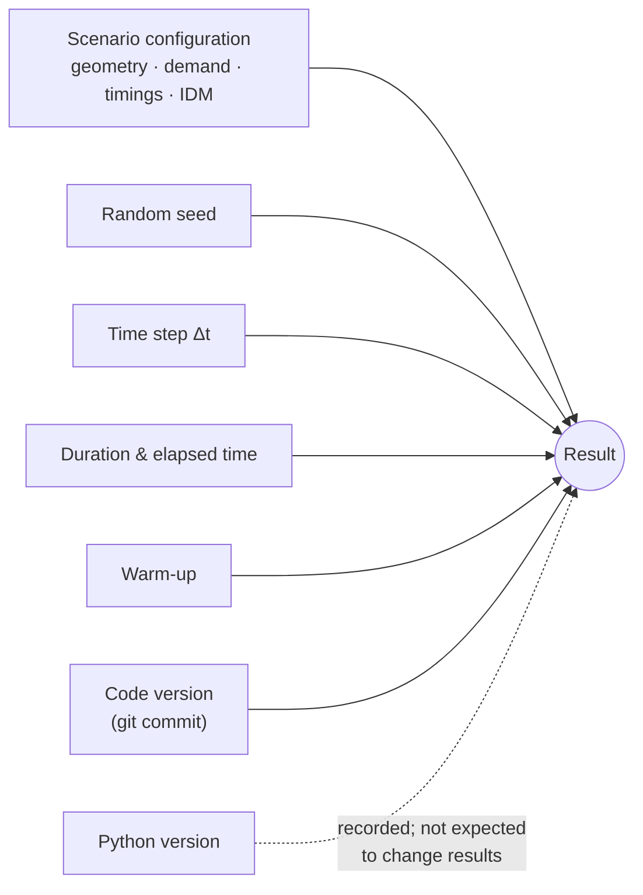
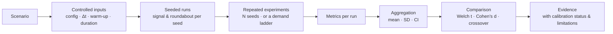

# Reproducibility

> **Status:** Current · V1.0 · verified against `backend/src/core/provenance.py`, `backend/src/main.py` (reproduce/export routes), `backend/src/study/` and `backend/tests/database/test_run_reproducibility.py`
> **Principle:** a result that cannot be re-run is an anecdote. UrbanFlow records everything needed to re-run any saved result and can check the re-run itself.

---

## 1. What determines a result



If all of these are the same, the result is the same. UrbanFlow records every one of them with each saved run.

---

## 2. Determinism guarantees (implementation)

| Guarantee | How it is achieved | Source |
| --- | --- | --- |
| Arrivals, splits, turns and vehicle properties depend only on the seed | Each engine owns a private `random.Random(seed)`; the global `random` module is never used during a run | `vehicles/spawner.py` |
| A run without a seed is still reproducible | A seed is generated, logged, and written back into the configuration that gets persisted | `VehicleSpawner.__init__` |
| Both strategies in a comparison see the same traffic | The orchestrator assigns the same seed to the signal and roundabout engines and steps them in lockstep | `snapshot/dual_orchestrator.py` |
| Tick order is fixed | spawn → controller → physics → audit → metrics, under one lock | `core/engine.py` |
| Parallel studies equal sequential studies | Every (tier or seed) × geometry is an independent seeded simulation; results are aggregated in the original order | `study/runner.py` |
| Performance caches never change results | Lane geometry and coordinate caches are pure functions; a test compares whole trajectories with the uncached implementation | `tests/roads/test_lane_lookup_equivalence.py` |
| Reset really resets | Clock, spawner, pool, conflict reservations, controller and collectors all return to their initial state | `SimulationEngine.reset()`, `tests/core/test_engine_reset.py` |

---

## 3. The reproducibility record

Every persisted run stores a provenance record (`build_run_provenance()`, schema version 1):

| Field | Meaning |
| --- | --- |
| `seed` | The seed the spawner **actually used** (read from the engine, not the request) |
| `config` / `exactConfig` / `configSource` | The configuration; `engine` = the exact dictionary the engine ran with, `client` = the dashboard's summary (used only when no engine was available) |
| `runMode` | `single` or `dual` (signal-vs-roundabout lockstep comparison) |
| `timing` | `timeStep`, `duration`, `warmupTime` the engine used, and `elapsed` at save time |
| `gitCommitHash` | Commit of the running code; `"unknown"` when neither `.git` nor a valid `GIT_COMMIT` is available |
| `pythonVersion` | Interpreter version |
| `summaryMetrics` | The engine's own metrics **at the recorded elapsed time** (computed server-side, not taken from the last snapshot the browser received) |
| `name`, `notes`, `tags` | User labels — editable without touching anything above |

Where runs come from:

| Source | Persisted when | `configSource` |
| --- | --- | --- |
| Guided comparison / single-strategy views | User presses Save (requires sign-in) | `engine` when the caller's live session holds an engine with the claimed seed; otherwise `client` |
| `POST /api/v1/simulations` | Automatically on completion, stop or error | `engine` |
| Volume sweep | Every tier, both strategies | `engine` (including injected controller settings) |
| Runs saved before provenance existed | — | fields are `null` |

> **Docker note.** The image excludes `.git`. Pass the commit at build time — `GIT_COMMIT=$(git rev-parse HEAD) docker compose up -d --build` — or saved runs record `"unknown"`. `start.ps1` does this automatically (and deliberately records `"unknown"` when backend image inputs have uncommitted changes). `GET /api/version` shows what the running backend will record.

---

## 4. Reproducing a saved run

### 4.1 In the app

`/app/history` → open a run → **Re-run and export**. The run page re-executes the stored configuration and seed on the server to the recorded elapsed time and shows whether delay and throughput matched, with any discrepancies and limitations.

### 4.2 Through the API

Examples use `http://localhost:8000` (native backend, or `docker-compose.dev.yml`). Against the production Compose stack use `http://localhost` with the same paths — nginx proxies `/api/` and adds the API key itself. Calling the backend directly with `API_KEY` set requires `-H "X-API-Key: $API_KEY"` on protected routes.

```bash
# 1. Inspect the stored record (config with the seed pinned, provenance, timing)
curl http://localhost:8000/api/v1/study/history/runs/<runId>/reproducibility

# 2. Re-run it headlessly and compare
curl -X POST http://localhost:8000/api/v1/study/history/runs/<runId>/reproduce

# 3. Export everything (JSON with the per-tick metrics timeline, or flat CSV)
curl -o run.json "http://localhost:8000/api/v1/study/history/runs/<runId>/export?format=json"
curl -o run.csv  "http://localhost:8000/api/v1/study/history/runs/<runId>/export?format=csv"
```

The reproduce response:

| Field | Meaning |
| --- | --- |
| `mode` | `single` or `dual` (dual re-runs both sides through the same orchestrator) |
| `reproducedElapsed` | Simulated time re-run to (the recorded elapsed time for runs with provenance, else full duration) |
| `comparedMetrics` | Metrics actually compared (`averageDelay`, `throughput`, per side for dual) |
| `tolerances` | ±0.05 s delay, ±0.1 vehicles |
| `isDeterministic` | `true` / `false`, or `null` when there was nothing to compare |
| `discrepancies` | Human-readable mismatches |
| `limitations` | Every reason to read the result with care: legacy run, client-summary config, unknown or different code version |
| `originalMetrics`, `reproducedMetrics` | Both full dictionaries |

Reproduction never modifies the stored run.

### 4.3 Re-running a configuration yourself

Any `exactConfig` from the record can be submitted as a new versioned simulation:

```bash
curl -X POST http://localhost:8000/api/v1/simulations \
  -H "Content-Type: application/json" \
  -d @config.json                     # returns {"simulationId": ...}
curl -X POST http://localhost:8000/api/v1/simulations/<simulationId>/control \
  -H "Content-Type: application/json" -d '{"action":"start"}'
curl "http://localhost:8000/api/v1/simulations/<simulationId>/report?format=json"
```

Versioned simulations run at real-time pace (1 s of simulated time per wall-clock second).

---

## 5. Reproducing a study



### 5.1 Full validated study (command line)

Runs a volume sweep and a Monte Carlo validation directly against the engine (no API server needed) and writes a CSV report. From the repository root, with backend dependencies installed:

```bash
python scripts/run_full_study.py --help
python scripts/run_full_study.py
python scripts/run_full_study.py --sweep-duration 240 --validation-duration 240 --num-seeds 5 \
    --time-step 0.1 --output-csv study_report.csv --output-json study_report.json
python scripts/run_full_study.py --rates 0.1,0.2,0.3,0.4
```

Defaults: 240 s per run (30 s warm-up excluded), 5 seeds, Δt = 0.1 s, rates = 20–160 % of the one-lane reference capacity. Results are also persisted to the database at `DB_PATH`.

### 5.2 Volume sweep (API)

```bash
curl -X POST http://localhost:8000/api/v1/study/sweeps/jobs \
  -H "Content-Type: application/json" \
  -d '{"arrivalRates":[0.1,0.2,0.3,0.4],"duration":240,"randomSeed":1,"name":"repro-sweep"}'
# → 202 {"jobId": ...}; poll until status is "completed"
curl http://localhost:8000/api/v1/study/jobs/<jobId>
```

A sweep is **fully reproducible**: same rates, duration, seed and `customConfig` give the same curves. Every tier's run is stored with its own provenance and can be reproduced individually.

### 5.3 Monte Carlo validation (API)

```bash
curl -X POST http://localhost:8000/api/v1/study/validate/monte-carlo/jobs \
  -H "Content-Type: application/json" \
  -d '{"numSeeds":5,"confidenceLevel":0.95,"duration":240}'
```

Monte Carlo draws **fresh seeds each time** and records them in `seeds` and `seedRuns`. The statistics are therefore not bit-identical across invocations — by design, each check is a new sample. Any individual seed can be reproduced by running that seed through a sweep or the versioned API with the same configuration.

### 5.4 Invariant and determinism check

```bash
curl -X POST http://localhost:8000/api/v1/study/validate/repeatability \
  -H "Content-Type: application/json" -d '{"duration":20,"randomSeed":12345}'
```

Runs both geometries twice with the same seed and checks vehicle conservation, non-negative speeds, signal green exclusivity and same-seed reproduction ([validation](validation.md#2-what-is-verified-and-how)).

---

## 6. Reproducibility checklist

- [ ] Record the **seed** (UI: "Traffic pattern #N"; API: `randomSeed`).
- [ ] Keep the **exact configuration** — export the run (`?format=json`) rather than re-typing settings.
- [ ] Note **Δt, duration, warm-up** (all in the export's `timing`).
- [ ] Build images with **`GIT_COMMIT`** set so the code version is recorded.
- [ ] For claims about a *difference*, use **repeated seeds** (reliability check / Monte Carlo), not one run.
- [ ] State the **calibration status** (`calibration.calibrated`) — one lane per approach is the calibrated comparison.
- [ ] Quote **both values** and the conditions, never a bare "winner".

---

## 7. Known reproducibility limits

| Limit | Effect |
| --- | --- |
| Monte Carlo seeds are not user-settable | A reliability check cannot be replayed as a whole; its seeds are listed |
| `gitCommitHash = "unknown"` | Re-runs cannot confirm the same code ran; flagged in `limitations` |
| `configSource = "client"` | Omitted fields re-run with backend defaults; flagged |
| Legacy runs without provenance | Re-run to full duration; flagged |
| Versioned simulations are in memory | `/api/v1/simulations/{id}` returns 404 after a restart (completed runs remain in history) |
| Reproduction tolerances | ±0.05 s / ±0.1 veh — tighter bitwise checksums are not implemented |
