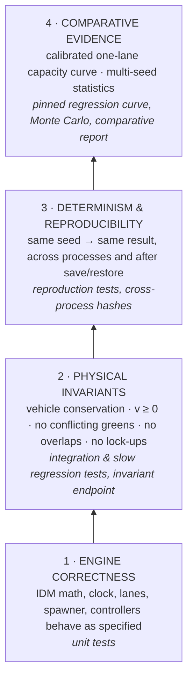
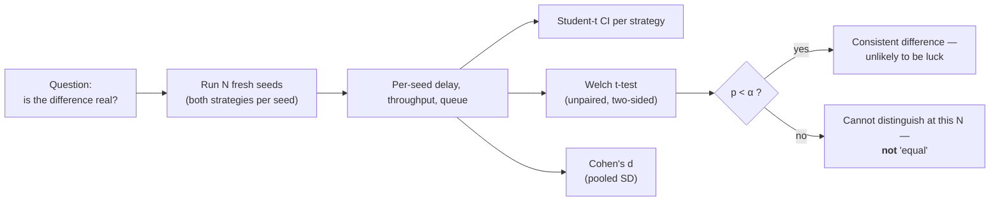

# Validation & Evidence

> **Status:** Current · V1.0 · consolidates the validation work recorded in the [comparative report](../reports/comparative_report.md) (revision 2026-09-25b), the [bug-fix report](../bug-fix-report.md), [V1 known limitations](../reports/v1-known-limitations.md) and the backend test suite.
> **Rule for this page:** nothing is claimed that is not backed by a test, a recorded measurement, or the source. Where evidence is partial, the page says so.

---

## 1. The evidence ladder

UrbanFlow's claims sit on four levels. Each level only supports the claims at or below it.



What this ladder does **not** contain: agreement with field data from a real junction. UrbanFlow is internally validated and calibrated against its own measured capacity; **it is not calibrated against observed traffic** (that is [V1.8/V1.9](../ROADMAP.md#v18--v19--calibration--network-level-foundations) scope).

---

## 2. What is verified, and how

### VALIDATED

| Claim | Evidence | Where |
| --- | --- | --- |
| IDM acceleration matches the published equations, including limits | Unit tests on free-road, following, zero-gap and invalid-input cases | `tests/vehicles/test_idm.py` |
| Clock, lanes, approaches and routing are geometrically consistent | Unit tests; cached lane lookup equals the uncached implementation over whole trajectories | `tests/core/test_clock.py`, `tests/roads/*`, `tests/vehicles/test_router.py` |
| Spawner honours seeds, distributions, lane policy and safe insertion | Unit tests | `tests/vehicles/test_spawner.py` |
| Signal never shows conflicting greens; phases follow the configured plan | Controller tests; checked every tick by the invariant endpoint | `tests/controllers/test_controllers.py`, `study/validation.py::run_invariant_checks` |
| Roundabout yields to circulating traffic and respects follow-up time | Controller and conflict tests | `tests/controllers/`, `tests/integration/test_roundabout_conflicts.py` |
| Vehicle conservation (spawned = active + exited) and v ≥ 0, every tick, both geometries | Invariant checks | `POST /api/v1/study/validate/repeatability`, `tests/study/test_validation.py` |
| The one-lane comparison is collision-free | 0 collisions in all 90 one-lane runs (both geometries, 9 demand points, seeds 1–5) | [comparative report §1](../reports/comparative_report.md#1-executive-summary) |
| No junction lock-up at the tested demands | Slow regression suites for signal and roundabout lock-up | `tests/integration/test_roundabout_lockup.py`, `tests/vehicles/test_router.py` (slow) |
| Capacity does not fall as demand rises (signal) | Slow regression | `tests/integration/test_signal_capacity.py` |
| The calibrated capacity curve stays where it was measured | Pinned per-point regression with tolerances | `tests/integration/test_calibrated_capacity_regression.py` (slow) |
| Same seed → same result, in-process | Invariant checks re-run each geometry; reproduction tests | `tests/database/test_run_reproducibility.py`, `tests/database/test_v11_history_and_repro.py` |
| Same seed → same result, across processes | Identical trajectory hashes under `PYTHONHASHSEED` 0 / 1 / 12345 (recorded 2026-09-24) | [bug-fix report — Final validation](../bug-fix-report.md#final-validation-2026-09-24) |
| A saved run restores and re-runs to the same metrics (single and dual) | Save → restore → reproduce tests | `tests/database/test_run_reproducibility.py` |
| Metrics follow their definitions (warm-up clipping, fairness exclusions, percentiles, safety measures) | Metric unit and collector integration tests | `tests/metrics/*` |
| Statistics are computed correctly (Student-t CI, Welch, Cohen's d, sign conventions) | Unit tests | `tests/study/test_compare_groups.py`, `tests/study/test_validation.py` |
| Sweep verdict direction and crossover bracket are correct | Unit tests | `tests/study/test_sweep_verdict_direction.py`, `tests/study/test_volume_sweep.py` |
| Snapshots match the contract | Contract tests | `tests/integration/test_snapshot_contract.py`, `tests/core/test_snapshot.py` |
| Configuration bounds and cross-field rules are enforced on every entry point | Validation tests | `tests/core/test_config_*`, `tests/integration/test_config_validation.py`, `tests/integration/test_live_config_ordering.py` |

### MEASURED (comparative evidence, one lane per approach)

From the [comparative report](../reports/comparative_report.md) (5 seeds, 240 s runs, 30 s warm-up, Δt 0.1 s; Welch tests, no multiple-comparison correction). Each finding holds **only for these conditions**:

| Demand offered | Finding |
| --- | --- |
| Light (360 veh/h) | Roundabout delay lower: 9.9 ± 1.0 s vs 16.1 ± 1.5 s (p < 0.001) |
| Busy (1,080 veh/h) | Roundabout served more (946 vs 789 veh/h, p = 0.033) at lower delay (19.5 vs 29.5 s, p = 0.040) |
| At and above saturation (≥ 2,160 veh/h) | Roundabout served 11–18 % more (p = 0.014–0.042); delay differences not significant |
| Maximum served flow | Signal ≈ 1,130–1,160 veh/h; roundabout ≈ 1,320–1,330 veh/h — the signal figure is specific to one **shared** lane with **permissive** left turns |

These are UrbanFlow's own results under its own assumptions. They illustrate what the platform measures; they are **not** a general statement that one junction type is better.

---

## 3. ASSUMED

Inputs that shape every result but are not validated by UrbanFlow. Full register: [methodology §12](../simulation/methodology.md#12-assumptions-register).

| Assumption | Basis |
| --- | --- |
| IDM parameters (a 2.0, b 3.0, T 1.5 s, s₀ 2 m, δ 4) | Standard literature values for passenger cars |
| Desired speed 85–105 % of a 50 km/h limit | Modelling choice |
| Lateral acceleration 3.0 m/s² on every curve | FHWA/NCHRP 672 speed–radius relationship |
| Roundabout critical gap 4.0 s, follow-up 2.5 s | Typical published single-lane values |
| Signal 30/4/2 s paired plan, permissive lefts | Modelling choice for the calibrated comparison |
| Stationary Poisson arrivals | Standard queueing assumption |
| Surrogate safety thresholds (TTC 1.5 s, PET 5 s) | Commonly cited literature defaults — not validated here |
| Presentation thresholds (tie tolerances, fairness bands, HCM grade bands) | Declared judgement calls, shown in the UI; not user-tested |

---

## 4. Statistical practice



| Practice | Status |
| --- | --- |
| Student-t intervals (not z = 1.96) at 0.90 / 0.95 / 0.99 | Implemented |
| Welch's unequal-variance test | Implemented |
| Effect size reported with direction | Implemented (`cohensD`, positive = signal higher) |
| Seeds recorded | Implemented |
| Paired test exploiting shared seeds | **Not implemented** — the test is unpaired, which is conservative |
| Multiple-comparison correction across delay / throughput / queue | **Not implemented** — stated in every result's `method.note` |
| Multi-seed sweeps (confidence bands per tier) | **Not implemented** — sweeps run one seed per tier (`seedsPerTier: 1`) |

---

## 5. Known limitations

| # | Limitation | Consequence | Status |
| --- | --- | --- | --- |
| K1 | **Multi-lane roundabout** uses concentric rings without spiral lane assignment; inner-ring exits cross outer rings | Multi-lane runs are not collision-free across the whole demand range (5 low-speed contacts in 54 runs, 2026-09-25 matrix). Results with > 1 lane are **exploratory** and labelled so. | Scheduled: [V1.4](../ROADMAP.md#v14--advanced-roundabout-modelling) |
| K2 | **One-lane signal is conservative**: one shared lane, permissive lefts, no turn bay | A waiting left-turner holds the only lane; maximum served flow sits below HCM shared-lane practice | Model scope; lane modelling in [V1.2](../ROADMAP.md#v12--advanced-lane-modelling) |
| K3 | **No lane changing** — lane chosen at spawn by turn intent | Approaches cannot rebalance | [V1.2](../ROADMAP.md#v12--advanced-lane-modelling) |
| K4 | **Homogeneous passenger-car fleet** | No buses, trucks or bikes | [V1.1](../ROADMAP.md#v11--different-vehicle-types) |
| K5 | **Fixed-time signals only** | No actuated/adaptive comparison | [V1.3](../ROADMAP.md#v13--adaptive-signal-control) |
| K6 | **Abstract four-leg geometry** | Not a specific real junction | [V1.5](../ROADMAP.md#v15--real-world-junction-modelling) |
| K7 | **Safety measures are exploratory**; no crash-risk model; no emissions | Safety is shown only as model-integrity cautions | [V1.6](../ROADMAP.md#v16--safety--environmental-analysis) |
| K8 | **No field calibration** | Absolute numbers are model outputs, not predictions for a site | [V1.8/V1.9](../ROADMAP.md#v18--v19--calibration--network-level-foundations) |
| K9 | **Stationary demand** within a run; one seed per sweep tier | No peak-hour profiles; sweep curves have no seed bands | Scenario planning in [V1.7](../ROADMAP.md#v17--scenario--what-if-planning) |
| K10 | **Live comparison runs at 1× real time** | A 10-minute scenario takes 10 minutes to watch ("See results so far" mitigates) | Not scheduled |
| K11 | **Delay includes geometric slowing** (curve and entry speed limits) | Delay ≠ time spent stopped; `averageWaitTime` reports the latter in the specialist layer | By design |
| K12 | **`ConflictManager` stores one conflict point per lane pair; precomputation is O(n²)** | Adequate for one junction; not a network-scale design | See [V1 known limitations §6–7](../reports/v1-known-limitations.md) |

The per-item audit with mechanisms and re-measurements is [V1 known limitations](../reports/v1-known-limitations.md).

---

## 6. FUTURE WORK (validation-specific)

Items below strengthen *evidence*; each belongs to a roadmap milestone rather than being an open-ended wish.

| Work | Milestone |
| --- | --- |
| Validation of heterogeneous vehicle behaviour and its effect on capacity | V1.1 |
| Physics and regression tests for lane changes | V1.2 |
| Adaptive-control experiments with validation against fixed-time | V1.3 |
| Collision validation of multi-lane circulation (removes K1) | V1.4 |
| Validated safety proxies; emissions where scientifically supportable | V1.6 |
| Batch experiments with reproducibility at scenario level | V1.7 |
| Calibration framework against observed traffic | V1.8 / V1.9 |
| Research validation of the integrated platform | V2.0 |

---

## 7. How to re-run the validation

```bash
# Backend — fast suite (what CI gates on), from backend/
pytest -m "not slow"

# Backend — full-strength simulation regression sweeps (long; CI runs them nightly)
pytest -m slow --no-cov

# Invariants + determinism on a running backend
curl -X POST http://localhost:8000/api/v1/study/validate/repeatability \
  -H "Content-Type: application/json" -d '{"duration":20,"randomSeed":12345}'

# End-to-end study with a CSV report, from the repository root
python scripts/run_full_study.py
```

See [Testing](../testing/README.md) for what each layer protects.
