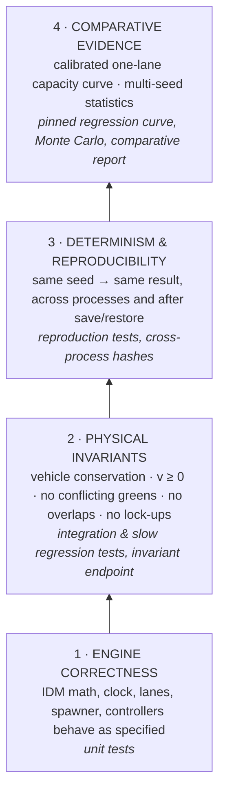
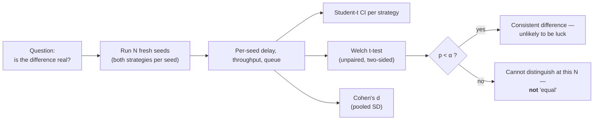

# Validation & Evidence

> **Status:** Current · V1.0 · consolidates the validation work recorded in the [comparative report](../reports/comparative_report.md) (revision 2026-09-25b), the [bug-fix report](../bug-fix-report.md), [V1 known limitations](../reports/v1-known-limitations.md) and the backend test suite.
> **Rule for this page:** nothing is claimed that is not backed by a test, a recorded measurement, or the source. Where evidence is partial, the page says so.

---

## 1. The evidence ladder

UrbanFlow's claims sit on four levels. Each level only supports the claims at or below it.



What this ladder does **not** contain: agreement with field data from a real junction. UrbanFlow is internally validated and calibrated against its own measured capacity; **it is not calibrated against observed traffic** (that is [V1.8/V1.9](../ROADMAP.md#v18--v19--calibration--network-level-foundations) scope).

---

## 2. What is verified, and how

### VALIDATED

| Claim | Evidence | Where |
| --- | --- | --- |
| IDM acceleration matches the published equations, including limits | Unit tests on free-road, following, zero-gap and invalid-input cases | `tests/vehicles/test_idm.py` |
| Clock, lanes, approaches and routing are geometrically consistent | Unit tests; cached lane lookup equals the uncached implementation over whole trajectories | `tests/core/test_clock.py`, `tests/roads/*`, `tests/vehicles/test_router.py` |
| Spawner honours seeds, distributions, lane policy and safe insertion | Unit tests | `tests/vehicles/test_spawner.py` |
| Signal never shows conflicting greens; phases follow the configured plan | Controller tests; checked every tick by the invariant endpoint | `tests/controllers/test_controllers.py`, `study/validation.py::run_invariant_checks` |
| Roundabout yields to circulating traffic and respects follow-up time | Controller and conflict tests | `tests/controllers/`, `tests/integration/test_roundabout_conflicts.py` |
| Vehicle conservation (spawned = active + exited) and v ≥ 0, every tick, both geometries | Invariant checks | `POST /api/v1/study/validate/repeatability`, `tests/study/test_validation.py` |
| The one-lane comparison is collision-free | 0 collisions in all 90 one-lane runs (both geometries, 9 demand points, seeds 1–5) | [comparative report §1](../reports/comparative_report.md#1-executive-summary) |
| No junction lock-up at the tested demands | Slow regression suites for signal and roundabout lock-up | `tests/integration/test_roundabout_lockup.py`, `tests/vehicles/test_router.py` (slow) |
| Capacity does not fall as demand rises (signal) | Slow regression | `tests/integration/test_signal_capacity.py` |
| The calibrated capacity curve stays where it was measured | Pinned per-point regression with tolerances | `tests/integration/test_calibrated_capacity_regression.py` (slow) |
| Same seed → same result, in-process | Invariant checks re-run each geometry; reproduction tests | `tests/database/test_run_reproducibility.py`, `tests/database/test_v11_history_and_repro.py` |
| Same seed → same result, across processes | Identical trajectory hashes under `PYTHONHASHSEED` 0 / 1 / 12345 (recorded 2026-09-24) | [bug-fix report — Final validation](../bug-fix-report.md#final-validation-2026-09-24) |
| A saved run restores and re-runs to the same metrics (single and dual) | Save → restore → reproduce tests | `tests/database/test_run_reproducibility.py` |
| Metrics follow their definitions (warm-up clipping, fairness exclusions, percentiles, safety measures) | Metric unit and collector integration tests | `tests/metrics/*` |
| Statistics are computed correctly (Student-t CI, Welch, Cohen's d, sign conventions) | Unit tests | `tests/study/test_compare_groups.py`, `tests/study/test_validation.py` |
| Sweep verdict direction and crossover bracket are correct | Unit tests | `tests/study/test_sweep_verdict_direction.py`, `tests/study/test_volume_sweep.py` |
| Snapshots match the contract | Contract tests | `tests/integration/test_snapshot_contract.py`, `tests/core/test_snapshot.py` |
| Configuration bounds and cross-field rules are enforced on every entry point | Validation tests | `tests/core/test_config_*`, `tests/integration/test_config_validation.py`, `tests/integration/test_live_config_ordering.py` |

### MEASURED (comparative evidence, one lane per approach)

From the [comparative report](../reports/comparative_report.md) (5 seeds, 240 s runs, 30 s warm-up, Δt 0.1 s; Welch tests, no multiple-comparison correction). Each finding holds **only for these conditions**:

| Demand offered | Finding |
| --- | --- |
| Light (360 veh/h) | Roundabout delay lower: 9.9 ± 1.0 s vs 16.1 ± 1.5 s (p < 0.001) |
| Busy (1,080 veh/h) | Roundabout served more (946 vs 789 veh/h, p = 0.033) at lower delay (19.5 vs 29.5 s, p = 0.040) |
| At and above saturation (≥ 2,160 veh/h) | Roundabout served 11–18 % more (p = 0.014–0.042); delay differences not significant |
| Maximum served flow | Signal ≈ 1,130–1,160 veh/h; roundabout ≈ 1,320–1,330 veh/h — the signal figure is specific to one **shared** lane with **permissive** left turns |

These are UrbanFlow's own results under its own assumptions. They illustrate what the platform measures; they are **not** a general statement that one junction type is better.

---

## 3. ASSUMED

Inputs that shape every result but are not validated by UrbanFlow. Full register: [methodology §12](../simulation/methodology.md#12-assumptions-register).

| Assumption | Basis |
| --- | --- |
| IDM parameters (a 2.0, b 3.0, T 1.5 s, s₀ 2 m, δ 4) | Standard literature values for passenger cars |
| Desired speed 85–105 % of a 50 km/h limit | Modelling choice |
| Lateral acceleration 3.0 m/s² on every curve | FHWA/NCHRP 672 speed–radius relationship |
| Roundabout critical gap 4.0 s, follow-up 2.5 s | Typical published single-lane values |
| Signal 30/4/2 s paired plan, permissive lefts | Modelling choice for the calibrated comparison |
| Stationary Poisson arrivals | Standard queueing assumption |
| Surrogate safety thresholds (TTC 1.5 s, PET 5 s) | Commonly cited literature defaults — not validated here |
| Presentation thresholds (tie tolerances, fairness bands, HCM grade bands) | Declared judgement calls, shown in the UI; not user-tested |

---

## 4. Statistical practice



| Practice | Status |
| --- | --- |
| Student-t intervals (not z = 1.96) at 0.90 / 0.95 / 0.99 | Implemented |
| Welch's unequal-variance test | Implemented |
| Effect size reported with direction | Implemented (`cohensD`, positive = signal higher) |
| Seeds recorded | Implemented |
| Paired test exploiting shared seeds | Monte Carlo validation: **not implemented** — unpaired, which is conservative. The V1.3 three-way study (§4.1) compares delays **paired** per seed |
| Multiple-comparison correction across delay / throughput / queue | **Not implemented** — stated in every result's `method.note` |
| Multi-seed sweeps (confidence bands per tier) | **Not implemented** — sweeps run one seed per tier (`seedsPerTier: 1`) |

### 4.1 Fixed-time vs adaptive vs roundabout (V1.3, 2026-10-06)

Run with the three-way study (`POST /api/v1/study/control-comparison/run`, `study/control_comparison.py`; the same in the Research Lab). Each seed runs once under every control: same geometry, lanes, vehicles, arrival sequence, 300 s with 30 s warm-up excluded; both signals on the paired plan with 4 s yellow and 2 s all-red; adaptive at its defaults (10 / 50 s, 2.5 s passage, 30 m zone). Mean delay per vehicle, paired per-seed difference adaptive − fixed-time with its 95 % Student-t interval; *lower* / *higher* need the interval to exclude zero **and** a gap beyond the 1 s / 5 % tie tolerance.

**One lane, cars only (calibrated), 10 seeds (101–110):**

| Demand | Fixed-time | Adaptive | Roundabout | Adaptive − fixed | Reading | Adaptive vs roundabout |
| --- | --- | --- | --- | --- | --- | --- |
| Light (310 veh/h) | 12.3 ± 2.7 s | 8.5 ± 1.9 s | 9.4 ± 0.6 s | −3.8 [−6.6, −1.0] | adaptive lower | tie |
| Moderate (620) | 18.0 ± 3.5 | 12.7 ± 1.6 | 11.5 ± 0.9 | −5.2 [−9.1, −1.4] | adaptive lower | inconclusive |
| Busy (940) | 24.2 ± 4.5 | 18.6 ± 3.4 | 16.3 ± 2.7 | −5.5 [−8.3, −2.7] | adaptive lower | roundabout lower |
| Near capacity (1,120) | 30.6 ± 6.2 | 25.8 ± 2.2 | 20.6 ± 3.6 | −4.9 [−10.3, +0.6] | inconclusive | roundabout lower |
| At capacity (1,250) | 31.5 ± 7.4 | 34.1 ± 7.1 | 24.5 ± 5.0 | +2.6 [−2.7, +7.9] | inconclusive | roundabout lower |
| Over capacity (1,620) | 43.9 ± 7.6 | 43.0 ± 4.7 | 37.9 ± 5.0 | −0.9 [−6.2, +4.3] | tie | roundabout lower |

**Two lanes, cars only (exploratory), 5 seeds:** adaptive lower than fixed-time at light (−3.3 s), moderate (−4.8 s) and near capacity (−8.0 s); tie at busy and at capacity; over capacity adaptive's mean is 3.0 s *higher* (inconclusive). Adaptive is lower than the roundabout near and over capacity, where the two-ring roundabout's weave (K1) costs it. **Two lanes, city mix, 3 seeds:** adaptive's mean is 3.7–5.8 s below fixed-time at every level, every reading inconclusive.

**Reading.** Adaptive control helps most where a fixed timetable wastes green: below saturation it ends greens that have run dry (green used rose from about 60 % to 80–88 % of green time on one lane at light and moderate demand) and the mean green shortens to 16–22 s. At and above capacity greens are almost fully used under both, and adaptive gains nothing measurable — at capacity on one lane its mean delay is slightly higher (inconclusive). Its greens there average 24.7 s against the fixed 30 s, so more of each hour goes to yellow and all-red; that lost time matters only when demand reaches capacity, and is the likely, not demonstrated, explanation. On one lane the roundabout still has the lowest delay from busy demand upwards. None of this was tuned: one set of defaults throughout.

**Safety and determinism.** 0 collisions on either signal in 336 signal runs across these studies (the roundabout's 4 contacts, all in two-lane runs, are the K1 weave). A repeated 90-run study returned identical results and per-seed rows. Tick-level checks in `tests/integration/test_adaptive_signal_runs.py` confirm that crossing roads are never released together and every release follows an all-red, on 1–3 lanes, mixed traffic and lane changing, plus a 27-run slow sweep with gridlock detection.

### 4.2 V1.4 roundabout validation matrix (2026-10-07)

Every run is a scenario document compiled by the product's own compiler (`core/scenario.py`), so the matrix exercises exactly what users run. 300 s, 30 s warm-up, seeds 1–3 (signals 1–2). Demand is a share of the reference capacity (1,250 veh/h for one lane, 2,180 for two): low 25 %, moderate 50 %, high 75 %, near 90 %, stress 130 %. Turning 20 / 60 / 20 % (left / straight / right). Mixes: *cars*; *mixed* (60 % car, 20 % SUV, 5 % bus, 5 % truck, 10 % motorcycle); *heavy* (15 % bus, 15 % truck); *moto* (50 % motorcycle). A **contact** is a collision counted by the audit; a **standstill** is every vehicle inside the junction stopped at once.

| Configuration | Runs | Contacts | Longest standstill | Served at stress (mean) |
| --- | --- | --- | --- | --- |
| One-lane ring, 4 mixes | 60 | 0 | 0 s | 79–96 |
| Two-lane ring, 2 lanes everywhere, 4 mixes | 60 | 0 | 0 s | 98–126 |
| Two-lane ring, unequal approaches (2-lane main road, 1-lane side road), cars and heavy | 30 | 0 | 0 s | 84–113 |
| Two-lane ring, 3-lane main road merging onto it, cars and mixed | 30 | 0 | 0 s | 107–123 |
| Two-lane ring, asymmetric demand (50 % from north), cars and moto | 30 | 0 | 0 s | 119–121 |
| Signal, 3-lane main road with custom lane arrows (left / straight / straight+right), fixed-time and adaptive, cars and mixed | 40 | 0 | 1.6 s | 114–175 |
| **Total** | **250** | **0** | **1.6 s** | |

Exit-zone give-ways run from ~20 per two-lane run at low demand to ~400 at stress; 146 times in 210 roundabout runs a vehicle met a conflict already inside its stopping distance and was committed through (`forcedExitCommitments`), without a contact. One-lane rings are unchanged from V1.3 run for run.

**Found and fixed by the matrix.** (1) A long vehicle queued just past an inner-lane exit was ignored by a vehicle leaving by that exit, which drove into its tail (two-lane ring, 50 % motorcycles, seed 2): the ring leader search now reads the leader's *tail* (`router._tail_on_ring_before_exit`; regression test in `test_roundabout_multilane_v14.py`). (2) A 105 s standstill on the adaptive signal (3-lane, mixed, seed 2), and a 38.5 s one on another seed, from a ConflictManager circular wait that predates V1.4: a platoon follower inside the box held nothing on the zone its leader had just released, a left-turner at its stop line was admitted onto it, and each then waited for the other. With any vehicle mix, a vehicle is now refused admission onto a crossing that a committed vehicle cannot stop short of even at the model's maximum braking (`conflict_manager._committed_long_crossing`; `tests/intersection/test_committed_admission_v14.py`). 39 of the 40 signal runs are identical to before; the 40th is the one that froze (43 → 76 vehicles served). The legacy cars-only population keeps V1.0's admission exactly, as the V1.0 reproduction tests require — the same trade-off as the merge order (K16), so the rare wait remains possible there. (3) Exit zones held every vehicle within 40 m whenever a zone was occupied, however soon it would clear; ordering the vehicle inside like any earlier arrival raised two-lane served flow 2–5 % at high demand, with no contact (`tests/controllers/test_roundabout_exit_zone_timing.py`).

**Capacity gain from a second lane** (cars only, 2,880 veh/h, 150 s, seed 1): 39 → 51 vehicles served (×1.31). At 5,400 veh/h over 240 s, seeds 1–3: one lane 79 / 75 / 81, two lanes 96 / 93 / 103, **three approach lanes 97 / 87 / 102** — the ring has at most two lanes, so a third approach lane adds queue space but not capacity, and the slow test `test_capacity_rises_with_lanes[roundabout]` (which expects 2 < 3) no longer holds for seeds 2 and 3.

**Runtime.** Roundabout exit-zone and keep-clear logic is about 3 % of run time; a two-lane heavy-traffic stress run takes about 10 % longer than in V1.3 (192 s vs 172–176 s sequential), one-lane runs are unchanged.

### 4.3 V1.5 real-world junction validation (2026-10-07)

Four shapes, each one scenario document compiled for fixed-time, adaptive and roundabout control (`tests/integration/test_real_world_junctions_v15.py`): a **T-junction** (no north arm, 1-lane arms, 1,250 veh/h); a **Y-junction** (three skewed arms at 20°, 115°, 250°); a **skewed asymmetric** four-arm junction (2-lane main road at 15°/195°, narrow side roads at 80° with 3.0 m lanes and 265° with 3.2 m lanes, lengths 120–320 m, mixed vehicles 75 % car / 10 % SUV / 5 % bus / 5 % truck / 5 % motorcycle, unequal turning); a **U-turn** junction (north arm of three 4.5 m lanes with a U-turn lane and 10 % U-turns; two-lane ring for the roundabout).

| Check | Runs | Result |
| --- | --- | --- |
| Every shape × strategy, 120 s, seed 3 | 12 | 0 contacts; every vehicle left by an arm that exists; approach breakdown lists only existing arms |
| U-turns completed, 300 s, seed 4 | 3 (one per strategy) | U-turns completed under all three; every U-turner left by its own arm; 0 contacts |
| Reproducibility (skewed asymmetric, fixed-time) | 3 | same seed → identical exits; different seed → different |
| Same arrivals for every strategy (T-junction) | 3 | spawned counts within 3 (arrivals blocked at a full entry) |
| API: validate, compile, run, live comparison, 3-way comparison study (T-junction, 2 seeds) | — | study rows list only the three arms; 0 contacts |
| Earlier smoke runs during development (T, skewed four-arm, wide-signal U-turn), 240 s, 3 strategies | 9 | 0 contacts |

**Compatibility.** Every V1.4 preset's fingerprint and its compiled configuration for all three strategies are byte-identical to those produced by the V1.4 code (recorded from commit `dcf7461`, pinned in `tests/core/test_scenario_v15.py`); lane, path and conflict-point geometry and 60 s trajectories of 24 legacy configurations (presets × strategies, 1–3 lanes signal and roundabout) are bit-identical to V1.4.

**Found and fixed by these tests.** The comparison study scaled demand on all four approaches and failed on a three-arm junction; the builder showed default arrows into a missing road (the engine already left them out); a U-turn rejection read "a vehicle mix without buss".

**Runtime.** Geometry is compiled once at set-up, never per tick. On the V1.4 presets V1.5 computes the identical simulation, and interleaved A/B runs of the V1.4 code (commit `dcf7461`) and V1.5 on the bus-corridor preset (120 s, five rounds each, CPU time per tick) gave equal means within noise: fixed-time 2.21 vs 2.03 ms, roundabout 2.79 vs 2.76 ms. An earlier single reading of 4.6 ms (V1.5) against 2.2 ms (V1.4) was taken while the test suite ran concurrently and did not reproduce. Real-world shapes run at 2.4–3.8 ms/tick (120 s, wall clock, unloaded).

**Not completed — do not read as passed.** (1) The slow 60-run matrix (`test_real_world_safety_matrix`: 4 shapes × 3 strategies × seeds 1–5 × 300 s) is in the suite but was stopped before completion for this report; it has **no result**. (2) The full `pytest -m slow` suite was **not run** against V1.5. Until both are run, V1.5 safety evidence is the fast tier above. Capacity on real-world geometry is uncalibrated and exploratory.

---

## 5. Known limitations

| # | Limitation | Consequence | Status |
| --- | --- | --- | --- |
| K1 | ~~Multi-lane roundabout without lane assignment~~ — **resolved in V1.4**: up to two designated circulating lanes, keep-clear entry and exit convergence zones; 0 contacts and no standstill in 250 runs (§4.2). Remaining: three circulating lanes are rejected, not modelled; a third approach lane merges onto the two-lane ring and adds no capacity; multi-lane capacity is uncalibrated. *Was:* concentric rings without spiral lane assignment; inner-ring exits crossed outer rings (5 low-speed contacts in 54 runs, 2026-09-25; 2 in 32 mixed-traffic runs and a heavy-traffic lock-up, 2026-10-06) | Multi-lane results remain **exploratory** (uncalibrated capacity) and are labelled so; they are no longer flagged as unsafe. Scenarios asking for three ring lanes, or an approach two or more lanes wider than the ring, are rejected with an explanation | Resolved in [V1.4](../ROADMAP.md#v14--advanced-roundabout-modelling); three-lane rings not scheduled |
| K2 | **One-lane signal is conservative**: one shared lane, permissive lefts, no turn bay | A waiting left-turner holds the only lane; maximum served flow sits below HCM shared-lane practice | Model scope; lane modelling in [V1.2](../ROADMAP.md#v12--advanced-lane-modelling) |
| K3 | ~~No lane changing~~ — **resolved in V1.2**: gradual MOBIL lane changing on approaches. Remaining: no lane drops/merges inside the junction (opposite approaches must have equal lane counts); motorcycles do not filter between lanes | Through traffic rebalances across permitted lanes; uneven opposite approaches are rejected rather than simulated | Lane drops: deferred from V1.5 (not scheduled) |
| K4 | ~~Homogeneous passenger-car fleet~~ — **resolved in V1.1**: car, SUV, bus, truck, motorcycle. Remaining: class parameters are literature-ordered model inputs, not calibrated; no articulated vehicles; at most 12 m | Mixed-traffic results are **exploratory** and labelled so (`calibration.mixedTraffic`) | Calibration: [V1.8/V1.9](../ROADMAP.md#v18--v19--calibration--network-level-foundations) |
| K5 | ~~Fixed-time signals only~~ — **resolved in V1.3**: an adaptive (vehicle-actuated) signal on the same phase plan, and a three-way study. Remaining: see K17–K18 | Fixed-time vs adaptive vs roundabout is measured with identical traffic | — |
| K6 | ~~Abstract four-leg geometry~~ — **largely resolved in V1.5**: three- or four-arm junctions, arms on their own bearings (within 30° of a compass slot) with their own lane widths and lengths, explicit U-turns (§4.3). Remaining: five-or-more-arm and staggered junctions are rejected, not modelled; no importer from map data (the slot-assignment foundation exists); real-world geometry is uncalibrated | A junction can be described as built, within those bounds; anything outside them is rejected with the reason. Results on such junctions are **exploratory** and labelled so | Multi-arm junctions and import: not scheduled (see [roadmap V1.5 deferred](../ROADMAP.md#v15--real-world-junction-modelling)) |
| K7 | **Safety measures are exploratory**; no crash-risk model; no emissions | Safety is shown only as model-integrity cautions | [V1.6](../ROADMAP.md#v16--safety--environmental-analysis) |
| K8 | **No field calibration** | Absolute numbers are model outputs, not predictions for a site | [V1.8/V1.9](../ROADMAP.md#v18--v19--calibration--network-level-foundations) |
| K9 | **Stationary demand** within a run; one seed per sweep tier | No peak-hour profiles; sweep curves have no seed bands | Scenario planning in [V1.7](../ROADMAP.md#v17--scenario--what-if-planning) |
| K10 | **Live comparison runs at 1× real time** | A 10-minute scenario takes 10 minutes to watch ("See results so far" mitigates) | Not scheduled |
| K11 | **Delay includes geometric slowing** (curve and entry speed limits) | Delay ≠ time spent stopped; `averageWaitTime` reports the latter in the specialist layer | By design |
| K12 | **`ConflictManager` stores one conflict point per lane pair; precomputation is O(n²)** | Adequate for one junction; not a network-scale design | See [V1 known limitations §6–7](../reports/v1-known-limitations.md) |
| K13 | **Long-vehicle rules are gated at 5 m** (V1.1): the axle-chord body pose, the length-aware conflict and emergency checks, roundabout entry commitment, shared-mouth and first-come-first-served entry at multi-lane roundabouts, and the ring exit test apply only to pairs involving a vehicle longer than the reference car | Cars-only runs reproduce V1.0 exactly (pinned by test), at the price of keeping two V1.0 approximations for cars: the ring leader search can brake an exiting car for a vehicle beyond its exit, and the car emergency check uses centre points | Cars: [V1.4](../ROADMAP.md#v14--advanced-roundabout-modelling) |
| K14 | **Design-vehicle geometry** (V1.1): with buses or trucks in the mix, signal stop lines move back by the longest class's extra length | A mixed scenario's signal is a larger junction than its cars-only counterpart, as on real bus/freight routes; compare mixes, not geometries | By design |
| K15 | **Lane changing costs time compared with V1.0** (V1.2): on multi-lane signals at moderate demand, mean delay is 3–5 s higher than V1.0, whose lane change was an instantaneous 3.5 m jump. Against no lane changing at all, MOBIL serves more vehicles at the same delay | Multi-lane absolute numbers differ from V1.0 (multi-lane was already exploratory); no collision or gridlock regression (48 paired runs, 2026-10-05) | By design |
| K16 | **Merge order is physical only on design-vehicle junctions** (V1.1): two committed vehicles converging on one exit lane merge nearest-first when the junction is laid out for long vehicles; cars-only junctions keep V1.0's reservation order | A V1.0 merge deadlock (two vehicles in the box each waiting for the other) is removed for mixed traffic but kept, rarely triggered, for cars only to preserve V1.0 results. V1.4 does the same for an admission wait (a crossing handed to a waiting vehicle while a committed one could no longer stop short of it, §4.2) | Cars: deferred (retained to preserve V1.0 reproducibility; not scheduled) |
| K17 | **Adaptive control is isolated, rule-based actuation** (V1.3): perfect stop-line detectors (no missed or false detections), no pedestrian calls, no coordination between junctions, no optimising or predictive control (SCOOT/SCATS-style), no learning. Default settings (10 / 50 s, 2.5 s passage, 30 m zone) are common practice values, not tuned per scenario or calibrated | Results compare a well-behaved actuated signal with a fixed timetable; a real installation's detection and tuning would differ | Optimising/learning control: [Future Scope](../future-scope/future_scope.md); calibration: [V1.8/V1.9](../ROADMAP.md#v18--v19--calibration--network-level-foundations) |
| K18 | **Direct green-to-green within one approach's stage** (inherited): in the one-direction-at-a-time fallback cycle, through lanes go from green to red without a yellow when the protected-left phase starts — the fixed-time cycle does the same. Adaptive control never adds such a step between different approaches (it rejects plans that would need one) | Affects only the fallback cycle; the dashboard and every study use the paired plan, which has a yellow and all-red after every green | Deferred (beyond V1.5 slot model; not scheduled) |

The per-item audit with mechanisms and re-measurements is [V1 known limitations](../reports/v1-known-limitations.md).

---

## 6. FUTURE WORK (validation-specific)

Items below strengthen *evidence*; each belongs to a roadmap milestone rather than being an open-ended wish.

| Work | Milestone |
| --- | --- |
| Validation of heterogeneous vehicle behaviour and its effect on capacity | V1.1 — **done for safety and determinism** (zero collisions / no gridlock across 28 heavy-mix runs at 30 % buses and trucks; exact replay); capacity effects remain exploratory until calibrated (K4) |
| Physics and regression tests for lane changes | V1.2 — **done** (`tests/vehicles/test_lane_change.py`, `tests/integration/test_vehicle_types_and_lanes.py`) |
| Adaptive-control experiments with validation against fixed-time | V1.3 — **done** (§4.1: three-way study over six demand levels, 1 and 2 lanes, cars and mixed traffic; exact replay; no signal collisions) |
| Collision validation of multi-lane circulation (removes K1) | V1.4 — **done** (§4.2: 250 runs, one and two ring lanes, unequal, merging and asymmetric approaches, four mixes, 0 contacts) |
| Safety validation of real-world geometry (three-arm, skewed, asymmetric, U-turns) | V1.5 — **fast tier done** (§4.3: 0 contacts, exact replay); the 60-run slow matrix and the full slow suite are **not yet run**; capacity on such junctions remains exploratory |
| Validated safety proxies; emissions where scientifically supportable | V1.6 |
| Batch experiments with reproducibility at scenario level | V1.7 |
| Calibration framework against observed traffic | V1.8 / V1.9 |
| Research validation of the integrated platform | V2.0 |

---

## 7. How to re-run the validation

```bash
# Backend — fast suite (what CI gates on), from backend/
pytest -m "not slow"

# Backend — full-strength simulation regression sweeps (long; CI runs them nightly)
pytest -m slow --no-cov

# Invariants + determinism on a running backend
curl -X POST http://localhost:8000/api/v1/study/validate/repeatability \
  -H "Content-Type: application/json" -d '{"duration":20,"randomSeed":12345}'

# End-to-end study with a CSV report, from the repository root
python scripts/run_full_study.py
```

See [Testing](../testing/README.md) for what each layer protects.
