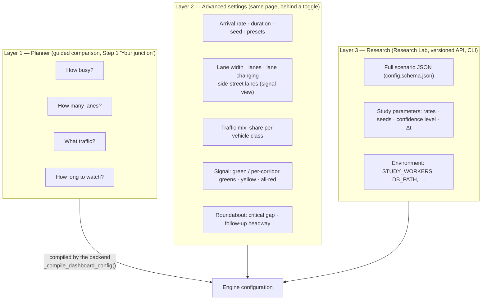

# Configuration Reference

> **Status:** Current · V1.0 · verified against `frontend/src/types/config.ts`, `frontend/src/types/demand.ts`, `backend/src/core/config_models.py`, `shared/schemas/config.schema.json` and `backend/src/main.py`
> **Product principle:** **SIMPLE BY DEFAULT, DEEP BY CHOICE.**

UrbanFlow has three configuration layers. Most people only ever see the first one.



---

## Layer 1 — Planner configuration

The guided comparison asks four everyday questions. Every other value comes from a calibrated default.

| Question | Options | Maps to | Default |
| --- | --- | --- | --- |
| **How busy is the junction?** | Light · Moderate · Busy · Near capacity · At capacity · Over capacity — shown in vehicles per hour | `arrivalRate` = share of the reference capacity for the chosen lane count | Busy (940 veh/h at 1 lane) |
| **How many lanes per approach?** | 1 (recommended — the calibrated comparison) · 2 · 3 (flagged as indicative) | `lanesNorth/South/East/West` | 1 |
| **What traffic uses the junction?** (V1.1) | Cars only (the calibrated comparison) · Typical city mix · Bus & freight route · Many two-wheelers | `vehicleMix` (omitted for cars only) | Cars only |
| **How long to watch?** | Quick look 2 min · Standard 5 min · Thorough 10 min | `duration` (120 / 300 / 600 s) | Standard |

Traffic-mix presets (`MIX_PRESETS` in `frontend/src/vehicles/vehicleClasses.ts`):

| Preset | Car | SUV | Bus | Truck | Motorcycle |
| --- | --- | --- | --- | --- | --- |
| Cars only | 100 % | — | — | — | — |
| Typical city mix | 60 % | 20 % | 5 % | 5 % | 10 % |
| Bus & freight route | 50 % | 10 % | 15 % | 15 % | 10 % |
| Many two-wheelers | 45 % | 10 % | 3 % | 2 % | 40 % |

Any mix other than cars only is labelled indicative (not calibrated). With buses or trucks the signal junction is laid out for them (stop lines further back — [methodology §4.3](methodology.md#43-design-vehicle-v11)).

Demand levels as a share of the reference capacity, and the resulting vehicles per hour:

| Level | Share | 1 lane | 2 lanes | 3 lanes |
| --- | --- | --- | --- | --- |
| Light | 25 % | 310 | 550 | 660 |
| Moderate | 50 % | 630 | 1,090 | 1,310 |
| Busy | 75 % | 940 | 1,640 | 1,970 |
| Near capacity | 90 % | 1,130 | 1,960 | 2,360 |
| At capacity | 100 % | 1,250 | 2,180 | 2,620 |
| Over capacity | 130 % | 1,630 | 2,830 | 3,410 |

The reference capacity is the mean of both strategies' measured maximum served flow, so no level favours either ([methodology §11](methodology.md#11-calibration-status)).

**Fixed for every guided run (not user inputs):** warm-up 30 s · Δt 0.1 s · approach length 200 m · Poisson arrivals · paired NS/EW signal plan · roundabout radii 10/20 m, entry 5 m/s, circulating ≤ 8 m/s · vehicle cap sized from demand.

---

## Layer 2 — Advanced settings

Opened from Step 1 ("Advanced settings — signal timing, driver behaviour, lane width, …") and from the single-strategy Research Lab views. Ranges are the UI control bounds; the backend re-validates everything.

| Setting | UI range | Default | Backend key (dashboard body) |
| --- | --- | --- | --- |
| Preset | Baseline · Downtown Peak · Suburban Collector · Multi-Lane Arterial | Baseline | fills the fields below |
| Arrival rate (whole junction) | 0.05–1.2 veh/s | 940/3600 | `arrivalRate` |
| Simulation duration | 30–600 s | 300 s | `duration` (backend: 1–3600) |
| Random seed | ≥ 1 | fresh random seed per page load | `randomSeed` |
| Lanes per approach | 1–3 | 1 | `lanesNorth` … `lanesWest` |
| Side-street lanes (east–west) — "Signal on its own" view only | 1–3 | same as above | `lanesEast`, `lanesWest` |
| Drivers change lanes when it helps | on / off | on | `laneChanging` (sent only when off) |
| Traffic mix — preset or a share per class (scaled to 100 %) | 0–100 % each | cars only | `vehicleMix` (sent only when not cars only) |
| Lane width | 2.5–4.8 m | 3.5 m | `laneWidth` |
| Green (both corridors) | 5–60 s | 30 s | `greenDuration` |
| North–south / east–west green (split timing) | 6–120 s | off | `nsGreenDuration`, `ewGreenDuration` (backend: > 5, ≤ 120) |
| Yellow | 2–8 s | 4 s | `yellowDuration` |
| All-red clearance | 1–6 s | 2 s | `allRedDuration` |
| Critical gap t_c | 2.0–6.0 s | 4.0 s | `criticalGap` |
| Follow-up headway t_f | 1.0–3.5 s | 2.5 s | `followUpTime` |

**Seed behaviour.** A seed sent with the configuration is treated as *pinned*: it survives Play-after-completion and Reset, so the same traffic pattern is re-run. Without one, the backend draws a fresh seed for every new run.

**Dashboard body.** The browser sends this flat object to `POST /api/simulation/config` (`dashboardPayload()` in `frontend/src/types/config.ts`):

```json
{
  "intersectionType": "fixed_time_signal",
  "intersectionSize": 11,
  "laneWidth": 3.5,
  "lanesNorth": 1, "lanesSouth": 1, "lanesEast": 1, "lanesWest": 1,
  "arrivalRate": 0.2611,
  "duration": 300,
  "randomSeed": 42,
  "greenDuration": 30, "yellowDuration": 4, "allRedDuration": 2,
  "criticalGap": 4.0, "followUpTime": 2.5
}
```

Optional V1.1/V1.2 fields, sent only when they differ from the defaults (so a cars-only body is byte-for-byte the V1.0 one): `"vehicleMix": {"car": 0.6, "suv": 0.2, "bus": 0.05, "truck": 0.05, "motorcycle": 0.1}` and `"laneChanging": false`. North/south and east/west lane counts must match each other.

The backend compiles it into a full engine configuration (`_compile_dashboard_config()` in `backend/src/main.py`) and validates the result against the same schema bounds and cross-field rules as the versioned API. The same compiler serves the reliability check, so "How reliable is this?" repeats *exactly* the scenario the user watched.

---

## Layer 3 — Research configuration

### 3.1 Scenario JSON (versioned API)

Used by `POST /api/v1/configs/validate`, `POST /api/v1/simulations` and study `customConfig`. Authoritative schema: [`shared/schemas/config.schema.json`](../../shared/schemas/config.schema.json). Full field-by-field contract: [06 — Scenario configuration contract](../architecture/06-scenario-configuration-contract.md).

Minimal valid configuration:

```json
{
  "simulation": { "duration": 300, "timeStep": 0.1, "randomSeed": 42 },
  "geometry": { "intersectionType": "roundabout" }
}
```

A mixed-traffic, multi-lane scenario with a one-lane side street (V1.1 + V1.2, exploratory):

```json
{
  "simulation": { "duration": 300, "randomSeed": 7 },
  "geometry": { "intersectionType": "fixed_time_signal" },
  "roads": {
    "lanesPerApproach": 2,
    "approaches": [{ "direction": "east", "lanes": 1 }, { "direction": "west", "lanes": 1 }],
    "laneChange": { "enabled": true, "safeDeceleration": 4.0, "accelerationThreshold": 0.2 }
  },
  "vehicleGeneration": {
    "vehicleMix": { "car": 0.6, "suv": 0.2, "bus": 0.05, "truck": 0.05, "motorcycle": 0.1 },
    "vehicleTypes": { "bus": { "maxAcceleration": 0.9, "length": { "min": 11.5, "max": 12.0 } } }
  }
}
```

A calibrated, fully explicit comparison scenario:

```json
{
  "simulation": { "duration": 240, "timeStep": 0.1, "warmupTime": 30, "randomSeed": 1 },
  "geometry": { "intersectionType": "fixed_time_signal" },
  "roads": { "approachLength": 200, "laneWidth": 3.5, "lanesPerApproach": 1, "speedLimit": 13.89 },
  "traffic": { "arrivalRate": 0.3, "arrivalDistribution": "poisson", "totalVehicles": 500 },
  "controller": {
    "straightRightDuration": 30, "yellowDuration": 4, "allRedDuration": 2,
    "phaseSequence": ["ns_green", "ns_yellow", "all_red", "ew_green", "ew_yellow", "all_red"]
  }
}
```

| Section | Key fields (default · bounds) |
| --- | --- |
| `simulation` | `duration` (required · 1–3600 s) · `timeStep` (0.1 · 0–1) · `warmupTime` (30 · ≥ 0, < duration when explicit) · `randomSeed` (optional · ≥ 0) · `snapshotFrequency` (10 Hz · 1–60) |
| `geometry` | `intersectionType` (required · `fixed_time_signal` \| `roundabout`) · `intersectionCenter` |
| `roads` | `approachLength` (200 · 50–1000 m) · `laneWidth` (3.5 · 2.5–5.0 m) · `lanesPerApproach` (2 · 1–4) · `approaches[].lanes` (per-approach override, V1.2) · `speedLimit` (13.89 · ≤ 30 m/s) · `laneChange` (V1.2: `enabled` true · `accelerationThreshold` 0.2 · 0–2 m/s² · `safeDeceleration` 4.0 · ≤ 9 m/s² · `politeness` per class · 0–1) |
| `traffic` | `arrivalRate` (0.5 · 0–10 veh/s) · `arrivalDistribution` (`poisson` \| `uniform`) · `totalVehicles` (200 · ≤ 5000) · `directionalSplit` and `turnProbabilities` (each must sum to 1; seeded random when omitted) |
| `vehicleGeneration` | `maxAcceleration` 2.0 · `comfortDeceleration` 3.0 · `desiredTimeHeadway` 1.5 · `minimumGap` 2.0 · `idmDelta` 4 · `vehicleLength`/`vehicleWidth`/`desiredSpeed` ranges · `maxLateralAcceleration` (≤ 8) — these define the car · `vehicleMix` (V1.1: share per `car`/`suv`/`bus`/`truck`/`motorcycle`, sums to 1; omitted = V1.0 cars only) · `vehicleTypes.<class>` (V1.1 overrides: `length`, `width`, `desiredSpeedFactor` ranges; `maxAcceleration`, `comfortDeceleration`, `desiredTimeHeadway`, `minimumGap`, `idmDelta`, `maxLateralAcceleration`, `laneChangeDuration`, `laneChangeMinDistance`, `politeness`) — class defaults in [methodology §5.4](methodology.md#54-vehicle-classes-v11) |
| `controller` (signal) | `straightRightDuration` (aliases `greenDuration`, `greenTime`; 30) · `nsGreenDuration`/`ewGreenDuration` · `yellowDuration` (4) · `allRedDuration` (2) · `leftDuration` (5, fallback cycle only) · `phaseSequence` · `offset` |
| `controller` (roundabout) | `innerRadius` (10) · `outerRadius` (20, > inner) · `criticalGap` (4.0) · `followUpTime` (2.5) · `entrySpeed` (5.0) · `circulatingSpeed` (8.0 · ≤ 15) |
| `metrics` | `waitSpeedThreshold` 0.5 · `stopSpeedThreshold` 0.1 · `ttcThresholdSeconds` 1.5 · `petThresholdSeconds` 5.0 · `ttcSearchRadius` 50 |
| `visualization` | display preferences only; no effect on results |

**Cross-field rules** (`backend/src/core/config_validation.py`): explicit `warmupTime < duration`; `directionalSplit` and `turnProbabilities` sum to 1; `outerRadius > innerRadius`; range `max ≥ min` (including `vehicleTypes` ranges); every number finite; `arrivalDistribution: "burst"` rejected as not implemented; `vehicleMix` sums to 1 with known classes and at least one positive share; north/south and east/west lane counts equal (a wider approach would have to merge inside the junction).

### Reserved and inert fields

| Field | Accepted by | Effect in V1.0 |
| --- | --- | --- |
| `controller.circulatingLanes` | schema, Pydantic | **None.** Ring count follows `roads.lanesPerApproach`. Activation belongs to [V1.4](../ROADMAP.md#v14--advanced-roundabout-modelling). |
| `traffic.arrivalDistribution: "burst"` | schema enum | Rejected by validation (not implemented). |
| `roads.approaches[].speedLimit` | schema, Pydantic | Not read; every approach uses `roads.speedLimit`. (`approaches[].lanes` is live since V1.2.) |
| `metrics.enabled`, `updateFrequency`, `rollingWindowSize` | schema | Not read by the collector (it always computes every metric; the throughput window is 60 s). |
| `visualization.*` | schema | Presentation hints only. |

### 3.2 Study parameters

| Study | Endpoint (job form) | Parameters (default · bound) |
| --- | --- | --- |
| Volume sweep | `POST /api/v1/study/sweeps/jobs` | `arrivalRates` (8 tiers, 20–160 % of 1-lane capacity · ≤ 20 rates, each 0–10 veh/s) · `duration` (60 · 1–3600 s) · `randomSeed` (42) · `name` · `customConfig` (Δt 0.05–1.0) |
| Monte Carlo validation | `POST /api/v1/study/validate/monte-carlo/jobs` | `numSeeds` (5 · 1–30) · `confidenceLevel` (0.95 · 0.90/0.95/0.99) · `duration` (30 · 1–3600) · **either** `customConfig` **or** `scenario` (the dashboard body) |
| Invariant checks | `POST /api/v1/study/validate/repeatability` | `duration` (20) · `randomSeed` (12345) |
| Full study (CLI) | `python scripts/run_full_study.py` | `--sweep-duration 240` · `--validation-duration 240` · `--num-seeds 5` · `--time-step 0.1` · `--rates` · `--output-csv study_report.csv` · `--output-json` · `-v` |

### 3.3 Environment

| Variable | Service | Purpose | Default |
| --- | --- | --- | --- |
| `DB_PATH` | backend | SQLite file | `backend/simulation.db` natively; `/app/data/simulation.db` in Docker |
| `CORS_ORIGINS` | backend | Comma-separated allowed origins (`*` disables credentials) | `http://localhost:5173,http://127.0.0.1:5173` |
| `API_KEY` | backend + nginx (`BACKEND_API_KEY`) | Key for mutating / compute-heavy routes, sent as `X-API-Key` (nginx adds it) | empty = disabled |
| `STUDY_WORKERS` | backend | Study worker processes: unset = one per CPU (≤ 8); `N` = 1–32; `0` = inline | unset |
| `GIT_COMMIT` | backend build arg | Commit recorded with saved runs when `.git` is absent | empty → `"unknown"` |
| `COGNITO_USER_POOL_ID`, `COGNITO_CLIENT_ID`, `AWS_REGION` | backend | Verify Cognito ID tokens | empty; region `us-east-1` |
| `DEV_AUTH_BYPASS` | backend | Accept the local development token | off (on in `docker-compose.dev.yml`) |
| `VITE_API_URL`, `VITE_WS_URL` | frontend (build/dev) | Explicit backend URLs; otherwise same origin / Vite proxy | — |
| `VITE_COGNITO_USER_POOL_ID`, `VITE_COGNITO_CLIENT_ID` | frontend (build time) | Cognito sign-in | — |
| `VITE_DEV_AUTH_BYPASS` | frontend (dev server only) | Set `false` to test real Cognito sign-in locally | bypass on in `npm run dev` |
| `URBANFLOW_HTTP_PORT`, `URBANFLOW_ALT_HTTP_PORT` | compose | Host ports for nginx | 80, 3000 |

Secrets (`API_KEY`, Cognito identifiers) belong in an uncommitted `.env` file or the host environment — never in the repository.
