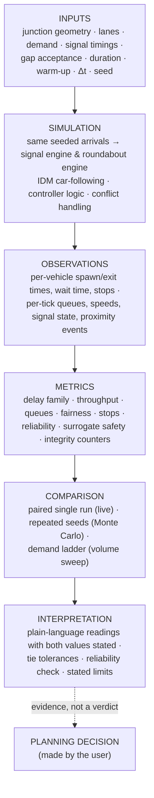
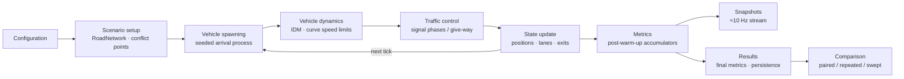
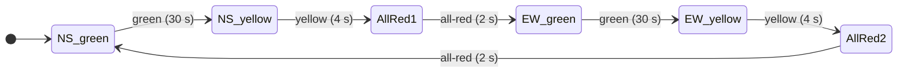
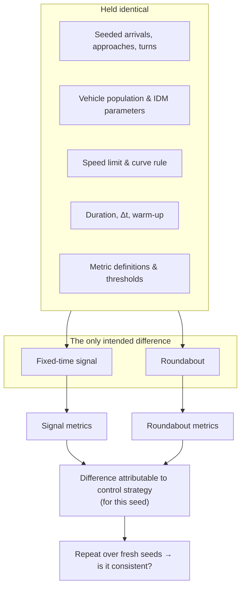

# Simulation Methodology

> **Status:** Current · V1.0 · every parameter on this page is read from the source and cited
> **Audience:** researchers, traffic engineers, reviewers, contributors
> **Companions:** [Configuration reference](configuration.md) · [Metrics reference](../research/metrics-reference.md) · [Reproducibility](../research/reproducibility.md) · [Validation & evidence](../research/validation.md)

UrbanFlow is a **microscopic, discrete-time, single-junction traffic simulator** built to answer one question under controlled conditions:

> *For this junction and this traffic, how do a fixed-time signal and a roundabout perform when they receive exactly the same vehicles?*

This page separates four kinds of statement and labels them throughout:

| Label | Meaning |
| --- | --- |
| **ASSUMPTION** | A modelling choice or input value. Defensible, but not measured by UrbanFlow. |
| **IMPLEMENTATION** | What the code does, verifiable in the source. |
| **MEASURED** | A result produced by running the simulator (see the [comparative report](../reports/comparative_report.md)). |
| **CONCLUSION** | An interpretation drawn from measurements, always scoped to its conditions. |

---

## 1. From inputs to interpretation

The simulation pipeline in more detail:

---

## 2. What is modelled — and what is not

| Modelled (IMPLEMENTATION) | Not modelled in V1.0 |
| --- | --- |
| One four-leg junction (north, south, east, west), right-hand traffic | Networks, corridors, upstream/downstream junctions |
| 1–4 lanes per approach (calibrated comparison: **1**) | Lane changing on approaches (lane is chosen at spawn) |
| Passenger-car population with randomised length, width and desired speed | Distinct vehicle classes (buses, trucks, bikes) — planned for V1.1 |
| Longitudinal car-following (IDM) along fixed lane paths | Lateral dynamics; overtaking |
| Fixed-time signal with paired north–south / east–west phases | Actuated or adaptive signals — planned for V1.3 |
| Single-geometry roundabout with give-way entry, critical gap and follow-up time | Spiral multi-lane circulation, lane markings in the ring — planned for V1.4 |
| Poisson or uniform arrivals per approach | Platooned / bunched arrivals; time-varying demand profiles |
| Surrogate safety proximity measures (TTC; PET on signal geometry) and an overlap audit | Crash-risk prediction; pedestrians; cyclists; emissions |

The full scope statement, with the reasoning for each limit, is in [Validation & evidence](../research/validation.md#5-known-limitations).

---

## 3. Time

**IMPLEMENTATION** — `core/clock.py`, `core/engine.py`

| Item | Value | Source |
| --- | --- | --- |
| Time step Δt | **0.1 s** default; schema range `0 < Δt ≤ 1.0`; studies accept `0.05 ≤ Δt ≤ 1.0` | `SimulationSection.timeStep`, `main.py` study bounds |
| Integration | Semi-implicit Euler: `v ← max(0, v + a·Δt)`, then `x ← x + v·Δt` | `vehicles/vehicle.py::update_state` |
| Order inside a tick | clock → spawn → **controller** → vehicle physics → collision audit → metric callbacks → completion check | `SimulationEngine.step()` |
| Duration | `1 ≤ duration ≤ 3600 s` | `SimulationSection.duration` |
| Interactive pacing | Engine thread sleeps so one tick ≈ Δt of wall time (1× real time) | `SimulationEngine._run_loop` |
| Headless pacing | Studies call `step()` in a loop, as fast as the CPU allows | `study/runner.py` |

Updating the controller **before** physics means a phase change or a refused gap is seen by vehicles in the same tick.

---

## 4. Junction geometry

**IMPLEMENTATION** — `roads/network.py`, `roads/lane.py`

| Parameter | Default | Notes |
| --- | --- | --- |
| Approach length | 200 m | `roads.approachLength`, `50 < L ≤ 1000` |
| Lane width | 3.5 m | `roads.laneWidth`, `2.5 < w ≤ 5.0` |
| Lanes per approach | 2 (engine default) · **1 in the guided comparison** | Versioned API: one integer for all approaches (1–4). The dashboard sends per-direction counts internally. |
| Roundabout radii | inner 10 m, outer 20 m | `controller.innerRadius` / `outerRadius` |
| Speed limit | 13.89 m/s (50 km/h) | `roads.speedLimit` |

**Lane assignment at spawn** (turn-intent aware, `vehicles/spawner.py`):

| Lanes | Left | Straight | Right |
| --- | --- | --- | --- |
| 1 | lane 0 | lane 0 | lane 0 |
| 2 | lane 0 | lane 1 (or any free lane) | lane 1 |
| 3+ | lane 0 | middle lane (or any free lane) | last lane |

On a roundabout the number of circulating rings follows the approach lane count. The `controller.circulatingLanes` field is accepted by the schema but **does not change the geometry** in V1.0 (see [configuration](configuration.md#reserved-and-inert-fields)).

---

## 5. Traffic demand and vehicle spawning

**IMPLEMENTATION** — `vehicles/spawner.py`, `core/limits.py`

### 5.1 Arrival process

- `traffic.arrivalRate` λ is the **whole-junction** rate in vehicles per second (schema `0 < λ ≤ 10`).
- Each approach *d* receives λ_d = λ · split_d.
- **Poisson** (default): inter-arrival times are exponential, `t = −ln(U) / λ_d`, drawn from the run's seeded generator.
- **Uniform**: deterministic headway `1 / λ_d`.
- `burst` is in the schema enum but rejected by validation as not implemented.

### 5.2 Directional split and turning

If `traffic.directionalSplit` or `traffic.turnProbabilities` are **omitted**, they are **drawn from the seeded generator** (ASSUMPTION — chosen to add realistic per-run variety):

| Quantity | Draw when omitted |
| --- | --- |
| Approach weights | each `U(0.5, 2.0)`, normalised to sum 1 |
| P(straight) | `U(0.50, 0.70)` |
| P(left) | `U(0.3, 0.7) × (1 − P(straight))` |
| P(right) | remainder |

Because these come from the seed, two runs with the same seed see the **same** split and turning mix; different seeds see different mixes. The guided comparison and the reliability check rely on exactly this property.

### 5.3 Vehicle properties

| Property | Distribution (default) | Source |
| --- | --- | --- |
| Length | `U(4.0, 5.0)` m | `vehicleGeneration.vehicleLength` |
| Width | `U(1.8, 2.2)` m | `vehicleGeneration.vehicleWidth` |
| Desired speed v₀ | `U(0.85, 1.05) × speedLimit` → 11.8–14.6 m/s at 50 km/h | `vehicles/speed_profile.py` |

### 5.4 Safe insertion

A vehicle is placed only if the entry of its lane has room (`gap ≥ minimumGap + max length`); otherwise the arrival waits, keeping its turn intent, and is retried next tick. Its initial speed is capped so that, braking at the comfortable deceleration, it can stop behind the vehicle ahead (`_safe_insertion_speed`). This removed a class of insertion collisions found during the bug-fix pass ([bug-fix report](../bug-fix-report.md)).

### 5.5 Vehicle cap

`traffic.totalVehicles` caps vehicles generated per run (default 200, max 5000). The dashboard compiler and the study runners size it from the scenario — `ceil(1.5 · λ · duration) + 50`, clamped to [200, 5000] — so normal Poisson variation never truncates demand. If the cap is ever reached, metrics report `vehicleLimitReached = true` rather than silently reading truncated demand as full demand.

---

## 6. Vehicle dynamics — the Intelligent Driver Model

**IMPLEMENTATION** — `vehicles/idm.py`

UrbanFlow uses the Intelligent Driver Model (Treiber, Hennecke & Helbing, 2000; reference PDF in [`docs/resources/References/`](../resources/References/)) for longitudinal acceleration:

$$
\dot v = a\left[1-\left(\frac{v}{v_0}\right)^{\delta}-\left(\frac{s^*(v,\Delta v)}{s}\right)^2\right],
\qquad
s^*(v,\Delta v)=s_0+vT+\frac{v\,\Delta v}{2\sqrt{ab}}
$$

with `Δv = v − v_lead` (closing speed) and `s` the bumper-to-bumper gap. Without a leader only the free-road term applies. The result is clipped at `−b_max`; a non-positive gap returns `−b_max` directly.

| Symbol | Meaning | Default | Config key |
| --- | --- | --- | --- |
| a | Maximum acceleration | 2.0 m/s² | `vehicleGeneration.maxAcceleration` |
| b | Comfortable deceleration | 3.0 m/s² | `vehicleGeneration.comfortDeceleration` |
| T | Desired time headway | 1.5 s | `vehicleGeneration.desiredTimeHeadway` |
| s₀ | Minimum standstill gap | 2.0 m | `vehicleGeneration.minimumGap` |
| δ | Acceleration exponent | 4 | `vehicleGeneration.idmDelta` |
| b_max | Absolute deceleration limit | 9.0 m/s² | fixed in code |

**Curves (ASSUMPTION).** On any curved connection lane speed is limited to `√(a_lat · R)` with `a_lat = 3.0 m/s²` (configurable as `vehicleGeneration.maxLateralAcceleration`), and vehicles brake for the curve beforehand. The same rule applies to signal turns and roundabout arcs, which is what makes their travel times comparable. The value is derived from the FHWA/NCHRP 672 fastest-path speed–radius relationship; it is a model input, not a finding.

**Leaders and conflicts.** A vehicle's leader is found along its own route (`vehicles/router.py`). Crossing and merging conflicts are handled by two layers:

| Layer | Applies to | Mechanism |
| --- | --- | --- |
| `ConflictManager` | Signal geometry | Pre-computed crossing points between connection lanes, a reservation table, and right-of-way rules (right-turners yield to straight; left-turners yield to everyone; ties by vehicle id) |
| Predictive conflict resolver | All geometries (entry arbitration on multi-ring roundabouts) | Samples each vehicle's path ahead and constrains the later arrival at a close approach |

---

## 7. Traffic-control strategies

Both controllers implement `BaseController` (`controllers/base.py`) and are built by `controllers/factory.py`. They act on vehicles only through **virtual obstacles** at stop/give-way lines, so vehicle physics is identical across strategies.

### 7.1 Fixed-time signal — `controllers/fixed_time_signal.py`

| Item | Value (default) | Notes |
| --- | --- | --- |
| Phase plan | `ns_green → ns_yellow → all_red → ew_green → ew_yellow → all_red` | `controller.phaseSequence`; used by the live dashboard and all studies |
| Green | 30 s (`straightRightDuration`; aliases `greenDuration`, `greenTime`) | Schema `5 < g ≤ 120` |
| Per-corridor greens | `nsGreenDuration`, `ewGreenDuration` (optional) | Asymmetric timing; omitted = shared green |
| Yellow / all-red | 4 s / 2 s | |
| Cycle | 72 s with defaults | `2 × (green + yellow + all-red)` |
| Left turns | **Permissive** during the paired green; they yield to opposing traffic via `ConflictManager` | No protected left phase in the paired plan |
| Offset | `controller.offset` shifts the cycle start | |

If a config supplies no `phaseSequence`, the controller falls back to a one-approach-at-a-time cycle with a protected left phase (`leftDuration`, default 5 s). The dashboard and studies always send the paired plan.

### 7.2 Roundabout — `controllers/roundabout.py`

| Parameter | Default | Meaning |
| --- | --- | --- |
| `criticalGap` | **4.0 s** | Minimum time gap to the next circulating vehicle an entering driver accepts |
| `followUpTime` | **2.5 s** | Minimum time between consecutive entries from one approach |
| `entrySpeed` | 5.0 m/s | Speed cap in the last 10 m before the give-way line |
| `circulatingSpeed` | 8.0 m/s | Speed cap on the ring |

Entry logic (IMPLEMENTATION): circulating traffic has priority. For each approach, the controller projects circulating vehicles towards the entry at `max(current speed, circulatingSpeed)`, blocks the entry (virtual obstacle) while any would arrive within the critical gap, and spaces consecutive entries by the follow-up time. A spillback state (with hysteresis) shapes approach speeds when a queue is stalled and propagating.

---

## 8. Warm-up

**IMPLEMENTATION** — `metrics/collector.py`, `study/calibration.py`

A junction starts empty, so early measurements would under-state delay and queues. Every metric except a few counters ignores the first `warmupTime` seconds:

| Context | Warm-up |
| --- | --- |
| Live / guided comparison | 30 s (fixed; not a dashboard input) |
| Versioned API | `simulation.warmupTime`, default 30 s (must be < duration when given explicitly) |
| Volume sweep, Monte Carlo | `min(30 s, 0.25 × duration)` — at least three-quarters of every run is measured |
| Invariant checks | 2 s |

Vehicles already on the network when warm-up ends have their accumulated wait and stops captured as a baseline and subtracted, so a single measurement window applies to every vehicle. Delay for such vehicles counts only post-warm-up travel, with the free-flow time scaled to the same fraction.

---

## 9. Determinism and seeds

**IMPLEMENTATION** — `vehicles/spawner.py`, `snapshot/dual_orchestrator.py`

- Each engine owns a **private** `random.Random(seed)`; nothing reads the process-global `random` module during a run.
- If no seed is supplied, one is generated, logged, and **written back into the config**, so it is persisted with the run.
- The comparison orchestrator gives the signal engine and the roundabout engine the **same seed**, so both receive the same arrival times, approaches, turn intents and vehicle properties (subject to each junction's ability to admit them).
- Same seed + same configuration + same code → same results. See [Reproducibility](../research/reproducibility.md) for how this is recorded and verified.

---

## 10. Controlled comparison

### 10.1 Why control matters

A single run mixes two sources of difference: **the control strategy** and **the luck of the arrivals**. UrbanFlow removes the second where it can and measures it where it cannot.

### 10.2 Three levels of evidence

| Level | Where | Design | What it supports |
| --- | --- | --- | --- |
| **Paired run** | Guided comparison (Watch both → Results) | One seed, both strategies in lockstep | "For this traffic pattern, A lost N s less per driver than B" |
| **Repeated experiment** | "How reliable is this?" check; Research Lab → Statistical validation | 1–30 fresh seeds, both strategies per seed | Mean difference, Student-t confidence intervals, Welch's t-test, Cohen's d |
| **Demand ladder** | Research Lab → Traffic-level sweep; `scripts/run_full_study.py` | Both strategies at up to 20 arrival rates, same seed per tier | How the comparison changes with demand; delay crossover bracket |

### 10.3 Interpretation rules (IMPLEMENTATION in the product layer)

- **Both values are always stated.** A plain sentence never replaces the numbers.
- **"About the same"** — a difference counts only if it exceeds *both* an absolute and a relative tolerance (delay: 1 s and 5 % of the larger value); within either, the two are reported as about the same — `frontend/src/metrics/plainLanguage.ts`, `backend/src/study/tolerances.py`. This is a presentation rule, not a significance test.
- **No composite verdict across geometries.** The fixed-weight `masterEfficiencyScore` is structurally unfair across layouts (idle-green loss is signal-only) and is never shown side by side.
- **Non-significance is not equality.** A non-significant test means the study could not distinguish the strategies at that sample size.

---

## 11. Calibration status

**MEASURED** — [comparative report §2](../reports/comparative_report.md#2-measured-capacity-v1-single-lane-per-approach)

The signal-vs-roundabout comparison is **calibrated for one lane per approach**. With more lanes both geometries change (turn lanes at the signal, one ring per entry lane at the roundabout), and multi-lane roundabout runs are not collision-free across the whole demand range because the single geometry cannot express spiral lane assignment. Every study result carries a `calibration` object (`study/calibration.py`) so an exploratory multi-lane result can never be mistaken for the calibrated baseline.

Guided demand levels are defined as a share of a **reference capacity** that is the *mean* of the two strategies' measured maximum served flow — the same number for both, so no level favours either:

| Lanes per approach | Reference capacity (veh/h) | Light 25 % | Moderate 50 % | Busy 75 % | Near 90 % | At capacity 100 % | Over 130 % |
| --- | --- | --- | --- | --- | --- | --- | --- |
| 1 | 1,250 | 310 | 630 | 940 | 1,130 | 1,250 | 1,630 |
| 2 | 2,180 | 550 | 1,090 | 1,640 | 1,960 | 2,180 | 2,830 |
| 3 | 2,620 | 660 | 1,310 | 1,970 | 2,360 | 2,620 | 3,410 |

Values are the ones the guided UI offers: `Math.round(ratio × capacity / 10) × 10` in `frontend/src/types/demand.ts`. The backend mirror `demand_vph()` in `study/calibration.py` uses Python's round-half-to-even and therefore yields 10 veh/h less for five exact-half cases (1 lane: Moderate, Near, Over; 2 lanes: Light; 3 lanes: Busy). The backend uses it only for the default Monte Carlo scenario ("Busy", 1 lane = 940 veh/h in both), so no guided result is affected.

---

## 12. Assumptions register

| # | Assumption | Value | Where it matters |
| --- | --- | --- | --- |
| A1 | IDM parameters represent ordinary passenger cars | a = 2.0, b = 3.0, T = 1.5, s₀ = 2.0, δ = 4 | All dynamics |
| A2 | Desired speed follows the posted limit | 85–105 % of 50 km/h | Free-flow time → delay |
| A3 | One lateral-acceleration limit for all curves | 3.0 m/s² | Turn and ring speeds |
| A4 | Roundabout gap acceptance | t_c = 4.0 s, t_f = 2.5 s | Roundabout capacity |
| A5 | Signal plan | 30/4/2 s paired, permissive lefts | Signal capacity |
| A6 | Arrivals are Poisson and stationary over the run | — | All demand |
| A7 | Split and turning mix vary by seed when unspecified | see §5.2 | Seed-to-seed variance |
| A8 | Queued = speed below 0.5 m/s; stop = below 0.1 m/s (hysteresis to 0.2 m/s) | — | Queue, wait, stop metrics |

These are inputs, not findings. Changing any of them changes results; the [configuration reference](configuration.md) shows which are user-adjustable.
