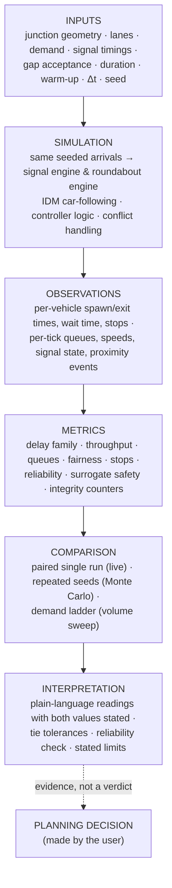
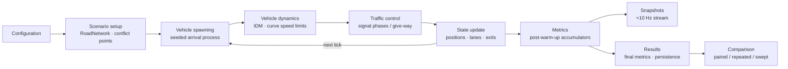
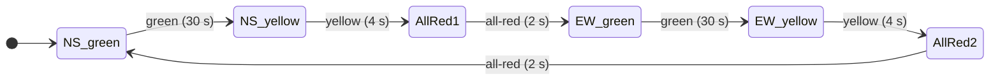
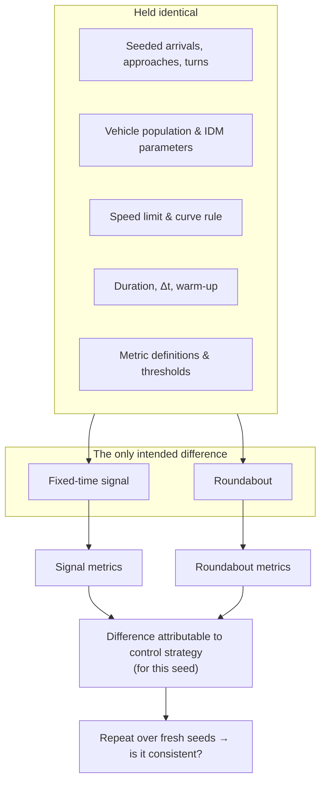

# Simulation Methodology

> **Status:** Current · V1.4 · every parameter on this page is read from the source and cited
> **Audience:** researchers, traffic engineers, reviewers, contributors
> **Companions:** [Configuration reference](configuration.md) · [Metrics reference](../research/metrics-reference.md) · [Reproducibility](../research/reproducibility.md) · [Validation & evidence](../research/validation.md)

UrbanFlow is a **microscopic, discrete-time, single-junction traffic simulator** built to answer one question under controlled conditions:

> *For this junction and this traffic, how do a fixed-time signal and a roundabout perform when they receive exactly the same vehicles?*

This page separates four kinds of statement and labels them throughout:

| Label | Meaning |
| --- | --- |
| **ASSUMPTION** | A modelling choice or input value. Defensible, but not measured by UrbanFlow. |
| **IMPLEMENTATION** | What the code does, verifiable in the source. |
| **MEASURED** | A result produced by running the simulator (see the [comparative report](../reports/comparative_report.md)). |
| **CONCLUSION** | An interpretation drawn from measurements, always scoped to its conditions. |

---

## 1. From inputs to interpretation

The simulation pipeline in more detail:

---

## 2. What is modelled — and what is not

| Modelled (IMPLEMENTATION) | Not modelled |
| --- | --- |
| One four-leg junction (north, south, east, west), right-hand traffic | Networks, corridors, upstream/downstream junctions |
| 1–4 lanes per approach, set per approach, with per-lane movements and per-approach length, demand, turning and vehicle mix (calibrated comparison: **1**) — V1.2, V1.4 | Lane drops and merges inside a signalised junction (opposite approaches must match there) |
| Gradual, safety-checked lane changing on approaches (MOBIL) — V1.2 | Lane filtering by motorcycles; overtaking inside the junction |
| Five vehicle classes — car, SUV, bus, truck, motorcycle — each with its own size, IDM, cornering and lane-change parameters — V1.1 | Articulated vehicles and trailers; vehicles longer than 12 m |
| Longitudinal car-following (IDM) along lane paths; lateral motion only during a lane change | Free lateral dynamics; overtaking |
| Fixed-time and adaptive (vehicle-actuated) signals with paired north–south / east–west phases — V1.3 | Coordinated or network-optimised signal control |
| Roundabout with give-way entry, critical gap and follow-up time; 1–2 circulating lanes with lane designation, keep-clear entry and exit convergence zones — V1.4 | Three or more circulating lanes; free lane changing on the ring; right-turn bypass lanes |
| Poisson or uniform arrivals per approach | Platooned / bunched arrivals; time-varying demand profiles |
| Surrogate safety proximity measures (TTC; PET on signal geometry) and an overlap audit | Crash-risk prediction; pedestrians; cyclists; emissions |

The full scope statement, with the reasoning for each limit, is in [Validation & evidence](../research/validation.md#5-known-limitations).

---

## 3. Time

**IMPLEMENTATION** — `core/clock.py`, `core/engine.py`

| Item | Value | Source |
| --- | --- | --- |
| Time step Δt | **0.1 s** default; schema range `0 < Δt ≤ 1.0`; studies accept `0.05 ≤ Δt ≤ 1.0` | `SimulationSection.timeStep`, `main.py` study bounds |
| Integration | Semi-implicit Euler: `v ← max(0, v + a·Δt)`, then `x ← x + v·Δt` | `vehicles/vehicle.py::update_state` |
| Order inside a tick | clock → spawn → **controller** → vehicle physics → collision audit → metric callbacks → completion check | `SimulationEngine.step()` |
| Duration | `1 ≤ duration ≤ 3600 s` | `SimulationSection.duration` |
| Interactive pacing | Engine thread sleeps so one tick ≈ Δt of wall time (1× real time) | `SimulationEngine._run_loop` |
| Headless pacing | Studies call `step()` in a loop, as fast as the CPU allows | `study/runner.py` |

Updating the controller **before** physics means a phase change or a refused gap is seen by vehicles in the same tick.

---

## 4. Junction geometry

**IMPLEMENTATION** — `roads/network.py`, `roads/lane.py`

| Parameter | Default | Notes |
| --- | --- | --- |
| Approach length | 200 m | `roads.approachLength`, `50 < L ≤ 1000` |
| Lane width | 3.5 m | `roads.laneWidth`, `2.5 < w ≤ 5.0` |
| Lanes per approach | 2 (engine default) · **1 in the guided comparison** | `roads.lanesPerApproach` (1–4) for all approaches; `roads.approaches[].lanes` overrides one approach. North/south and east/west must match (§4.2). |
| Roundabout radii | inner 10 m, outer 20 m | `controller.innerRadius` / `outerRadius` |
| Speed limit | 13.89 m/s (50 km/h) | `roads.speedLimit` |

### 4.1 Lanes and lane use (V1.2)

Every lane carries its identity — approach, index across the approach (0 next to the centreline) and role (incoming, connection, outgoing) — and one lane-use rule says which movements each incoming lane permits (`RoadNetwork.permitted_turns`):

| Lanes | Lane 0 | Middle lanes | Last lane |
| --- | --- | --- | --- |
| 1 | left · straight · right | — | — |
| 2+ | left · straight | straight | straight · right |

A controller can narrow it: under the one-direction-at-a-time signal plan, lane 0's head shows a left arrow only, so it becomes a left-turn pocket. Grouped plans (`phaseSequence`, the dashboard default) leave the rule as above. The snapshot reports it per lane (`lanePermittedTurns`) and the maps paint it as lane arrows.

**V1.4 — configured lane use.** A scenario may set each lane's movements itself (`roads.approaches[].laneUse`, e.g. left / straight / straight+right), which replaces the default rule for that approach; the signal heads then show those arrows. Validation rejects arrows that cross, turning lanes without a receiving lane, and turning traffic that no lane allows (see the [configuration contract](../architecture/06-scenario-configuration-contract.md#24-roads--road-configuration)). Multiple turning lanes are paired with receiving lanes in order (the k-th left lane from the left turns into exit lane k; right turns mirror it). A roundabout's lane markings follow its lane designation (§7.4.1).

Vehicles enter in the preferred lane for their turn (left → lane 0, right → last lane, straight → middle) when that lane permits it, otherwise the nearest lane that does, and, if that entry is blocked, another lane the turn is permitted from. Under the default rule this is exactly the V1.2 behaviour.

### 4.2 Per-road lane counts

At a **signal**, each road carries the same number of lanes in both directions, so north/south and east/west must have equal counts: through traffic from a wider approach would otherwise have to merge inside the junction, which the model cannot do (in V1.0, north 1 / south 2 locked the junction). Two crossing roads may differ — a two-lane main road with a one-lane side street. The signal's junction box is square and sized to the widest road. A **roundabout** (V1.4) has its own ring lane count and maps every entry and exit lane onto it, so its approaches may all differ (§7.4.1). Each approach may also have its own length (`roads.approaches[].length`, V1.4).

### 4.3 Design vehicle (V1.1)

When the vehicle mix includes vehicles longer than the 5 m reference car, the signalised junction is laid out for the longest of them, as real junctions on bus and freight routes are: every stop line moves back by the extra length (12 m vehicles → 7 m), and because turning paths run from stop line to stop line their corner radii grow with it. The snapshot reports the setback (`intersection.stopLineSetback`). Cars-only scenarios keep the V1.0 geometry exactly. The roundabout's geometry is set by its radii and does not change.

On a roundabout the number of circulating lanes is `geometry.circulatingLanes` (V1.4; 1 or 2, default the widest approach up to 2). The older `controller.circulatingLanes` field is still accepted but **has no effect** (see [configuration](configuration.md#reserved-and-inert-fields)). The design-vehicle rule also counts vehicle mixes given to individual approaches (V1.4).

---

## 5. Traffic demand and vehicle spawning

**IMPLEMENTATION** — `vehicles/spawner.py`, `core/limits.py`

### 5.1 Arrival process

- `traffic.arrivalRate` λ is the **whole-junction** rate in vehicles per second (schema `0 < λ ≤ 10`).
- Each approach *d* receives λ_d = λ · split_d.
- **Poisson** (default): inter-arrival times are exponential, `t = −ln(U) / λ_d`, drawn from the run's seeded generator.
- **Uniform**: deterministic headway `1 / λ_d`.
- `burst` is in the schema enum but rejected by validation as not implemented.

### 5.2 Directional split and turning

If `traffic.directionalSplit` or `traffic.turnProbabilities` are **omitted**, they are **drawn from the seeded generator** (ASSUMPTION — chosen to add realistic per-run variety):

| Quantity | Draw when omitted |
| --- | --- |
| Approach weights | each `U(0.5, 2.0)`, normalised to sum 1 |
| P(straight) | `U(0.50, 0.70)` |
| P(left) | `U(0.3, 0.7) × (1 − P(straight))` |
| P(right) | remainder |

Because these come from the seed, two runs with the same seed see the **same** split and turning mix; different seeds see different mixes. The guided comparison and the reliability check rely on exactly this property.

**V1.4 — per approach.** `traffic.approaches[]` may give an approach its own turning shares and its own vehicle mix; scenario documents always set every approach's demand (veh/h, compiled to `arrivalRate` × `directionalSplit`) and turning explicitly, so nothing about their traffic is drawn at random except the arrivals themselves and the vehicle classes.

### 5.3 Vehicle properties

Without `vehicleGeneration.vehicleMix` every vehicle is the V1.0 passenger car, drawn exactly as before:

| Property | Distribution (default) | Source |
| --- | --- | --- |
| Length | `U(4.0, 5.0)` m | `vehicleGeneration.vehicleLength` |
| Width | `U(1.8, 2.2)` m | `vehicleGeneration.vehicleWidth` |
| Desired speed v₀ | `U(0.85, 1.05) × speedLimit` → 11.8–14.6 m/s at 50 km/h | `vehicles/speed_profile.py` |

### 5.4 Vehicle classes (V1.1)

**ASSUMPTION** — `vehicles/vehicle_types.py`

With a mix, each arrival's class is drawn once from the configured shares (and kept while the arrival waits for space, like its turn), then its dimensions and desired speed from the class's ranges. Defaults:

| Class | Length (m) | Width (m) | v₀ / speed limit | a (m/s²) | b (m/s²) | T (s) | s₀ (m) | a_lat (m/s²) | Lane change: time · min distance · politeness |
| --- | --- | --- | --- | --- | --- | --- | --- | --- | --- |
| Car | 4.0–5.0 | 1.8–2.2 | 0.85–1.05 | 2.0 | 3.0 | 1.5 | 2.0 | 3.0 | 3.0 s · 12 m · 0.3 |
| SUV | 4.6–5.2 | 1.9–2.1 | 0.85–1.05 | 1.8 | 2.8 | 1.6 | 2.0 | 2.7 | 3.2 s · 14 m · 0.3 |
| Bus | 10.5–12.0 | 2.50–2.55 | 0.75–0.90 | 1.0 | 2.0 | 1.8 | 2.5 | 1.8 | 4.5 s · 22 m · 0.5 |
| Truck | 8.0–12.0 | 2.40–2.55 | 0.70–0.90 | 0.8 | 2.0 | 2.0 | 3.0 | 1.6 | 5.0 s · 24 m · 0.5 |
| Motorcycle | 1.9–2.3 | 0.7–0.9 | 0.90–1.10 | 3.0 | 3.5 | 1.1 | 1.5 | 4.0 | 2.0 s · 8 m · 0.1 |

The car row is whatever `vehicleGeneration` configures; every other class can be overridden through `vehicleGeneration.vehicleTypes`. The values follow the relative ordering in the IDM literature (Treiber & Kesting, *Traffic Flow Dynamics*, 2013, ch. 11: heavy vehicles accelerate and brake more gently and keep longer headways) scaled to this model's urban car. They are model inputs, not findings, and a mixed comparison is **not calibrated** (§11).

### 5.5 Safe insertion

A vehicle is placed only if the entry of its lane has room (`gap ≥ minimumGap + max length`, both of its own class); otherwise the arrival waits, keeping its turn intent, and is retried next tick. Its initial speed is capped so that, braking at the comfortable deceleration, it can stop behind the vehicle ahead (`_safe_insertion_speed`). This removed a class of insertion collisions found during the bug-fix pass ([bug-fix report](../bug-fix-report.md)).

### 5.6 Vehicle cap

`traffic.totalVehicles` caps vehicles generated per run (default 200, max 5000). The dashboard compiler and the study runners size it from the scenario — `ceil(1.5 · λ · duration) + 50`, clamped to [200, 5000] — so normal Poisson variation never truncates demand. If the cap is ever reached, metrics report `vehicleLimitReached = true` rather than silently reading truncated demand as full demand.

---

## 6. Vehicle dynamics — the Intelligent Driver Model

**IMPLEMENTATION** — `vehicles/idm.py`

UrbanFlow uses the Intelligent Driver Model (Treiber, Hennecke & Helbing, 2000; reference PDF in [`docs/resources/References/`](../resources/References/)) for longitudinal acceleration:

$$
\dot v = a\left[1-\left(\frac{v}{v_0}\right)^{\delta}-\left(\frac{s^*(v,\Delta v)}{s}\right)^2\right],
\qquad
s^*(v,\Delta v)=s_0+vT+\frac{v\,\Delta v}{2\sqrt{ab}}
$$

with `Δv = v − v_lead` (closing speed) and `s` the bumper-to-bumper gap. Without a leader only the free-road term applies. The result is clipped at `−b_max`; a non-positive gap returns `−b_max` directly.

| Symbol | Meaning | Default | Config key |
| --- | --- | --- | --- |
| a | Maximum acceleration | 2.0 m/s² | `vehicleGeneration.maxAcceleration` |
| b | Comfortable deceleration | 3.0 m/s² | `vehicleGeneration.comfortDeceleration` |
| T | Desired time headway | 1.5 s | `vehicleGeneration.desiredTimeHeadway` |
| s₀ | Minimum standstill gap | 2.0 m | `vehicleGeneration.minimumGap` |
| δ | Acceleration exponent | 4 | `vehicleGeneration.idmDelta` |
| b_max | Absolute deceleration limit | 9.0 m/s² | fixed in code |

**Curves (ASSUMPTION).** On any curved connection lane speed is limited to `√(a_lat · R)` with `a_lat = 3.0 m/s²` (configurable as `vehicleGeneration.maxLateralAcceleration`), and vehicles brake for the curve beforehand. The same rule applies to signal turns and roundabout arcs, which is what makes their travel times comparable. The value is derived from the FHWA/NCHRP 672 fastest-path speed–radius relationship; it is a model input, not a finding.

**Per class (V1.1).** A vehicle with a class uses its class's IDM (a, b, T, s₀, δ), its class's `a_lat` on curves and its class's `b` for the yellow-light decision; a vehicle without one uses the table above.

**Long vehicles (V1.1).** A rectangle laid tangent to a tight bend at its centre puts an 11 m body's ends metres outside the path. A vehicle longer than 5 m is therefore posed on the chord between its axles, both on the route (`vehicles/body.py`), so its body cuts the inside of a bend as real long vehicles do. The same body is what the collision audit, the predictive layer and the emergency check test, and the conflict manager treats a crossing as occupied within half the vehicle's length (plus 0.5 m) of its centre. Conflict points between paths count within 3 m plus half the longest vehicle's extra length, a long vehicle committed inside the junction keeps precedence over one still at its stop line, two vehicles committed inside the junction and converging on the same exit lane merge in physical order (the one nearer the merge goes first, whoever claimed it first), a long vehicle needs `(length − 5 m) / entrySpeed` more gap to enter a roundabout and completes an entry once its front has crossed the give-way line. At a multi-lane roundabout entry a long vehicle takes the whole mouth while it swings in (the other entry lanes of its approach hold at the line until its body is 14 m along its path), and when a long vehicle is among the vehicles at the line of one approach they enter one at a time, first come first served, so a turning bus's tail swing never sweeps a neighbour waiting at the line. Every one of these applies only to pairs involving a vehicle longer than 5 m, which is why cars-only runs reproduce V1.0 exactly.

**Leaders and conflicts.** A vehicle's leader is found along its own route (`vehicles/router.py`). Crossing and merging conflicts are handled by two layers:

| Layer | Applies to | Mechanism |
| --- | --- | --- |
| `ConflictManager` | Signal geometry | Pre-computed crossing points between connection lanes, a reservation table, and right-of-way rules (right-turners yield to straight; left-turners yield to everyone; ties by vehicle id) |
| Predictive conflict resolver | All geometries (entry arbitration on multi-ring roundabouts) | Samples each vehicle's path ahead and constrains the later arrival at a close approach |

### 6.1 Lane changing (V1.2)

**IMPLEMENTATION** — `vehicles/lane_change.py` · settings `roads.laneChange`

On incoming approaches with more than one lane, each vehicle considers a change to an adjacent lane its movement is permitted from (at most once every 3 s). The decision is **MOBIL** (Kesting, Treiber & Helbing, 2007), evaluated with each vehicle's own IDM:

- **Safety** — after the change the new follower must not brake harder than `b_safe` (`safeDeceleration`, 4.0 m/s²), nor the changing vehicle; both bumper gaps must be at least 1 m.
- **Incentive** — `ã_c − a_c + p·[(ã_n − a_n) + (ã_o − a_o)] > Δa_th`: the vehicle's own gain plus politeness `p` (per class, or `roads.laneChange.politeness`) times the gain of its new and old followers must exceed `accelerationThreshold` (0.2 m/s²). A stop line counts as a stationary leader.
- **Mandatory** — a vehicle in a lane its turn is not permitted from must change towards one (incentive waived, safety never). If it reaches the point where a change can no longer be completed, it takes a movement its lane permits (a *missed turn*, counted in `laneModel.missedTurns`); it never cuts in and never stops dead to wait.

**Execution — never instantaneous.** The vehicle's logical lane switches at once (it follows, and is followed in, the lane it is entering), while it stays registered on the lane it is leaving until the manoeuvre ends, so followers in both lanes see it and it keeps its distance to vehicles ahead in both. Its lateral position moves along a smooth cosine profile over `max(min distance, speed × duration)` metres **of travel** — a stopped vehicle does not move sideways — and its heading yaws accordingly. A change is only started with that distance plus 10 m of lane left, so it always completes before the stop line. Vehicles changing lanes are audited for collisions against everything near them, including the vehicles they merge between.

V1.0 had an undocumented lane change that moved a through vehicle 3.5 m sideways in a single tick and was exempt from the collision audit; it has been replaced.

---

## 7. Traffic-control strategies

Every controller implements `BaseController` (`controllers/base.py`) and is built by `controllers/factory.py`: the fixed-time signal (§7.1), the adaptive signal (§7.3, V1.3) and the roundabout (§7.4). They act on vehicles only through **virtual obstacles** at stop/give-way lines, so vehicle physics is identical across strategies.

### 7.1 Fixed-time signal — `controllers/fixed_time_signal.py`

| Item | Value (default) | Notes |
| --- | --- | --- |
| Phase plan | `ns_green → ns_yellow → all_red → ew_green → ew_yellow → all_red` | `controller.phaseSequence`; used by the live dashboard and all studies |
| Green | 30 s (`straightRightDuration`; aliases `greenDuration`, `greenTime`) | Schema `5 < g ≤ 120` |
| Per-corridor greens | `nsGreenDuration`, `ewGreenDuration` (optional) | Asymmetric timing; omitted = shared green |
| Yellow / all-red | 4 s / 2 s | |
| Cycle | 72 s with defaults | `2 × (green + yellow + all-red)` |
| Left turns | **Permissive** during the paired green; they yield to opposing traffic via `ConflictManager` | No protected left phase in the paired plan |
| Offset | `controller.offset` shifts the cycle start | |

If a config supplies no `phaseSequence`, the controller falls back to a one-approach-at-a-time cycle with a protected left phase (`leftDuration`, default 5 s). The dashboard and studies always send the paired plan.

### 7.3 Adaptive signal — `controllers/adaptive_signal.py` (V1.3)

Vehicle-actuated control: the **same** phase plan, signal heads, yellow and all-red as §7.1 (it subclasses `FixedTimeSignalController` and reuses its `_apply_signals`); only *when a green ends* differs. Selected with `controller.signalControl: "adaptive"`.

**Detection** (`controllers/signal_detection.py`): each incoming lane has a zone covering the last `detectionDistance` (30 m) before its stop line. A phase *releases* the lanes whose head it shows green. *Presence* (any vehicle in a zone) is demand; *passage* (a vehicle in the zone moving at ≥ 1 m/s) extends a green. A vehicle midway through a lane change is counted once, on the lane it is entering. Only the incoming lanes' own vehicle lists are read.

| Rule | Behaviour (defaults) |
| --- | --- |
| Minimum green | A green never ends before `minGreen` (10 s), so a standing queue gets moving |
| Call | Another green phase calls when ≥ `demandThreshold` (1) vehicles are detected on lanes only it releases |
| Rest in green | With no call anywhere, the green continues (no maximum applies) |
| Extension / gap-out | Each passing vehicle restarts a gap timer; with a call waiting, the green ends when `extensionStep` (2.5 s) passes with no passing vehicle |
| Maximum green / max-out | Once a call exists, the green ends at most `maxGreen` (50 s) after it, however busy |
| Next phase | The first calling green in the plan's cyclic order; greens and whole stages without a call are skipped (a skipped stage's yellow is never shown) |
| Clearance | A change between approaches always runs the stage's configured yellow and all-red in full; the only direct green-to-green step is within one approach's stage (straight+right → protected left in the default cycle), which the fixed-time cycle also takes |

Why passage, not presence, extends a green: a vehicle standing in the zone during green — a permissive left-turner yielding to oncoming traffic, or one held by a blocked exit — would otherwise hold every green to its maximum. Measured before this rule (2 lanes, 0.6 veh/s, seed 7): adaptive 37.4 s mean delay vs fixed-time 29.5 s, 3 max-outs; after it, 28.9 s vs 29.5 s.

**Safety:** the controller only decides when a phase changes. Which lanes are released follows the phase exactly as for the fixed-time signal, and whether a released vehicle may enter is still decided by `ConflictManager` and the pool's collision checks. Tests check on every tick of whole multi-lane, mixed-traffic runs that crossing roads are never released together and that a road is only released after an all-red (`tests/integration/test_adaptive_signal_runs.py`).

**Live state:** `controller.adaptive` in the snapshot — status (`min_green`, `extending`, `resting`, `clearance`), detections per approach, the next phase, counts of greens, gap-outs, max-outs, extended greens and skipped phases, and the last 12 decisions. `phaseTimeRemaining` is an upper bound for an adaptive green.

**Green-time measures** (`metrics.signalTiming`, both signals, post-warm-up, measured with the same 30 m detection for fixed-time and adaptive): phase changes, green seconds, mean completed green, and *unused green* — green with nobody detected on the released lanes while someone was detected waiting on another phase.

**Cost:** one pass over the vehicles on the incoming lanes per tick (green phases only), plus the same pass for the green-time measure. On the 300 s smoke runs below the adaptive run's wall time was within the run-to-run noise of the fixed-time run with the same seed (0.7–0.8 s at light demand, 19.9 vs 23.0 s at 2 lanes, 0.6 veh/s, where the adaptive run also served 9 more vehicles).

### 7.4 Roundabout — `controllers/roundabout.py`

| Parameter | Default | Meaning |
| --- | --- | --- |
| `criticalGap` | **4.0 s** | Minimum time gap to the next circulating vehicle an entering driver accepts |
| `followUpTime` | **2.5 s** | Minimum time between consecutive entries from one approach |
| `entrySpeed` | 5.0 m/s | Speed cap in the last 10 m before the give-way line |
| `circulatingSpeed` | 8.0 m/s | Speed cap on the ring |

Entry logic (IMPLEMENTATION): circulating traffic has priority. For each approach, the controller projects circulating vehicles towards the entry at `max(current speed, circulatingSpeed)`, blocks the entry (virtual obstacle) while any would arrive within the critical gap, and spaces consecutive entries by the follow-up time. A spillback state (with hysteresis) shapes approach speeds when a queue is stalled and propagating.

#### 7.4.1 Multi-lane rings (V1.4)

**IMPLEMENTATION** — `roads/lane_config.py`, `roads/network.py`, `controllers/roundabout.py`

V1.0–V1.3 had one ring per approach lane, kept every vehicle on its entry lane's ring, and let a vehicle leaving an inner ring drive across the outer ring with nothing deciding who went first (known limitation K1: low-speed contacts, and lock-ups with heavy vehicles). V1.4 replaces that with an explicit model:

| Element | Rule |
| --- | --- |
| Ring lanes | `geometry.circulatingLanes`, **1 or 2**, independent of the approaches (default: the widest approach, at most 2). Each ring lane gets an equal share of `outerRadius − innerRadius`, at least 3.0 m and the widest vehicle + 1.0 m. Three ring lanes are rejected: a middle lane would weave across both others at every exit, which is not modelled. |
| Lane designation | Left turn → inner lane; right turn → outer lane; straight → the entry lane's own ring lane. Entry lanes are right-aligned onto the ring (the right-hand entry lane feeds the outer lane); a one-lane approach feeds both ring lanes; an approach one lane wider than the ring merges its two left-hand lanes onto the inner lane, taking turns at the give-way line. Ring lanes are right-aligned onto each exit; a one-lane exit receives both. With as many ring lanes as entry lanes, every path is exactly the V1.0–V1.3 path. |
| Lane markings | Derived from the designation (shown as lane arrows); a scenario may set them explicitly (`laneUse` / `roundaboutLaneUse`), and validation names any lane that cannot reach the movement it is given. |
| Entry | Gap acceptance against every ring lane the entry joins or crosses (as before), plus **keep-clear**: a vehicle only starts across the outer lane when nothing is standing within its own length + 2 m beyond where it reaches each ring lane, so it never stops across a lane it is crossing. |
| Inner-lane exit curve | Spirals out over a 5 m arc (`ROUNDABOUT_INNER_EXIT_TRANSITION_ARC`) instead of the shared 10 m, keeping it ≥ 2.9 m (centre to centre) from the outer-lane path to the same exit; longer arcs cut across the outer lane while it still carries traffic. |
| **Exit convergence zones** | Around each exit the two ring lanes meet: the inner-lane exit curve crosses outer-lane traffic that continues past the exit and runs alongside outer-lane traffic leaving by it. That stretch is a zone that vehicles from the two ring lanes take in **strict arrival order** (earlier arrival first, ties to the inner lane; a vehicle already inside counts as arrived): a vehicle enters only if no vehicle from the other lane that is inside, or arrives first, would still be there (plus a 1 s headway) when it arrives. An earlier version held every vehicle within 40 m whenever the zone was occupied at all, however soon it would clear; that cost a two-lane ring about a third of its capacity gain over one lane (2,880 veh/h, 150 s: ×1.15 instead of ×1.31). A waiting vehicle is held with its front at the zone start, where its body is still clear of the other lane's path; the hold is per vehicle (`vehicle_stop_limits`), applied like the predictive layer's limits. A vehicle already inside its comfortable stopping distance when a conflict appears continues and is counted (`forcedExitCommitments`). |

**Why this is deadlock-free.** Arrival order is total, so two vehicles never wait for each other; every wait is for a vehicle inside a zone or ahead in that order, and a vehicle inside a zone is never held by the zone rule — beyond it lies a free exit lane, or its own lane on to the next zone. Keep-clear entry means no entering vehicle stops across a lane, which is what closed the wait cycles in rejected designs.

**Development record (MEASURED; 2 and 3 lanes per approach, 0.3–1.2 veh/s, seeds 1–3, 300 s, 30 s warm-up).** Three designs were measured and rejected before this one; they are recorded because the reasons constrain the model:

| Design | Contacts (24 runs) | Longest junction standstill | Served at 1.2 veh/s, 2 lanes |
| --- | --- | --- | --- |
| V1.3 (rings = entry lanes, no exit rule) | 2 | 0 s | 151 |
| Explicit inner-lane exit give-way | 17 | 156 s | 62 |
| Turbo designation (outer lane right turns only) + outer lane gives way at exits | 0 | 197 s | 28 |
| Turbo designation + exit convergence zones | 0 | 0 s | 100 |
| **V1.4: two-lane designation + exit zones + keep-clear entry** | see [validation §4.2](../research/validation.md#42-v14-roundabout-validation-matrix) | | |

The turbo designation is safe but adds almost nothing over one lane: inner-lane entries then face the same conflicting flow as on a one-lane ring, so only right turns gain.

---

## 8. Warm-up

**IMPLEMENTATION** — `metrics/collector.py`, `study/calibration.py`

A junction starts empty, so early measurements would under-state delay and queues. Every metric except a few counters ignores the first `warmupTime` seconds:

| Context | Warm-up |
| --- | --- |
| Live / guided comparison | 30 s (fixed; not a dashboard input) |
| Versioned API | `simulation.warmupTime`, default 30 s (must be < duration when given explicitly) |
| Volume sweep, Monte Carlo | `min(30 s, 0.25 × duration)` — at least three-quarters of every run is measured |
| Invariant checks | 2 s |

Vehicles already on the network when warm-up ends have their accumulated wait and stops captured as a baseline and subtracted, so a single measurement window applies to every vehicle. Delay for such vehicles counts only post-warm-up travel, with the free-flow time scaled to the same fraction.

---

## 9. Determinism and seeds

**IMPLEMENTATION** — `vehicles/spawner.py`, `snapshot/dual_orchestrator.py`

- Each engine owns a **private** `random.Random(seed)`; nothing reads the process-global `random` module during a run.
- If no seed is supplied, one is generated, logged, and **written back into the config**, so it is persisted with the run.
- The comparison orchestrator gives the signal engine and the roundabout engine the **same seed**, so both receive the same arrival times, approaches, turn intents and vehicle properties (subject to each junction's ability to admit them).
- Vehicle classes are drawn from the same private generator, and lane-change decisions use no randomness, so mixed and multi-lane runs replay exactly too. With no `vehicleMix` the draw sequence is exactly V1.0's: single-lane cars-only runs reproduce V1.0 bit for bit (pinned in `tests/integration/test_vehicle_types_and_lanes.py`).
- Same seed + same configuration + same code → same results. See [Reproducibility](../research/reproducibility.md) for how this is recorded and verified.

---

## 10. Controlled comparison

### 10.1 Why control matters

A single run mixes two sources of difference: **the control strategy** and **the luck of the arrivals**. UrbanFlow removes the second where it can and measures it where it cannot.

### 10.2 Three levels of evidence

| Level | Where | Design | What it supports |
| --- | --- | --- | --- |
| **Paired run** | Guided comparison (Watch both → Results) | One seed, both strategies in lockstep | "For this traffic pattern, A lost N s less per driver than B" |
| **Repeated experiment** | "How reliable is this?" check; Research Lab → Statistical validation | 1–30 fresh seeds, both strategies per seed | Mean difference, Student-t confidence intervals, Welch's t-test, Cohen's d |
| **Demand ladder** | Research Lab → Traffic-level sweep; `scripts/run_full_study.py` | Both strategies at up to 20 arrival rates, same seed per tier | How the comparison changes with demand; delay crossover bracket |

### 10.3 Interpretation rules (IMPLEMENTATION in the product layer)

- **Both values are always stated.** A plain sentence never replaces the numbers.
- **"About the same"** — a difference counts only if it exceeds *both* an absolute and a relative tolerance (delay: 1 s and 5 % of the larger value); within either, the two are reported as about the same — `frontend/src/metrics/plainLanguage.ts`, `backend/src/study/tolerances.py`. This is a presentation rule, not a significance test.
- **No composite verdict across geometries.** The fixed-weight `masterEfficiencyScore` is structurally unfair across layouts (idle-green loss is signal-only) and is never shown side by side.
- **Non-significance is not equality.** A non-significant test means the study could not distinguish the strategies at that sample size.

---

## 11. Calibration status

**MEASURED** — [comparative report §2](../reports/comparative_report.md#2-measured-capacity-v1-single-lane-per-approach)

The signal-vs-roundabout comparison is **calibrated for one lane per approach**. With more lanes both geometries change (turn lanes at the signal; at the roundabout, since V1.4, up to two designated circulating lanes with exit convergence zones, §7.4.1). Multi-lane roundabouts are collision-free across the V1.4 validation matrix ([validation §4.2](../research/validation.md#42-v14-roundabout-validation-matrix)), but neither junction's multi-lane capacity has been calibrated, so those results remain exploratory. Mixed vehicle classes are likewise exploratory: the class parameters (§5.4) are literature-ordered model inputs, not calibrated against observed traffic. Every study result carries a `calibration` object (`study/calibration.py`) so an exploratory multi-lane result can never be mistaken for the calibrated baseline.

Guided demand levels are defined as a share of a **reference capacity** that is the *mean* of the two strategies' measured maximum served flow — the same number for both, so no level favours either:

| Lanes per approach | Reference capacity (veh/h) | Light 25 % | Moderate 50 % | Busy 75 % | Near 90 % | At capacity 100 % | Over 130 % |
| --- | --- | --- | --- | --- | --- | --- | --- |
| 1 | 1,250 | 310 | 630 | 940 | 1,130 | 1,250 | 1,630 |
| 2 | 2,180 | 550 | 1,090 | 1,640 | 1,960 | 2,180 | 2,830 |
| 3 | 2,620 | 660 | 1,310 | 1,970 | 2,360 | 2,620 | 3,410 |

Values are the ones the guided UI offers: `Math.round(ratio × capacity / 10) × 10` in `frontend/src/types/demand.ts`. The backend mirror `demand_vph()` in `study/calibration.py` uses Python's round-half-to-even and therefore yields 10 veh/h less for five exact-half cases (1 lane: Moderate, Near, Over; 2 lanes: Light; 3 lanes: Busy). The backend uses it only for the default Monte Carlo scenario ("Busy", 1 lane = 940 veh/h in both), so no guided result is affected.

---

## 12. Assumptions register

| # | Assumption | Value | Where it matters |
| --- | --- | --- | --- |
| A1 | IDM parameters represent ordinary passenger cars | a = 2.0, b = 3.0, T = 1.5, s₀ = 2.0, δ = 4 | All dynamics |
| A2 | Desired speed follows the posted limit | 85–105 % of 50 km/h | Free-flow time → delay |
| A3 | One lateral-acceleration limit for all curves | 3.0 m/s² | Turn and ring speeds |
| A4 | Roundabout gap acceptance | t_c = 4.0 s, t_f = 2.5 s | Roundabout capacity |
| A5 | Signal plan | 30/4/2 s paired, permissive lefts | Signal capacity |
| A6 | Arrivals are Poisson and stationary over the run | — | All demand |
| A7 | Split and turning mix vary by seed when unspecified | see §5.2 | Seed-to-seed variance |
| A8 | Queued = speed below 0.5 m/s; stop = below 0.1 m/s (hysteresis to 0.2 m/s) | — | Queue, wait, stop metrics |
| A9 | Vehicle-class parameters (V1.1) | §5.4 table | Mixed-traffic delay, capacity, per-class results |
| A10 | Design-vehicle geometry when long vehicles are present | stop lines back by (L_max − 5 m) | Signal box size, turn radii |
| A11 | MOBIL lane changing (V1.2) | b_safe 4.0 m/s², Δa_th 0.2 m/s², politeness per class | Multi-lane lane use and delay |
| A12 | Two-lane roundabout lane designation (V1.4) | left inner, right outer, straight on the entry lane's own | Multi-lane roundabout capacity and lane use |
| A13 | Exit convergence zones (V1.4) | strict arrival order; zone held 1.0 s after it is cleared; outer-lane zone margin 2 m | Multi-lane roundabout capacity and safety |
| A14 | Keep-clear entry (V1.4) | entrant's length + 2 m free, ring vehicles below 2 m/s count as standing | Multi-lane roundabout entry capacity |
| A15 | Inner-lane exit curve (V1.4) | 5 m arc | Multi-lane roundabout exit speed |

These are inputs, not findings. Changing any of them changes results; the [configuration reference](configuration.md) shows which are user-adjustable.
