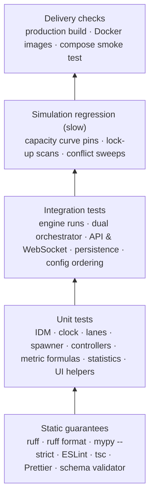
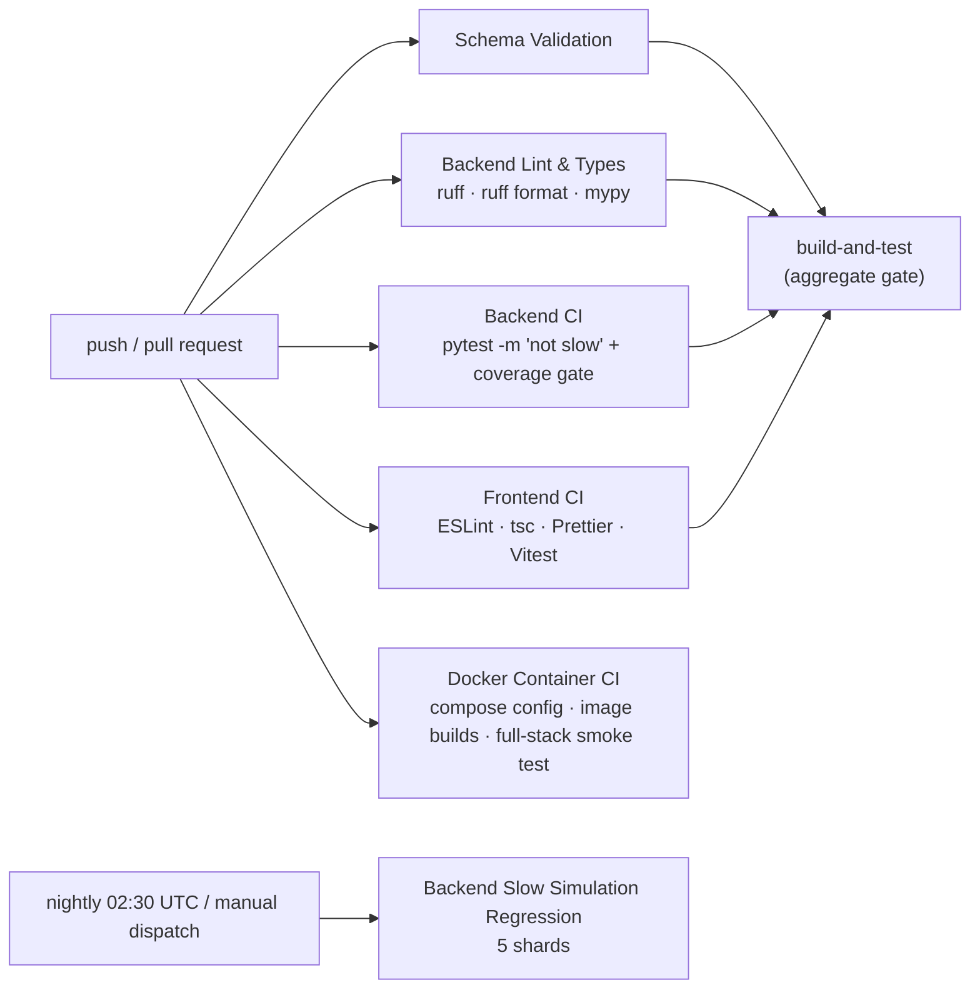

# Testing & Quality Gates

> **Status:** Current · V1.0 · verified against `.github/workflows/ci.yml`, `.github/workflows/docker.yml`, `backend/pyproject.toml`, `frontend/package.json` and `.husky/pre-commit`

UrbanFlow's tests exist to protect **three things**: that the simulation is physically and logically correct, that its numbers are reproducible, and that what users see is a faithful presentation of what the backend measured. Tools are listed below by *what they protect*, not just by name.

---

## 1. The quality pyramid



| Layer | Protects against | Runs |
| --- | --- | --- |
| Static | Type errors, unsafe refactors, formatting drift, malformed schemas | Every push / PR; lint also on pre-commit |
| Unit | A formula or rule silently changing meaning | Every push / PR |
| Integration | Subsystems disagreeing (engine ↔ controller ↔ collector ↔ API ↔ DB) | Every push / PR |
| Simulation regression | **Results** drifting: capacity, lock-ups, collisions, the published curve | Nightly and on demand |
| Delivery | A green test suite that cannot be built or started | Every push / PR |

---

## 2. Backend

Stack: **pytest**, **pytest-cov**, **ruff**, **mypy** (strict). Configuration: `backend/pyproject.toml`.

```bash
cd backend
pytest -m "not slow"          # the CI gate: everything except full-strength sweeps
pytest -m slow --no-cov       # full-strength simulation regression sweeps (long)
pytest                        # everything — the marker selects, it never hides
ruff check src/ tests/
ruff format --check src/ tests/
mypy src/
```

| Gate | Setting | Why |
| --- | --- | --- |
| Coverage floor | `--cov-fail-under=85` (in `addopts`) | Catches a large module shipped without tests; never set back to 0 |
| Ruff rules | `E`, `F`, `I`, `N` | Correctness, imports, naming |
| mypy | `strict = true` | The engine is large and stateful; types catch interface drift |

### What each test area protects

| Directory | Protects |
| --- | --- |
| `tests/vehicles/` | IDM equations, vehicle state updates, spawner seeding and safe insertion, routing and leader finding, speed profiles |
| `tests/controllers/` | Signal phase plans, asymmetric greens, offsets, roundabout gap acceptance, follow-up time, congestion hysteresis |
| `tests/intersection/` | Conflict-point geometry and predictive conflict resolution (including lock-up cases) |
| `tests/roads/` | Lane geometry; cached lookups equal to uncached trajectories |
| `tests/core/` | Clock, engine lifecycle, reset, configuration models and cross-field rules, provenance, snapshots |
| `tests/metrics/` | Every metric definition, warm-up clipping, composite score rules, safety measures, vehicle limit |
| `tests/study/` | Statistics (CI, Welch, Cohen's d), sweep verdict direction and crossover, report generation, CLI |
| `tests/database/` | Persistence, run reproducibility, history/labels, sweep persistence batching |
| `tests/api/` | Routes, API-key auth, development auth bypass, replay ownership, study jobs and limits, reliability scenario |
| `tests/integration/` | Full runs, dual simulation, WebSocket integration, snapshot contract, config validation and ordering, live session limits, stress, DB concurrency |

### Slow simulation regression

Marked `@pytest.mark.slow`; excluded from the PR gate, run nightly (02:30 UTC) and by manual dispatch, one CI shard per file:

| Shard | File | Guards |
| --- | --- | --- |
| signal-capacity | `tests/integration/test_signal_capacity.py` | Signal capacity never falls as demand rises |
| roundabout-conflicts | `tests/integration/test_roundabout_conflicts.py` | Conflict/contact budgets across lanes and demand |
| roundabout-lockup | `tests/integration/test_roundabout_lockup.py` | Former lock-ups keep discharging without collisions |
| calibrated-capacity | `tests/integration/test_calibrated_capacity_regression.py` | The published one-lane capacity curve stays pinned |
| signal-lockup | `tests/vehicles/test_router.py` | Saturated-signal lock-up regression |

---

## 3. Frontend

Stack: **Vitest** + Testing Library (jsdom), **TypeScript** (`tsc`), **ESLint**, **Prettier**, **Vite** build.

```bash
cd frontend
npm run test          # vitest run
npm run type-check    # tsc --noEmit
npm run lint          # eslint .
npm run format        # prettier --check .
npm run build         # tsc && vite build
```

| Test area (`frontend/src/test/`) | Protects |
| --- | --- |
| `GuidedComparison.test.tsx`, `App.test.tsx`, `routing.test.tsx` | The planner journey end to end against mocked hooks; navigation; nginx route list kept in step with the router |
| `plainLanguage.test.ts`, `metricCatalog.test.ts` | Plain-language readings, tie rules, bands; **every backend metric has a catalog entry** |
| `useWebSocketSnapshot.test.tsx`, `websocket.test.ts`, `liveSession.test.ts`, `snapshotInterpolator.test.ts` | Streaming, reconnection, session-cookie ordering, smooth interpolation |
| `HistoryDashboard`, `RunPage`, `ComparePage`, `savedRun` tests | Saved runs, reproduction display, multi-run comparison |
| `VolumeAnalysisDashboard`, `ValidationDashboard`, `WeightedScoringPanel`, `IntegrityCheck` tests | Research Lab tools and their wording |
| `devAuthBypass.test.ts`, `DevAuthApp.test.tsx` | The development sign-in bypass can never reach a production build |
| geometry / map / logo / time / container-size tests | Rendering helpers |

---

## 4. Contracts and delivery

| Check | Command | Protects |
| --- | --- | --- |
| Schema validator | `python scripts/validate_schemas.py` | Every file in `shared/schemas/` is valid JSON with `$schema` |
| Compose validation | `docker compose -f docker-compose.yml config` (and `-dev`) | Both stacks parse |
| Image builds + smoke tests | `.github/workflows/docker.yml` | Backend image starts and answers `/health`; frontend image builds; the full Compose stack starts and is healthy through nginx |
| Stack smoke test (local) | `.\start.ps1 -SmokeTest` | Pages, assets, `/health`, database, study workers, live WebSocket and image freshness on a running stack |

---

## 5. Continuous integration



A local pre-commit hook (`.husky/pre-commit`) runs the frontend linter.

---

## 6. Most recent recorded results

Recorded gate results live with the work that produced them: [bug-fix report — Final validation](../bug-fix-report.md#final-validation-2026-09-24) (backend, slow suites, cross-process determinism) and [user narrative §H](../product/urbanflow-user-narrative.md#h-validation-results) (guided-journey release). Re-run the commands above for current numbers rather than relying on counts quoted in documents.
